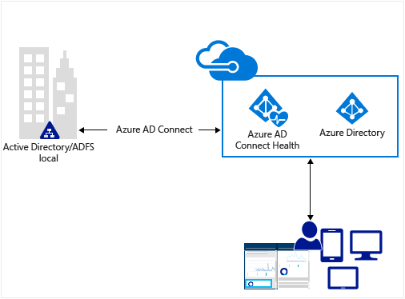
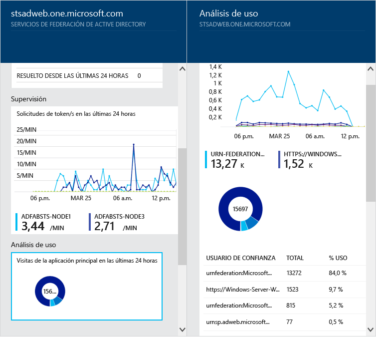
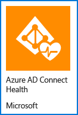
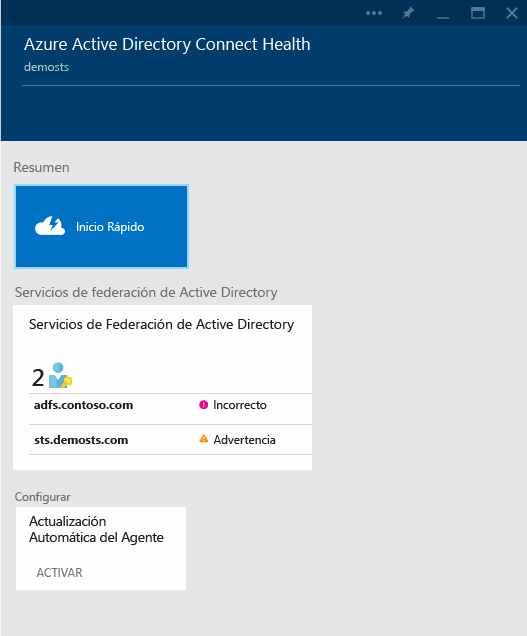

<properties
	pageTitle="Monitorización de la infraestructura de identidad local en la nube"
	description="En esta página se describe qué es Azure AD Connect Health y por qué debería usarlo."
	services="active-directory"
	documentationCenter=""
	authors="billmath"
	manager="stevenpo"
	editor="curtand"/>

<tags
	ms.service="active-directory"
	ms.workload="identity"
	ms.tgt_pltfrm="na"
	ms.devlang="na"
	ms.topic="get-started-article"
	ms.date="01/21/2016"
	ms.author="billmath"/>

# Supervisión de la infraestructura de identidad local y los servicios de sincronización en la nube

Azure AD Connect Health le ayuda a supervisar y a comprender mejor su infraestructura de identidad local y los servicios de sincronización disponibles mediante Azure AD Connect. Ofrece la capacidad de ver alertas, rendimiento, patrones de uso, ajustes de configuración; le permite mantener una conexión confiable a Office 365 y mucho más. Esto se logra mediante un agente instalado en los servidores de destino.

Esta información se presenta en el portal de Azure AD Connect Health. Mediante el portal de Azure AD Connect Health puede ver alertas, supervisión del rendimiento y análisis de uso. Esta información se presenta en un mismo lugar, muy fácil de usar, para que no tenga que perder tiempo en la búsqueda de la información que necesita.

Las actualizaciones futuras de Azure AD Connect Health incluirán la supervisión adicional y la información sobre otros componentes de identidad. Por tanto, se proporciona un único panel mediante el modo de identidad, al permitir un entorno más sólido, mantenido e integrado que los usuarios pueden aprovechar para aumentar su capacidad de hacer su trabajo.

## Por qué usar Azure AD Connect Health

La integración de directorios locales con Azure AD hace que los usuarios sean más productivos al proporcionar una identidad común para acceder tanto a los recursos en la nube como a los locales. Sin embargo, esta integración conlleva el desafío de garantizar que este entorno esté bien mantenido para que los usuarios puedan acceder de manera confiable a los recursos tanto a nivel local como en la nube desde cualquier dispositivo. Azure AD Connect Health proporciona un sencillo enfoque basado en la nube para supervisar y obtener información sobre la infraestructura de identidad local, que se utiliza para acceder a Office 365 o a otras aplicaciones de Azure AD. Es tan sencillo como instalar un agente en cada uno de los servidores de identidad locales.

Azure AD Connect Health para AD FS es compatible con AD FS 2.0 en Windows Server 2008/2008 R2, AD FS en Windows Server 2012/2012 R2. También se incluyen los servidores Proxy de AD FS o Proxy de aplicación web que proporcionan compatibilidad de autenticación para el acceso a la extranet. Azure AD Connect Health para AD FS proporciona el siguiente conjunto de capacidades clave:

- Ver y realizar acciones sobre las alertas para un acceso confiable a las aplicaciones protegidas de AD FS, como Azure AD
- Notificaciones de correo electrónico para alertas críticas
- Ver datos de rendimiento para determinar la planificación de capacidad
- Vistas detalladas de los patrones de inicio de sesión de AD FS para determinar las anomalías o establecer líneas de base para la planificación de capacidad

Azure AD Connect Health para sincronización supervisa y proporciona información sobre las sincronizaciones que tienen lugar entre Active Directory local y Azure Active Directory. Azure AD Connect Health para sincronización ofrece el siguiente conjunto de funiciones clave:

- Visualización y toma de medidas al recibir alertas para asegurarse de sincronizaciones confiables entre su infraestructura local y Azure Active Directory
- Notificaciones de correo electrónico para alertas críticas
- Visualización de los datos de rendimiento

El vídeo siguiente proporcionará información general de Azure AD Connect Health:

[AZURE.VIDEO azure-ad-connect-health--monitor-you-identity-bridge]

## Introducción al Portal de Azure
Para empezar a usar Azure Active Directory Connect Health, siga los pasos siguientes.

1. Inicie sesión en el [Portal de Microsoft Azure](https://portal.azure.com/).
2. Para obtener acceso a Azure Active Directory Connect Health, vaya a Marketplace y búsquelo o seleccione Marketplace y, luego, Seguridad + Identidad.
3. En la hoja de introducción (una hoja es una parte de la vista general. Puede considerar una hoja como una ventana o menú emergente. Haga clic en **Crear**. Se abrirá otra hoja con la información del directorio.
4. En la hoja del directorio, haga clic en **Crear**. Si no tiene una licencia de Azure Active Directory Premium, necesitará obtener una para usar Azure AD Connect Health. Para obtener información sobre Azure AD Premium, consulte Introducción a Azure AD Premium.

>[AZURE.NOTE]Recuerde que para ver los datos de la instancia de Azure AD Connect Health, deberá instalar el agente de Azure AD Connect Health en los servidores de destino. Para descargar el agente de Azure AD Connect Health, seleccione Inicio rápido y Obtener herramientas en la primera hoja. También puede descargar directamente el agente mediante el [vínculo](#download-the-agent) que aparece a continuación. Para utilizar Azure Active Directory Connect Health, haga lo siguiente:

### El portal y los servicios de Azure AD Connect Health
El portal de Azure AD Connect Health le permite ver alertas, información de supervisión del rendimiento y análisis de uso. Después del primer acceso a Azure AD Connect Health, se mostrará la primera hoja. Puede considerar una hoja como una ventana. La primera hoja que verá muestra Inicio rápido, Servicios y Configurar. Debajo de la captura de pantalla aparece una breve explicación de cada una de ellas. La sección de servicios muestra los servicios y las instancias activos de esos servicios que supervisa Azure AD Connect Health.

- **Inicio rápido**: al seleccionar esta opción, se abrirá la hoja Inicio rápido. Aquí podrá descargar el agente de Azure AD Connect Health; para ello, elija Obtener herramientas, obtenga acceso a la documentación y proporcione comentarios.
- **Servicios de federación de Active Directory**: representa todos los servicios de AD FS que actualmente supervisa Azure AD Connect Health. Si selecciona una de las instancias, se abre una hoja con información sobre esa instancia de servicios. Esta información incluye una descripción general, propiedades, alertas, supervisión y análisis de uso. 
- Configurar: esta opción le permite activar o desactivar lo siguiente:
<ol>
1. La actualización automática, para actualizar automáticamente el agente de Azure AD Connect Health a la versión más reciente. Esto significa que actualizará automáticamente a la versión más reciente del agente de Azure AD Connect Health cuando esté disponible. Esta opción está habilitada de manera predeterminada.
2. Permitir el acceso de Microsoft a los datos de mantenimiento del directorio de Azure AD solo con fines de solución de problemas: esto significa que, si esta opción está habilitada, Microsoft podrá ver los mismos datos que usted está viendo. Esto puede ayudar a solucionar problemas. Esta opción está deshabilitada de manera predeterminada.

## Requisitos
La tabla siguiente es una lista de los requisitos que se deben cumplir para usar Azure AD Connect Health.

| Requisito | Descripción|
| ----------- | ---------- |
|Azure AD Premium| Azure AD Connect Health es una característica de Azure AD Premium y, por tanto, requiere Azure AD Premium.   Para obtener más información, consulte [Introducción a Azure AD Premium](active-directory-get-started-premium.md).  Para iniciar una versión de evaluación gratis de 30 días, consulte [este vínculo.](https://azure.microsoft.com/trial/get-started-active-directory/)|.
|Debe ser un administrador global de su Azure AD para habilitar (crear) Azure AD Connect Health|De forma predeterminada, solo los administradores globales pueden habilitar (crear) toda la información, acceder a ella y realizar todas las operaciones de Azure AD Connect Health. Para obtener información adicional, consulte [Administración de su directorio de Azure AD](active-directory-administer.md).    El uso de control de acceso basado en rol puede permitir que otros usuarios de la organización accedan a Azure AD Connect Health. Para más información, consulte [Operaciones de Azure AD Connect Health](active-directory-aadconnect-health-operations.md#manage-access-with-role-based-access-control).  **Importante:**La cuenta que use al instalar los agentes debe ser una cuenta profesional o de organización <!--school account--> y no puede ser una cuenta Microsoft. Para obtener más información, consulte [Inicio de sesión en Azure como una organización](sign-up-organization.md).|
|En AD FS, la auditoría de AD FS debe estar habilitada para usar el análisis de uso| Si planea usar el análisis de uso con AD FS, debe habilitarse la auditoría de AD FS.   Consulte [Instalación del agente de Azure AD Connect Health para AD FS.](active-directory-aadconnect-health-agent-install.md#installing-the-azure-ad-connect-health-agent-for-ad-fs)
|Requisitos del agente de Azure AD Connect Health|Vea la tabla siguiente para conocer los requisitos específicos de agente.

En la tabla siguiente se muestran los requisitos que se deben cumplir para usar Azure AD Connect Health.

| Requisito | Descripción|
| ----------- | ---------- |
|Agente de Azure AD Connect Health instalado en cada servidor de destino| Azure AD Connect Health requiere que haya un agente instalado en los servidores de destino para proporcionar los datos que se ven en el portal.   Por ejemplo, para obtener datos sobre su infraestructura local de AD FS, el agente se debe instalar en los servidores de AD FS. Esto incluye los servidores proxy de AD FS y de aplicación web.   Para obtener información sobre la instalación del agente, consulte [Instalación del agente de Azure AD Connect Health](active-directory-aadconnect-health-agent-install.md).  **Importante:** la cuenta que use al instalar los agentes debe ser una cuenta profesional u organizativa, no puede ser una cuenta Microsoft. Para obtener más información, consulte [Inicio de sesión en Azure como una organización](sign-up-organization.md).|
|Agente de Azure AD Connect Health para sincronización| Este agente se instala automáticamente con la versión más reciente de Azure AD Connect.   Si está empezando, no es necesario hacer nada más. El agente se instalará cuando instale Azure AD Connect.   Si ya tiene instalado Azure AD Connect, deberá actualizarlo a la versión más reciente, que puede descargarse [aquí](http://www.microsoft.com/download/details.aspx?id=47594).
|Conectividad saliente a los extremos del servicio de Azure|Durante la instalación y el tiempo de ejecución, el agente requiere conectividad a los extremos del servicio de Azure AD Connect Health que se enumeran a continuación. Si bloquea la conectividad saliente, asegúrese de agregar los siguientes elementos a la lista de permitidos:   <li>**new**: https://management.azure.com </li><li>**new**: &#42;.blob.core.windows.net </li><li>**new**: &#42;.queue.core.windows.net</li><li>&#42;.servicebus.windows.net - Port: 5671</li><li>https://&#42;.adhybridhealth.azure.com/</li><li>https://&#42;.table.core.windows.net/</li><li>https://policykeyservice.dc.ad.msft.net/</li><li>https://login.windows.net</li><li>https://login.microsoftonline.com</li><li>https://secure.aadcdn.microsoftonline-p.com</li> |
|Puertos de Firewall en el servidor que ejecuta al agente.| El agente requiere que los siguientes puertos del firewall estén abiertos para poder comunicarse con los puntos de conexión del servicio Azure AD Health.  <li>Puerto TCP/UDP 80</li><li>Puerto TCP/UDP 443</li><li>Puerto TCP/UDP 5671</li>
|Permitir los siguientes sitios web si la seguridad mejorada de IE está habilitada|Los siguientes sitios web se deben permitir si está habilitada la seguridad mejorada de Internet Explorer en el servidor que va a tener instalado el agente.  <li>https://login.microsoftonline.com</li><li>https://secure.aadcdn.microsoftonline-p.com</li><li>https://login.windows.net</li><li>El servidor de federación de su organización en el que confía Azure Active Directory, por ejemplo: https://sts.contoso.com</li>

## Descarga del agente

Para comenzar, realice una de las operaciones siguientes:

- Para empezar a usar Azure AD Connect Health para AD FS, puede descargar la versión más reciente del agente aquí: [Descargar agente de Azure AD Connect Health para AD FS](http://go.microsoft.com/fwlink/?LinkID=518973). Asegúrese de que ha agregado el servicio de Marketplace antes de instalar los agentes.
- Para comenzar a usar Azure AD Connect Health para sincronización, descargue e instale la versión más reciente de Azure AD Connect. El agente de mantenimiento se instalará como parte de la instalación de Azure AD Connect. Azure AD Connect admite una actualización local desde versiones anteriores.

## Vínculos relacionados

* [Instalación del agente de Azure AD Connect Health](active-directory-aadconnect-health-agent-install.md)
* [Operaciones de Azure AD Connect Health](active-directory-aadconnect-health-operations.md)
* [Uso de Azure AD Connect Health con AD FS](active-directory-aadconnect-health-adfs.md)
* [Uso de Azure AD Connect Health para sincronización](active-directory-aadconnect-health-sync.md)
* [Preguntas más frecuentes de Azure AD Connect Health](active-directory-aadconnect-health-faq.md)

<!---HONumber=AcomDC_0128_2016-->