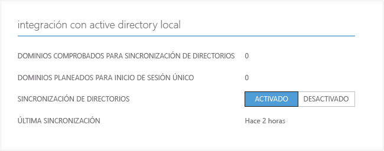
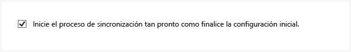
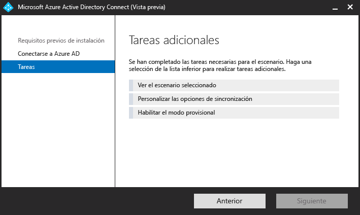

<properties
	pageTitle="Pasos siguientes y cómo administrar Azure AD Connect en Azure AD Connect| Microsoft Azure"
	description="Aprenda a ampliar la configuración predeterminada y las tareas operativas de Azure AD Connect."
	services="active-directory"
	documentationCenter=""
	authors="billmath"
	manager="stevenpo"
	editor="curtand"/>

<tags
	ms.service="active-directory"
	ms.workload="identity"
	ms.tgt_pltfrm="na"
	ms.devlang="na"
	ms.topic="article"
	ms.date="01/21/2016"
	ms.author="billmath"/>

# Pasos siguientes y cómo administrar Azure AD Connect
Los siguientes temas tratan cuestiones operativas avanzadas que le permiten personalizar Azure Active Directory Connect para satisfacer las necesidades y los requisitos de sus organizaciones.

## Asignación de licencias a usuarios de Azure AD Premium y Enterprise Mobility

Ahora que los usuarios se han sincronizado a la nube, debe asignarlos una licencia para lo que puedan empezar a trabajar con las aplicaciones de nube, como Office 365.

### Para asignar una licencia de Azure AD Premium o Enterprise Mobility Suite
--------------------------------------------------------------------------------
1. Inicie sesión en el Portal de Azure como administrador.
2. En la parte izquierda, seleccione **Active Directory**.
3. En la página Active Directory, haga doble clic en el directorio que tiene los usuarios que desea habilitar.
4. En la parte superior de la página de directorios, seleccione **Licencias**.
5. En la página Licencias, seleccione Active Directory Premium o Enterprise Mobility Suite y, a continuación, haga clic en **Asignar**.
6. En el cuadro de diálogo, seleccione los usuarios a los que desee asignar las licencias y, a continuación, haga clic en el icono de marca de verificación para guardar los cambios.

## Comprobación de la tarea de sincronización programada
Puede comprobar el estado de una sincronización en el Portal de Azure.

### Para comprobar la tarea de sincronización programada
--------------------------------------------------------------------------------
1. Inicie sesión en el Portal de Azure como administrador.
2. En la parte izquierda, seleccione **Active Directory**.
3. En la página Active Directory, haga doble clic en el directorio que tiene los usuarios que desea habilitar.
4. En la parte superior de la página de directorios, seleccione **Integración de directorios**.
5. En la integración con Active Directory local, anote la hora de la última sincronización.

## Inicio de una tarea de sincronización programada
Si necesita ejecutar una tarea de sincronización, ejecútelo de nuevo mediante el Asistente de Azure AD Connect. Necesitará proporcionar sus credenciales de Azure AD. En el asistente, seleccione la tarea **Personalizar las opciones de sincronización** y haga clic en siguiente en todo el asistente. Al final, asegúrese de que la casilla **Iniciar el proceso de configuración tan pronto como se complete la configuración** está seleccionada.

## Tareas adicionales disponibles en Azure AD Connect
Después de la instalación inicial de Azure AD Connect, siempre puede volver a iniciar el asistente desde la página de inicio de Azure AD Connect o el acceso directo de escritorio. Verá que volver a pasar por el asistente ofrece algunas nuevas opciones en el formulario de tareas adicionales.

En la tabla siguiente se proporciona un resumen de estas tareas y una breve descripción de cada una de ellas.

Tarea adicional | Descripción
------------- | ------------- |
Ver el escenario seleccionado |Permite ver la solución actual de Azure AD Connect. Incluye la configuración general, los directorios sincronizados, la configuración de sincronización, etc.
Personalizar las opciones de sincronización | Permite cambiar la configuración actual, incluida la adición de bosques de Active Directory adicionales a la configuración o habilitar las opciones de sincronización, como usuario, grupo, dispositivo o reescritura de contraseña.
Habilitar el modo provisional | Esto permite almacenar información que se sincronizará más adelante, pero no se exportará nada a Azure AD o Active Directory. Esto permite obtener una vista previa de las sincronizaciones antes de que ocurran.

## Pasos siguientes
Obtenga más información sobre la [Integración de las identidades locales con Azure Active Directory](active-directory-aadconnect.md).

<!---HONumber=AcomDC_0128_2016-->