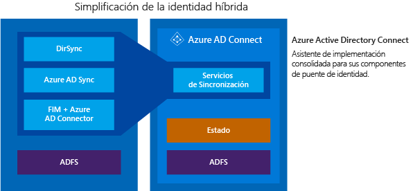

<properties
	pageTitle="Azure AD Connect: integración de las identidades locales con Azure Active Directory. | Microsoft Azure"
	description="Azure AD Connect es la herramienta que permite integrar su sistema de identidad local, por ejemplo, Windows Server Active Directory, con Azure Active Directory, y conectar a los usuarios a Office 365, Azure y miles de aplicaciones SaaS. En este tema se explican las características de Azure AD Connect y se proporciona información sobre cómo funciona Azure AD Connect y cómo instalarlo, configurarlo y personalizarlo."
    keywords="introducción a Azure AD Connect, información general de Azure AD Connect, qué es Azure AD Connect, instalación de active directory"
	services="active-directory"
	documentationCenter=""
	authors="andkjell"
	manager="stevenpo"
	editor="curtand"/>

<tags
	ms.service="active-directory"
	ms.workload="identity"
	ms.tgt_pltfrm="na"
	ms.devlang="na"
	ms.topic="get-started-article"
	ms.date="02/29/2016"
	ms.author="andkjell;billmath"/>

# Integración de las identidades locales con Azure Active Directory
Azure AD Connect es la herramienta que permite integrar su sistema de identidad local, por ejemplo, Windows Server Active Directory con Azure Active Directory, y conectar a los usuarios a aplicaciones SaaS de Office 365, Azure y 1000. En este tema se proporciona una guía completa para preparar e implementar los componentes que los usuarios finales necesitan para tener acceso a los servicios en la nube con la misma identidad que usan actualmente para el acceso a las aplicaciones de empresa existentes.

## ¿Por qué usar Azure AD Connect?
la integración de directorios locales con Azure AD hace que los usuarios sean más productivos proporcionando una identidad común para tener acceso a recursos de nube y locales. Con esta integración, los usuarios y las organizaciones pueden aprovechar lo siguiente:

- Los usuarios pueden usar una única identidad para acceder a aplicaciones locales y servicios en la nube, como Office 365.

- Una sola herramienta que proporciona una experiencia de implementación simplificada para la sincronización y el inicio de sesión.

- Proporciona las funcionalidades más novedosas para sus escenarios de trabajo. Azure AD Connect sustituye a las versiones anteriores de las herramientas de integración de identidades, como DirSync y Sincronización de Azure AD. Para más información, consulte [Identidades híbridas: comparación de las herramientas para la integración de directorios de identidades híbridas](active-directory-hybrid-identity-design-considerations-tools-comparison.md).

### Cómo funciona Azure AD Connect

Azure Active Directory Connect se compone de tres partes principales. Se trata de los servicios de sincronización, la parte opcional de Servicios de federación de Active Directory y la parte de supervisión que se lleva a cabo mediante [Azure AD Connect Health](active-directory-aadconnect-health.md).

 

- Sincronización: esta parte consta de los componentes y la funcionalidad publicados anteriormente como [Dirsync y Sincronización de Azure AD](active-directory-hybrid-identity-design-considerations-tools-comparison.md). Esta es la parte que se encarga de crear usuarios y grupos. También es responsable de asegurarse de que la información sobre los usuarios y los grupos de su entorno local coincide con la de la nube.
- AD FS: se trata de una parte opcional de Azure AD Connect y puede utilizarse para configurar un entorno híbrido mediante una infraestructura local de AD FS. Las organizaciones pueden utilizar esta parte para abordar implementaciones complejas que incluyen elementos como un inicio de sesión único de unión a dominio, la aplicación de la directiva de inicio de sesión de AD y MFA mediante tarjeta inteligente o de terceros.
- Supervisión de estado: Azure AD Connect Health puede ofrecer una sólida supervisión y proporcionar una ubicación central en el Portal de Azure para ver esta actividad. Para obtener más información, consulte [Azure Active Directory Connect Health](active-directory-aadconnect-health.md).

## Instalación de Azure AD Connect

Puede encontrar la descarga de Azure AD Connect en el [Centro de descarga de Microsoft](http://go.microsoft.com/fwlink/?LinkId=615771).

| Solución | Escenario |
| ----- | ----- |
| Antes de empezar: [hardware y requisitos previos](active-directory-aadconnect-prerequisites.md) | <li>Pasos que deben completarse antes de empezar a instalar Azure AD Connect.</li> |
| [Configuración rápida](active-directory-aadconnect-get-started-express.md) | <li>Opción recomendada y predeterminada si tiene Active Directory de un solo bosque.</li> <li>Inicio de sesión de usuario con la misma contraseña mediante la sincronización de contraseñas.</li>
| [Configuración personalizada](active-directory-aadconnect-get-started-custom.md) | <li>Se usa cuando se tienen varios bosques. Admite muchas [topologías](active-directory-aadconnect-topologies.md) locales.</li> <li>Personalice la opción de inicio de sesión, como ADFS para la federación, o use un proveedor de identidades de terceros.</li> <li>Personalice las características de sincronización, como filtrado y escritura diferida.</li>
| [Actualización desde DirSync](active-directory-aadconnect-dirsync-upgrade-get-started.md) | <li>Si tiene un servidor de DirSync existente que ya se está ejecutando.</li>
| [Actualización desde Azure AD Sync o Azure AD Connect](active-directory-aadconnect-upgrade-previous-version.md)| <li>Hay varios métodos diferentes y el que elija dependerá de sus preferencias.</li>

[Después de la instalación](active-directory-aadconnect-whats-next.md), debe comprobar que funciona según lo previsto y asignar licencias a los usuarios.

### Pasos siguientes para instalar Azure AD Connect

| Tema. | |
| --------- | --------- |
| Descarga de Azure AD Connect | [Descarga de Azure AD Connect](http://go.microsoft.com/fwlink/?LinkId=615771) |
| Instalación mediante configuración rápida | [Instalación rápida de Azure AD Connect](active-directory-aadconnect-get-started-express.md) |
| Instalación mediante configuración personalizada | [Instalación personalizada de Azure AD Connect](active-directory-aadconnect-get-started-custom.md) |
| Actualización desde DirSync | [Actualización desde la herramienta Sincronización de Azure AD (DirSync)](active-directory-aadconnect-dirsync-upgrade-get-started.md) |
| Después de la instalación | [Comprobación de la instalación y asignación de licencias ](active-directory-aadconnect-whats-next.md) |

### Más información sobre la instalación de Azure AD Connect

También quiere prepararse para los problemas [operativos](active-directory-aadconnectsync-operations.md). Quizás quiera tener un servidor independiente para que pueda conmutar por error fácilmente en caso de un [desastre](active-directory-aadconnectsync-operations.md#disaster-recovery). Si planea realizar cambios frecuentes en la configuración, debe preparar un servidor en [modo de ensayo](active-directory-aadconnectsync-operations.md#staging-mode).

| Tema. | |
| --------- | --------- |
| Topologías admitidas | [Topologías de Azure AD Connect](active-directory-aadconnect-topologies.md) |
| Conceptos de diseño | [Conceptos de diseño de Azure AD Connect](active-directory-aadconnect-design-concepts.md) |
| Cuentas usadas para la instalación | [Más información sobre las credenciales y los permisos de Azure AD Connect](active-directory-aadconnect-accounts-permissions.md) |
| Planeación operativa | [Sincronización de Azure AD Connect: tareas y consideraciones operativas](active-directory-aadconnectsync-operations.md) |
| Opciones de inicio de sesión de usuario | [Opciones para el inicio de sesión de los usuarios en Azure AD Connect](active-directory-aadconnect-user-signin.md) |

## Configuración de características
Azure AD Connect incluye varias características que puede activar de manera opcional o que están habilitadas de forma predeterminada. En algunos casos, algunas características pueden requerir configuración adicional en determinados escenarios y topologías.

El [filtrado](active-directory-aadconnectsync-configure-filtering.md) se usa cuando se quieren limitar los objetos que se sincronizan con Azure AD. De forma predeterminada se sincronizan todos los usuarios, contactos, grupos y equipos de Windows 10, pero puede definir un límite en función de dominios, unidades organizativas o atributos.

La [sincronización de contraseñas](active-directory-aadconnectsync-implement-password-synchronization.md) sincroniza el hash de contraseña en Active Directory con Azure AD. Así el usuario puede usar la misma contraseña de forma local y en la nube, pero administrarla en una sola ubicación. Como se usará su Active Directory local, también podrá usar su propia directiva de contraseñas.

La [escritura diferida de contraseñas](active-directory-passwords-getting-started.md) permite a los usuarios cambiar y restablecer sus contraseñas en la nube y aplicar su directiva local de contraseñas.

La [reescritura de dispositivos](active-directory-aadconnect-feature-device-writeback.md) permite que un dispositivo registrado en Azure AD se reescriba en Active Directory local para que se pueda usar para el acceso condicional.

La característica para [evitar eliminaciones accidentales](active-directory-aadconnectsync-feature-prevent-accidental-deletes.md) está activada de forma predeterminada y protege su directorio en la nube de un lote de eliminaciones al mismo tiempo. De forma predeterminada, se permiten 500 eliminaciones por cada ejecución y este número se puede cambiar según el tamaño de su organización.

La [actualización automática](active-directory-aadconnect-feature-automatic-upgrade.md) está habilitada de forma predeterminada para las instalaciones de configuración rápida y garantiza que Azure AD Connect está siempre actualizado con la versión más reciente.

### Pasos siguientes para configurar características

| Tema. | |
| --------- | --------- |
| Configuración del filtrado | [Azure AD Connect Sync: configuración del filtrado](active-directory-aadconnectsync-configure-filtering.md) |
| Sincronización de contraseñas | [Sincronización de Azure AD Connect: implementación de la sincronización de contraseñas](active-directory-aadconnectsync-implement-password-synchronization.md) |
| Escritura diferida de contraseñas | [Introducción a la administración de contraseñas](active-directory-passwords-getting-started.md) |
| Escritura diferida de dispositivos | [Habilitación de escritura diferida de dispositivos en Azure AD Connect](active-directory-aadconnect-feature-device-writeback.md) |
| Evitar eliminaciones accidentales | [Sincronización de Azure AD Connect: cómo evitar eliminaciones accidentales](active-directory-aadconnectsync-feature-prevent-accidental-deletes.md) |
| Actualización automática | [Azure AD Connect: Actualización automática](active-directory-aadconnect-feature-automatic-upgrade.md)|

## Personalización de Azure AD Connect Sync
Azure AD Connect Sync incluye una configuración predeterminada diseñada para funcionar en la mayoría de clientes y topologías. Pero siempre hay situaciones en las que la configuración predeterminada no funciona y debe ajustarse. Se permiten los cambios que se documentan en esta sección y en los temas vinculados.

Si no ha trabajado con una topología de sincronización antes, querrá comenzar a comprender los aspectos básicos y los términos usados que se describen en los [conceptos técnicos](active-directory-aadconnectsync-technical-concepts.md). Azure AD Connect es la evolución de MIIS2003, ILM2007 y FIM2010. Aunque algunas cosas son idénticas, muchas también han cambiado.

En la [configuración predeterminada](active-directory-aadconnectsync-understanding-default-configuration.md) se considera que puede haber más de un bosque. En esas topologías un objeto de usuario se puede representar como un contacto de otro bosque. El usuario puede tener también vinculado un buzón en otro bosque de recursos. El comportamiento de la configuración predeterminada se describe en la sección sobre [usuarios y contactos](active-directory-aadconnectsync-understanding-users-and-contacts.md).

El modelo de configuración sincronizado se denomina [aprovisionamiento declarativo](active-directory-aadconnectsync-understanding-declarative-provisioning-expressions.md). Los flujos de atributos avanzados usan [funciones](active-directory-aadconnectsync-functions-reference.md) para expresar transformaciones de atributo. Puede ver y examinar toda la configuración con las herramientas que se incluyen en Azure AD Connect. Si tiene que realizar cambios en la configuración, asegúrese de seguir los [procedimientos recomendados](active-directory-aadconnectsync-best-practices-changing-default-configuration.md) para que sea más fácil adoptar nuevas versiones a medida que estén disponibles.

### Pasos siguientes para personalizar Azure AD Connect Sync

| Tema. | |
| --------- | --------- |
| Todos los artículos de sincronización de Azure AD Connect | [Sincronización de Azure AD Connect](active-directory-aadconnectsync-whatis.md) |
| Conceptos técnicos | [Azure AD Connect Sync: conceptos técnicos](active-directory-aadconnectsync-technical-concepts.md) |
| Introducción a la configuración predeterminada | [Azure AD Connect Sync: descripción de la configuración predeterminada](active-directory-aadconnectsync-understanding-default-configuration.md) |
| Descripción de usuarios y contactos | [Azure AD Connect Sync: descripción de usuarios y contactos](active-directory-aadconnectsync-understanding-users-and-contacts.md) |
| Aprovisionamiento declarativo | [Sincronización de Azure AD Connect: conocimiento de expresiones de aprovisionamiento declarativo](active-directory-aadconnectsync-understanding-declarative-provisioning-expressions.md) |
| Cambio de la configuración predeterminada | [Prácticas recomendadas de cambio de la configuración predeterminada](active-directory-aadconnectsync-best-practices-changing-default-configuration.md) |

## Más información y referencias

| Tema. | |
| --------- | --------- |
| Historial de versiones | [Historial de versiones](active-directory-aadconnect-version-history.md) |
| Comparación de DirSync, Sincronización de Azure AD y Azure AD Connect | [Comparación de las herramientas para la integración de directorios](active-directory-hybrid-identity-design-considerations-tools-comparison.md) |
| Atributos sincronizados | [Atributos sincronizados](active-directory-aadconnectsync-attributes-synchronized.md) |
| Supervisión del uso de Azure AD Connect Health | [Azure AD Connect Health](active-directory-aadconnect-health.md) |
| Preguntas frecuentes | [Preguntas más frecuentes sobre Azure AD Connect](active-directory-aadconnect-faq.md) |

**Recursos adicionales**

Presentación de Ignite 2015 sobre cómo extender los directorios locales a la nube.

[AZURE.VIDEO microsoft-ignite-2015-extending-on-premises-directories-to-the-cloud-made-easy-with-azure-active-directory-connect]

<!---HONumber=AcomDC_0302_2016-->