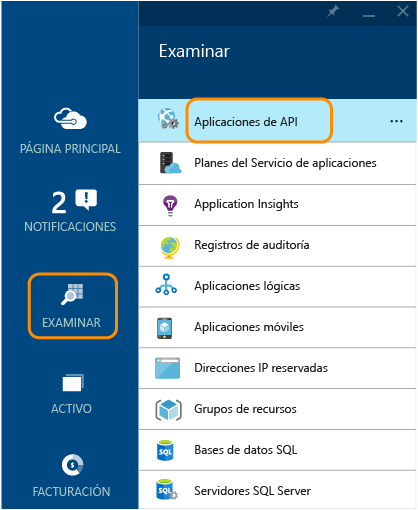
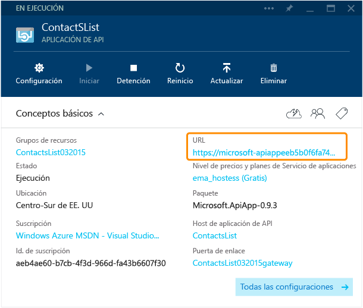
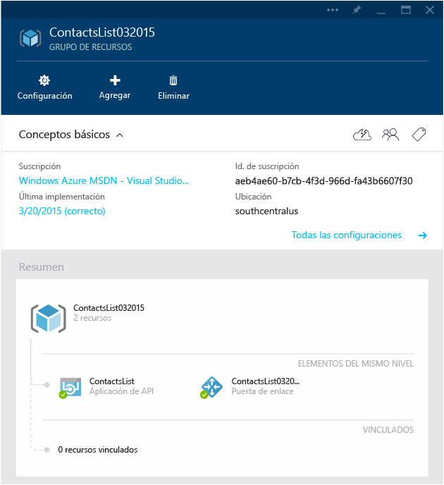
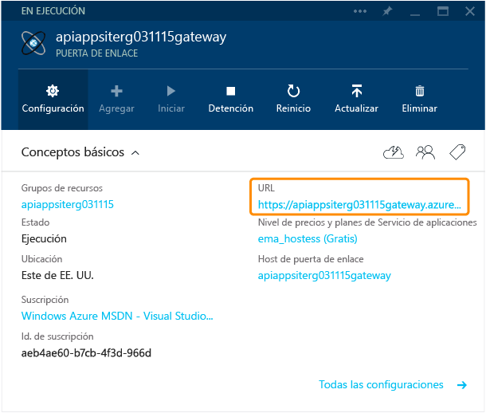
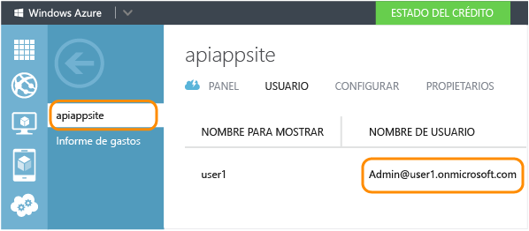
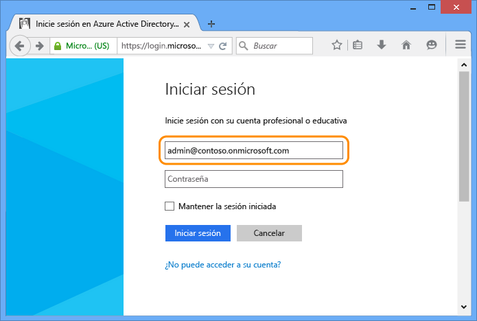
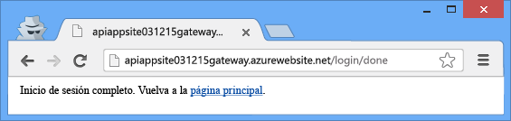

<properties 
	pageTitle="Protección de una aplicación API de Azure" 
	description="Obtenga información acerca de cómo proteger una aplicación de API de Azure mediante el uso de Visual Studio." 
	services="app-service\api" 
	documentationCenter=".net" 
	authors="tdykstra" 
	manager="wpickett" 
	editor="jimbe"/>

<tags 
	ms.service="app-service-api" 
	ms.workload="web" 
	ms.tgt_pltfrm="dotnet" 
	ms.devlang="na" 
	ms.topic="article" 
	ms.date="01/08/2016" 
	ms.author="tdykstra"/>

# Protección de una aplicación de API: agregar la autenticación de Azure Active Directory o de un proveedor social

[AZURE.INCLUDE [app-service-api-v2-note](../../includes/app-service-api-v2-note.md)]

## Información general

En este tutorial se muestra cómo proteger una aplicación de API para que solo los usuarios autenticados puedan tener acceso a ella. El tutorial también muestra el código que puede utilizar en una aplicación de API de ASP.NET para recuperar información sobre el usuario que ha iniciado la sesión.

Realizará los pasos siguientes:

- Llamar a la aplicación de API para comprobar que funciona.
- Aplicar las reglas de autenticación a la aplicación de API.
- Volver a llamar a la aplicación de API para comprobar que rechaza las solicitudes no autenticadas.
- Iniciar sesión en el proveedor configurado.
- Volver a llamar a la aplicación de API para comprobar que el acceso autenticado funciona.
- Escribir y probar el código que recupera notificaciones para el usuario que ha iniciado la sesión.

Para obtener más información sobre la autenticación en el Servicio de aplicaciones de Azure, vea [Autenticación para aplicaciones de API y aplicaciones de móvil](../app-service/app-service-authentication-overview.md).

## Requisitos previos

Este tutorial funciona con la aplicación de API que creó en [Creación de una aplicación de API](app-service-dotnet-create-api-app.md) y que implementó en [Implementación de una aplicación de API](app-service-dotnet-deploy-api-app.md).

## Uso del explorador para llamar a la aplicación de API 

La manera más sencilla de comprobar que la aplicación de API es accesible públicamente es llamarla desde un explorador.

1. En el explorador, vaya al [Portal de vista previa de Azure].

3. En la página principal, haga clic en **Examinar > Aplicaciones de API** y, a continuación, haga clic en el nombre de la aplicación de API que desea proteger.

	

	

3. En la hoja **Aplicación de API**, haga clic en la **Dirección URL** para abrir una ventana del explorador que llame a la aplicación de API.

	

2. Agregue `/api/contacts/get/` a la dirección URL en la barra de direcciones del explorador.

	Por ejemplo, si la dirección URL de la aplicación de API es la siguiente:

    	https://microsoft-apiappeeb5bdsasd744e188be7fa26f239bd4b.azurewebsites.net/

	La dirección URL completa sería la siguiente:

    	https://microsoft-apiappeeb5bdsasd744e188be7fa26f239bd4b.azurewebsites.net/api/contacts/get/

	Los distintos exploradores controlan las llamadas a API de manera diferente. En la imagen se muestra una llamada realizada correctamente desde un explorador Chrome.

	

2. Guarde la dirección URL que ha utilizado, pues la volverá a usar más adelante en el tutorial.

## Protección de la aplicación de API

Cuando implementa una aplicación de API, lo hace en un grupo de recursos. Puede agregar aplicaciones web y otras aplicaciones de API para el mismo grupo de recursos y cada aplicación de API dentro del grupo de recursos puede tener una de las tres configuraciones de accesibilidad siguientes: <!--todo: diagram showing different accessibility settings-->

- **Público (anónimo)**: cualquier persona puede llamar a la aplicación de API desde fuera del grupo de recursos sin tener que iniciar sesión.
- **Público (autenticado)**: solo los usuarios autenticados pueden llamar a la aplicación de API desde fuera del grupo de recursos.
- **Interno**: solo otras aplicaciones de API del mismo grupo de recursos pueden llamar a la aplicación de API. (Las llamadas desde aplicaciones web se consideran externas aunque las aplicaciones web estén en el mismo grupo de recursos).

Cuando Visual Studio crea el grupo de recursos, también crea una *puerta de enlace*. Una puerta de enlace es una aplicación web especial que controla todas las solicitudes destinadas a las Aplicaciones de API del grupo de recursos.

Cuando vaya a la hoja del grupo de recursos en el [Portal de vista previa de Azure], podrá ver la aplicación de API y la puerta de enlace en el diagrama.

### Configuración de la aplicación de API para que requiera autenticación

Para configurar la aplicación de API para aceptar únicamente solicitudes autenticadas, establecerá su accesibilidad en **Público (autenticado)** y configurará la puerta de enlace para requerir la autenticación de un proveedor como Azure Active Directory, Google o Facebook.

[AZURE.INCLUDE [app-service-api-config-auth](../../includes/app-service-api-config-auth.md)]

La aplicación de API ya está protegida contra el acceso no autenticado. A continuación, tendrá que configurar la puerta de enlace para especificar qué proveedor de autenticación se va a utilizar.

### Configuración de la puerta de enlace para usar un proveedor de autenticación

[AZURE.INCLUDE [app-service-api-gateway-config-auth](../../includes/app-service-api-gateway-config-auth.md)]

## Comprobación de que funciona la autenticación

**Nota:** si tiene algún problema para iniciar sesión al realizar los pasos siguientes, pruebe a abrir una ventana privada o de incógnito.
 
1. Abra una ventana del explorador y, en la barra de direcciones, escriba la dirección URL que llama al método `Get` de la aplicación de API, tal como hizo anteriormente.

	Esta vez el intento de obtener acceso a la aplicación de API da como resultado un mensaje de error.

	

2. En el explorador, vaya a la dirección URL de inicio de sesión. La URL sigue este patrón:

    	http://[gatewayurl]/login/[providername]

	La URL de la puerta de enlace puede obtenerse en la hoja **Puerta de enlace** del [Portal del vista previa de Azure]. (Para obtener acceso a la hoja **Puerta de enlace**, haga clic en la puerta de enlace del diagrama que aparece en la hoja **Grupo de recursos**).

	

	[providername] debe ser uno de los siguientes valores:
	
	* "microsoftaccount"
	* "facebook"
	* "twitter"
	* "google"
	* "aad"

	A continuación se muestra una URL de inicio de sesión de ejemplo para Azure Active Directory:

		https://dropboxrgaeb4ae60b7cb4f3d966dfa43.azurewebsites.net/login/aad/

	Observe que, a diferencia de la URL anterior, esta no incluye el nombre de la aplicación de API, porque la puerta de enlace autentica al usuario, no a la aplicación de API. La puerta de enlace controla la autenticación para todas las Aplicaciones de API del grupo de recursos.

3. Escriba sus credenciales cuando el explorador muestra una página de inicio de sesión.
 
	Si configura el inicio de sesión de Azure Active Directory, utilice uno de los usuarios enumerados en la pestaña **Usuarios** para la aplicación que ha creado en la pestaña Azure Active Directory del [portal de Azure], como admin@contoso.onmicrosoft.com.

	

	

4. Cuando aparezca el mensaje de "inicio de sesión completa", vuelva a escribir la dirección URL al método Get de la aplicación de API.

	Como ya se ha autenticado, la llamada es correcta. La puerta de enlace reconoce que es un usuario autenticado y pasa la solicitud a la aplicación de API.

	

	

	Si habilitó Swagger UI, ahora también puede ir a la página Swagger UI. Sin embargo, verá un icono rojo de **ERROR** en la esquina inferior derecha de la página y, si hace clic en el icono, verá un mensaje que indica que no se puede obtener acceso al archivo JSON de Swagger. Esto se debe a que Swagger realiza una llamada AJAX sin incluir el token Zumo que trata de recuperar el archivo JSON. Esto no impide que la página Swagger UI funcione.

## Uso de Postman para enviar una solicitud Post

Al iniciar sesión la puerta de enlace, esta envía un token de autenticación. Este token debe incluirse con todas las solicitudes desde orígenes externos que pasen por la puerta de enlace. Cuando tenga acceso a una API con un explorador, este normalmente almacena el token en una cookie y lo envía a la API junto con todas las llamadas subsiguientes.

Para que pueda ver lo que sucede en segundo plano, en esta sección del tutorial se usará una herramienta de explorador para crear y enviar una solicitud Post y obtener el token de la autorización de la cookie e incluirla en un encabezado HTTP. Esta sección es opcional: en la sección anterior ya se ha comprobado que la aplicación de API solo acepta el acceso autenticado.

Estas instrucciones muestran cómo utilizar la herramienta Postman en el explorador Chrome, pero podría hacer lo mismo con cualquier herramienta de cliente REST y herramientas para desarrolladores de explorador.

1. En una ventana del explorador Chrome, siga los pasos mostrados en la sección anterior para autenticarse y después abra Herramientas para desarrolladores (F12).

	

3. En la pestaña **Recursos** de las herramientas para desarrolladores de Chrome, encuentre las cookies para la puerta de enlace y haga tres veces clic en el valor de la cookie **x-zumo-auth** para seleccionar todos los casos.

	**Nota:** asegúrese de obtener todo el valor de la cookie. Si hace doble clic, solo obtendrá la primera parte de este.

5. Haga clic con el botón secundario en el **Valor** de la cookie **x-zumo-auth** y, a continuación, haga clic en **Copiar**.

	

4. Si no lo ha hecho todavía, instale la extensión de Postman en el explorador Chrome.

6. Abra la extensión Postman.

7. En el campo URL de solicitud, escriba la dirección URL al método Get de la aplicación de API que usó anteriormente, pero omita `get/` del final.
 
		http://[apiappurl]/api/contacts
    
8. Haga clic en **Encabezados** y, a continuación, agregue un encabezado *x-zumo-auth*. Pegue el valor del token del Portapapeles en el campo **Valor**.

9. Agregue un encabezado *Content-Type* con valor *application/json*.

10. Haga clic en **form-data** y después agregue una clave de *contacto* con el siguiente valor:

		{   "Id": 0,   "Name": "Li Yan",   "EmailAddress": "yan@contoso.com" }

11. Haga clic en Enviar.

	La aplicación de API devuelve una respuesta *201 - Creado*.

	

12. Para comprobar que esta solicitud no funcionará sin el token de autenticación, elimine el encabezado de autenticación y haga clic en Enviar de nuevo.

	Obtendrá una respuesta *403 - Prohibido*.

	

## Obtención de información sobre el usuario que ha iniciado sesión

En esta sección, se cambiar el código de la aplicación de API de ContactsList para que recupere y devuelva la dirección de correo electrónico y el nombre del usuario que ha iniciado la sesión.

1. En Visual Studio, abra el proyecto de aplicación de API que implementó en [Implementación de una aplicación de API](app-service-dotnet-deploy-api-app.md) al que ha estado llamando este tutorial.

3. Abra el archivo apiapp.json y agregue una línea que indica que la aplicación de API usa la autenticación de Azure Active Directory.

		"authentication": [{"type": "aad"}]

	El archivo final apiapp.json tendrá un aspecto similar al siguiente:

		{
		    "$schema": "http://json-schema.org/schemas/2014-11-01/apiapp.json#",
		    "id": "ContactsList",
		    "namespace": "microsoft.com",
		    "gateway": "2015-01-14",
		    "version": "1.0.0",
		    "title": "ContactsList",
		    "summary": "",
		    "author": "",
		    "endpoints": {
		        "apiDefinition": "/swagger/docs/v1",
		        "status": null
		    },
		    "authentication": [{"type": "aad"}]
		}

	Este tutorial utiliza Azure Active Directory como ejemplo. Para otros proveedores, se usa el identificador apropiado. Estos son los valores válidos de proveedor:

	* "aad"
	* "microsoftaccount"
	* "google"
	* "twitter"
	* "facebook". 

3. En el archivo *ContactsController.cs*, agregue una instrucción `using` en la parte superior del archivo.

		using Microsoft.Azure.AppService.ApiApps.Service;

2. Reemplace el código del método `Get` por el código siguiente:

		var runtime = Runtime.FromAppSettings(Request);
		var user = runtime.CurrentUser;
		TokenResult token = await user.GetRawTokenAsync("aad");
		var name = (string)token.Claims["name"];
		var email = (string)token.Claims["http://schemas.xmlsoap.org/ws/2005/05/identity/claims/upn"];
		return new Contact[]
		{
		    new Contact { Id = 1, EmailAddress = email, Name = name }
		};

	En lugar de los tres contactos de ejemplo, el código devuelve información de contacto para el usuario que ha iniciado la sesión.

	En el código de ejemplo, se usa Azure Active Directory. Para otros proveedores, usaría el identificador de notificaciones y el nombre de token adecuados, tal como se muestra en el paso anterior.

	Para obtener información acerca de las notificaciones de Azure Active Directory que están disponibles, consulte [Tipo de notificaciones y tokens admitidos](https://msdn.microsoft.com/library/dn195587.aspx).

3. Agregue la instrucción using para `Microsoft.Azure.AppService.ApiApps.Service`.

		using Microsoft.Azure.AppService.ApiApps.Service;

3. Vuelva a implementar el proyecto.

	Visual Studio recordará la configuración de cuando se implementó el proyecto al realizar el tutorial de [implementación](app-service-dotnet-deploy-api-app.md). Haga clic en con el botón derecho en el proyecto, haga clic en **Publicar** y, de nuevo en **Publicar** en el cuadro de diálogo **Publicar web**.

6. Siga el procedimiento que hizo anteriormente para enviar una solicitud Get a la aplicación de API protegida.

	El mensaje de respuesta muestra el nombre y el identificador de la identidad utilizada para iniciar sesión.

	

## Pasos siguientes

Ha visto cómo proteger una aplicación de API de Azure al requerir Azure Active Directory o la autenticación de proveedor social. Para obtener más información, vea [Autenticación para aplicaciones de API y aplicaciones móviles](../app-service/app-service-authentication-overview.md).

[portal de Azure]: https://manage.windowsazure.com/
[Portal de vista previa de Azure]: https://portal.azure.com/
[Portal del vista previa de Azure]: https://portal.azure.com/

<!---HONumber=AcomDC_0114_2016-->