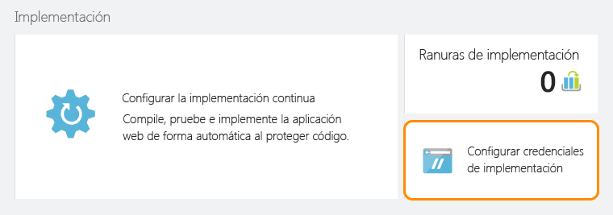

<properties
	pageTitle="Compilación e implementación de una aplicación de API de Java en el Servicio de aplicaciones de Azure"
	description="Aprenda a crear un paquete de aplicación de API de Java y a implementarlo en el Servicio de aplicaciones de Azure."
	services="app-service\api"
	documentationCenter="java"
	authors="bradygaster"
	manager="mohisri" 
	editor="tdykstra"/>

<tags
	ms.service="app-service-api"
	ms.workload="web"
	ms.tgt_pltfrm="na"
	ms.devlang="java"
	ms.topic="get-started-article"
	ms.date="11/27/2015"
	ms.author="bradygaster"/>

# Compilación e implementación de una aplicación de API de Java en el Servicio de aplicaciones de Azure

[AZURE.INCLUDE [app-service-api-get-started-selector](../../includes/app-service-api-get-started-selector.md)]

En este tutorial se muestra cómo crear una aplicación de Java e implementarla en las aplicaciones de API del Servicio de aplicaciones de Azure mediante [Git](http://git-scm.com). Las instrucciones que se indican en este tutorial se pueden seguir en cualquier sistema operativo que sea capaz de ejecutar Java. El código de este tutorial está compilado mediante [Maven](https://maven.apache.org/). [Jax RS](https://jax-rs-spec.java.net/) se utiliza para crear el servicio RESTful y se genera a partir de la especificación de metadatos de [Swagger](http://swagger.io) mediante el [Editor de Swagger](http://editor.swagger.io/).

## Requisitos previos

1. [Kit para desarrolladores de Java 8](http://www.oracle.com/technetwork/java/javase/downloads/jdk8-downloads-2133151.html) (o superior)
1. Una suscripción de [evaluación gratuita](https://azure.microsoft.com/pricing/free-trial/) o de pago a [Microsoft Azure](https://azure.microsoft.com/)
1. [Maven](https://maven.apache.org/) instalado en el equipo de desarrollo
1. GIT instalado en el equipo de desarrollo. 

## Aplicación de la técnica scaffolding a la API mediante Swagger.IO
Con el editor en línea de swagger.io, puede escribir en Swagger código JSON o YAML que representa la estructura de su API. Cuando haya diseñado el área de superficie de API, puede exportar el código en una diversidad de plataformas y marcos. En la siguiente sección se modificará el código con scaffold para incluir la funcionalidad de simulacro.

Esta demostración comenzará con un cuerpo JSON de Swagger que se pegará en el editor de swagger.io, que luego se utilizará para generar código mediante el uso de JAX-RS para acceder a un punto de conexión de API de REST. A continuación, modificará el código con scaffold para devolver datos ficticios y simular una API de REST creada sobre un mecanismo de persistencia de datos.

1. Copie el siguiente código JSON de Swagger en el Portapapeles.

		{
			"swagger": "2.0",
			"info": {
				"version": "v1",
				"title": "Contact List",
				"description": "A Contact list API based on Swagger and built using Java"
			},
			"host": "localhost",
			"schemes": [
				"http",
				"https"
			],
			"basePath": "/api",
			"paths": {
				"/contacts": {
					"get": {
						"tags": [
							"Contact"
						],
						"operationId": "contacts_get",
						"consumes": [],
						"produces": [
							"application/json",
							"text/json"
						],
						"responses": {
							"200": {
								"description": "OK",
								"schema": {
									"type": "array",
									"items": {
										"$ref": "#/definitions/Contact"
									}
								}
							}
						},
						"deprecated": false
					}
				},
				"/contacts/{id}": {
					"get": {
						"tags": [
							"Contact"
						],
						"operationId": "contacts_getById",
						"consumes": [],
						"produces": [
							"application/json",
							"text/json"
						],
						"parameters": [
							{
								"name": "id",
								"in": "path",
								"required": true,
								"type": "integer",
								"format": "int32"
							}
						],
						"responses": {
							"200": {
								"description": "OK",
								"schema": {
									"type": "array",
									"items": {
										"$ref": "#/definitions/Contact"
									}
								}
							}
						},
						"deprecated": false
					}
				}
			},
			"definitions": {
				"Contact": {
					"type": "object",
					"properties": {
						"Id": {
							"format": "int32",
							"type": "integer"
						},
						"Name": {
							"type": "string"
						},
						"EmailAddress": {
							"type": "string"
						}
					}
				}
			}
		}
		
1. Vaya al [editor en línea de Swagger](http://editor.swagger.io/). Una vez allí, haga clic en el elemento de menú **Archivo -> Pegar JSON**.

    

1. Pegue el código JSON de Swagger de lista de contactos que copió anteriormente.

    

1. Vea las páginas de documentación y el resumen de la API representado en el editor.

    

1. Seleccione la opción de menú **Generar servidor -> JAX RS** para aplicar la técnica scaffolding al código del lado servidor que modificará más adelante para agregar la implementación ficticia.

    
	
	Una vez que se genere el código, se le proporcionará un archivo ZIP para descargar. Este archivo contiene el código al que el generador de código de Swagger le ha aplicado la técnica scaffolding y todos los scripts de compilación asociados. Descomprima la biblioteca completa en un directorio de su estación de trabajo de desarrollo.

## Edición del código para agregar la implementación de API
En esta sección va a reemplazar la implementación del lado servidor del código generado por el código personalizado. El nuevo código devolverá una listaDeMatrices de entidades de contactos para el cliente que realiza la llamada.

1. Abra el archivo de modelo *Contact.java*, ubicado en la carpeta *src/gen/java/io/swagger/model*, mediante [código de Visual Studio](https://code.visualstudio.com) o en el editor de texto de su elección. 

    

1. Agregue el siguiente constructor a la clase **Contact**.

        public Contact(Integer id, String name, String email) 
		{
			this.id = id;
			this.name = name;
			this.emailAddress = email;
		}

1. Abra el archivo de implementación del servicio *ContactsApiServiceImpl.java*, ubicado en la carpeta *src/main/java/io/swagger/api/impl*, mediante [código de Visual Studio](https://code.visualstudio.com) o en el editor de texto de su elección.

    

1. Sobrescriba el código del archivo con este nuevo código para agregar una implementación ficticia al código de servicio.

        package io.swagger.api.impl;

        import io.swagger.api.*;
        import io.swagger.model.*;
        import com.sun.jersey.multipart.FormDataParam;
        import io.swagger.model.Contact;
        import java.util.*;
        import io.swagger.api.NotFoundException;
        import java.io.InputStream;
        import com.sun.jersey.core.header.FormDataContentDisposition;
        import com.sun.jersey.multipart.FormDataParam;
        import javax.ws.rs.core.Response;

        @javax.annotation.Generated(value = "class io.swagger.codegen.languages.JaxRSServerCodegen", date = "2015-11-24T21:54:11.648Z")
        public class ContactsApiServiceImpl extends ContactsApiService {
  
            private ArrayList<Contact> loadContacts()
            {
                ArrayList<Contact> list = new ArrayList<Contact>();
                list.add(new Contact(1, "Barney Poland", "barney@contoso.com"));
                list.add(new Contact(2, "Lacy Barrera", "lacy@contoso.com"));
                list.add(new Contact(3, "Lora Riggs", "lora@contoso.com"));
                return list;
            }
  
            @Override
            public Response contactsGet()
            throws NotFoundException {
                ArrayList<Contact> list = loadContacts();
                return Response.ok().entity(list).build();
                }
  
            @Override
            public Response contactsGetById(Integer id)
            throws NotFoundException {
                ArrayList<Contact> list = loadContacts();
                Contact ret = null;
            
                for(int i=0; i<list.size(); i++)
                {
                    if(list.get(i).getId() == id)
                    {
                        ret = list.get(i);
                    }
                }
                return Response.ok().entity(ret).build();
            }
        }

1. Abra el símbolo del sistema.

1. Ejecute el siguiente comando de Maven para compilar el código y ejecutarlo localmente mediante el servidor de aplicaciones de Jetty.

		mvn package jetty:run
		
1. Debería ver que la ventana de comandos refleja que Jetty ha iniciado el código en el puerto 8080.

	
	
1. Utilice [Postman](https://www.getpostman.com/) para realizar una solicitud al método de API "obtener todos los contactos" ubicado en http://localhost:8080/api/contacts.

	
	
1. Utilice [Postman](https://www.getpostman.com/) para realizar una solicitud al método de API "obtener contacto específico" ubicado en http://localhost:8080/api/contacts/2.

	
	
1. Por último, compile el archivo WAR de Java (archivo Web) ejecutando el siguiente comando de Maven en la consola.

		mvn package war:war
		
	Una vez creado el archivo WAR, se colocará en la carpeta **target**. Vaya a la carpeta **target** y cambie el nombre del archivo WAR **ROOT.war** (asegúrese de que las mayúsculas y minúsculas coinciden con este formato).
	
		rename swagger-jaxrs-server-1.0.0.war ROOT.war
		
	Por último, ejecute los siguientes comandos para crear una carpeta **deploy** que va a utilizar para implementar el archivo WAR en Azure.
	
		mkdir deploy
		mkdir deploy\webapps
		copy target\ROOT.war deploy\webapps
		cd deploy
	
## Publicación del resultado en el Servicio de aplicaciones de Azure
En esta sección aprenderá a crear una nueva aplicación de API mediante el Portal de Azure, a prepararla para hospedar aplicaciones Java y a implementar el archivo WAR recién creado en el Servicio de aplicaciones de Azure para ejecutar la nueva aplicación de API.

1. Cree una nueva aplicación de API en el [Portal de Azure](https://portal.azure.com/); para ello, haga clic en el elemento de menú **Nuevo -> Web y móvil -> Aplicación de API**.
	
	

1. Haga clic en la opción **Configuración de la aplicación** en la hoja de configuración de la aplicación de API. A continuación, seleccione las últimas versiones de Java de los menús de versión de Java y seleccione la aplicación Tomcat más reciente en el menú de contenedor web.

	

1. Haga clic en el elemento de menú de configuración **Credenciales de implementación** y proporcione un nombre de usuario y una contraseña para usarlos para publicar archivos en la aplicación de API.

	

1. Haga clic en el elemento de menú de configuración **Implementación continua**. Una vez allí, haga clic en el botón **Elegir origen** y seleccione la opción **Repositorio de Git local**. Se crea un repositorio de Git que se ejecuta en Azure, que tiene una asociación con la aplicación de API. Cada vez que confirme el código en la bifurcación *principal* del repositorio de Git, el código se publicará en la instancia de aplicación de API en ejecución activa.

	

1. Copie la nueva URL del repositorio de Git en el Portapapeles. Guárdela, será importante dentro de poco.

	

1. Realice la operación de inserción de Git del archivo WAR en el repositorio en línea. Para ello, vaya a la carpeta **deploy** que creó anteriormente para que pueda confirmar fácilmente el código hasta el repositorio que se ejecuta en el Servicio de aplicaciones. Una vez que esté en la ventana de la consola y que haya ido a la carpeta donde se encuentra la carpeta de aplicaciones web, emita los siguientes comandos de Git para iniciar el proceso y lanzar una implementación.

		git init
		git add .
		git commit -m "initial commit"
		git remote add azure [YOUR GIT URL]		
		git push azure master
		
	Después de emitir la solicitud **push**, se le pedirá la contraseña que creó anteriormente para la credencial de la implementación. Si la escribe, verá que en el portal se muestra que la implementación ha llegado y se ha implementado.
		
1. Si utiliza nuevamente Postman para llegar a la aplicación de API recién implementada que se ejecuta en el Servicio de aplicaciones de Azure, verá que el comportamiento es coherente y que ahora se devuelven los datos de contacto, y todo ello mediante sencillos cambios en el código Java con scaffold Swagger.io.

	
	
## Pasos siguientes
En este artículo ha sido capaz de comenzar con un archivo JSON de Swagger y algún código Java con scaffold obtenido con el editor de Swagger.io. A partir de ahí, algunos sencillos cambios y un proceso de implementación de Git han dado lugar a que tengamos una aplicación de API funcional escrita en Java. El siguiente tutorial de la serie de introducción a Aplicaciones de API muestra cómo [consumir aplicaciones de API desde clientes de JavaScript mediante CORS](app-service-api-cors-consume-javascript.md).

Para sacar más partido a este ejemplo, aprenda más sobre el [SDK de almacenamiento para Java](../storage/storage-java-how-to-use-blob-storage.md) para conservar los blobs de JSON. O bien, puede usar el [SDK de Java de DocumentDB](../documentdb/documentdb-java-application.md) para guardar los datos de contacto en Azure DocumentDB.

Para obtener más información sobre del uso de Java en Azure, consulte el [Centro para desarrolladores de Java](/develop/java/).

<!---HONumber=AcomDC_0204_2016-->