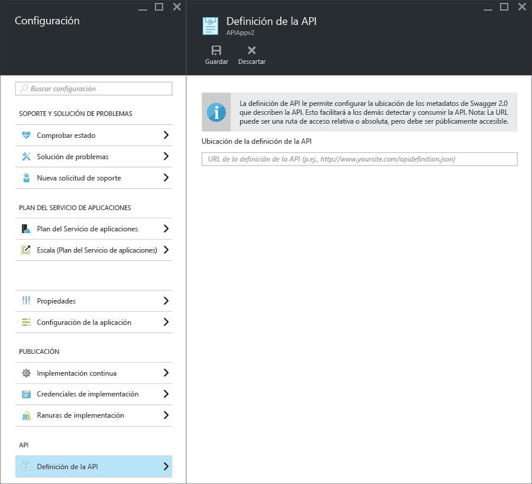

<properties
	pageTitle="Metadatos de aplicaciones de API del Servicio de aplicaciones para la detección de API y la generación de código | Microsoft Azure"
	description="Aprenda cómo las aplicaciones de API del Servicio de aplicaciones de Azure usan los metadatos de Swagger para facilitar la detección de API y la generación de código."
	services="app-service\api"
	documentationCenter=".net"
	authors="tdykstra"
	manager="wpickett"
	editor=""/>

<tags
	ms.service="app-service-api"
	ms.workload="na"
	ms.tgt_pltfrm="na"
	ms.devlang="na"
	ms.topic="get-started-article"
	ms.date="11/25/2015"
	ms.author="tdykstra"/>

# Metadatos de aplicaciones de API del Servicio de aplicaciones para la detección de API y la generación de código 

La compatibilidad con los metadatos de la API de [Swagger 2.0](http://swagger.io/) está integrada en las aplicaciones de API del Servicio de aplicaciones. Aunque no es necesario usar Swagger, si lo usa, puede sacar partido de las características de aplicaciones de API que facilitan la detección y el consumo.

## Punto de conexión de Swagger

Puede especificar un punto de conexión que proporcione metadatos JSON de Swagger 2.0 para una aplicación de API en una propiedad de la aplicación de API. El punto de conexión puede ser relativo a la dirección URL base de la aplicación de API o a una dirección URL absoluta. Las direcciones URL absolutas pueden señalar fuera de la aplicación de API.

En muchos clientes de bajada (por ejemplo, la generación de código de Visual Studio y el flujo "Agregar API" de PowerApps), es preciso que se pueda acceder públicamente a la dirección URL (que no esté protegida mediante autenticación de usuario o de servicio). Esto significa que si usa la autenticación de Servicio de aplicaciones y desea exponer la definición de la API desde su propia aplicación, será preciso que utilice la opción de autenticación que permite que llegue tráfico a la API. Para más información, consulte [Autenticación y autorización para Aplicaciones de API en el Servicio de aplicaciones](app-service-api-authentication.md).

### Hoja del portal

En el [Portal de Azure](https://portal.azure.com/), la dirección URL del punto de conexión se puede ver y cambiar en la hoja **Definición de API**.

### Propiedad del Administrador de recursos de Azure

La dirección URL de la definición de API de una aplicación de API también se puede configurar mediante las herramientas del Administrador de recursos de Azure como Azure PowerShell, CLI o el [Explorador de recursos](https://resources.azure.com/).

Establezca la propiedad `apiDefinition` en el tipo de recurso Microsoft.Web/sites/config para el recurso <site name>/web. Por ejemplo, en el **Explorador de recursos**, vaya a **suscripciones > {su suscripción} > resourceGroups > {su grupo de recursos} > proveedores > Microsoft.Web > sitios > {su sitio} > configuración > web** y verá la propiedad cors:

		"apiDefinition": {
		  "url": "https://contactslistapi.azurewebsites.net/swagger/docs/v1"
		}

### Valor predeterminado

Si se usa Visual Studio para crear una aplicación de API, el punto de conexión de la definición de API se establece automáticamente en la URL base de la aplicación de API más `/swagger/docs/v1`. Se trata de la dirección URL predeterminada que el paquete NuGet de [Swashbuckle](https://www.nuget.org/packages/Swashbuckle) utiliza para enviar los metadatos de Swagger generados dinámicamente para un proyecto de ASP.NET Web API.

## Generación de código

Una de las ventajas de integrar Swagger en aplicaciones de API de Azure es la generación automática de código. Las clases de cliente generadas hacen que sea más fácil escribir código que llame a una aplicación de API.

Puede generar código de cliente para una aplicación de API con Visual Studio o desde la línea de comandos. Para información sobre cómo generar clases de cliente en Visual Studio para un proyecto de ASP.NET Web API, consulte [Introducción a Aplicaciones de API y ASP.NET en el Servicio de aplicaciones de Azure](app-service-api-dotnet-get-started.md#codegen). Para información sobre cómo hacerlo desde la línea de comandos en todos los lenguajes admitidos, consulte el archivo Léame del repositorio [Azure/autorest](https://github.com/azure/autorest) en GitHub.com.
 
## Pasos siguientes

Para obtener un tutorial detallado que le guíe en el proceso de creación, implementación y consumo de una aplicación de API, consulte [Introducción a Aplicaciones de API y ASP.NET en el Servicio de aplicaciones de Azure](app-service-api-dotnet-get-started.md).

<!---HONumber=AcomDC_1210_2015-->