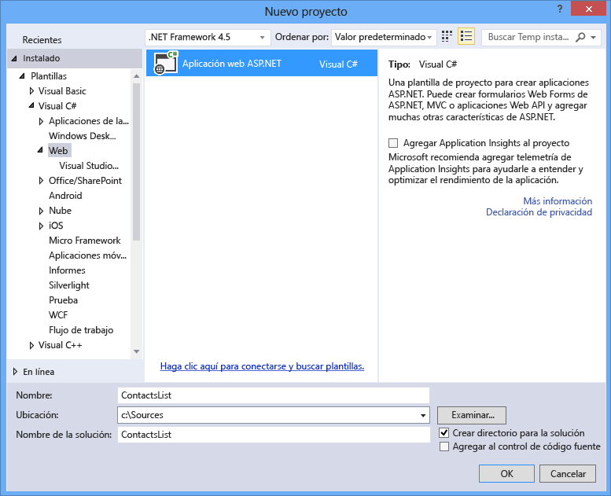
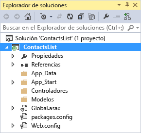
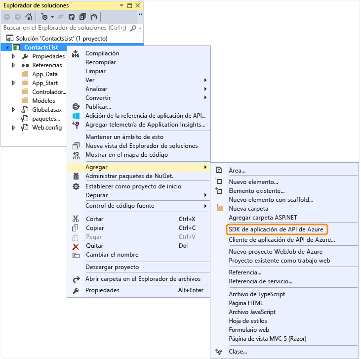
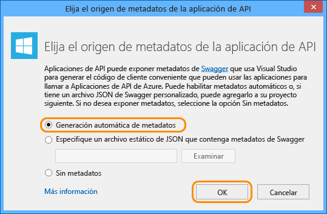

<properties 
	pageTitle="Configuración de un proyecto Web API como una aplicación de API" 
	description="Obtenga información sobre cómo configurar un proyecto Web API como una aplicación de API con Visual Studio 2013" 
	services="app-service\api" 
	documentationCenter=".net" 
	authors="bradygaster" 
	manager="wpickett" 
	editor="jimbe"/>

<tags 
	ms.service="app-service-api" 
	ms.workload="web" 
	ms.tgt_pltfrm="dotnet" 
	ms.devlang="na" 
	ms.topic="article" 
	ms.date="01/08/2016" 
	ms.author="tdykstra"/>

# Configuración de un proyecto Web API como una aplicación de API

[AZURE.INCLUDE [app-service-api-v2-note](../../includes/app-service-api-v2-note.md)]

## Información general

En este tutorial se muestra cómo usar un proyecto de Web API existente y configurarlo para implementarlo como una [aplicación de API](app-service-api-apps-why-best-platform.md) en el [Servicio de aplicaciones de Azure](../app-service/app-service-value-prop-what-is.md). En los tutoriales posteriores de la serie se muestra cómo [implementar](app-service-dotnet-deploy-api-app.md) y [depurar](../app-service-dotnet-remotely-debug-api-app.md) el proyecto de aplicación de API creado en este tutorial.

Para obtener información sobre las aplicaciones de API, consulte [¿Qué son las Aplicaciones de API?](app-service-api-apps-why-best-platform.md).

[AZURE.INCLUDE [install-sdk-2015-2013](../../includes/install-sdk-2015-2013.md)]

Este tutorial requiere la versión 2.6 o posterior de SDK de Azure para .NET.

## Configuración de un proyecto Web API 

Esta sección muestra cómo configurar un proyecto de Web API existente como aplicación de API. Comenzará utilizando la plantilla de proyecto Web API para crear un proyecto Web API y, a continuación, lo configurará como una aplicación de API.

1. Abra Visual Studio 2015 o Visual Studio 2013.

2. Haga clic en **Archivo > Nuevo proyecto**.

3. Seleccione la plantilla **Aplicación Web ASP.NET**.

4. Asegúrese de que la casilla **Agregar Application Insights al proyecto** está desactivada.

4. Asigne al proyecto el nombre *ContactsList*.

	

5. Haga clic en **Aceptar**.

6. En el cuadro de diálogo **Nuevo proyecto de ASP.NET**, seleccione la plantilla de proyecto **vacía**.

7. Haga clic en la casilla **Web API**.

8. Desactive la opción **Host en la nube** opción.

	

9. Haga clic en **Aceptar** para generar el proyecto.

	

10. En el **Explorador de soluciones**, haga clic con el botón secundario en el proyecto (no la solución) y, a continuación, seleccione **Agregar > SDK de aplicación de API de Azure**.

	

11. En el cuadro de diálogo **Elegir origen de metadatos de la aplicación de API**, haga clic en **Generación automática de metadatos**.

	

	Esta opción habilita la IU dinámica de Swagger, que verá más adelante en el tutorial. Si opta por cargar un archivo de metadatos de Swagger, se guarda con el nombre de archivo *apiDefinition.swagger.json*, tal como se explica en la sección siguiente.

12. Haga clic en **Aceptar**.
 
	En este punto, Visual Studio instala paquetes de NuGet de la aplicación de API y agrega los metadatos de la aplicación de API al proyecto Web API.

[AZURE.INCLUDE [app-service-api-review-metadata](../../includes/app-service-api-review-metadata.md)]

[AZURE.INCLUDE [app-service-api-define-api-app](../../includes/app-service-api-define-api-app.md)]

[AZURE.INCLUDE [app-service-api-direct-deploy-metadata](../../includes/app-service-api-direct-deploy-metadata.md)]

## Pasos siguientes

La aplicación de API ya está lista para implementarse. Para ello, puede seguir el tutorial [Implementación de una aplicación de API](app-service-dotnet-deploy-api-app.md).
 

<!---HONumber=AcomDC_0114_2016-->