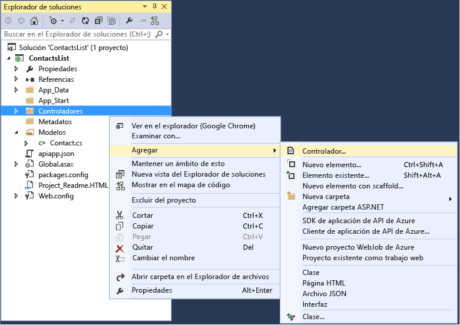
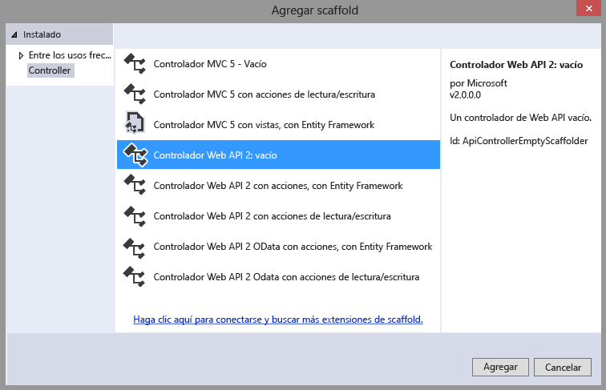
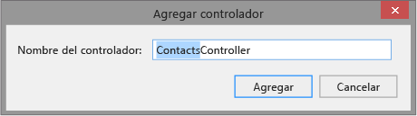
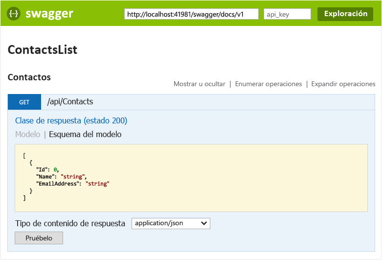
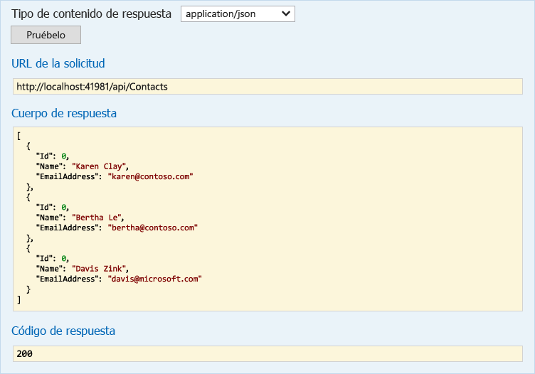

<properties 
	pageTitle="Creación de una aplicación de API de ASP.NET en el Servicio de aplicaciones de Azure mediante Visual Studio 2015" 
	description="Aprenda a crear una aplicación de API de ASP.NET en el Servicio de aplicaciones de Azure con Visual Studio 2015." 
	services="app-service\api" 
	documentationCenter=".net" 
	authors="tdykstra" 
	manager="wpickett" 
	editor="jimbe"/>

<tags 
	ms.service="app-service-api" 
	ms.workload="web" 
	ms.tgt_pltfrm="dotnet" 
	ms.devlang="na" 
	ms.topic="article" 
	ms.date="01/08/2016" 
	ms.author="tdykstra"/>

# Creación de una aplicación de API de ASP.NET en el Servicio de aplicaciones de Azure mediante Visual Studio 2015

[AZURE.INCLUDE [app-service-api-v2-note](../../includes/app-service-api-v2-note.md)]

## Información general

En este tutorial creará un proyecto de API web 2 de ASP.NET con [Visual Studio 2015](https://www.visualstudio.com/es-ES/downloads/visual-studio-2015-downloads-vs.aspx) y lo configurará para implementarlo en la nube como una [aplicación de API](app-service-api-apps-why-best-platform.md) en el [Servicio de aplicaciones de Azure](../app-service/app-service-value-prop-what-is.md). También implementará el proyecto en Azure Al final del tutorial, tendrá una aplicación de API que se ejecuta en la nube de Azure.

En el tutorial se supone que sabe cómo trabajar con archivos y carpetas en el **Explorador de soluciones** de Visual Studio.

El tutorial funciona con la versión actualmente publicada de la API web de ASP.NET. Para obtener información sobre cómo crear una aplicación de API de ASP.NET MVC 6, consulte la entrada del blog: [https://alexanderzeitler.com/articles/Deploying-a-ASP-NET-MVC-6-API-as-Azure-API-App-in-Azure-App-Services/](https://alexanderzeitler.com/articles/Deploying-a-ASP-NET-MVC-6-API-as-Azure-API-App-in-Azure-App-Services/ "Implementación de una API de ASP.NET MVC 6 como una aplicación de API de Azure en los Servicios de aplicaciones de Azure").

[AZURE.INCLUDE [install-sdk-2015-only](../../includes/install-sdk-2015-only.md)]

Este tutorial requiere la versión 2.6 o posterior de SDK de Azure para .NET.

## Creación de un proyecto de aplicación de API 

Visual Studio 2015 RC no dispone todavía de una plantilla de proyecto de aplicación de API, así que para crear uno empiece con la plantilla de proyecto de API web.

1. Abra Visual Studio 2015 RC.

2. Haga clic en **Archivo > Nuevo proyecto**.

3. En **Plantillas**, haga clic en **Web** y luego en la plantilla **Aplicación web ASP.NET**.

4. Asigne al proyecto el nombre *ContactsList*.

5. Desactive la casilla **Agregar Application Insights a proyecto**.

5. Haga clic en **Aceptar**.

	

6. En el cuadro de diálogo **Nuevo proyecto de ASP.NET**, en **Plantillas de ASP.NET 4.6**, seleccione la plantilla de proyecto **Vacía**.

7. Active la casilla **API web**.

8. Desactive la casilla **Host en la nube**.

7. Haga clic en **Aceptar**.

	

## Incorporación de paquetes NuGet

El runtime del Servicio de aplicaciones para aplicaciones de API lo proporciona el paquete de NuGet [Microsoft.Azure.AppService.ApiApps.Service](http://www.nuget.org/packages/Microsoft.Azure.AppService.ApiApps.Service/) y la generación dinámica de metadatos de la API de [Swagger](http://swagger.io/ "Información oficial de Swagger") la proporciona el paquete de NuGet [Swashbuckle](http://www.nuget.org/packages/Swashbuckle/).

> **Nota:** al instalar el paquete Swashbuckle, se habilita de forma predeterminada una página de prueba de API. Si publica la aplicación de API de publicación y establece su nivel de acceso en **Público (anónimo)**, cualquiera que encuentre la dirección URL de la página de prueba puede usarla para llamar a la API. La página de prueba se usará más adelante en el tutorial.

1. Haga clic en **Herramientas > Administrador de paquetes de Nuget > Consola del administrador de paquetes**.

2. En la **Consola del Administrador de paquetes ** (PMC), escriba los siguientes comandos.

		install-package Microsoft.Azure.AppService.ApiApps.Service
		install-package Swashbuckle

	Puede que tenga que esperar unos minutos después de que el PMC muestra el mensaje que indica que se están comprobando las dependencias.

## Agregar archivos de metadatos de aplicación de API

Los metadatos que permiten que un proyecto de API web se implemente como una aplicación de API están contenidos en un archivo *apiapp.json* y una carpeta *Metadatos* con sus subcarpetas y archivos. En los pasos siguientes se agregan estos archivos con valores predeterminados.

En la sección [Metadatos de la aplicación de API](#api-app-metadata), más adelante en este tutorial, se explica cómo personalizar estos metadatos.

1. En la carpeta del proyecto, cree un archivo *.json* llamado apiapp.json y sustituya el contenido del nuevo archivo por el siguiente texto JSON.

		{
		    "$schema": "http://json-schema.org/schemas/2014-11-01/apiapp.json#",
		    "id": "ContactsList",
		    "namespace": "microsoft.com",
		    "gateway": "2015-01-14",
		    "version": "1.0.0",
		    "title": "ContactsListTitle",
		    "summary": "Summary",
		    "author": "Author",
		    "endpoints": {
		        "apiDefinition": "/swagger/docs/v1",
		        "status": null
		    }
		}

3. En la carpeta del proyecto, cree una carpeta denominada *Metadatos* y, dentro de esa carpeta, cree una carpeta denominada *deploymentTemplates*.

5. En la carpeta *deploymentTemplates*, cree un archivo *.json* denominado *apiappconfig.azureresource.json* y sustituta el contenido del nuevo archivo por el siguiente texto JSON.

		{
		  "$schema": "http://schemas.management.azure.com/schemas/2014-04-01-preview/deploymentTemplate.json#",
		  "contentVersion": "1.0.0.0",
		  "parameters": {
		    "$system": {
		      "type": "Object"
		    }
		  },
		  "resources": []
		}

## Adición de código de API web

En los pasos siguientes se agrega código para un método HTTP Get simple que devuelve una lista de contactos codificada de forma rígida.

1. Cree la carpeta *Models* en la carpeta del proyecto, en caso de que no exista.

2. En la carpeta *Models*, agregue un archivo de clase denominado *Contact.cs*, y reemplace el contenido del archivo por el siguiente código. namespace ContactsList.Models { public class Contact { public int Id { get; set; } public string Name { get; set; } public string EmailAddress { get; set; } } }

5. Haga clic con el botón secundario en la carpeta **Controladores** y seleccione **Agregar > Controlador**.

	

6. En el cuadro de diálogo **Agregar scaffold**, seleccione la opción **Controlador de Web API 2 - Vacío** y haga clic en **Agregar**.

	

7. Asigne el nombre **ContactsController** al controlador y haga clic en **Agregar**.

	

8. Una vez creado el archivo *ContactsController.cs*, sustituya su contenido por el código siguiente.

		using ContactsList.Models;
		using System;
		using System.Collections.Generic;
		using System.Linq;
		using System.Net;
		using System.Net.Http;
		using System.Threading.Tasks;
		using System.Web.Http;
		
		namespace ContactsList.Controllers
		{
		    public class ContactsController : ApiController
		    {
		        [HttpGet]
		        public IEnumerable<Contact> Get()
		        {
		            return new Contact[]{
						new Contact { Id = 1, EmailAddress = "barney@contoso.com", Name = "Barney Poland"},
						new Contact { Id = 2, EmailAddress = "lacy@contoso.com", Name = "Lacy Barrera"},
	                	new Contact { Id = 3, EmailAddress = "lora@microsoft.com", Name = "Lora Riggs"}
		            };
		        }
		    }
		}

## Prueba de la API web

Para ver la página de prueba de la API, realice los pasos siguientes.

1. Ejecute la aplicación localmente (CTRL+F5) y agregue `/swagger` al final de la dirección URL en la barra de direcciones del navegador. 

	

2. Haga clic en **Contacts (Contactos) > Get (Obtener) > Try it out (Probarlo)**. Verá que la API funciona y devuelve el resultado esperado.

	

## Creación de una aplicación de API en Azure

1. Cree una aplicación de API en el [Portal de vista previa de Azure](https://portal.azure.com/). 

	* Haga clic en **Nuevo > Web + móvil > Aplicación de API**.

		

	* En **Nombre**, escriba ContactsList.

	* En **Plan del Servicio de aplicaciones**, haga clic en **Crear nuevo** y escriba un nombre, por ejemplo: **ContactsList**.

		Para obtener más información sobre los planes del Servicio de aplicaciones, consulte [Introducción detallada sobre los planes del Servicio de aplicaciones de Azure](azure-web-sites-web-hosting-plans-in-depth-overview.md).

	* Haga clic en **Nivel de precios > Ver todo > Gratis > Seleccionar** para seleccionar el nivel de precios gratuito.

		Puede usar un nivel de precios de pago, pero no es necesario para este tutorial.

	* En **Grupo de recursos**, haga clic en **Crear nuevo** y escriba un nombre, por ejemplo: ContactsList.

		Para obtener más información sobre los grupos de recursos, consulte [Uso de grupos de recursos para administrar los recursos de Azure](resource-group-overview.md).

	* Si tiene varias suscripciones, seleccione la que quera usar.

	* Elija una ubicación cercana a usted.

	* Haga clic en **Crear**.

		

2. Cuando Azure termine de crear la aplicación de API, establezca el nivel de acceso de la aplicación de API en **Público (anónimo)**.

	* Haga clic en **Examinar > Grupos de recursos > [el grupo de recursos que creó] > [la aplicación de API que creó]**.

	* Haga clic en **Configuración > Configuración de la aplicación**.

	* Cambie el **Nivel de acceso** a **Público (anónimo)**.
	 
	* Haga clic en **Guardar**.

		
	
2. Tome nota del nombre de la aplicación web subyacente que hospeda la aplicación de API. Lo usará al implementar el proyecto de Visual Studio.

	* En **Host de aplicación API**, haga clic en **ContactsList**.

		

	* El nombre está en el título de la hoja **Host de aplicación API**.

		

## Implementación del proyecto de API web en la nueva aplicación de API de Azure
 
Las aplicaciones de API son básicamente aplicaciones web para las que Azure proporciona características adicionales de forma que tengan funcionalidad de servicio web. En Visual Studio 2015 RC, se publican en la aplicación web subyacente de la aplicación de API porque el asistente de Publicación web no dispone de una selección específicamente para aplicaciones de API.

2. En el **Explorador de soluciones** de Visual Studio, haga clic con el botón derecho en el proyecto y, luego, en el menú contextual, haga clic en **Publicar**.

3. En el paso **Perfil** del asistente **Publicación web**, haga clic en **Aplicaciones web de Microsoft Azure**.

	

4. En la lista desplegable **Aplicaciones web existentes**, seleccione la entrada con el nombre de la aplicación de API que apuntó anteriormente.

	

5. Haga clic en **Publicar**.

	El explorador se abre en la URL de la aplicación web y muestra una página que dice que se ha creado la aplicación API.

6. En la barra de direcciones del explorador, agregue "swagger/" al final de la URL, por ejemplo:

		https://microsoft-apiappb001b62a9033493a33748332233fca2.azurewebsites.net/swagger/

	Verá la misma interfaz de usuario de Swagger que vio anteriormente ejecutándose de forma local, pero ahora ejecutándose en la nube.

2. Haga clic en **Contacts (Contactos) > Get (Obtener) > Try it out (Probarlo)**. Verá que la API funciona y devuelve el resultado esperado.

	

## Visualización de la definición de la API en el portal de vista previa de Azure

En esta sección, se navega al portal para ver la definición de la API de la aplicación de API que acaba de crear.

1. En el [Portal de vista previa de Azure](https://portal.azure.com/), navegue hasta la hoja **Aplicación de API** de la aplicación de API: haga clic en **Examinar > Grupos de recursos > [el grupo de recursos que creó] > [la aplicación de API que creó]**.

4. Haga clic en **Definición de API**.

	La hoja **Definición de API** de la aplicación muestra la lista de operaciones de API que definió al crear la aplicación. (Si ha seguido este tutorial, sólo verá una operación Get.)

	

## Adición de una operación al código de la API web

5. Vuelva al proyecto de Visual Studio y agregue el código siguiente al archivo **ContactsController.cs**. Este código agrega un método **Post** que se puede usar para registrar nuevas instancias de `Contact` en la API.  

		[HttpPost]
		public HttpResponseMessage Post([FromBody] Contact contact)
		{
			// todo: save the contact somewhere
			return Request.CreateResponse(HttpStatusCode.Created);
		}

	

6. Publique el proyecto como lo hizo anteriormente. (En el **Explorador de soluciones**, haga clic con el botón derecho en el proyecto y haga clic en **Publicar** y, a continuación, haga clic en **Publicar** en el Asistente para **publicación web**.)

12. Cuando haya completado el proceso de publicación, vuelva al portal y reinicie la puerta de enlace como lo hizo anteriormente.

14. En el portal, vuelva a la hoja **Definición de API**.

	Verá el nuevo extremo de la API que acaba de crear e implementar en su suscripción de Azure.

	

[AZURE.INCLUDE [app-service-api-direct-deploy-metadata](../../includes/app-service-api-direct-deploy-metadata.md)]

## Pasos siguientes

Ahora ha creado e implementado una aplicación de API con Visual Studio 2015 RC. Para obtener más documentación sobre las aplicaciones de API, vea las entradas del panel de navegación que se muestra en el lado izquierdo de la página (para ventanas de explorador anchas) o en la parte superior de la página (para ventanas de explorador estrechas). Actualmente, la mayor parte de la documentación sobre aplicaciones de API se refiere a Visual Studio 2013, pero gran parte de ella puede usarse con VS 2015 porque la interfaz de usuario, el código que se escribe y la interfaz de usuario del portal son iguales.
 

<!---HONumber=AcomDC_0128_2016-->