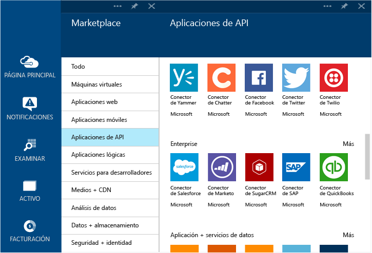

<properties 
	pageTitle="Qué son los conectores y las aplicaciones de API de BizTalk" 
	description="Obtenga información acerca de Aplicaciones de API, conectores y Aplicaciones de API de BizTalk" 
	services="app-service\logic" 
	documentationCenter="" 
	authors="MandiOhlinger" 
	manager="dwrede" 
	editor=""/>

<tags 
	ms.service="app-service-logic" 
	ms.workload="integration" 
	ms.tgt_pltfrm="na" 
	ms.devlang="na" 
	ms.topic="article" 
	ms.date="12/01/2015" 
	ms.author="mandia"/>

# Qué son los conectores y las aplicaciones de API de BizTalk

Servicios de aplicaciones de Azure se basa en un principio de extensibilidad y conectividad común a través de aplicaciones de API. Un *conector* es un tipo de aplicación de API que se centra en la conectividad. Los conectores, al igual que cualquier otra aplicación de API, se utilizan desde aplicaciones web, aplicaciones móviles y aplicaciones lógicas. Los conectores hacen que sea fácil conectarse a servicios existentes y ayuda a administrar la autenticación, ofrece supervisión, proporciona análisis, etc.

Cualquier desarrollador puede crear sus propias aplicaciones de API e implementarlas de forma privada. En el futuro, los desarrolladores pueden compartir y rentabilizar sus aplicaciones de API creadas de forma personalizada a través del mercado.

Para que los desarrolladores aceleren la creación de soluciones con Servicio de aplicaciones de Azure, el equipo de Azure agregó una serie de conectores al marketplace para satisfacer muchos escenarios comunes. Además, para ampliar el alcance de los Servicios de aplicaciones para escenarios de integración complejos y avanzados, también hay disponibles varias capacidades Premium y BizTalk.

En el Servicios de aplicaciones de Azure, hay servicio diferentes "niveles" disponibles. Todos los niveles incluyen todos los conectores y aplicaciones de la API, incluida su funcionalidad completa.

[Tarifas de servicio de aplicación](https://azure.microsoft.com/pricing/details/app-service/) describe estos niveles de servicio y también muestra qué se incluye en estos niveles. Las secciones siguientes describen las distintas categorías de conectores y aplicaciones de la API de BizTalk.

## Conectores estándar
El Servicio de aplicaciones incluye un conjunto completo de conectores que proporciona una llave en mano para conectar las aplicaciones web, móviles y lógicas a algunos de los principales nombres de SaaS actuales, incluidos Office 365, SalesForce, Sugar CRM, OneDrive, DropBox, Marketo, Facebook y muchos más. También incluye un conjunto de conectores para comunicarse con servicios externos mediante FTP, SFTP, POP3/IMAP, SMTP y SOAP; que son tan sencillos como realizar una llamada HTTP.

## Conectores Premium 
Los conectores Premium amplían el alcance de los Servicios de aplicaciones aún más en la empresa con conectividad para SAP, Oracle, DB2, Informix y WebSphere MQ.

## Servicios EDI y EAI
La creación de aplicaciones críticas para la empresa requiere más que solo conectividad. Basado en la plataforma de integración líder del sector de Microsoft - BizTalk Server - las Aplicaciones de API de BizTalk proporcionan capacidades de integración avanzadas que se acoplarán a las aplicaciones web, móviles y lógica fácilmente. Algunas de estas capacidades de integración incluyen validación, extracción, transformación, codificadores, administración de socios comerciales y la compatibilidad con los formatos EDI como X12, EDIFACT y AS2.

## Reglas
Las reglas de negocio encapsulan las directivas y decisiones que controlan los procesos de negocio. Normalmente, las reglas son dinámicas y cambian con el tiempo por diferentes motivos, incluidos los planes de negocios, normas y muchas otras razones. Reglas de BizTalk en Servicios de aplicaciones le permite separar estas directivas desde el código de aplicación y hacer que el proceso de cambio sea más rápido y sencillo.

## Lista de conectores y aplicaciones de API
Consulte [Lista de conectores y aplicaciones de API](app-service-logic-connectors-list.md) para obtener una lista completa de conectores y aplicaciones de API incluidas en cada categoría, incluidos los conectores estándar, EAI de BizTalk, conectores de Premium, etc.
 

<!---HONumber=AcomDC_0128_2016-->