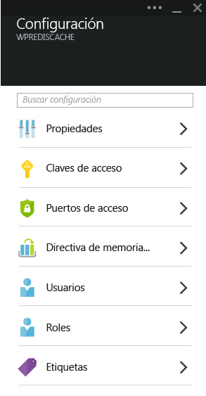
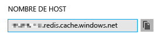
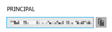
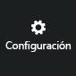
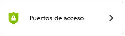
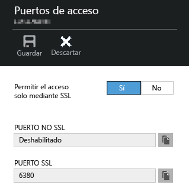
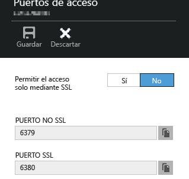

<properties
	pageTitle="Conexión de una aplicación web en Servicio de aplicaciones de Azure a Caché en Redis a través del protocolo Memcache | Microsoft Azure"
	description="Conexión de una aplicación web en Servicio de aplicaciones de Azure a Caché en Redis mediante el protocolo Memcache"
	services="app-service\web"
	documentationCenter="php"
	authors="SyntaxC4"
	manager="wpickett"
	editor="riande"/>

<tags
	ms.service="app-service-web"
	ms.devlang="php"
	ms.topic="get-started-article"
	ms.tgt_pltfrm="windows"
	ms.workload="na"
	ms.date="12/24/2015"
	ms.author="cfowler"/>

# Conexión de una aplicación web en Servicio de aplicaciones de Azure a Caché en Redis a través del protocolo Memcache

En este artículo, aprenderá a conectar una aplicación web de WordPress en [Servicio de aplicaciones de Azure](http://go.microsoft.com/fwlink/?LinkId=529714) a [Caché en Redis de Azure][12] mediante el protocolo [Memcache][13]. Si tiene una aplicación web existente que usa un servidor de Memcache para almacenamiento en caché en memoria, puede migrarla a Servicio de aplicaciones de Azure y usar la solución de almacenamiento en caché de origen en Microsoft Azure con pocos o ningún cambio en el código de aplicación. Además, puede usar su experiencia existente en Memcache para crear aplicaciones distribuidas y altamente escalables en Servicio de aplicaciones de Azure con Caché en Redis de Azure para almacenamiento en caché en memoria, mientras usa marcos de aplicaciones conocidos como .NET, PHP, Node.js, Java y Python.

Aplicaciones web del Servicio de aplicaciones habilita este escenario de aplicación con las correcciones de compatibilidad (shim) de Memcache de Aplicaciones web, que es un servidor local con Memcache que actúa como proxy de Memcache para almacenar en caché las llamadas a Caché en Redis de Azure. Esto permite que toda aplicación que se comunica mediante el uso del protocolo Memcache almacene en caché datos con Caché en Redis. Estas correcciones de compatibilidad (shim) de Memcache funcionan en el nivel de protocolo, por tanto, cualquier aplicación o marco de aplicaciones puede utilizarlas siempre que se comunique mediante el uso del protocolo Memcache.

[AZURE.INCLUDE [app-service-web-to-api-and-mobile](../../includes/app-service-web-to-api-and-mobile.md)]

## Requisitos previos

Las correcciones de compatibilidad (shim) de Memcache de Aplicaciones web se pueden utilizar con cualquier aplicación, siempre que se comunique mediante el uso del protocolo Memcache. En este ejemplo específico, la aplicación de referencia es un sitio escalable de WordPress, que se puede aprovisionar desde Azure Marketplace.

Siga los pasos descritos en estos artículos:

* [Aprovisionamiento de una entrada del Servicio de Caché en Redis de Azure][0]
* [Implementación de un sitio escalable de WordPress en Azure][1]

Una vez que se implementa el sitio web escalable de WordPress y que se aprovisiona una instancia de Caché en Redis, estará preparado para proceder con la habilitación de las correcciones de compatibilidad (shim) de Memcache en Aplicaciones web del Servicio de aplicaciones de Azure.

## Habilitación de las correcciones de compatibilidad de Memcache de Aplicaciones web

Para configurar las correcciones de compatibilidad (shim) de Memcache, debe crear tres ajustes de aplicaciones. Puede hacerlo mediante una variedad de métodos, entre los que se incluyen el [Portal de Azure](http://go.microsoft.com/fwlink/?LinkId=529715), el [Portal clásico][3], los [cmdlets de Azure PowerShell][5] o la [interfaz de la línea de comandos de Azure][5]. En lo que respecta a esta publicación, usaremos el [Portal de Azure][4] para establecer los ajustes de la aplicación. Los valores siguientes se pueden recuperar de la hoja **Configuración** de la instancia de Caché en Redis.



### Agregar la configuración de aplicación REDIS\_HOST

La primera configuración de aplicación que debe crear es la configuración de aplicación **REDIS\_HOST**. Esta configuración establece el destino al cual las correcciones de compatibilidad (shim) reenvía la información de caché. El valor que se requiere para la configuración de aplicación REDIS\_HOST se puede recuperar de la hoja **Propiedades** de la instancia de Caché en Redis.



Defina la clave para la configuración de aplicación en **REDIS\_HOST** y el valor de la configuración de aplicación en el **nombre de host** de la instancia de Caché en Redis.


### Agregar la configuración de aplicación REDIS\_KEY

La segunda configuración de aplicación que se debe crear es la configuración de aplicación **REDIS\_KEY**. Esta configuración proporciona el token de autenticación que se necesita para tener un acceso seguro a la instancia de Caché en Redis. Puede recuperar el valor que se requiere para la configuración de aplicación REDIS\_KEY de la hoja **Claves de acceso** de la instancia Caché en Redis.



Establezca la clave de la configuración de aplicación en **REDIS\_KEY** y el valor de la configuración de aplicación en **Clave principal** de la instancia de Caché en Redis.


### Agregar la configuración de aplicación MEMCACHESHIM\_REDIS\_ENABLE

La última configuración de aplicación se usa para habilitar las correcciones de compatibilidad (shim) de Memcache en Aplicaciones web, que utiliza las configuraciones REDIS\_HOST y REDIS\_KEY para conectarse a Caché en Redis de Azure y reenviar las llamadas a caché. Establezca la clave de la configuración de aplicación en **MEMCACHESHIM\_REDIS\_ENABLE** y el valor en **true**.


Una vez que agrega las tres (3) configuraciones de aplicación, haga clic en **Guardar**.

## Habilitar extensión de Memcache para PHP

A fin de que la aplicación se comunique con el protocolo Memcache, es necesario instalar la extensión Memcache en PHP (el marco de lenguaje para el sitio de WordPress).

### Descargar la extensión php\_memcache

Acceda a [PECL][6]. En la categoría de almacenamiento en caché, haga clic en [memcache][7]. Haga clic en el vínculo DLL en la columna de descargas.


Descargue el vínculo No seguro para subprocesos (NTS) x86 para la versión de PHP habilitada en Aplicaciones web. (El valor predeterminado es PHP 5.4)


### Habilitar la extensión php\_memcache

Después de descargar el archivo, descomprima y cargue **php\_memcache.dll** en el directorio **d:\\home\\site\\wwwroot\\bin\\ext\**. Una vez que el archivo php\_memcache.dll se haya cargado en la aplicación web, es necesario habilitar la extensión para tiempo de ejecución de PHP. Para habilitar la extensión Memcache en el Portal de Azure, abra la hoja **Configuración de aplicación** de la aplicación web y, a continuación, agregue la nueva configuración de aplicación con la clave de **PHP\_EXTENSIONS** y el valor **bin\\ext\\php\_memcache.dll**.


> [AZURE.NOTE]Si la aplicación web necesita cargar varias extensiones PHP, el valor de PHP\_EXTENSIONS debe ser una lista delimitada por comas de rutas de acceso relativas a archivos DLL.


Una vez que termine, haga clic en **Guardar**.

## Instalar el complemento WordPress para Memcache

> [AZURE.NOTE]También puede descargar el [complemento de almacenamiento en caché del objeto Memcached](https://wordpress.org/plugins/memcached/) desde WordPress.org.

En la página de complementos de WordPress, haga clic en **Agregar nuevo**.


En el cuadro de búsqueda, escriba **memcached** y presione **Entrar**.


Busque **Caché de objetos de Memcache** en la lista y, a continuación, haga clic en **Instalar ahora**.


### Habilitar el complemento WordPress para Memcache

>[AZURE.NOTE]Siga las instrucciones que aparecen en la entrada del blog [How to enable a Site Extension in Web Apps][8] (Habilitación de una extensión de sitio en Aplicaciones web) para instalar Visual Studio Team Services.

En el archivo `wp-config.php`, agregue el siguiente código sobre el comentario de edición de detención cerca del final del archivo.

```php
$memcached_servers = array(
	'default' => array('localhost:' . getenv("MEMCACHESHIM_PORT"))
);
```

Una vez que se pega este código, monaco guardará automáticamente el documento.

El paso siguiente es habilitar el complemento object-cache. Para hacerlo, arrastre y suelte **object-cache.php** desde la carpeta **wp-content/plugins/memcached** a la carpeta **wp-content** para habilitar la funcionalidad Caché de objetos de Memcache.


Ahora que el archivo **object-cache.php** está en la carpeta **wp-content**, Caché de objetos de Memcache ya está habilitado.


## Comprobación de que el complemento Memcache Object Cache funciona

Todos los pasos para habilitar las correcciones de compatibilidad (shim) de Memcache de Aplicaciones web ahora están completos. Lo único que queda es comprobar que los datos rellenan la instancia de Caché en Redis.

### Habilitar la compatibilidad de puertos no SSL en Caché en Redis de Azure

>[AZURE.NOTE]En el momento de la redacción del presente artículo, la CLI de Redis no es compatible con la conectividad SSL, por lo que los siguientes pasos resultan necesarios.

En el Portal de Azure, vaya a la instancia de Caché en Redis que creó para esta aplicación web. Una vez abierta la hoja de la memoria caché, haga clic en el icono **Configuración**.



Seleccione **Puertos de acceso** en la lista.



Haga clic en **No** para **Permitir acceso solo vía SSL**.



Verá que ahora está definido el valor Puerto NO SSL. Haga clic en **Guardar**.



### Conectarse a Caché en Redis de Azure desde redis-cli

>[AZURE.NOTE]En este paso se supone que Redis está instalado localmente en su equipo de desarrollo. [Siga estas instrucciones para instalar Redis localmente][9].

Abra la consola de línea de comandos de su preferencia y escriba el siguiente comando:

```shell
redis-cli –h <hostname-for-redis-cache> –a <primary-key-for-redis-cache> –p 6379
```

Reemplace **&lt;hostname-for-redis-cache&gt;** por el nombre de host xxxxx.redis.cache.windows.net real y **&lt;primary-key-for-redis-cache&gt;** por la clave de acceso para la memoria caché y, después, presione **Entrar**. Una vez que la CLI se conecte a la instancia de Caché en Redis, emita cualquier comando de Redis. En la captura de pantalla que aparece a continuación, elegí enumerar las claves.


La llamada para enumerar las claves debe devolver un valor. Si no es así, intente ir a la aplicación web y vuelva a intentarlo.

## Conclusión

¡Enhorabuena! La aplicación de WordPress ahora tiene una caché en memoria centralizada para ayudar a aumentar el rendimiento. Recuerde, las Correcciones de compatibilidad (shim) de Memcache de Aplicaciones web se puede usar con cualquier cliente Memcache, independientemente del lenguaje de programación o del marco de aplicaciones. Si desea enviar comentarios o formular preguntas acerca de las correcciones de compatibilidad (shim) de Memcache de Aplicaciones web, publique en los [Foros de MSDN][10] o en [Stackoverflow][11].

>[AZURE.NOTE]Si desea empezar a trabajar con el Servicio de aplicaciones de Azure antes de inscribirse para abrir una cuenta de Azure, vaya a [Prueba del Servicio de aplicaciones](http://go.microsoft.com/fwlink/?LinkId=523751), donde podrá crear inmediatamente una aplicación web de inicio de corta duración en el Servicio de aplicaciones. No es necesario proporcionar ninguna tarjeta de crédito ni asumir ningún compromiso.

## Lo que ha cambiado
* Para obtener una guía del cambio de Sitios web a Servicio de aplicaciones, vea: [Servicio de aplicaciones de Azure y su impacto en los servicios de Azure existentes](http://go.microsoft.com/fwlink/?LinkId=529714)


[0]: ../redis-cache/cache-dotnet-how-to-use-azure-redis-cache.md#create-a-cache
[1]: http://bit.ly/1t0KxBQ
[2]: http://manage.windowsazure.com
[3]: http://portal.azure.com
[4]: ../powershell-install-configure.md
[5]: /downloads
[6]: http://pecl.php.net
[7]: http://pecl.php.net/package/memcache
[8]: http://blog.syntaxc4.net/post/2015/02/05/how-to-enable-a-site-extension-in-azure-websites.aspx
[9]: http://redis.io/download#installation
[10]: https://social.msdn.microsoft.com/Forums/home?forum=windowsazurewebsitespreview
[11]: http://stackoverflow.com/questions/tagged/azure-web-sites
[12]: /services/cache/
[13]: http://memcached.org

<!---HONumber=AcomDC_0107_2016-->