<properties
	pageTitle="Creación de una aplicación web de ASP.NET en Servicio de aplicaciones de Azure | Microsoft Azure"
	description="Este tutorial muestra cómo crear un proyecto web ASP.NET en Visual Studio 2013 e implementarlo en una aplicación web en el Servicio de aplicaciones de Azure."
	services="app-service\web"
	documentationCenter=".net"
	authors="tdykstra"
	manager="wpickett"
	editor="jimbe"/>

<tags
	ms.service="app-service-web"
	ms.workload="web"
	ms.tgt_pltfrm="na"
	ms.devlang="dotnet"
	ms.topic="hero-article"
	ms.date="03/02/2015"
	ms.author="tdykstra"/>

# Creación de una aplicación web ASP.NET en el Servicio de aplicaciones de Azure

> [AZURE.SELECTOR]
- [.Net](web-sites-dotnet-get-started.md)
- [Node.js](web-sites-nodejs-develop-deploy-mac.md)
- [Java](web-sites-java-get-started.md)
- [PHP - Git](web-sites-php-mysql-deploy-use-git.md)
- [PHP - FTP](web-sites-php-mysql-deploy-use-ftp.md)
- [Python](web-sites-python-ptvs-django-mysql.md)

## Información general

Este tutorial muestra cómo implementar una aplicación web ASP.NET en una [aplicación web del Servicio de aplicaciones de Azure](app-service-web-overview.md) mediante Visual Studio 2015. En este tutorial se considera que no tiene ninguna experiencia previa con Azure o ASP.NET. Cuando acabe, tendrá una sencilla aplicación web que se ejecutará en la nube.

La siguiente ilustración muestra la aplicación completada:

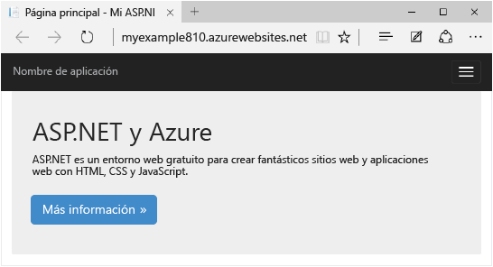

Aprenderá a realizar los siguientes procedimientos:

* Cómo crear una nueva aplicación web del Servicio de aplicaciones servicio mientras crea un proyecto web en Visual Studio.
* Cómo implementar un proyecto web en una aplicación web de servicio de aplicación mediante Visual Studio.
* Uso del [Portal de Azure](/overview/preview-portal/) para supervisar y administrar la aplicación web.

Al final de este tutorial, la sección [Pasos siguientes](#next-steps) proporciona vínculos a otros tutoriales con información más detallada sobre cómo usar el Servicio de aplicaciones de Azure.

> [AZURE.NOTE] Ayúdenos a conformar el ámbito y el enfoque de este tutorial, si hay otros temas que le gustaría ver cubiertos aquí o en un tutorial de introducción, déjenos un comentario en [Comentarios](#comments) al final del tutorial.

[AZURE.INCLUDE [Requisitos previos](../../includes/app-service-web-dotnet-get-started-prereqs.md)]

## Crear un proyecto y una aplicación web

El primer paso es crear un proyecto web en Visual Studio y una aplicación web en el Servicio de aplicaciones de Azure. Cuando esté listo, implemente el proyecto a la aplicación web para que esté disponible en Internet.

En el diagrama se muestra lo que se hace en los pasos de creación e implementación.

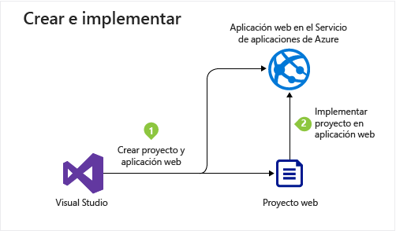

1. Abra Visual Studio 2015.

2. Haga clic en **Archivo > Nuevo > Proyecto**.

3. En el cuadro de diálogo **Nuevo proyecto**, haga clic en **Visual C# > Web > Aplicación web ASP.NET**. (Si lo prefiere, puede elegir **Visual Basic**).

3. Asegúrese de que **.NET Framework 4.5.2** es el marco de trabajo de destino seleccionado.

4.  [Azure Application Insights](../application-insights/app-insights-overview.md) supervisa la aplicación web en cuanto a disponibilidad, rendimiento y uso. La casilla **Agregar Application Insights al proyecto** está seleccionada de forma predeterminada la primera vez que crea un proyecto web después de instalar Visual Studio. Desactive la casilla Agregar Application Insights al proyecto si no desea probar Application Insights.

4. Asigne a la aplicación el nombre **MyExample**.

5. Haga clic en **Aceptar**.

	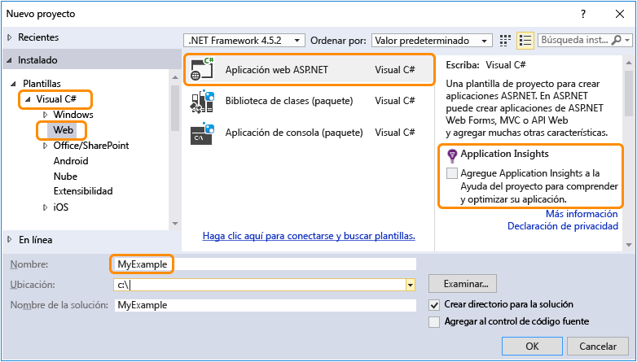

5. En el cuadro de diálogo **Nuevo proyecto de ASP.NET**, seleccione la plantilla **MVC**.

7. Haga clic en **Cambiar autenticación**.

	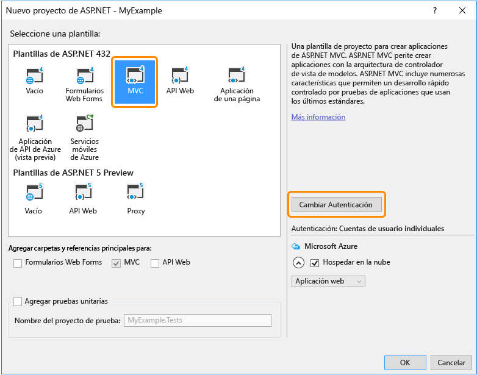

6. En el cuadro de diálogo **Cambiar autenticación**, haga clic en **Sin autenticación** y, a continuación, en **Aceptar**.

	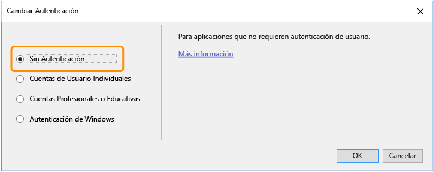

	La aplicación que está creando para este tutorial es simple y no admite el inicio de sesión de usuario.

5. En la sección **Microsoft Azure** del cuadro de diálogo **Nuevo proyecto de ASP.NET**, asegúrese de que **Host en la nube** está seleccionado y que **Servicio de aplicaciones** está seleccionado en la lista desplegable.

	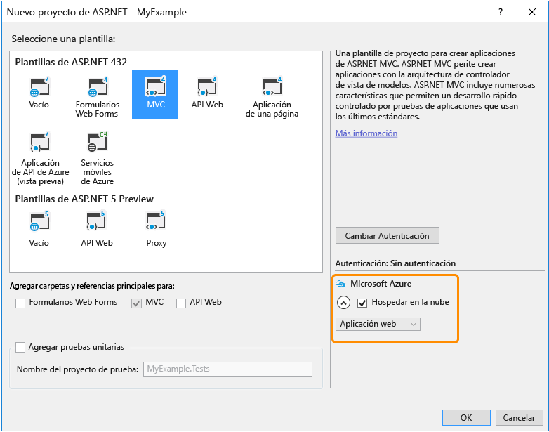

	Con esta configuración se especifica que Visual Studio creará una aplicación web de Azure para su proyecto web.

6. Haga clic en **Aceptar**.

5. Si aún no ha iniciado sesión en Azure, Visual Studio le pedirá que lo haga. Inicie sesión con el identificador y la contraseña de la cuenta que utiliza para administrar la suscripción de Azure.

	Cuando haya iniciado sesión, el cuadro de diálogo **Crear servicio de aplicaciones** le preguntará qué recursos desea crear.

	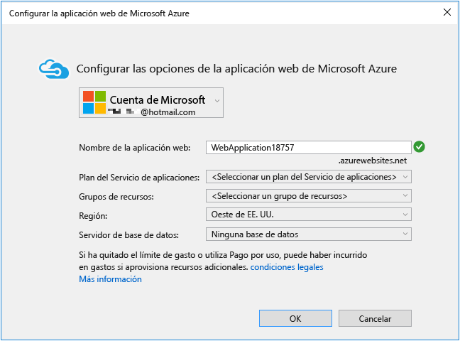

3. En el cuadro de diálogo **Crear servicio de aplicaciones**, escriba un nombre en **Nombre de la aplicación web** que sea único en el dominio *azurewebsites.net*. Puede denominarlo MyExample con números a la derecha para que sea único, por ejemplo, MyExample810. Si se crea automáticamente un nombre de web predeterminado, será exclusivo y puede usarlo.

	Si escribe un nombre que ya usa otro usuario, aparecerá un signo de exclamación rojo a la derecha en lugar de una marca de verificación verde y tendrá que especificar otro nombre.

	Azure usará este nombre como prefijo de la dirección URL de la aplicación. La dirección URL completa se compondrá de lo que escriba aquí más *.azurewebsites.net* (como se muestra junto al cuadro de texto **Nombre de la aplicación web**). Por ejemplo, si el nombre es `MyExample810`, la dirección URL será `myexample810.azurewebsites.net`. La dirección URL debe ser única.

6. Al lado del cuadro **Grupo de recursos**, haga clic en **Nuevo** y escriba "MyExample" u otro nombre que prefiera.

	Este cuadro combinado permite seleccionar un grupo de recursos existente o crear uno nuevo, para lo que se debe escribir un nombre de grupo de recursos que no exista en la suscripción.

	Un grupo de recursos es una colección de recursos de Azure tales como aplicaciones de API, bases de datos, máquinas virtuales, etc. Para un tutorial, suele ser mejor crear un nuevo grupo de recursos, porque así podrá eliminar fácilmente y en un solo paso todos los recursos de Azure que cree para el tutorial. Para más información, consulte [Información general de Azure Resource Manager](../resource-group-overview.md).

4. Haga clic en el botón **Nuevo** situado junto a la lista desplegable **Plan de servicio de aplicaciones**.

	

	La captura de pantalla muestra los valores de ejemplo de **Nombre de la aplicación web**, **Suscripción** y **Grupo de recursos**. Sus valores serán diferentes.

	En los siguientes pasos se crea un plan del Servicio de aplicaciones para el nuevo grupo de recursos. Un plan del Servicio de aplicaciones especifica los recursos de proceso en los que se ejecuta la aplicación de API. Por ejemplo, si elige el nivel Gratis, la aplicación de API se ejecuta en máquinas virtuales compartidas, mientras que para algunos niveles de pago, se ejecuta en máquinas virtuales dedicadas. Para más información, consulte [Información general sobre los planes del Servicio de aplicaciones de Azure](../app-service/azure-web-sites-web-hosting-plans-in-depth-overview.md).

5. En el cuadro de diálogo **Configurar el plan de servicio de aplicaciones**, escriba "MyExamplePlan" u otro nombre que prefiera.

5. En la lista desplegable **Ubicación**, elija la ubicación más cercana.

	Esta opción especifica en qué centro de datos de Azure se ejecutará su aplicación. Para este tutorial, puede seleccionar cualquier región y no habrá una diferencia notable, Pero para una aplicación de producción, desea que el servidor esté lo más próximo posible a los clientes que acceden a él con el fin de minimizar la [latencia](http://www.bing.com/search?q=web%20latency%20introduction&qs=n&form=QBRE&pq=web%20latency%20introduction&sc=1-24&sp=-1&sk=&cvid=eefff99dfc864d25a75a83740f1e0090).

5. En la lista desplegable **Tamaño**, haga clic en **Gratis**.

	Para este tutorial, el plan de tarifa Gratis proporcionará un rendimiento suficiente.

6. En el cuadro de diálogo **Configurar plan del servicio de aplicaciones**, haga clic en **Aceptar**.

	

7. En el cuadro de diálogo **Crear servicio de aplicaciones**, haga clic en **Crear**.

	

	En poco tiempo, normalmente menos de un minuto, Visual Studio crea el proyecto web y la aplicación web.

	La ventana del **Explorador de soluciones** ventana muestra los archivos y carpetas del nuevo proyecto.

	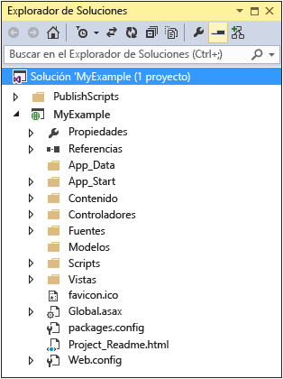

	La ventana **Actividad del Servicio de aplicaciones de Azure** muestra que se ha creado la aplicación web.

	

	Puede ver la aplicación web en **Cloud Explorer**.

	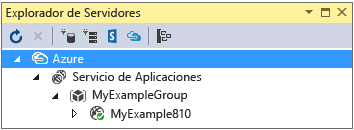

## Implementación del proyecto en la aplicación web

En esta sección implementará el proyecto web en la aplicación web, como se muestra en el paso 2 del diagrama.

1. En el **Explorador de soluciones**, haga clic con el botón derecho y seleccione **Publicar**.

	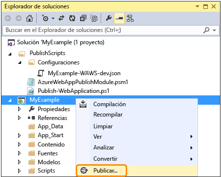

	En unos segundos aparecerá el Asistente para **publicación web**. El asistente abre un *perfil de publicación* que incluye la configuración para implementar el proyecto web en la nueva aplicación web. Si desea realizar la implementación en otra aplicación web distinta, puede hacer clic en la pestaña **Perfil** ficha para crear un perfil diferente. Para este tutorial, aceptará la configuración que se implementa en la aplicación web que creó anteriormente.

8. En la pestaña **Conexión** del Asistente para **publicación web**, haga clic en **Siguiente**.

	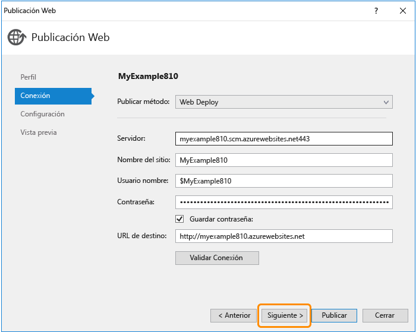

	La pestaña siguiente es **Configuración**. Aquí puede cambiar la pestaña de configuración de compilación para implementar una compilación de depuración para la [depuración remota](../app-service-web/web-sites-dotnet-troubleshoot-visual-studio.md#remotedebug). La pestaña también ofrece varias **Opciones de publicación de archivos**:

	* Quitar archivos adicionales en el destino.
	* Precompilar durante la publicación.
	* Excluir archivos de la carpeta App\_Data.

	Para este tutorial no necesita ninguna de ellas. Para obtener explicaciones detalladas de lo que hacen, consulte [Implementación de un proyecto de aplicación web mediante Publicación con un solo clic en Visual Studio](https://msdn.microsoft.com/library/dd465337.aspx).

10. En la pestaña **Configuración**, haga clic en **Siguiente**.

	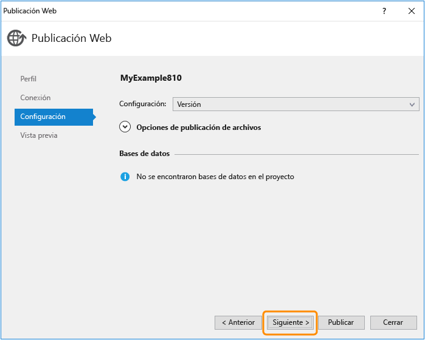

	Haga clic en la pestaña **Versión preliminar**. Aquí puede ver qué archivos se van a copiar desde el proyecto a la aplicación de API. Al implementar un proyecto en una aplicación de API para la que ya implementó anteriormente, solo se copian los archivos modificados. Si desea ver una lista de lo que se va a copiar, haga clic en el botón **Comenzar versión preliminar**.

11. En la pestaña **Vista previa**, haga clic en **Publicar**.

	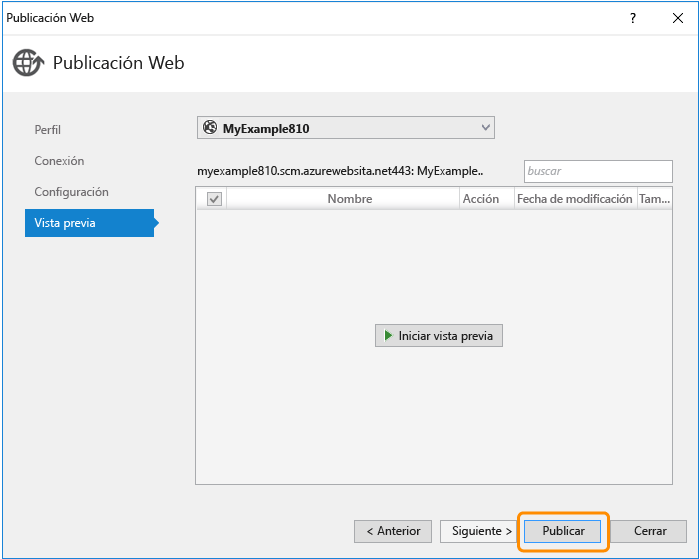

	Al hacer clic en **Publicar**, Visual Studio comienza el proceso de copia de los archivos en el servidor de Azure. Esto puede tardar un par de minutos.

	Las ventanas **Salida** y **Actividad del Servicio de aplicaciones de Azure** muestran las acciones de implementación que se realizaron e informan de la correcta finalización de la implementación.

	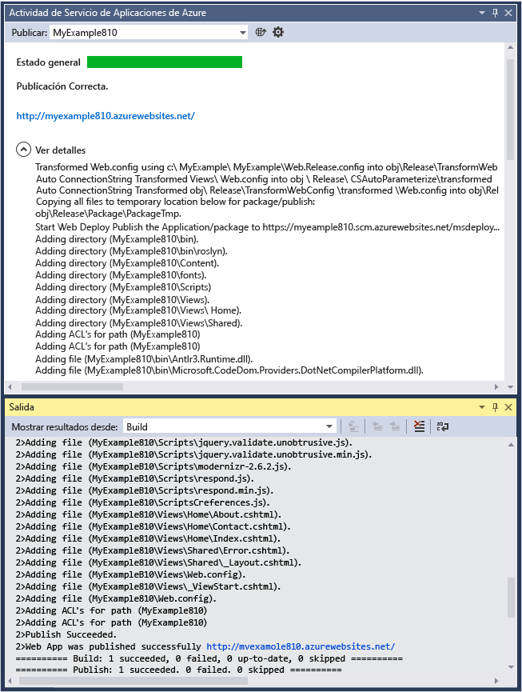

	Tras una implementación correcta, el explorador predeterminado se abre automáticamente en la dirección URL de la aplicación web implementada y la aplicación que creó se ejecuta ahora en la nube. La dirección URL en la barra de direcciones del explorador muestra que la aplicación web se carga desde Internet.

	

> [AZURE.TIP] Puede habilitar la barra de herramientas **Publicación en Web con un solo clic** para agilizar la implementación. Haga clic en **Vista > Barras de herramientas** y seleccione **Publicación en Web con un solo clic**. Puede usar la barra de herramientas para seleccionar un perfil, hacer clic en un botón para publicar o hacer clic en un botón para abrir el asistente para **Publicación web**. 

## Supervisión y administración de la aplicación web en el Portal de Azure

El [Portal de Azure](/services/management-portal/) es una interfaz web que puede usar para administrar y supervisar los servicios de Azure; por ejemplo, la aplicación web que acaba de crear. En esta sección del tutorial podrá ver algo de lo que puede hacer en el portal.

1. En el explorador, vaya a [https://portal.azure.com](https://portal.azure.com) e inicie sesión con las credenciales que usa para administrar su cuenta de Azure.

2. Haga clic en **Servicios de aplicaciones** y, a continuación, en el nombre de la aplicación web.

	

	La hoja **Aplicación web** muestra información general acerca de la configuración y las estadísticas de uso de su aplicación web. (Las ventanas que se abren a la derecha se llaman *hojas*).

	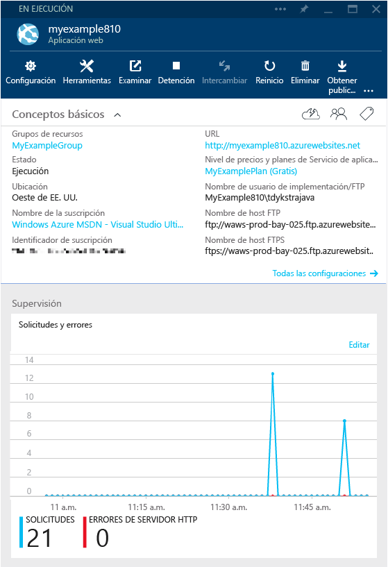

	Por ahora, la aplicación web no ha tenido mucho tráfico y puede que no se muestre nada en el gráfico. Si explora la aplicación, actualiza la página varias veces y después actualiza la página la página del Portal, verá que aparecen algunas estadísticas.

3. En la hoja **Configuración** se muestran más opciones para configurar su aplicación web.

	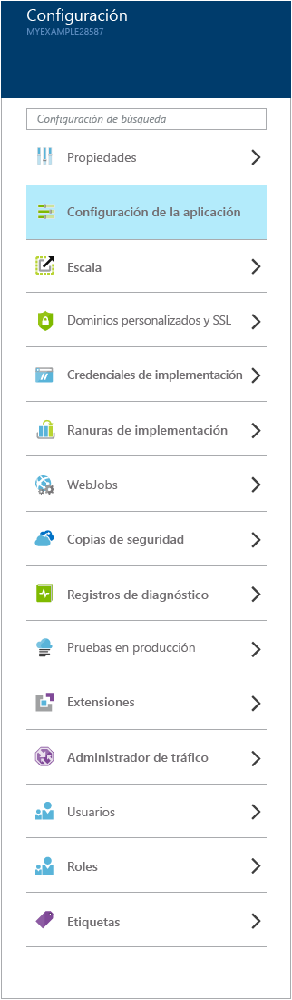

	Hay más secciones en esta hoja que se muestran en esta captura de pantalla.

4. Haga clic en **Configuración de la aplicación** de la sección **General** de la hoja **Configuración** para ver un ejemplo de los tipos de configuración que se pueden establecer en el Portal.

	Por ejemplo, puede controlar la versión de .NET que se usa para la aplicación web, habilitar características tales como [WebSockets](/blog/2013/11/14/introduction-to-websockets-on-windows-azure-web-sites/) y establecer [valores de cadena de conexión](/blog/2013/07/17/windows-azure-web-sites-how-application-strings-and-connection-strings-work/).

	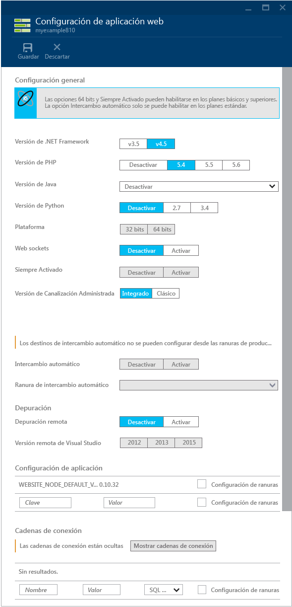

Estas son solo algunas de las características del Portal. Puede crear nuevas aplicaciones web, eliminar las existentes, detener y reiniciar aplicaciones web, y administrar otros tipos de servicios de Azure, como bases de datos y máquinas virtuales.

## Pasos siguientes

En este tutorial, aprendió a crear una aplicación web sencilla e implementarla en una aplicación web de Azure. Estos son algunos temas y recursos relacionados que le permitirán saber más sobre el Servicio de aplicaciones de Azure:

* Otras maneras de crear aplicaciones web

	Ha visto cómo crear una aplicación web mientras crea un proyecto de Visual Studio. También puede crear recursos de Azure en el proceso de implementación en Visual Studio del mismo modo que se hizo durante la creación del proyecto. También se pueden crear aplicaciones webs mediante el [Portal de Azure](https://portal.azure.com/), [cmdlets de Azure para Windows PowerShell](../powershell-install-configure.md) o la [interfaz de línea de comandos multiplataforma](../xplat-cli.md).

* Creación de aplicaciones de API

	Ha visto cómo crear una instancia del Servicio de aplicaciones de Azure pensada principalmente para hospedar un sitio web. El Servicio de aplicaciones también tiene características diseñadas para que sea más fácil desarrollar, probar y hospedar API. Para más información, consulte [Introducción a Aplicaciones de API y ASP.NET en el Servicio de aplicaciones de Azure](../app-service-api/app-service-api-dotnet-get-started.md).

* Otros métodos de implementar un proyecto web

	Para obtener información sobre otras formas de implementar proyectos web en aplicaciones web, ya sea con Visual Studio o con [automatización de la implementación](http://www.asp.net/aspnet/overview/developing-apps-with-windows-azure/building-real-world-cloud-apps-with-windows-azure/continuous-integration-and-continuous-delivery) desde un [sistema de control de código fuente](http://www.asp.net/aspnet/overview/developing-apps-with-windows-azure/building-real-world-cloud-apps-with-windows-azure/source-control), consulte [Implementación de una aplicación web de Azure](web-sites-deploy.md).

	Visual Studio también puede generar scripts de Windows PowerShell que puede usar para automatizar la implementación. Para obtener más información, consulte [Automatizar todo (creación de aplicaciones en la nube para el mundo real con Azure)](http://www.asp.net/aspnet/overview/developing-apps-with-windows-azure/building-real-world-cloud-apps-with-windows-azure/automate-everything).

* Solución de problemas de aplicaciones web

	Visual Studio proporciona características que facilitan la visualización de los registros de Azure conforme se generan, en tiempo real. La ejecución también se puede realizar en modo de depuración de manera remota en Azure. Para obtener más información, consulte [Solución de problemas de aplicaciones web de Azure en Visual Studio](web-sites-dotnet-troubleshoot-visual-studio.md).

* Incorporación de un nombre de dominio personalizado y SSL

	Para obtener información acerca de cómo usar SSL y su propio dominio (por ejemplo, www.contoso.com, en lugar de contoso.azurewebsites.net), consulte los siguientes recursos:

	* [Configuración de un nombre de dominio personalizado en el Servicio de aplicaciones de Azure](web-sites-custom-domain-name.md)
	* [Habilitación de HTTPS en un sitio web de Azure](web-sites-configure-ssl-certificate.md)

* Cómo agregar características en tiempo real (por ejemplo, chat)

	Si la aplicación web va a incluir características en tiempo real (como un servicio de chat, un juego o un tablero de cotizaciones), se puede optimizar el rendimiento usando [ASP.NET SignalR](http://www.asp.net/signalr) con el método de transporte [WebSockets](/blog/2013/11/14/introduction-to-websockets-on-windows-azure-web-sites/). Para obtener más información, consulte [Uso de SignalR con aplicaciones web de Azure](http://www.asp.net/signalr/overview/signalr-20/getting-started-with-signalr-20/using-signalr-with-windows-azure-web-sites).

* Selección entre Servicio de aplicaciones, Servicios en la nube y Máquinas virtuales de Azure para aplicaciones web

	En Azure puede ejecutar aplicaciones web en Aplicaciones web del Servicio de aplicaciones, como se muestra en este tutorial, o bien en Servicios en la nube o en Máquinas virtuales. Para obtener más información, consulte [Comparación entre el Servicio de aplicaciones de Azure, Servicios en la nube y Máquinas virtuales](/manage/services/web-sites/choose-web-app-service/).

<!---HONumber=AcomDC_0309_2016-->