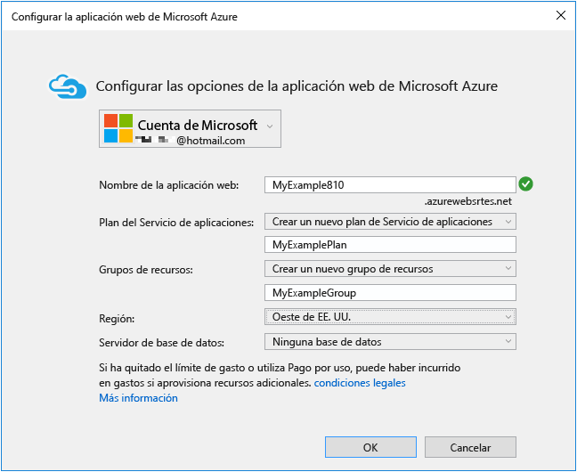
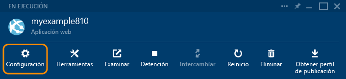

<properties
	pageTitle="Creación de una aplicación web de ASP.NET en Servicio de aplicaciones de Azure | Microsoft Azure"
	description="Este tutorial muestra cómo crear un proyecto web ASP.NET en Visual Studio 2013 e implementarlo en una aplicación web en el Servicio de aplicaciones de Azure."
	services="app-service\web"
	documentationCenter=".net"
	authors="tdykstra"
	manager="wpickett"
	editor="jimbe"/>

<tags
	ms.service="app-service-web"
	ms.workload="web"
	ms.tgt_pltfrm="na"
	ms.devlang="dotnet"
	ms.topic="hero-article"
	ms.date="12/07/2015"
	ms.author="tdykstra"/>

# Creación de una aplicación web ASP.NET en el Servicio de aplicaciones de Azure

> [AZURE.SELECTOR]
- [.Net](web-sites-dotnet-get-started.md)
- [Node.js](web-sites-nodejs-develop-deploy-mac.md)
- [Java](web-sites-java-get-started.md)
- [PHP - Git](web-sites-php-mysql-deploy-use-git.md)
- [PHP - FTP](web-sites-php-mysql-deploy-use-ftp.md)
- [Python](web-sites-python-ptvs-django-mysql.md)

## Información general

Este tutorial muestra cómo implementar una aplicación web ASP.NET en una [aplicación web del Servicio de aplicaciones de Azure](app-service-web-overview.md) con Visual Studio 2015 o Visual Studio 2013. En este tutorial se considera que no tiene ninguna experiencia previa con Azure o ASP.NET. Cuando acabe, tendrá una sencilla aplicación web que se ejecutará en la nube.

La siguiente ilustración muestra la aplicación completada:

Aprenderá a realizar los siguientes procedimientos:

* Cómo preparar su máquina para el desarrollo de Azure mediante la instalación del [SDK de Azure para .NET](../dotnet-sdk/).
* Cómo configurar Visual Studio para crear una nueva aplicación web del Servicio de aplicaciones mientras crea un proyecto web de ASP.NET MVC 5.
* Cómo implementar un proyecto web en una aplicación web de servicio de aplicación mediante Visual Studio.
* Cómo usar el **Explorador de servidores** de Visual Studio para abrir archivos remotos e iniciar una sesión de depuración remota. 
* Uso del [Portal de Azure](/overview/preview-portal/) para supervisar y administrar la aplicación web.

> [AZURE.NOTE] Este tutorial trata del uso de ASP.NET con el Servicio de aplicaciones de Azure; no enseña cómo desarrollar una aplicación web ASP.NET. Para ver una introducción a ASP.NET MVC 5, consulte [Introducción a ASP.NET MVC 5](http://www.asp.net/mvc/overview/getting-started/introduction/getting-started) en el sitio de [ASP.NET](http://asp.net/). Para obtener vínculos a otros artículos con información más detallada sobre cómo usar el Servicio de aplicaciones de Azure, consulte la sección [Pasos siguientes](#next-steps).
> 
> Ayúdenos a conformar el ámbito y el enfoque de este tutorial, si hay otros temas que le gustaría ver cubiertos aquí o en un tutorial de introducción, déjenos un comentario en [Comentarios](#comments) al final del tutorial.

##Suscripción a Microsoft Azure

Para completar este tutorial, deberá tener una cuenta de Azure. Puede:

* [Abrir una cuenta de Azure gratis](/pricing/free-trial/?WT.mc_id=A261C142F). Obtenga créditos que puede usar para probar los servicios de Azure de pago. Incluso después de que se agoten los créditos, puede mantener la cuenta y usar los servicios y características gratuitos de Azure, como la característica de Aplicaciones web del Servicio de aplicaciones de Azure.
* [Activar los beneficios de suscripción a Visual Studio](/pricing/member-offers/msdn-benefits-details/?WT.mc_id=A261C142F). Su suscripción a Visual Studio le proporciona créditos todos los meses que puede usar para servicios de Azure de pago.

Si desea empezar a usar el Servicio de aplicaciones de Azure antes de suscribirse para obtener una cuenta de Azure, vaya a [Probar el Servicio de aplicaciones](http://go.microsoft.com/fwlink/?LinkId=523751). Ahí puede crear de forma inmediata una aplicación web de corta duración para iniciarse en Servicio de aplicaciones, no se requiere tarjeta de crédito y no se establece ningún compromiso.

En el siguiente vídeo, Scott Hanselman muestra lo sencillo que resulta suscribirse para una prueba gratuita de Microsoft Azure. (Duración: 1:58)

> [AZURE.VIDEO sign-up-for-microsoft-azure]

[AZURE.INCLUDE [install-sdk-2015-2013](../../includes/install-sdk-2015-2013.md)]

## Crear un proyecto y una aplicación web

El primer paso es crear un proyecto web en Visual Studio y una aplicación web en el Servicio de aplicaciones de Azure. Cuando esté listo, implemente el proyecto a la aplicación web para que esté disponible en Internet.

En el diagrama se muestra lo que se hace en los pasos de creación e implementación.

1. Abra Visual Studio 2015 o Visual Studio 2013.

	Si usa Visual Studio 2013, las pantallas pueden variar ligeramente con respecto a las capturas de pantalla, pero los procedimientos son básicamente los mismos.

2. En el menú **Archivo**, haga clic en **Nuevo > Proyecto**.

3. En el cuadro de diálogo **Nuevo proyecto**, haga clic en **C# > Web > Aplicación web ASP.NET**. Si lo prefiere, puede elegir **Visual Basic**.

3. Asegúrese de que **.NET Framework 4.5.2** es el marco de trabajo de destino seleccionado.

4.  [Azure Application Insights](app-insights-overview.md) supervisa la aplicación web en cuanto a disponibilidad, rendimiento y uso. Desactive la casilla **Agregar Application Insights al proyecto** si no desea probarlo.

4. Asigne a la aplicación el nombre **MyExample**.

5. Haga clic en **Aceptar**.

	

5. En el cuadro de diálogo **Nuevo proyecto de ASP.NET**, seleccione la plantilla **MVC**.

	[MVC](http://www.asp.net/mvc) es un marco ASP.NET para desarrollar aplicaciones web.

7. Haga clic en **Cambiar autenticación**.

	

6. En el cuadro de diálogo **Cambiar autenticación**, haga clic en **Sin autenticación** y, a continuación, en **Aceptar**.

	

	La aplicación de ejemplo que va a crear no permitirá a los usuarios iniciar sesión. La sección [Pasos siguientes](#next-steps) contiene un vínculo a un tutorial que implementa la autenticación y la autorización.

5. En el cuadro de diálogo **Nuevo proyecto de ASP.NET**, no altere la configuración en **Microsoft Azure** y después haga clic en **Aceptar**.

	

	La configuración predeterminada especifica que Visual Studio creará una aplicación web de Azure para el proyecto web. En la siguiente sección del tutorial, implementará el proyecto web en la aplicación web recién creada.

5. Si aún no ha iniciado sesión en Azure, Visual Studio le pedirá que lo haga. Inicie sesión con el identificador y la contraseña de la cuenta que utiliza para administrar la suscripción de Azure.

	Cuando haya iniciado sesión, el cuadro de diálogo **Crear servicio de aplicaciones** le preguntará qué recursos desea crear.

	

3. En el cuadro de diálogo **Crear servicio de aplicaciones**, escriba un **Nombre de la aplicación web** que sea único en el dominio *azurewebsites.net*. Puede denominarlo MyExample con números a la derecha para que sea único, por ejemplo, MyExample810. Si se crea automáticamente un nombre de web predeterminado, será exclusivo y puede usarlo.

	Si escribe un nombre que ya usa otro usuario, aparecerá un signo de exclamación rojo a la derecha en lugar de una marca de verificación verde y tendrá que especificar otro nombre.

	Azure usará este nombre como prefijo de la dirección URL de la aplicación. La dirección URL completa se compondrá de lo que escriba aquí más *. azurewebsites.net* (como se muestra junto al cuadro de texto **Nombre de aplicación Web**). Por ejemplo, si el nombre es `MyExample810`, la dirección URL será `MyExample810.azurewebsites.net`. La dirección URL debe ser única.

4. Junto a la lista desplegable **Plan de servicio de aplicaciones**, haga clic en el botón **Nuevo...**

	La sección [Pasos siguientes](#next-steps) contiene vínculos a información acerca de los planes del Servicio de aplicaciones.

5. Escriba **MyExamplePlan**, u otro nombre si lo prefiere, como nombre del plan.

6. En la lista desplegable **Grupo de recursos**, escriba el nombre del nuevo grupo de recursos.

	La sección [Pasos siguientes](#next-steps) contiene vínculos a información acerca de los grupos de recursos.

5. Como nombre del grupo de recursos, escriba **MyExampleGroup** u otro nombre que prefiera.

5. En la lista desplegable **Región**, elija la ubicación más cercana.

	Este valor especifica el centro de datos de Azure en el que se ejecutará la aplicación web. Para este tutorial, puede seleccionar cualquier región y no habrá una diferencia notable, Sin embargo, para una aplicación web de producción, lo normal es que quiera tener el servidor web lo más cercano posible a los exploradores que accederán al sitio, con el fin de minimizar la [latencia](http://www.bing.com/search?q=web%20latency%20introduction&qs=n&form=QBRE&pq=web%20latency%20introduction&sc=1-24&sp=-1&sk=&cvid=eefff99dfc864d25a75a83740f1e0090).

5. No modifique el campo de la base de datos.

	En este tutorial no se usa una base de datos. En la sección [Pasos siguientes](#next-steps) encontrará un vínculo a un tutorial que muestra cómo usar una base de datos.

6. Haga clic en **Aceptar**.

	

	En unos segundos, Visual Studio crea el proyecto web en la carpeta especificada y crea la aplicación web en la región de Azure especificada.

	La ventana del **Explorador de soluciones** ventana muestra los archivos y carpetas del nuevo proyecto.

	

	La ventana **Actividad del Servicio de aplicaciones de Azure** muestra que se ha creado la aplicación web.

	

	Y puede ver la aplicación web en el **Explorador de servidores**.

	

## Implementación del proyecto en la aplicación web

En esta sección implementará el proyecto web en la aplicación web, como se muestra en el paso 2 del diagrama.

1. En el **Explorador de soluciones**, haga clic con el botón derecho y seleccione **Publicar**.

	

	En unos segundos aparecerá el Asistente para **publicación web**. El asistente abre un *perfil de publicación* que incluye la configuración para implementar el proyecto web en la nueva aplicación web. Si desea realizar la implementación en otra aplicación web distinta, puede hacer clic en la pestaña **Perfil** ficha para crear un perfil diferente. Para este tutorial, aceptará la configuración que se implementa en la aplicación web que creó anteriormente.

8. En la pestaña **Conexión** del Asistente para **publicación web**, haga clic en **Siguiente**.

	

10. En la pestaña **Configuración**, haga clic en **Siguiente**.

	Puede aceptar los valores predeterminados de **Configuración** y **Opciones de publicación de archivos**.

	Puede usar la lista desplegable **Configuración** para implementar una compilación de depuración para la depuración remota. La sección [Pasos siguientes](#next-steps) contiene vínculos a un tutorial que muestra cómo ejecutar Visual Studio en modo de depuración de forma remota.

	

11. En la pestaña **Vista previa**, haga clic en **Publicar**.

	Si desea ver qué archivos se copiarán en Azure, puede hacer clic en **Iniciar vista previa** antes de hacer clic en **Publicar**.

	

	Al hacer clic en **Publicar**, Visual Studio comienza el proceso de copia de los archivos en el servidor de Azure.

	Las ventanas **Salida** y **Actividad del Servicio de aplicaciones de Azure** muestran las acciones de implementación que se realizaron e informan de la correcta finalización de la implementación.

	

	Tras una implementación correcta, el explorador predeterminado se abre automáticamente en la dirección URL de la aplicación web implementada y la aplicación que creó se ejecuta ahora en la nube. La dirección URL en la barra de direcciones del explorador muestra que la aplicación web se carga desde Internet.

	

13. Mantenga esta ventana del explorador abierta para su uso en la sección siguiente.

**Sugerencia:** puede habilitar la barra de herramientas **Publicación en Web con un solo clic** para agilizar la implementación. Haga clic en **Vista > Barras de herramientas** y seleccione **Publicación en Web con un solo clic**. Puede usar la barra de herramientas para seleccionar un perfil, hacer clic en un botón para publicar o hacer clic en un botón para abrir el asistente para **publicación web**.

## Acceso a archivos del sitio web en el Explorador de servidores

Cuando se prueba y depura una aplicación web, puede hacer cambios temporales rápidos en el sitio remoto; para ello, abra y modifique los archivos del **Explorador de servidores**.

1.  En **Explorador de servidores**, vaya a **Azure > Servicio de aplicaciones > MyExampleGroup**, y, a continuación, expanda el nodo para la aplicación web.

2. Expanda **Archivos > Vistas > Inicio**, y, a continuación, haga doble clic en el archivo *Index.cshtml*.

	

3. Cambie `<h1>ASP.NET</h1>` a `<h1>Azure App Service</h1>`.

4. Guarde el archivo .

5. Actualice la ventana del explorador que contiene el sitio que se ejecuta en Azure.

	

Este cambio está en el sitio implementado pero no en el proyecto local. Si vuelve a implementar el proyecto, el sitio se revertirá a como era antes de realizar este cambio.

Esta característica es útil para [desactivar temporalmente customErrors en el archivo Web.config con el fin de obtener un mensaje de error detallado](web-sites-dotnet-troubleshoot-visual-studio.md).

En el **Explorador de servidores** también puede hacer clic con el botón derecho en el nodo de Servicio de aplicaciones y obtener acceso a la configuración de la aplicación web en una ventana de Visual Studio, iniciar una sesión de depuración remota y ver registros de aplicación en tiempo real, a medida que la aplicación los escribe.

Para obtener más información, consulte [Solución de problemas de aplicaciones web de Azure en Visual Studio](web-sites-dotnet-troubleshoot-visual-studio.md).

## Supervisión y administración de la aplicación web en el Portal de Azure

El [Portal de Azure](/services/management-portal/) es una interfaz web que puede usar para administrar y supervisar los servicios de Azure; por ejemplo, la aplicación web que acaba de crear. En esta sección del tutorial podrá ver algo de lo que puede hacer en el Portal.

1. En el explorador, vaya a [https://portal.azure.com](https://portal.azure.com) e inicie sesión con sus credenciales de Azure.

2. Haga clic en **Servicios de aplicaciones** y, a continuación, en el nombre de la aplicación web.

	La hoja **Aplicación web** muestra información general acerca de la configuración y las estadísticas de uso de su aplicación web.

	

	Por ahora, la aplicación web no ha tenido mucho tráfico y puede que no se muestre nada en el gráfico. Si explora la aplicación, actualiza la página varias veces y después actualiza la página la página del Portal, verá que aparecen algunas estadísticas.

3. Haga clic en **Configuración** a fin de ver más opciones para configurar su aplicación web.

	

	Verá una lista de los tipos de configuración.

	

4. Haga clic en **Configuración de la aplicación** para ver un ejemplo de los tipos de configuración que se pueden establecer en el Portal.

	Por ejemplo, puede controlar la versión de .NET que se usa para la aplicación web, habilitar características tales como [WebSockets](/blog/2013/11/14/introduction-to-websockets-on-windows-azure-web-sites/) y establecer [valores de cadena de conexión](/blog/2013/07/17/windows-azure-web-sites-how-application-strings-and-connection-strings-work/).

	

Estas son solo algunas de las características del Portal. Puede crear nuevas aplicaciones web, eliminar las existentes, detener y reiniciar aplicaciones web, y administrar otros tipos de servicios de Azure, como bases de datos y máquinas virtuales.

## Pasos siguientes

En este tutorial, aprendió a crear una aplicación web sencilla e implementarla en una aplicación web de Azure. Estos son algunos temas y recursos relacionados que le permitirán obtener más información sobre aplicaciones web del Servicio de aplicaciones de Azure.

* Incorporación de funcionalidad de base de datos y autorización

	Para ver un tutorial que muestra cómo acceder a una base de datos y restringir algunas funciones de aplicación a los usuarios autorizados, consulte [Implementación de una aplicación ASP.NET MVC segura con suscripción, OAuth y Base de datos SQL en una aplicación web de Azure](/develop/net/tutorials/web-site-with-sql-database/). Ese tutorial presupone cierto conocimiento de MVC 5. Si no está familiarizado con MVC 5, consulte [Introducción a ASP.NET MVC 5](http://www.asp.net/mvc/overview/getting-started/introduction/getting-started).

* Otros métodos de implementar un proyecto web

	Para obtener información sobre otras formas de implementar proyectos web en aplicaciones web, ya sea con Visual Studio o con [automatización de la implementación](http://www.asp.net/aspnet/overview/developing-apps-with-windows-azure/building-real-world-cloud-apps-with-windows-azure/continuous-integration-and-continuous-delivery) desde un [sistema de control de código fuente](http://www.asp.net/aspnet/overview/developing-apps-with-windows-azure/building-real-world-cloud-apps-with-windows-azure/source-control), consulte [Implementación de una aplicación web de Azure](web-sites-deploy.md).

	Visual Studio también puede generar scripts de Windows PowerShell que puede usar para automatizar la implementación. Para obtener más información, consulte [Automatizar todo (creación de aplicaciones en la nube para el mundo real con Azure)](http://www.asp.net/aspnet/overview/developing-apps-with-windows-azure/building-real-world-cloud-apps-with-windows-azure/automate-everything).

* Solución de problemas de aplicaciones web

	Visual Studio proporciona características que facilitan la visualización de los registros de Azure conforme se generan, en tiempo real. La ejecución también se puede realizar en modo de depuración de manera remota en Azure. Para obtener más información, consulte [Solución de problemas de aplicaciones web de Azure en Visual Studio](web-sites-dotnet-troubleshoot-visual-studio.md).

* Incorporación de un nombre de dominio personalizado y SSL

	Para obtener información acerca de cómo usar SSL y su propio dominio (por ejemplo, www.contoso.com, en lugar de contoso.azurewebsites.net), consulte los siguientes recursos:

	* [Configuración de un nombre de dominio personalizado en el Servicio de aplicaciones de Azure](web-sites-custom-domain-name.md)
	* [Habilitación de HTTPS en un sitio web de Azure](web-sites-configure-ssl-certificate.md)

* Cómo agregar características en tiempo real (por ejemplo, chat)

	Si la aplicación web va a incluir características en tiempo real (como un servicio de chat, un juego o un tablero de cotizaciones), se puede optimizar el rendimiento usando [ASP.NET SignalR](http://www.asp.net/signalr) con el método de transporte [WebSockets](/blog/2013/11/14/introduction-to-websockets-on-windows-azure-web-sites/). Para obtener más información, consulte [Uso de SignalR con aplicaciones web de Azure](http://www.asp.net/signalr/overview/signalr-20/getting-started-with-signalr-20/using-signalr-with-windows-azure-web-sites).

* Selección entre Servicio de aplicaciones, Servicios en la nube y Máquinas virtuales de Azure para aplicaciones web

	En Azure puede ejecutar aplicaciones web en Aplicaciones web del Servicio de aplicaciones, como se muestra en este tutorial, o bien en Servicios en la nube o en Máquinas virtuales. Para obtener más información, consulte [Comparación entre el Servicio de aplicaciones de Azure, Servicios en la nube y Máquinas virtuales](/manage/services/web-sites/choose-web-app-service/).

* [Cómo elegir o crear un plan del Servicio de aplicaciones](../app-service/azure-web-sites-web-hosting-plans-in-depth-overview.md)

* [Cómo elegir o crear un grupo de recursos](../azure-portal/resource-group-portal.md)

## Lo que ha cambiado
* Para obtener una guía del cambio de Sitios web al Servicio de aplicaciones, consulte [Servicio de aplicaciones de Azure y los servicios de Azure existentes](http://go.microsoft.com/fwlink/?LinkId=529714).

<!---HONumber=AcomDC_0204_2016-->