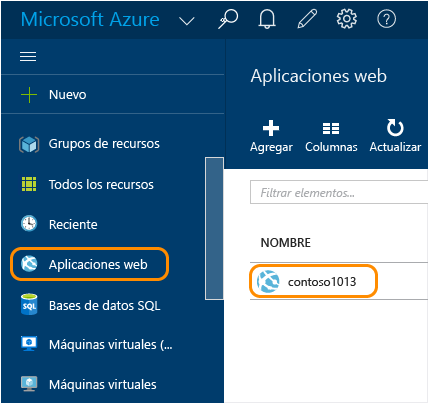
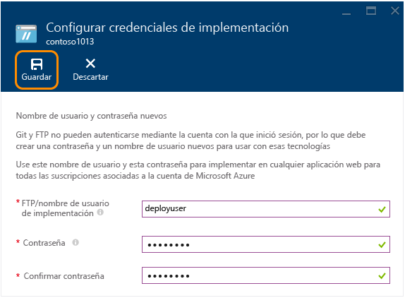
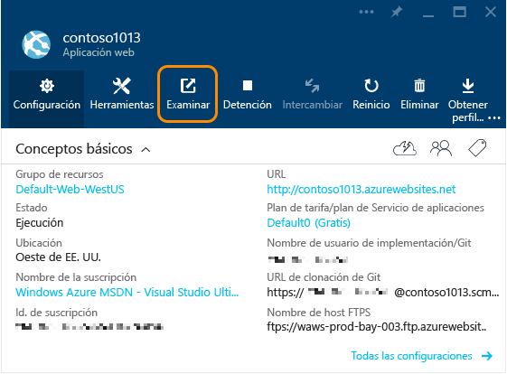
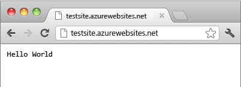

<properties
	pageTitle="Creación de una aplicación web de Node.js en Servicio de aplicaciones de Azure | Microsoft Azure"
	description="Obtenga información sobre cómo implementar una aplicación de Node.js en una aplicación web en el Servicio de aplicaciones de Azure."
	services="app-service\web"
	documentationCenter="nodejs"
	authors="rmcmurray"
	manager="wpickett"
	editor=""/>

<tags
	ms.service="app-service-web"
	ms.workload="web"
	ms.tgt_pltfrm="na"
	ms.devlang="nodejs"
	ms.topic="hero-article"
	ms.date="01/09/2016"
	ms.author="robmcm"/>

# Creación de una aplicación web de Node.js en el Servicio de aplicaciones de Azure

> [AZURE.SELECTOR]
- [.Net](web-sites-dotnet-get-started.md)
- [Node.js](web-sites-nodejs-develop-deploy-mac.md)
- [Java](web-sites-java-get-started.md)
- [PHP - Git](web-sites-php-mysql-deploy-use-git.md)
- [PHP - FTP](web-sites-php-mysql-deploy-use-ftp.md)
- [Python](web-sites-python-ptvs-django-mysql.md)

Este tutorial muestra cómo crear una aplicación de [Node.js](http://nodejs.org) sencilla e implementarla en una [aplicación web](app-service-web-overview.md) del [Servicio de aplicaciones de Azure](../app-service/app-service-value-prop-what-is.md) con [Git](http://git-scm.com). Las instrucciones de este tutorial se pueden seguir en cualquier sistema operativo que sea capaz de ejecutar Node.js.

Aprenderá a realizar los siguientes procedimientos:

* Creación de una aplicación web en el Servicio de aplicaciones de Azure con el Portal de Azure.
* Cómo implementar una aplicación de Node.js en la aplicación web insertándola en el repositorio Git de la aplicación web.

La aplicación completa escribe una cadena corta "hello world" en el explorador.

![Un explorador muestra el mensaje "Hello World".][helloworld-completed]

Para ver tutoriales y código de ejemplo con aplicaciones más complejas de Node.js, o para ver otros temas sobre cómo usar Node.js en Azure, consulte el [Centro para desarrolladores de Node.js](/develop/nodejs/).

> [AZURE.NOTE]Necesita una cuenta de Microsoft Azure para completar este tutorial. Si aún no la tiene, puede [activar los beneficios de suscripción a Visual Studio](/es-ES/pricing/member-offers/msdn-benefits-details/?WT.mc_id=A261C142F) o bien [registrarse para obtener una evaluación gratuita](/es-ES/pricing/free-trial/?WT.mc_id=A261C142F).
>
> Si desea empezar a usar el Servicio de aplicaciones de Azure antes de suscribirse para obtener una cuenta de Azure, vaya a la [prueba gratuita del Servicio de aplicaciones](http://go.microsoft.com/fwlink/?LinkId=523751). Ahí puede crear de forma inmediata una aplicación web de corta duración para iniciarse en Servicio de aplicaciones, no se requiere tarjeta de crédito y no se establece ningún compromiso.

## Creación de una aplicación web y habilitación de la publicación Git

Siga estos pasos para crear una aplicación web en el Servicio de aplicaciones de Azure y habilitar la publicación en Git.

[Git](http://git-scm.com/) es un sistema de control de versión distribuida que puede utilizar para implementar su sitio web de Azure. Tendrá que almacenar el código que escriba para su aplicación web en un repositorio Git local y lo implementará en Azure insertando en un repositorio remoto. Este método de implementación es una característica de las aplicaciones web del Servicio de aplicaciones.

1. Inicie sesión en el [Portal de Azure](https://portal.azure.com).

2. Haga clic en el icono **+NUEVO** situado en la parte superior izquierda del Portal de Azure.

3. Haga clic en **Web y móvil** y, después, haga clic en **Aplicación web**.

    ![][portal-quick-create]

4. Escriba un nombre para la aplicación web en el cuadro **Aplicación web**.

	Este nombre debe ser único en el dominio azurewebsites.net porque la dirección URL de la aplicación web será {nombre}.azurewebsites.net. Si el nombre especificado no es único, se muestra un signo de exclamación rojo en el cuadro de texto.

5. Seleccione una **suscripción**.

6. Seleccione un **Grupo de recursos** o cree uno nuevo.

	Para obtener más información acerca de los grupos de recursos, consulte [Uso del Portal de Azure para administrar los recursos de Azure](../resource-group-portal.md).

7. Seleccione un **Plan de servicio de aplicaciones/Ubicación** o cree uno nuevo.

	Para obtener más información sobre los planes del Servicio de aplicaciones, consulte [Información general sobre los planes del Servicio de aplicaciones de Azure](../azure-web-sites-web-hosting-plans-in-depth-overview.md).

8. Haga clic en **Crear**.
   
	![][portal-quick-create2]

	En poco tiempo, normalmente menos de un minuto, Azure termina de crear la nueva aplicación web.

9. Haga clic en **Aplicaciones web > {su nueva aplicación web}**.

	

10. En la hoja **Aplicación web**, haga clic en la parte **Implementación**.

	![][deployment-part]

11. En la hoja **Implementación continua**, haga clic en **Elegir origen**.

12. Haga clic en **Repositorio de Git local** y, después, en **Aceptar**.

	![][setup-git-publishing]

13. Configure las credenciales de implementación si aún no lo hizo.

	a. En la hoja Aplicación web, haga clic en **Configuración > Credenciales de implementación**.

	![][deployment-credentials]
 
	b. Cree un nombre de usuario y una contraseña.
	
	

14. En la hoja Aplicación web, haga clic en **Configuración** y, después, en **Propiedades**.
 
	Para publicar, la insertará en un repositorio de Git remoto. La dirección URL del repositorio se muestra en **Dirección URL de Git**. Esta dirección URL se usará más adelante en el tutorial.

	![][git-url]

## Compilación y comprobación de la aplicación localmente

En esta sección, creará un archivo **server.js** que contiene una versión ligeramente modificada del ejemplo 'Hello World' de [nodejs.org]. El código agrega process.env.PORT como el puerto que se escuchará al ejecutarlo en una aplicación web de Azure.

1. Cree un directorio llamado *helloworld*.

2. Use un editor de texto para crear un archivo nuevo denominado **server.js** en el directorio *helloworld*.

2. Copie el código siguiente en el archivo **server.js** y, después, guárdelo:

        var http = require('http')
        var port = process.env.PORT || 1337;
        http.createServer(function(req, res) {
          res.writeHead(200, { 'Content-Type': 'text/plain' });
          res.end('Hello World\n');
        }).listen(port);

3. Abra la línea de comandos y use el siguiente comando para iniciar la aplicación web localmente:

        node server.js

4. Abra el explorador web y navegue a http://localhost:1337.

	Aparecerá una página web con el mensaje "Hello World", tal y como se muestra en la siguiente captura de pantalla:

    ![Un explorador muestra el mensaje "Hello World".][helloworld-localhost]

## Publicación de la aplicación

1. Si aún no hizo, instale Git.

	Para obtener instrucciones de instalación para su plataforma, consulte la [página de descargas de Git](http://git-scm.com/download).

1. Desde la línea de comandos, cambie los directorios por el directorio **helloworld** y escriba el siguiente comando para inicializar el repositorio de Git local.

		git init

2. Utilice los siguientes comandos para agregar archivos al repositorio:

		git add .
		git commit -m "initial commit"

3. Agregue un Git remoto para insertar actualizaciones en la aplicación web de Azure que creó anteriormente con el siguiente comando:

		git remote add azure [URL for remote repository]

4. Inserte los cambios en Azure con el siguiente comando:

		git push azure master

	Se le solicitará la contraseña que creó anteriormente. La salida será similar al del ejemplo siguiente:

		Counting objects: 3, done.
		Delta compression using up to 8 threads.
		Compressing objects: 100% (2/2), done.
		Writing objects: 100% (3/3), 374 bytes, done.
		Total 3 (delta 0), reused 0 (delta 0)
		remote: New deployment received.
		remote: Updating branch 'master'.
		remote: Preparing deployment for commit id '5ebbe250c9'.
		remote: Preparing files for deployment.
		remote: Deploying Web.config to enable Node.js activation.
		remote: Deployment successful.
		To https://user@testsite.scm.azurewebsites.net/testsite.git
		 * [new branch]      master -> master

5. Para ver la aplicación, haga clic en el botón **Examinar** situado en la parte **Aplicación web** del Portal de Azure.

	

	

## Publicación de cambios de la aplicación

1. Abra el archivo **server.js** en un editor de texto y cambie "Hello World\\n" a "Hello Azure\\n". 

2. Guarde el archivo .

2. En la línea de comandos, cambie los directorios por el directorio **helloworld** y ejecute los siguientes comandos:

		git add .
		git commit -m "changing to hello azure"
		git push azure master

	Se le pedirá de nuevo su contraseña.

3. Actualice la ventana del explorador en la que fue a la dirección URL de la aplicación web.

	![Página web que muestra "Hello Azure"][helloworld-completed]

## Reversión de una implementación

En la hoja **Aplicación web**, haga clic en **Configuración > Implementación continua** para ver el historial de implementaciones en la hoja **Implementaciones**. Si necesita revertir a una implementación anterior, selecciónela y, después, haga clic en **Implementar de nuevo** en la hoja **Detalles de la implementación**.

## Pasos siguientes

Implementó una aplicación de Node.js en una aplicación web en el Servicio de aplicaciones de Azure. Para aprender cómo las Aplicaciones web del Servicio de aplicaciones ejecutan aplicaciones de Node.js, consulte [Aplicaciones web del Servicio de aplicaciones de Azure: Node.js](http://blogs.msdn.com/b/silverlining/archive/2012/06/14/windows-azure-websites-node-js.aspx) y [Especificación de una versión de Node.js en una aplicación Azure](../nodejs-specify-node-version-azure-apps.md).

Node.js proporciona un abundante ecosistema de módulos que puede utilizar con sus aplicaciones. Para obtener información sobre el funcionamiento de Aplicaciones web con módulos, consulte [Uso de módulos Node.js con aplicaciones de Azure](../nodejs-use-node-modules-azure-apps.md).

Si tiene problemas con la aplicación una vez implementada en Azure, consulte [Cómo depurar una aplicación web de Node.js en el Servicio de aplicaciones de Azure](web-sites-nodejs-debug.md) para obtener información acerca de cómo diagnosticar el problema.

Este artículo usa el Portal de Azure para crear una aplicación web. También puede usar la [Interfaz de línea de comandos de Azure](../xplat-cli-install.md) o [Azure PowerShell](../install-configure-powershell.md) para realizar las mismas operaciones.

Para más información sobre cómo desarrollar aplicaciones de Node.js en Azure, consulte el [Centro para desarrolladores de Node.js](/develop/nodejs/).

[helloworld-completed]: ./media/web-sites-nodejs-develop-deploy-mac/helloazure.png
[helloworld-localhost]: ./media/web-sites-nodejs-develop-deploy-mac/helloworldlocal.png
[portal-quick-create]: ./media/web-sites-nodejs-develop-deploy-mac/create-quick-website.png
[portal-quick-create2]: ./media/web-sites-nodejs-develop-deploy-mac/create-quick-website2.png
[setup-git-publishing]: ./media/web-sites-nodejs-develop-deploy-mac/setup_git_publishing.png
[go-to-dashboard]: ./media/web-sites-nodejs-develop-deploy-mac/go_to_dashboard.png
[deployment-part]: ./media/web-sites-nodejs-develop-deploy-mac/deployment-part.png
[deployment-credentials]: ./media/web-sites-nodejs-develop-deploy-mac/deployment-credentials.png
[git-url]: ./media/web-sites-nodejs-develop-deploy-mac/git-url.png

<!---HONumber=AcomDC_0114_2016-->