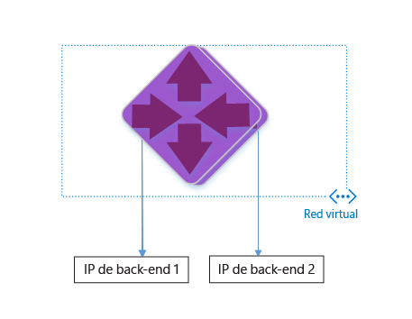
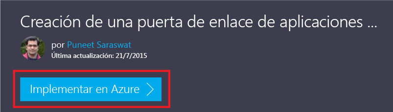
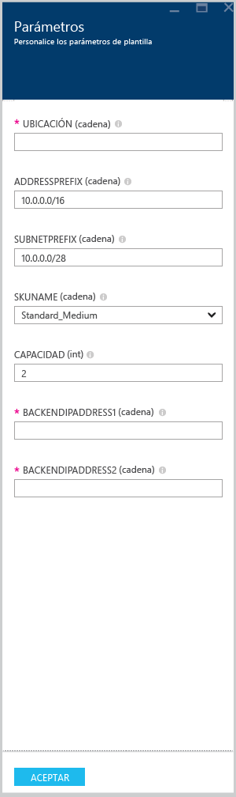

<properties
   pageTitle="Creación de una puerta de enlace de aplicaciones con plantillas del Administrador de recursos de Azure | Microsoft Azure"
   description="En esta página se ofrecen instrucciones para crear una puerta de enlace de aplicaciones de Azure con la plantilla del Administrador de recursos de Azure"
   documentationCenter="na"
   services="application-gateway"
   authors="joaoma"
   manager="jdial"
   editor="tysonn"/>
<tags
   ms.service="application-gateway"
   ms.devlang="na"
   ms.topic="hero-article"
   ms.tgt_pltfrm="na"
   ms.workload="infrastructure-services"
   ms.date="11/10/2015"
   ms.author="joaoma"/>

# Creación de una puerta de enlace de aplicaciones con la plantilla de Administrador de recursos de Azure

Puerta de enlace de aplicaciones de Azure es un equilibrador de carga de nivel 7. Proporciona conmutación por error, solicitudes HTTP de enrutamiento de rendimiento entre distintos servidores, independientemente de que se encuentren en la nube o en una implementación local. Puerta de enlace de aplicaciones tiene las siguientes características de entrega de aplicaciones: equilibrio de carga HTTP, afinidad de sesiones basada en cookies y descarga SSL (Capa de sockets seguros).

> [AZURE.SELECTOR]
- [Azure Classic PowerShell](application-gateway-create-gateway.md)
- [Azure Resource Manager PowerShell](application-gateway-create-gateway-arm.md)
- [Azure Resource Manager template](application-gateway-create-gateway-arm-template.md)

 

Aprenderá a descargar y modificar una plantilla de Administrador de recursos de Azure desde GitHub, así como a implementarla desde GitHub, PowerShell y la CLI de Azure.

Si simplemente va a implementar la plantilla de Administrador de recursos de Azure directamente desde GitHub sin realizar ningún cambio, vaya a la sección sobre la implementación una plantilla desde GitHub.

## Escenario

En este escenario:

- Creará una puerta de enlace de aplicaciones con dos instancias.
- Creará una red virtual denominada VirtualNetwork1 con un bloque CIDR reservado de 10.0.0.0/16.
- Creará una subred denominada Appgatewaysubnet que usa 10.0.0.0/28 como bloque CIDR.
- Instalará dos IP de back-end configuradas con anterioridad para los servidores web cuya carga de tráfico desea equilibrar. En esta plantilla de ejemplo, las IP de back-end serán 10.0.1.10 y 10.0.1.11.

>[AZURE.NOTE]Esos son los parámetros para esta plantilla. Para personalizar la plantilla, puede cambiar las reglas, el agente de escucha y la SSL que abre azuredeploy.json.

## Descarga e información sobre la plantilla del Administrador de recursos de Azure

Puede descargar la plantilla del Administrador de recursos de Azure existente para crear una red virtual y dos subredes desde GitHub, realizar todos los cambios que desee y volver a utilizarla. Para ello, siga estos pasos:

1. Vaya a https://raw.githubusercontent.com/azure/azure-quickstart-templates/master/101-create-application-gateway/.
2. Haga clic en **azuredeploy.json** y luego en **RAW**.
3. Guarde el archivo en un una carpeta local del equipo.
4. Si está familiarizado con las plantillas del Administrador de recursos de Azure, vaya directamente al paso 7.
5. Abra el archivo que acaba de guardar y vea el contenido de **parameters** en la línea 5. Los parámetros de plantilla del Administrador de recursos de Azure proporcionan un marcador de posición para los valores que se pueden rellenar durante la implementación.

	| Parámetro | Descripción |
	|---|---|
	| **ubicación** | Región de Azure en que se creará la puerta de enlace de aplicaciones |
	| **VirtualNetwork1** | Nombre de la nueva red virtual |
	| **addressPrefix** | Espacio de direcciones de la red virtual, en formato CIDR |
	| **ApplicationGatewaysubnet** | Nombre de la subred de la puerta de enlace de aplicaciones |
	| **subnetPrefix** | Bloque CIDR de la subred de la puerta de enlace de aplicaciones |
	| **skuname** | Tamaño de la instancia de SKU |
	| **capacidad** | Número de instancias |
	| **backendaddress1** | Dirección IP del primer servidor web |
	| **backendaddress2** | Dirección IP del segundo servidor web |

>[AZURE.IMPORTANT]Las plantillas del Administrador de recursos de Azure que se mantienen en GitHub pueden cambiar con el tiempo. Asegúrese de comprobar la plantilla antes de usarla.

6. Compruebe el contenido en **resources** y observe lo siguiente:

	- **type**. Tipo de recurso que creó la plantilla. En este caso, el tipo es **Microsoft.Network/applicationGateways**, que representa una puerta de enlace de aplicaciones.
	- **name**. Nombre del recurso. Observe el uso de **[parameters('applicationGatewayName')]**, lo que significa el nombre lo proporcionará el usuario un archivo de parámetros durante la implementación.
	- **properties**. Lista de propiedades para el recurso. Esta plantilla usa la red virtual y la dirección IP pública durante la creación de la puerta de enlace de aplicaciones.

7. Vuelva a https://raw.githubusercontent.com/azure/azure-quickstart-templates/master/101-create-application-gateway/azuredeploy.json.
8. Haga clic en **azuredeploy-paremeters.json**, y, a continuación, haga clic en **RAW**.
9. Guarde el archivo en un una carpeta local en su equipo.
10. Abra el archivo que acaba de guardar y edite los valores de los parámetros. Use los siguientes valores para implementar la red puerta de enlace de aplicaciones que se describe en nuestro escenario.

		{
		  "$schema": "http://schema.management.azure.com/schemas/2015-01-01/deploymentParameters.json#",
		{
    	"location" : {
        "value" : "West US"
    	},
    	"addressPrefix": {
        "value": "10.0.0.0/16"
    	},
    	"subnetPrefix": {
        "value": "10.0.0.0/24"
    	},
    	"skuName": {
        "value": "Standard_Small"
    	},
    	"capacity": {
        "value": 2
    	},
    	"backendIpAddress1": {
        "value": "10.0.1.10"
    	},
    	"backendIpAddress2": {
        "value": "10.0.1.11"
    	}
		}

11. Guarde el archivo . Puede probar la plantilla de JSON y la plantilla de parámetros mediante las herramientas de validación de JSON en línea como [JSlint.com](http://www.jslint.com/)

## Implementación de la plantilla del Administrador de recursos de Azure mediante PowerShell

Si es la primera vez que usa Azure PowerShell, consulte [Cómo instalar y configurar Azure PowerShell](powershell-install-configure.md) y siga las instrucciones hasta el final para iniciar sesión en Azure y seleccionar su suscripción.

### Paso 1

		Login-AzureRmAccount

### Paso 2

Compruebe las suscripciones para la cuenta.

		get-AzureRmSubscription

Se le solicitará que se autentique con sus credenciales. 

### Paso 3

Elija qué suscripción de Azure va a utilizar. 

		Select-AzureRmSubscription -Subscriptionid "GUID of subscription"

### Paso 4

Si es necesario, crear un nuevo grupo de recursos mediante el cmdlet **New-AzureResourceGroup**. En el ejemplo siguiente, creará un grupo de recursos nuevo denominado AppgatewayRG en la ubicación East US.

	 New-AzureRmResourceGroup -Name AppgatewayRG -Location "East US"
		VERBOSE: 5:38:49 PM - Created resource group 'AppgatewayRG' in location 'eastus'

		ResourceGroupName : AppgatewayRG
		Location          : eastus
		ProvisioningState : Succeeded
		Tags              :
		Permissions       :
	                 Actions  NotActions
	                 =======  ==========
	                  *

		ResourceId        : /subscriptions/xxxxxxxxxxxxxxxxxxxxxxxxxxxxxx/resourceGroups/AppgatewayRG

Ejecute el cmdlet **New-AzureRmResourceGroupDeployment** para implementar la nueva red virtual mediante la plantilla y los archivos de parámetros que descargó y modificó antes.

		New-AzureRmResourceGroupDeployment -Name TestAppgatewayDeployment -ResourceGroupName AppgatewayRG `
 		   -TemplateFile C:\ARM\azuredeploy.json -TemplateParameterFile C:\ARM\azuredeploy-parameters.json

La salida generada por la línea de comandos será la siguiente:

		DeploymentName    : testappgatewaydeployment
		ResourceGroupName : appgatewayRG
		ProvisioningState : Succeeded
		Timestamp         : 9/19/2015 1:49:41 AM
		Mode              : Incremental
		TemplateLink      :
		Parameters        :
                   Name             Type                       Value
                   ===============  =========================  ==========
                   location         String                     East US
                   addressPrefix    String                     10.0.0.0/16
                   subnetPrefix     String                     10.0.0.0/24
                   skuName          String                     Standard_Small
                   capacity         Int                        2
                   backendIpAddress1  String                     10.0.1.10
                   backendIpAddress2  String                     10.0.1.11

		Outputs           :

## Implementación de la plantilla del Administrador de recursos de Azure mediante la CLI de Azure

Para implementar la plantilla del Administrador de recursos de Azure descargada mediante la CLI de Azure, siga estos pasos:

1. Si nunca ha usado la CLI de Azure, consulte [Instalación de la CLI de Azure](xplat-cli-install.md) y siga las instrucciones hasta el punto en que se selecciona la cuenta y suscripción de Azure.
2. Ejecuta el comando **azure config mode** para cambiar al modo de Administrador de recursos, como se muestra a continuación.

		azure config mode arm

Este es el resultado esperado del comando anterior:

		info:	New mode is arm

3. En caso necesario, ejecute el comando **azure group create** para crear un grupo de recursos nuevo, como se muestra a continuación. Observe la salida del comando. En la lista que se muestra en la salida se explican los parámetros utilizados. Para más información sobre los grupos de recursos, visite [Información general del Administrador de recursos de Azure](resource-group-overview.md).

		azure group create -n appgatewayRG -l eastus

**-n (or --name)**. Nombre del nuevo grupo de recursos. En este escenario, es *appgatewayRG*.

**-l (o --location)**. Región de Azure donde se creará el nuevo grupo de recursos. En este escenario, es *Eastus*.

4. Ejecute el cmdlet **azure group deployment create** para implementar la nueva red virtual mediante la plantilla y los archivos de parámetros que descargó y modificó antes. En la lista que se muestra en la salida se explican los parámetros utilizados.

		azure group deployment create -g appgatewayRG -n TestAppgatewayDeployment -f C:\ARM\azuredeploy.json -e C:\ARM\azuredeploy-parameters.json

Este es el resultado esperado del comando anterior:

		azure group deployment create -g appgatewayRG -n TestAppgatewayDeployment -f C:\ARM\azuredeploy.json -e C:\ARM\azuredeploy-parameters.json
		info:    Executing command group deployment create
		+ Initializing template configurations and parameters
		+ Creating a deployment
		info:    Created template deployment "TestAppgatewayDeployment"
		+ Waiting for deployment to complete
		data:    DeploymentName     : TestAppgatewayDeployment
		data:    ResourceGroupName  : appgatewayRG
		data:    ProvisioningState  : Succeeded
		data:    Timestamp          : 2015-09-21T20:50:27.5129912Z
		data:    Mode               : Incremental
		data:    Name               Type    Value
		data:    -----------------  ------  --------------
		data:    location           String  East US
		data:    addressPrefix      String  10.0.0.0/16
		data:    subnetPrefix       String  10.0.0.0/24
		data:    skuName            String  Standard_Small
		data:    capacity           Int     2
		data:    backendIpAddress1  String  10.0.1.10
		data:    backendIpAddress2  String  10.0.1.11
		info:    group deployment create command OK

**-g (or --resource-group)**. Nombre del grupo de recursos en que se creará la nueva red virtual.

**-f (o --template-file)**. Ruta de acceso al archivo de plantilla del Administrador de recursos de Azure.

**-e (o --parameters-file)**. Ruta de acceso al archivo de parámetros del Administrador de recursos de Azure.

## Implementación de la plantilla del Administrador de recursos de Azure mediante el método de hacer clic para implementar

Clic para implementar es otra forma de usar las plantillas del Administrador de recursos de Azure. Se trata de una manera fácil de usar plantillas con el Portal de Azure.

### Paso 1
Vaya a [Create an Application Gateway with Public IP](https://azure.microsoft.com/documentation/templates/101-application-gateway-public-ip/) (Creación de una puerta de enlace de aplicaciones con IP pública).

### Paso 2

Haga clic en **Implementar en Azure**.

### Paso 3

Rellene los parámetros de la plantilla de implementación en el portal y haga clic en **Aceptar**.

### Paso 4

Seleccione **Términos legales** y haga clic en **Comprar**.

### Paso 5

En la hoja Implementación personalizada, haga clic en **Crear**.

## Pasos siguientes

Si desea configurar la descarga de SSL, consulte [Configuración de una puerta de enlace de aplicaciones para la descarga SSL mediante el modelo de implementación clásica](application-gateway-ssl.md).

Si quiere configurar una puerta de enlace de aplicaciones para usarla con el equilibrador de carga interno, consulte [Creación de una puerta de enlace de aplicaciones con un equilibrador de carga interno (ILB)](application-gateway-ilb.md).

Si desea obtener más información acerca de opciones de equilibrio de carga en general, vea:

- [Equilibrador de carga de Azure](https://azure.microsoft.com/documentation/services/load-balancer/)
- [Administrador de tráfico de Azure](https://azure.microsoft.com/documentation/services/traffic-manager/)

<!---HONumber=AcomDC_0114_2016-->