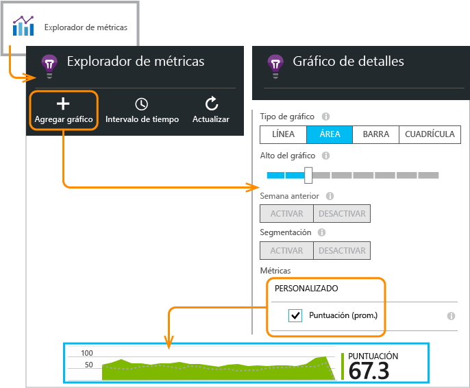

<properties 
	pageTitle="API de Application Insights para eventos y métricas personalizados" 
	description="Inserte unas cuantas líneas de código en su aplicación de dispositivo o de escritorio, página o servicio web, para realizar el seguimiento del uso y diagnosticar problemas." 
	services="application-insights"
    documentationCenter="" 
	authors="alancameronwills" 
	manager="douge"/>
 
<tags 
	ms.service="application-insights" 
	ms.workload="tbd" 
	ms.tgt_pltfrm="ibiza" 
	ms.devlang="multiple" 
	ms.topic="article" 
	ms.date="03/02/2016" 
	ms.author="awills"/>

# API de Application Insights para eventos y métricas personalizados 

*Application Insights se encuentra en su versión de vista previa.*

Inserte unas cuantas líneas de código en la aplicación para averiguar qué uso hacen de ella los usuarios o para ayudarle a diagnosticar problemas. Puede enviar datos de telemetría desde aplicaciones de escritorio y de dispositivo y desde clientes y servidores web.

Los recopiladores de datos de Application Insights usan esta API para enviar datos de telemetría estándar como vistas de página e informes de excepciones, pero también puede usarla para enviar sus propios datos de telemetría personalizados.

## API summary

La API es uniforme en todas las plataformas, excepto por algunas pequeñas variaciones.

Método | Usado para
---|---
[`TrackPageView`](#page-views) | Páginas, pantallas, hojas o formularios
[`TrackEvent`](#track-event) | Acciones de usuario y otros eventos. Se usa para realizar el seguimiento del comportamiento de los usuarios o para supervisar el rendimiento.
[`TrackMetric`](#track-metric) | Las medidas de rendimiento como las longitudes de cola no están relacionadas con eventos específicos.
[`TrackException`](#track-exception)|Excepciones de registro para diagnóstico. Permite realizar el seguimiento del lugar donde se producen en relación con otros eventos y examinar los seguimientos de pila.
[`TrackRequest`](#track-request)| Permite registrar la frecuencia y duración de las solicitudes de servidor para el análisis de rendimiento.
[`TrackTrace`](#track-trace)|Mensajes de registro de diagnóstico. También puede capturar registros de terceros.
[`TrackDependency`](#track-dependency)|Registre la duración y frecuencia de las llamadas a componentes externos de los que depende la aplicación.

Puede [adjuntar propiedades y métricas](#properties) a la mayoría de estas llamadas de telemetría.


## <a name="prep"></a>Antes de comenzar

Si no ha hecho esto aún:

* Agregue el SDK de Application Insights a su proyecto:
 * [Proyecto de ASP.NET][greenbrown]
 * [Proyecto de Windows][windows]
 * [Proyecto de Java][java] 
 * [JavaScript en cada página web][client]   

* En el código de servidor web o de dispositivo, incluya:

    *C#:* `using Microsoft.ApplicationInsights;`

    *VB:* `Imports Microsoft.ApplicationInsights`

    *Java:* `import com.microsoft.applicationinsights.TelemetryClient;`

## Construcción de una instancia de TelemetryClient

Construya una instancia de TelemetryClient (excepto en JavaScript en páginas web):

*C#:*

    private TelemetryClient telemetry = new TelemetryClient();

*VB:*

    Private Dim telemetry As New TelemetryClient

*Java*

    private TelemetryClient telemetry = new TelemetryClient();

TelemetryClient es seguro para subprocesos.

Recomendamos utilizar una instancia de `TelemetryClient` por cada módulo de la aplicación. Por ejemplo, puede tener un `TelemetryClient` en el servicio web para informar de las solicitudes http entrantes y otro en una clase de middleware para notificar eventos de la lógica de negocios. Puede establecer propiedades tales como `TelemetryClient.Context.User.Id` para realizar el seguimiento de los usuarios y de las sesiones, o bien `TelemetryClient.Context.Device.Id` para identificar el equipo. Esta información se adjunta a todos los eventos enviados por la instancia.


## Seguimiento de eventos

En Application Insights, un *evento personalizado* es un punto de datos que se puede mostrar en el [Explorador de métricas][metrics] como recuento agregado y también como repeticiones individuales en [Búsqueda de diagnóstico][diagnostic]. (No está relacionado con MVC ni con "eventos" de otro marco).

Inserte llamadas a TrackEvent en el código para contabilizar la frecuencia con la que los usuarios utilizan una determinada característica, la frecuencia con la que logran unos determinados objetivos o la frecuencia con la que cometen determinados tipos de errores.

Por ejemplo, en una aplicación de juego, envíe un evento cada vez que un usuario gane el juego:

*JavaScript*

    appInsights.trackEvent("WinGame");

*C#*
    
    telemetry.TrackEvent("WinGame");

*VB*


    telemetry.TrackEvent("WinGame")

*Java*

    telemetry.trackEvent("WinGame");

En este caso, "WinGame" es el nombre que aparece en el portal de Application Insights.

Para ver un recuento de los eventos, abra una hoja [Explorador de métricas](app-insights-metrics-explorer.md), agregue un nuevo gráfico y seleccione Eventos.


Para comparar los recuentos de eventos diferentes, establezca el tipo de gráfico en cuadrícula y el grupo por nombre de evento:


En la cuadrícula, haga clic en un nombre de evento para ver todas las repeticiones individuales de ese evento.


Haga clic en cualquier repetición para ver más información.

Para centrarse en eventos concretos en la búsqueda o el explorador de métricas, establezca el filtro de la hoja en los nombres de eventos que le interesan:


## Seguimiento de métricas

Use TrackMetric para enviar métricas que no están asociadas a eventos concretos. Por ejemplo, puede supervisar una longitud de cola a intervalos regulares.

Las métricas se muestran como gráficos estadísticos en el Explorador de métricas, pero a diferencia de los eventos, no puede buscar repeticiones individuales en Búsqueda de diagnóstico.

Los valores de métrica deben ser > = 0 para que se muestren correctamente.


*JavaScript*

    appInsights.trackMetric("Queue", queue.Length);

*C#*

    telemetry.TrackMetric("Queue", queue.Length);

*VB*

    telemetry.TrackMetric("Queue", queue.Length)

*Java*

    telemetry.trackMetric("Queue", queue.Length);

De hecho, puede realizar esta operación en un subproceso en segundo plano:

*C#*

    private void Run() {
     var appInsights = new TelemetryClient();
     while (true) {
      Thread.Sleep(60000);
      appInsights.TrackMetric("Queue", queue.Length);
     }
    }


Para ver los resultados, abra el Explorador de métricas y agregue un gráfico nuevo. Configúrelo para que muestre su métrica.



Hay algunos [límites en cuanto al número de métricas](#limits) que puede usar.

## Vistas de página

En una aplicación de dispositivo o de página web, se envían datos de telemetría de la vista de página de forma predeterminada cuando se carga cada pantalla o página. Sin embargo, puede cambiar esta frecuencia para que se realice el seguimiento de las vistas de página en momentos diferentes o adicionales. Por ejemplo, en una aplicación que muestra pestañas u hojas, quizás quiera realizar el seguimiento de una "página" siempre que el usuario abra una nueva hoja.


Los datos de usuario y de sesión se envían como propiedades junto con las vistas de página, por lo que los gráficos de usuario y de sesión se activan cuando hay datos de telemetría de vistas de página.

#### Vistas de página personalizadas

*JavaScript*

    appInsights.trackPageView("tab1");

*C#*

    telemetry.TrackPageView("GameReviewPage");

*VB*

    telemetry.TrackPageView("GameReviewPage")


Si tiene varias fichas dentro de páginas HTML diferentes, puede especificar también la dirección URL:

    appInsights.trackPageView("tab1", "http://fabrikam.com/page1.htm");

#### Cronometrar las vistas de página

De forma predeterminada, los tiempos notificados como "Tiempo de carga de la vista de página" se miden desde que el explorador envía la solicitud hasta que se llama al evento de carga de página del explorador.

En su lugar, puede:

* Establecer una duración explícita en la llamada [trackPageView](https://github.com/Microsoft/ApplicationInsights-JS/blob/master/API-reference.md#trackpageview).
 * `appInsights.trackPageView("tab1", null, null, null, durationInMilliseconds);`
* Usar las llamadas para cronometrar la vista de página `startTrackPage` y `stopTrackPage`.

*JavaScript*

    // To start timing a page:
    appInsights.startTrackPage("Page1");

...

    // To stop timing and log the page:
    appInsights.stopTrackPage("Page1", url, properties, measurements);

El nombre que use como primer parámetro asocia las llamadas de inicial y final. El valor predeterminado es el nombre de la página actual.

Las duraciones de carga de página resultantes que se muestran en el Explorador de métricas se derivan del intervalo que media entre las llamadas inicial y final. Depende del usuario qué intervalo se cronometra realmente.

## Seguimiento de solicitudes

Este método lo usa el SDK del servidor para registrar las solicitudes HTTP.

También puede llamarlo usted mismo si quiere simular solicitudes en un contexto en el que no se está ejecutando el módulo de servicio web.

*C#*

    // At start of processing this request:

    // Operation Id and Name are attached to all telemetry and help you identify
    // telemetry associated with one request:
    telemetry.Context.Operation.Id = Guid.NewGuid().ToString();
    telemetry.Context.Operation.Name = requestName;
    
    var stopwatch = System.Diagnostics.Stopwatch.StartNew();

    // ... process the request ...

    stopwatch.Stop();
    telemetryClient.TrackRequest(requestName, DateTime.Now,
       stopwatch.Elapsed, 
       "200", true);  // Response code, success


## Seguimiento de excepciones

Envíe excepciones a Application Insights para [contabilizarlas][metrics], como una indicación de la frecuencia de un problema, y para [examinar todas las repeticiones individuales][diagnostic]. Los informes incluyen los seguimientos de la pila.

*C#*

    try
    {
        ...
    }
    catch (Exception ex)
    {
       telemetry.TrackException(ex);
    }

*JavaScript*

    try
    {
       ...
    }
    catch (ex)
    {
       appInsights.trackException(ex);
    }

Los SDK capturan muchas excepciones automáticamente, por lo que no siempre es necesario llamar explícitamente a TrackException.

* ASP.NET: [escritura de código para detectar excepciones](app-insights-asp-net-exceptions.md)
* J2EE: [las excepciones se detectan automáticamente](app-insights-java-get-started.md#exceptions-and-request-failures)
* Aplicaciones de Windows: [Los bloqueos se detectan automáticamente](app-insights-windows-crashes.md)
* JavaScript: Detectado automáticamente. Si desea deshabilitar la colección automática, agregue una línea al fragmento de código que se inserta en las páginas web:

    ```
    ({
      instrumentationKey: "your key"
      , disableExceptionTracking: true
    })
    ```


## Seguimiento de seguimientos 

Use este método para ayudar a diagnosticar problemas mediante el envío de una ''ruta de exploración'' a Application Insights. Puede enviar fragmentos de datos de diagnóstico e inspeccionarlos en [Búsqueda de diagnóstico][diagnostic].

 

Los [adaptadores de registro][trace] usan esta API para enviar registros de terceros al portal.


*C#*

    telemetry.TrackTrace(message, SeverityLevel.Warning, properties);

El límite de tamaño en `message` es mucho mayor que el límite en propiedades. Puede buscar en el contenido del mensaje, pero (a diferencia de los valores de propiedad) no puede filtrar por él.

## Seguimiento de dependencia

Utilice esta llamada para realizar un seguimiento de los tiempos de respuesta y las tasad de éxito de las llamadas a un fragmento de código externo. Los resultados se muestran en los gráficos de dependencia del portal.

```C#

            var success = false;
            var startTime = DateTime.UtcNow;
            var timer = System.Diagnostics.Stopwatch.StartNew();
            try
            {
                success = dependency.Call();
            }
            finally
            {
                timer.Stop();
                telemetry.TrackDependency("myDependency", "myCall", startTime, timer.Elapsed, success);
            }
```

Recuerde que los SDK del servidor incluyen un [módulo de dependencia](app-insights-dependencies.md) que detecta y realiza automáticamente el seguimiento de ciertas llamadas de dependencia; por ejemplo, a bases de datos y API de REST. Debe instalar un agente en el servidor para que el módulo funcione. Utilizará esta llamada si desea hacer un seguimiento de las llamadas no captadas por el seguimiento automatizado, o bien si no desea instalar el agente.

Para desactivar el módulo de seguimiento de dependencias estándar, edite [ApplicationInsights.config](app-insights-configuration-with-applicationinsights-config.md) y elimine la referencia a `DependencyCollector.DependencyTrackingTelemetryModule`.


## Datos de vaciado

Normalmente el SDK envía datos en momentos elegidos para minimizar el impacto en el usuario. Sin embargo, en algunos casos puede que desee vaciar el búfer: por ejemplo, si usa el SDK en una aplicación que se apaga.

*C#*

    telemetry.Flush();

    // Allow some time for flushing before shutdown.
    System.Threading.Thread.Sleep(1000);

Tenga en cuenta que la función es asincrónica para canales en memoria, pero sincrónica si decide usar el [canal persistente](app-insights-windows-desktop.md#persistence-channel).


## Usuarios autenticados

En una aplicación web, los usuarios se identifican por cookies de manera predeterminada. Se puede contar al usuario más de una vez si accede a la aplicación desde un equipo o explorador diferente, o elimina las cookies.

Pero si los usuarios inician sesión en su aplicación, puede obtener un recuento más preciso estableciendo el identificador del usuario autenticado en el código del explorador:

*JavaScript*

```JS
    // Called when my app has identified the user.
    function Authenticated(signInId) {
      var validatedId = signInId.replace(/[,;=| ]+/g, "_");
      appInsights.setAuthenticatedUserContext(validatedId);
      ...
    }
```

En una aplicación MVC web de ASP.NET, por ejemplo:

*Razor*

        @if (Request.IsAuthenticated)
        {
            <script>
                appInsights.setAuthenticatedUserContext("@User.Identity.Name".replace(/[,;=| ]+/g, "_"));
            </script>
        }

No es necesario usar el nombre de inicio de sesión real del usuario. Solo tiene que ser un identificador único para ese usuario. No debe incluir espacios ni ninguno de los caracteres `,;=|`.

El identificador de usuario también se establece en una cookie de sesión y se envía al servidor. Si está instalado el SDK del servidor, el Id. de usuario autenticado se enviará como parte de las propiedades de contexto tanto de la telemetría del cliente como del servidor, para que pueda filtrar y buscar en ella.

Si su aplicación agrupa a los usuarios en cuentas, también puede pasar un identificador de la cuenta (con las mismas restricciones de caracteres).


      appInsights.setAuthenticatedUserContext(validatedId, accountId);

En el [Explorador de métricas](app-insights-metrics-explorer.md), puede crear un gráfico que cuente los **Usuarios autenticados** y las **Cuentas de usuario**.

También puede [buscar][diagnostic] puntos de datos de cliente con cuentas y nombres de usuario específicos.

## <a name="properties"></a>Filtrado, búsqueda y segmentación de los datos con propiedades

Puede asociar propiedades y medidas a los eventos (y también a las métricas, vistas de página, excepciones y otros datos de telemetría).

Las **propiedades** son valores de cadena que se pueden usar para filtrar los datos de telemetría en los informes de uso. Por ejemplo, si su aplicación proporciona varios juegos, querrá adjuntar el nombre del juego a cada evento para así poder ver cuáles son los juegos más populares.

Hay un límite de aproximadamente 1.000 en la longitud de cadena. (Si quiere enviar fragmentos grandes de datos, use el parámetro de mensaje de [TrackTrace](#track-trace)).

Las **métricas** son valores numéricos que se pueden presentar de forma gráfica. Por ejemplo, puede que quiera ver si hay un aumento gradual en las puntuaciones que alcanzan sus jugadores. Los gráficos se pueden segmentar por las propiedades enviadas con el evento, así que podría separar o apilar los gráficos para diferentes juegos.

Los valores de métrica deben ser > = 0 para que se muestren correctamente.


Hay algunos [límites en el número de propiedades, valores de propiedad y métricas](#limits) que puede usar.


*JavaScript*

    appInsights.trackEvent
      ("WinGame",
         // String properties:
         {Game: currentGame.name, Difficulty: currentGame.difficulty},
         // Numeric metrics:
         {Score: currentGame.score, Opponents: currentGame.opponentCount}
         );

    appInsights.trackPageView
        ("page name", "http://fabrikam.com/pageurl.html",
          // String properties:
         {Game: currentGame.name, Difficulty: currentGame.difficulty},
         // Numeric metrics:
         {Score: currentGame.score, Opponents: currentGame.opponentCount}
         );
          

*C#*

    // Set up some properties and metrics:
    var properties = new Dictionary <string, string> 
       {{"game", currentGame.Name}, {"difficulty", currentGame.Difficulty}};
    var metrics = new Dictionary <string, double>
       {{"Score", currentGame.Score}, {"Opponents", currentGame.OpponentCount}};

    // Send the event:
    telemetry.TrackEvent("WinGame", properties, metrics);


*VB*

    ' Set up some properties:
    Dim properties = New Dictionary (Of String, String)
    properties.Add("game", currentGame.Name)
    properties.Add("difficulty", currentGame.Difficulty)

    Dim metrics = New Dictionary (Of String, Double)
    metrics.Add("Score", currentGame.Score)
    metrics.Add("Opponents", currentGame.OpponentCount)

    ' Send the event:
    telemetry.TrackEvent("WinGame", properties, metrics)


*Java*
    
    Map<String, String> properties = new HashMap<String, String>();
    properties.put("game", currentGame.getName());
    properties.put("difficulty", currentGame.getDifficulty());
    
    Map<String, Double> metrics = new HashMap<String, Double>();
    metrics.put("Score", currentGame.getScore());
    metrics.put("Opponents", currentGame.getOpponentCount());
    
    telemetry.trackEvent("WinGame", properties, metrics);


> [AZURE.NOTE] Tenga cuidado de no registrar información de identificación personal en las propiedades.

**Si utilizó métricas**, abra el Explorador de métricas y seleccione la métrica del grupo Personalizada:


*Si no aparece la métrica o el encabezado Personalizada no se encuentra allí, cierre la hoja de selección e inténtelo más tarde. A veces las métricas pueden tardar una hora en agregarse a través de la canalización.*

**Si usó propiedades y métricas**, segmente la métrica por la propiedad:


**En Búsqueda de diagnóstico**, puede ver las propiedades y las métricas de repeticiones individuales de un evento.


Utilice el campo de búsqueda para ver las apariciones del evento con un valor de propiedad concreto.


[Más información sobre las expresiones de búsqueda][diagnostic].

#### Método alternativo para establecer propiedades y métricas

Si le resulta más cómodo, puede recopilar los parámetros de un evento en un objeto independiente:

    var event = new EventTelemetry();

    event.Name = "WinGame";
    event.Metrics["processingTime"] = stopwatch.Elapsed.TotalMilliseconds;
    event.Properties["game"] = currentGame.Name;
    event.Properties["difficulty"] = currentGame.Difficulty;
    event.Metrics["Score"] = currentGame.Score;
    event.Metrics["Opponents"] = currentGame.Opponents.Length;

    telemetry.TrackEvent(event);

> [AZURE.WARNING] No vuelva a usar la misma instancia de elemento de telemetría (`event` en este ejemplo) para llamar a Track*() varias veces. Esto puede hacer que se envíe la telemetría con una configuración incorrecta.

#### <a name="timed"></a> Eventos de temporización

Seguro que en ocasiones le gustaría representar el tiempo que se tarda en realizar alguna acción. Por ejemplo, puede que quiera saber cuánto tiempo tardan los usuarios en considerar las opciones de un juego. Este es un ejemplo útil del uso del parámetro de medición.


*C#*

    var stopwatch = System.Diagnostics.Stopwatch.StartNew();

    // ... perform the timed action ...

    stopwatch.Stop();

    var metrics = new Dictionary <string, double>
       {{"processingTime", stopwatch.Elapsed.TotalMilliseconds}};

    // Set up some properties:
    var properties = new Dictionary <string, string> 
       {{"signalSource", currentSignalSource.Name}};

    // Send the event:
    telemetry.TrackEvent("SignalProcessed", properties, metrics);


## <a name="defaults"></a>Propiedades predeterminadas para la telemetría personalizada

Si quiere establecer valores de propiedad predeterminados para algunos de los eventos personalizados que escriba, puede hacerlo en una instancia de TelemetryClient. Se adjuntarán a cada elemento de telemetría enviado desde ese cliente.

*C#*

    using Microsoft.ApplicationInsights.DataContracts;

    var gameTelemetry = new TelemetryClient();
    gameTelemetry.Context.Properties["Game"] = currentGame.Name;
    // Now all telemetry will automatically be sent with the context property:
    gameTelemetry.TrackEvent("WinGame");
    
*VB*

    Dim gameTelemetry = New TelemetryClient()
    gameTelemetry.Context.Properties("Game") = currentGame.Name
    ' Now all telemetry will automatically be sent with the context property:
    gameTelemetry.TrackEvent("WinGame")

*Java*

    import com.microsoft.applicationinsights.TelemetryClient;
    import com.microsoft.applicationinsights.TelemetryContext;
    ...


    TelemetryClient gameTelemetry = new TelemetryClient();
    TelemetryContext context = gameTelemetry.getContext();
    context.getProperties().put("Game", currentGame.Name);
    
    gameTelemetry.TrackEvent("WinGame");


    
Las llamadas de telemetría individuales pueden invalidar los valores predeterminados en los diccionarios de propiedad.

**Para los clientes web de JavaScript**, [use los inicializadores de telemetría de JavaScript](#js-initializer).

**Para agregar propiedades a toda la telemetría**, incluidos los datos de los módulos de colección estándar, [cree un inicializador de telemetría](app-insights-api-filtering-sampling.md#add-properties).


## Muestreo, filtrado y telemetría de procesamiento 

Puede escribir código para procesar la telemetría antes de que se envíe desde el SDK. El procesamiento incluye los datos enviados desde los módulos de telemetría estándar, como la recopilación de solicitudes HTTP y de dependencias.

* [Agregue propiedades](app-insights-api-filtering-sampling.md#add-properties) a la telemetría, por ejemplo, números de versión o valores calculados a partir de otras propiedades.
* El [muestreo](app-insights-api-filtering-sampling.md#sampling) reduce el volumen de datos enviados desde la aplicación al portal, sin que ello afecte a las métricas que se muestran ni a su capacidad para diagnosticar problemas al navegar entre elementos relacionados, como excepciones, solicitudes y vistas de página.
* El [filtrado](app-insights-api-filtering-sampling.md#filtering) también reduce el volumen. Puede controlar qué se envía y qué se descarta, pero debe tener en cuenta el efecto en las métricas. Según la forma en que se descarten los elementos, podría perder la capacidad de navegar entre elementos relacionados.

[Más información](app-insights-api-filtering-sampling.md)


## Deshabilitación de la telemetría

Para **iniciar y detener dinámicamente** la recopilación y la transmisión de telemetría:

*C#*

```C#

    using  Microsoft.ApplicationInsights.Extensibility;

    TelemetryConfiguration.Active.DisableTelemetry = true;
```

Para **deshabilitar los recopiladores estándar seleccionados**, por ejemplo, los contadores de rendimiento, las solicitudes HTTP o las dependencias, elimine o comente las líneas correspondientes en [ApplicationInsights.config][config]. Podría hacer esto, por ejemplo, si quiere enviar sus propios datos de TrackRequest.

## <a name="debug"></a>Modo de programador

Durante la depuración, resulta útil enviar los datos de telemetría por la canalización para así poder ver los resultados inmediatamente. También puede recibir mensajes adicionales que le ayuden a realizar el seguimiento de los posibles problemas con la telemetría. Desactívelo en producción, ya que puede ralentizar la aplicación.


*C#*
    
    TelemetryConfiguration.Active.TelemetryChannel.DeveloperMode = true;

*VB*

    TelemetryConfiguration.Active.TelemetryChannel.DeveloperMode = True


## <a name="ikey"></a> Establecimiento de la clave de instrumentación para datos de telemetría personalizados seleccionados

*C#*
    
    var telemetry = new TelemetryClient();
    telemetry.Context.InstrumentationKey = "---my key---";
    // ...


## <a name="dynamic-ikey"></a> Copia de la clave de instrumentación

Para evitar la mezcla de telemetría de entornos de desarrollo, prueba y producción, puede [crear recursos separados de Application Insights][create] y cambiar sus claves según el entorno.

En lugar de obtener la clave de instrumentación del archivo de configuración, puede establecerla en el código. Establezca la clave en un método de inicialización, como global.aspx.cs en un servicio de ASP.NET:

*C#*

    protected void Application_Start()
    {
      Microsoft.ApplicationInsights.Extensibility.
        TelemetryConfiguration.Active.InstrumentationKey = 
          // - for example -
          WebConfigurationManager.Settings["ikey"];
      ...

*JavaScript*

    appInsights.config.instrumentationKey = myKey; 


En páginas web, podría configurarla a partir del estado del servidor web, en lugar de codificarla literalmente en el script. Por ejemplo, en una página web generada en una aplicación ASP.NET:

*JavaScript en Razor*

    <script type="text/javascript">
    // Standard Application Insights web page script:
    var appInsights = window.appInsights || function(config){ ...
    // Modify this part:
    }({instrumentationKey:  
      // Generate from server property:
      @Microsoft.ApplicationInsights.Extensibility.
         TelemetryConfiguration.Active.InstrumentationKey"
    }) // ...


## TelemetryContext

TelemetryClient tiene una propiedad de Context, que contiene un número de valores que se envían junto con todos los datos de telemetría. Normalmente, se establecen mediante los módulos de telemetría estándar, pero también los puede establecer usted mismo. Por ejemplo:

    telemetryClient.Context.Operation.Name = "MyOperationName";

Si establece cualquiera de estos valores manualmente, considere la posibilidad de quitar la línea pertinente de [ApplicationInsights.config][config], de modo que no se confundan sus valores con los valores estándar.

* **Component** Identifica la aplicación y su versión
* **Device** Datos sobre el dispositivo en el que se ejecuta la aplicación (en las aplicaciones web, es el servidor o dispositivo cliente desde el que se envía la telemetría).
* **InstrumentationKey** Identifica el recurso de Application Insights en Azure donde aparecerá la telemetría. Normalmente, se selecciona de ApplicationInsights.config
* **Location** Identifica la ubicación geográfica del dispositivo.
* **Operation** En las aplicaciones web, es la solicitud HTTP actual. En otros tipos de aplicaciones, puede establecer este valor para agrupar los eventos juntos.
 * **Id**: valor generado que correlaciona distintos eventos, de modo que cuando usted inspeccione cualquier evento en Búsqueda de diagnóstico, puede encontrar "Elementos relacionados".
 * **Name**: un identificador, generalmente la dirección URL de la solicitud HTTP. 
 * **SyntheticSource**: si no es null o no está vacío, esta cadena indica que el origen de la solicitud se ha identificado como un robot o una prueba web. De forma predeterminada se excluirá de cálculos en el Explorador de métricas.
* **Properties** Propiedades que se envían con todos los datos de telemetría. Se pueden invalidar en llamadas de seguimiento* individuales.
* **Session** Identifica la sesión del usuario. El id. se establece en un valor generado, que cambia cuando el usuario lleva un tiempo sin estar activo.
* **User** Información del usuario. 


## Límites

Hay algunos límites en el número de métricas y eventos por aplicación (es decir, por clave de instrumentación).

1. Una velocidad máxima por segundo que se aplica por separado a cada clave de instrumentación. Por encima del límite, se quitarán algunos datos.
 * Hasta 500 puntos de datos por segundo de llamadas a TrackTrace y datos de registro capturados. (100 por segundo para el plan de tarifa gratuito).
 * Hasta 50 puntos de datos por segundo para las excepciones, que capturan nuestros módulos o llamadas a TrackException. 
 * Hasta 500 puntos de datos por segundo para todos los demás datos, donde se incluyen la telemetría estándar enviada por los módulos del SDK, y los eventos personalizados, las métricos y otros datos de telemetría enviados por su código. (100 por segundo para el plan de tarifa gratuito).
1. Volumen total mensual de datos, según el [plan de tarifa](app-insights-pricing.md).
1.	Máximo de 200 nombres de métrica únicos y 200 nombres de propiedad únicos para la aplicación. Las métricas incluyen el envío de datos a través de TrackMetric, así como mediciones u otros tipos de datos como eventos. Los nombres de métricas y propiedades son globales por clave de instrumentación, no limitadas al tipo de datos.
2.	Las propiedades se pueden usar para filtrar y agrupar por solo cuando tienen menos de 100 valores únicos para cada propiedad. Después de que los valores únicos superen los 100, la propiedad todavía se puede usar para búsqueda, pero no para filtros.
3.	Las propiedades estándar como el nombre de la solicitud y la URL de página se limitan a 1000 valores únicos por semana. Después de 1000 valores únicos, los valores adicionales se marcan como "Otros valores". El valor original puede seguir usándose para la búsqueda de texto completo y el filtrado.

*¿Cómo puedo evitar llegar al límite de velocidad de datos?*

* Instale el SDK más reciente para usar el [muestreo](app-insights-sampling.md).

*¿Durante cuánto tiempo se conservan los datos?*

* Consulte [Privacidad y retención de los datos][data].


## Documentos de referencia

* [Referencia de ASP.NET](https://msdn.microsoft.com/library/dn817570.aspx)
* [Referencia de Java](http://dl.windowsazure.com/applicationinsights/javadoc/)
* [Referencia de JavaScript](https://github.com/Microsoft/ApplicationInsights-JS/blob/master/API-reference.md)
* [SDK de Android](https://github.com/Microsoft/ApplicationInsights-Android)
* [SDK de iOS](https://github.com/Microsoft/ApplicationInsights-iOS)


## Código del SDK

* [SDK básico de ASP.NET](https://github.com/Microsoft/ApplicationInsights-dotnet)
* [ASP.NET 5](https://github.com/Microsoft/ApplicationInsights-aspnet5)
* [SDK de Android](https://github.com/Microsoft/ApplicationInsights-Android)
* [SDK de Java](https://github.com/Microsoft/ApplicationInsights-Java)
* [SDK de JavaScript](https://github.com/Microsoft/ApplicationInsights-JS)
* [SDK de iOS](https://github.com/Microsoft/ApplicationInsights-iOS)
* [Todas las plataformas](https://github.com/Microsoft?utf8=%E2%9C%93&query=applicationInsights)

## Preguntas

* *¿Qué excepciones pueden iniciar las llamadas de seguimiento\_()?*
    
    Ninguno. No es necesario agruparlas en cláusulas try-catch. Si el SDK encuentra problemas, registrará los mensajes que verá en la salida de la consola de depuración, y, si los mensajes pasan, en la búsqueda de diagnóstico.


* *¿Hay una API de REST para obtener datos desde el portal?*

    Sí (próximamente) Mientras tanto, use la [exportación continua](app-insights-export-telemetry.md).

## <a name="next"></a>Pasos siguientes


[Búsqueda de eventos y registros][diagnostic]

[Ejemplos y tutoriales](app-insights-code-samples.md)

[Solución de problemas][qna]


<!--Link references-->

[client]: app-insights-javascript.md
[config]: app-insights-configuration-with-applicationinsights-config.md
[create]: app-insights-create-new-resource.md
[data]: app-insights-data-retention-privacy.md
[diagnostic]: app-insights-diagnostic-search.md
[exceptions]: app-insights-asp-net-exceptions.md
[greenbrown]: app-insights-asp-net.md
[java]: app-insights-java-get-started.md
[metrics]: app-insights-metrics-explorer.md
[qna]: app-insights-troubleshoot-faq.md
[trace]: app-insights-search-diagnostic-logs.md
[windows]: app-insights-windows-get-started.md

 

<!---HONumber=AcomDC_0302_2016-->