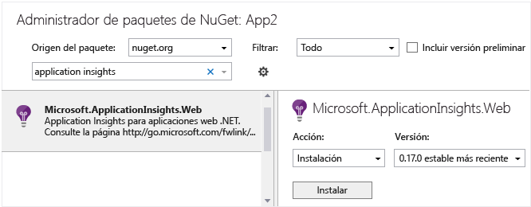

<properties
   pageTitle="Application Insights para los Servicios en la nube de Azure"
   description="Supervisión de los roles web y de trabajo de manera eficaz con Application Insights"
   services="application-insights"
   documentationCenter=""
   authors="soubhagyadash"
   manager="douge"
   editor="alancameronwills"/>

<tags
   ms.service="application-insights"
   ms.devlang="na"
   ms.tgt_pltfrm="ibiza"
   ms.topic="article"
   ms.workload="tbd"
   ms.date="11/15/2015"
   ms.author="sdash"/>

# Application Insights para los Servicios en la nube de Azure


*Application Insights se encuentra en su versión de vista previa.*

[Las aplicaciones de los Servicios en la nube de Microsoft Azure](https://azure.microsoft.com/services/cloud-services/) se pueden supervisar mediante [Visual Studio Application Insights][start] para obtener información sobre la disponibilidad, el rendimiento, los errores y el uso. Con los comentarios que obtendrá sobre el rendimiento y la eficacia de la aplicación en su entorno natural, pueda tomar decisiones meditadas sobre la dirección del diseño en cada ciclo de vida de desarrollo.


Necesitará una suscripción a [Microsoft Azure](http://azure.com). Inicie sesión con una cuenta Microsoft, que podría tener para Windows, XBox Live u otros servicios en la nube de Microsoft.


#### Aplicación de ejemplo instrumentado con Application Insights

Eche un vistazo a esta [aplicación de ejemplo](https://github.com/Microsoft/ApplicationInsights-Home/tree/master/Samples/AzureEmailService), en la que Application Insights se agrega a un servicio en la nube con dos roles de trabajo hospedados en Azure.

A continuación se explica cómo adaptar su propio proyecto de servicio en la nube de la misma manera.

## Creación de un recurso de Application Insights para cada rol

Un recurso de Application Insights es el lugar donde se analizan y muestran los datos de telemetría.

1.  En el [portal de Azure][portal], cree un nuevo recurso de Application Insights. Para el tipo de aplicación, elija la aplicación ASP.NET. 

    

2.  Realice una copia de la clave de instrumentación. La necesitará en breve para configurar el SDK.

    


Normalmente es mejor crear un recurso independiente para los datos de cada rol web y de trabajo.

Como alternativa, puede enviar datos de todos los roles a un único recurso, pero establezca una [propiedad predeterminada][apidefaults] para que pueda filtrar o agrupar los resultados de cada rol.

## <a name="sdk"></a>Instalación del SDK en cada proyecto


1. En Visual Studio, edite los paquetes de NuGet de su proyecto de aplicación de nube.

    


2. Agregue el paquete NuGet [Application Insights para Web](http://www.nuget.org/packages/Microsoft.ApplicationInsights.Web). Esta versión del SDK incluye módulos que agregan el contexto de servidor, como la información de roles. Para los roles de trabajo, use Application Insights para servicios de Windows.

    


3. Configure el SDK para enviar datos al recurso de Application Insights.

    Establezca la clave de instrumentación como valor de configuración en el archivo `ServiceConfiguration.Cloud.cscfg`. ([Código de ejemplo](https://github.com/Microsoft/ApplicationInsights-Home/blob/master/Samples/AzureEmailService/AzureEmailService/ServiceConfiguration.Cloud.cscfg)).
 
    ```XML
     <Role name="WorkerRoleA"> 
      <Setting name="APPINSIGHTS_INSTRUMENTATIONKEY" value="YOUR IKEY" /> 
     </Role>
    ```
 
    En una función de inicio adecuado, establezca la clave de instrumentación a partir del valor de configuración:

    ```C#
     TelemetryConfiguration.Active.InstrumentationKey = RoleEnvironment.GetConfigurationSettingValue("APPINSIGHTS_INSTRUMENTATIONKEY");
    ```

    Tenga en cuenta que en los informes de Diagnósticos de Azure se usará el mismo valor de `APPINSIGHTS_INSTRUMENTATIONKEY` de la opción de configuración.


    Realice esto para cada rol de la aplicación. Consulte los ejemplos:
 
 * [Rol web](https://github.com/Microsoft/ApplicationInsights-Home/blob/master/Samples/AzureEmailService/MvcWebRole/Global.asax.cs#L27)
 * [Rol de trabajo](https://github.com/Microsoft/ApplicationInsights-Home/blob/master/Samples/AzureEmailService/WorkerRoleA/WorkerRoleA.cs#L232)
 * [Para páginas web](https://github.com/Microsoft/ApplicationInsights-Home/blob/master/Samples/AzureEmailService/MvcWebRole/Views/Shared/_Layout.cshtml#L13)   

4. Establezca el archivo ApplicationInsights.config para que se copie siempre en el directorio de salida. 

    (En el archivo .config, verá mensajes pidiéndole colocar allí la clave de instrumentación. Sin embargo, para las aplicaciones de nube es mejor establecerla desde el archivo .cscfg. De esta forma se garantiza que el rol se identifica correctamente en el portal).


#### Ejecución y publicación de la aplicación

Ejecute la aplicación e inicie sesión en Azure. Abra los recursos de Application Insights que ha creado y verá que aparecen puntos de datos individuales en [Búsqueda](app-insights-diagnostic-search.md), y datos agregados en [Explorador de métricas](app-insights-metrics-explorer.md).

Agregue más telemetría (consulte las secciones siguientes) y luego publique la aplicación para obtener diagnósticos en vivo y comentarios sobre el uso.


#### ¿No hay datos?

* Abra el icono [Buscar][diagnostic] para ver los eventos individuales.
* Use la aplicación y abra varias páginas para generar telemetría.
* Espere unos segundos y haga clic en Actualizar.
* Vea [Solución de problemas][qna].


## Más telemetría

En las secciones siguientes se muestra cómo obtener telemetría adicional de diferentes aspectos de la aplicación.


## Seguimiento de solicitudes de roles de trabajo

En los roles web, el módulo de solicitudes recopila automáticamente datos acerca de las solicitudes HTTP. Consulte el [MVCWebRole de ejemplo](https://github.com/Microsoft/ApplicationInsights-Home/tree/master/Samples/AzureEmailService/MvcWebRole) para obtener ejemplos de cómo puede invalidar el comportamiento de la colección predeterminada.

Puede capturar el rendimiento de las llamadas a los roles de trabajo realizando su seguimiento de la misma manera que con las solicitudes HTTP. En Application Insights, el tipo de telemetría Solicitud mide una unidad de trabajo del lado servidor con nombre que se puede programar y puede realizarse correctamente o producir un error de forma independiente. Si bien el SDK captura automáticamente las solicitudes HTTP, puede insertar su propio código para realizar el seguimiento de las solicitudes a los roles de trabajo.

Consulte los dos roles de trabajo de ejemplo instrumentados en las solicitudes de informes: [WorkerRoleA](https://github.com/Microsoft/ApplicationInsights-Home/tree/master/Samples/AzureEmailService/WorkerRoleA) y [WorkerRoleB](https://github.com/Microsoft/ApplicationInsights-Home/tree/master/Samples/AzureEmailService/WorkerRoleB)

## Diagnóstico de Azure

Los datos de [Diagnósticos de Azure](../vs-azure-tools-diagnostics-for-cloud-services-and-virtual-machines.md) incluyen eventos de administración de roles, contadores de rendimiento y registros de aplicación. Puede hacer que se envíen a Application Insights para verlos junto con el resto de los datos de telemetría y así facilitar el diagnóstico de los problemas.

Los Diagnósticos de Azure son especialmente útiles si un rol produce errores de forma inesperada o no es capaz de iniciarse.

1. Haga clic con el botón derecho en el rol (no en el proyecto) para abrir sus propiedades, y seleccione **Habilitar diagnósticos**, **Enviar diagnósticos a Application Insights**.

    

    **O bien, si la aplicación ya está publicada y ejecutándose**, abra el Explorador de servidores o Cloud Explorer, haga clic con el botón derecho en la aplicación y seleccione la misma opción.

3.  Seleccione el mismo recurso de Application Insights que en el caso de los otros datos de telemetría.

    Si lo desea, puede establecer un recurso diferente en diferentes configuraciones del servicio (nube, local) para ayudar a mantener los datos de desarrollo separados de los datos activos.

3. Opcionalmente, [excluye algunos de los diagnósticos de Azure](app-insights-azure-diagnostics.md) que desea que se reenvíen a Application Insights. El valor predeterminado es todo.

### Visualización de eventos de diagnóstico de Azure

Dónde encontrar los diagnósticos:

* Los contadores de rendimiento se muestran como métricas personalizadas. 
* Los registros de eventos de Windows se muestran como seguimientos y eventos personalizados.
* Los registros de aplicación, los registros ETW y los registros de infraestructura de diagnóstico aparecen como seguimientos.

Para ver los recuentos de eventos y contadores de rendimiento, abra [Explorador de métricas](app-insights-metrics-explorer.md) y agregue un nuevo gráfico:


Use [Búsqueda](app-insights-diagnostic-search.md) para buscar en los distintos registros de seguimiento enviados por Diagnósticos de Azure. Por ejemplo, si tenía una excepción no controlada en un rol que provocó el bloqueo de dicho rol y recicla esa información, aparecería en el canal Aplicación del registro de eventos de Windows. Puede utilizar la funcionalidad Buscar para ver el error del registro de eventos de Windows y obtener el seguimiento de la pila completo para la excepción, lo que le permite encontrar la causa raíz del problema.


## Diagnósticos de aplicación

La extensión Diagnósticos de Azure incluye automáticamente las entradas de registro que genera la aplicación mediante System.Diagnostics.Trace.

Pero si ya usa los marcos Log4N o NLog, también puede [capturar sus seguimientos de registro][netlogs].

[Realice el seguimiento de métricas y eventos personalizados][api] en el cliente, en el servidor, o en ambos, para obtener más información sobre el rendimiento y el uso de la aplicación.

## Dependencias

El SDK de Application Insights puede notificar llamadas realizadas por la aplicación a dependencias externas, como API de REST y servidores SQL Server. Esto permite ver si una dependencia específica causa respuestas lentas o errores.

Para realizar un seguimiento de las dependencias, tendrá que configurar el rol web/trabajo con el [Agente Application Insights](app-insights-monitor-performance-live-website-now.md), también denominado "Monitor de estado".

Para utilizar al agente de Application Insights con los roles web/trabajo:

* Agregue la carpeta [AppInsightsAgent](https://github.com/Microsoft/ApplicationInsights-Home/tree/master/Samples/AzureEmailService/WorkerRoleA/AppInsightsAgent) y los dos archivos en ella a los proyectos de roles web/trabajo. Asegúrese de establecer sus propiedades de compilación para que siempre se copien en el directorio de salida. Estos archivos instalan el agente.
* Agregue la tarea de inicio para el archivo CSDEF como se muestra [aquí](https://github.com/Microsoft/ApplicationInsights-Home/tree/master/Samples/AzureEmailService/AzureEmailService/ServiceDefinition.csdef#L18).
* Nota: los *roles de trabajo* requieren tres variables de entorno, como se muestra [aquí](https://github.com/Microsoft/ApplicationInsights-Home/tree/master/Samples/AzureEmailService/AzureEmailService/ServiceDefinition.csdef#L44). No es obligatorio para roles web.

Se trata de un ejemplo de lo que se ve en el portal de Application Insights:

* Diagnóstico sofisticado con solicitudes y dependencias automáticamente correlacionadas:

    

* Rendimiento del rol web, con información de dependencia:

    

* A continuación se muestra una captura de pantalla de las solicitudes y la información de dependencia para un rol de trabajo:

    

## Excepciones

Consulte [Supervisión de excepciones en Application Insights](app-insights-asp-net-exceptions.md) para obtener información acerca de cómo puede recopilar excepciones no controladas de tipos de aplicaciones web diferentes.

El rol de web ejemplo tiene los controladores MVC5 y Web API 2. Las excepciones no controladas de los dos se capturan con lo siguiente:

* Configure [AiHandleErrorAttribute](https://github.com/Microsoft/ApplicationInsights-Home/blob/master/Samples/AzureEmailService/MvcWebRole/Telemetry/AiHandleErrorAttribute.cs) [aquí](https://github.com/Microsoft/ApplicationInsights-Home/blob/master/Samples/AzureEmailService/MvcWebRole/App_Start/FilterConfig.cs#L12) para los controladores MVC5
* Configure[AiWebApiExceptionLogger](https://github.com/Microsoft/ApplicationInsights-Home/blob/master/Samples/AzureEmailService/MvcWebRole/Telemetry/AiWebApiExceptionLogger.cs) [aquí](https://github.com/Microsoft/ApplicationInsights-Home/blob/master/Samples/AzureEmailService/MvcWebRole/App_Start/WebApiConfig.cs#L25) para los controladores Web API 2

Para los roles de trabajo, hay dos maneras de realizar el seguimiento de las excepciones.

* TrackException(ex)
* Si ha agregado el paquete de NuGet del agente de escucha de seguimiento de Application Insights, puede usar System.Diagnostics.Trace para registrar excepciones. [Ejemplo de código](https://github.com/Microsoft/ApplicationInsights-Home/blob/master/Samples/AzureEmailService/WorkerRoleA/WorkerRoleA.cs#L107)

## Contadores de rendimiento

Los siguientes contadores se recopilan de forma predeterminada:

    * \Process(??APP_WIN32_PROC??)\% Processor Time
	* \Memory\Available Bytes
	* \.NET CLR Exceptions(??APP_CLR_PROC??)# of Exceps Thrown / sec
	* \Process(??APP_WIN32_PROC??)\Private Bytes
	* \Process(??APP_WIN32_PROC??)\IO Data Bytes/sec
	* \Processor(_Total)\% Processor Time

Además, también se recopilan los siguientes para los roles web:

	* \ASP.NET Applications(??APP_W3SVC_PROC??)\Requests/Sec	
	* \ASP.NET Applications(??APP_W3SVC_PROC??)\Request Execution Time
	* \ASP.NET Applications(??APP_W3SVC_PROC??)\Requests In Application Queue

Puede especificar otros contadores de rendimiento de Windows o personalizados adicionales como se muestra [aquí](https://github.com/Microsoft/ApplicationInsights-Home/blob/master/Samples/AzureEmailService/WorkerRoleA/ApplicationInsights.config#L14)

  

## Telemetría correlacionada para roles de trabajo

Es una sofisticada experiencia de diagnóstico, donde puede ver qué provocó una solicitud de latencia alta o con errores. Con los roles web, el SDK se establece automáticamente la correlación entre la telemetría relacionada. Para los roles de trabajo, puede utilizar un inicializador de telemetría personalizado para establecer un atributo de contexto Operation.Id común para todas la telemetrías con el fin de lograrlo. Esto permitirá saber de un vistazo si se produjo el problema de latencia o con errores debido a una dependencia o el código.

Este es el procedimiento:

* Establezca el identificador de la correlación en una CallContext como se muestra [aquí](https://github.com/Microsoft/ApplicationInsights-Home/blob/master/Samples/AzureEmailService/WorkerRoleA/WorkerRoleA.cs#L36). En este caso, usamos el identificador de solicitud como identificador de correlación
* Agregue una implementación personalizada de TelemetryInitializer, que establecerá el Operation.Id al correlationId indicado. Se muestra aquí: [ItemCorrelationTelemetryInitializer](https://github.com/Microsoft/ApplicationInsights-Home/blob/master/Samples/AzureEmailService/WorkerRoleA/Telemetry/ItemCorrelationTelemetryInitializer.cs#L13)
* Agregue el inicializador de telemetría personalizado. Puede hacerlo en el archivo ApplicationInsights.config o en el código, como se muestra [aquí](https://github.com/Microsoft/ApplicationInsights-Home/blob/master/Samples/AzureEmailService/WorkerRoleA/WorkerRoleA.cs#L233)

Eso es todo. La experiencia del portal ya está dispuesta para ayudarle a ver la telemetría asociada de un vistazo:


## Telemetría de cliente

[Agregue el SDK de JavaScript a sus páginas web][client] para obtener telemetría basada en el explorador, como recuentos de vista de página, tiempos de carga de página y excepciones de script, y para poder editar telemetría personalizada en los scripts de página.

## Pruebas de disponibilidad

[Configure las pruebas web][availability] para comprobar que la aplicación efectivamente está activa y responde adecuadamente.


## Ejemplo

[El ejemplo](https://github.com/Microsoft/ApplicationInsights-Home/tree/master/Samples/AzureEmailService) supervisa un servicio que tiene un rol web y dos roles de trabajo.

## Excepción "Método no encontrado" en la ejecución en Servicios en la nube de Azure

¿Ha realizado la compilación para .NET 4.6? 4.6 no se admite automáticamente en los roles de Servicios en la nube de Azure. [Instale 4.6 en cada rol](../cloud-services/cloud-services-dotnet-install-dotnet.md) antes de ejecutar la aplicación.

## Temas relacionados

* [Configuración del envío de diagnósticos de Azure a Application Insights](app-insights-azure-diagnostics.md)
* [Uso de PowerShell para enviar diagnósticos de Azure a Application Insights](app-insights-powershell-azure-diagnostics.md)


[api]: app-insights-api-custom-events-metrics.md
[apidefaults]: app-insights-api-custom-events-metrics.md#default-properties
[apidynamicikey]: app-insights-api-custom-events-metrics.md#dynamic-ikey
[availability]: app-insights-monitor-web-app-availability.md
[azure]: app-insights-azure.md
[client]: app-insights-javascript.md
[diagnostic]: app-insights-diagnostic-search.md
[netlogs]: app-insights-asp-net-trace-logs.md
[perf]: app-insights-web-monitor-performance.md
[portal]: http://portal.azure.com/
[qna]: app-insights-troubleshoot-faq.md
[redfield]: app-insights-monitor-performance-live-website-now.md
[start]: app-insights-overview.md

<!---HONumber=AcomDC_0224_2016-->