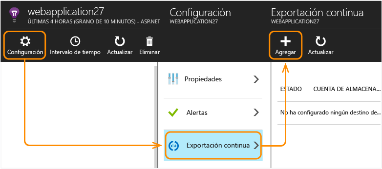
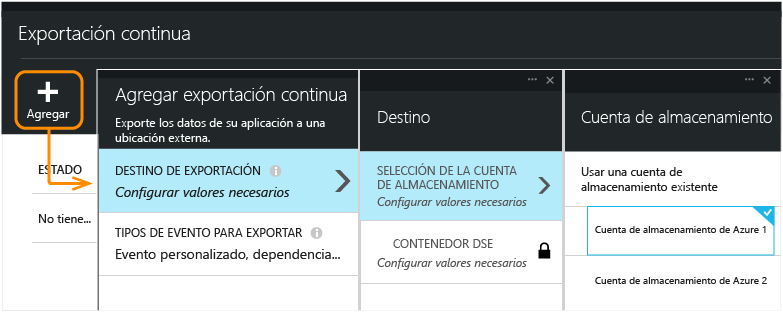
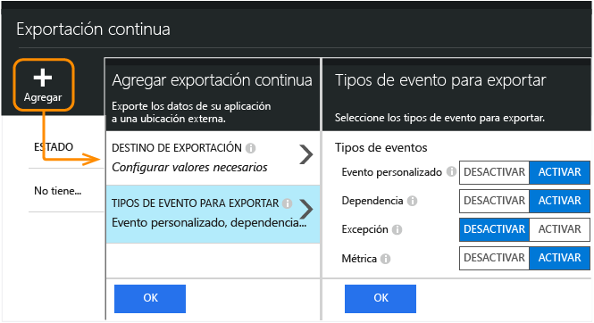
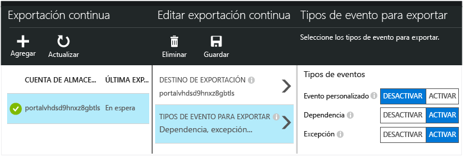
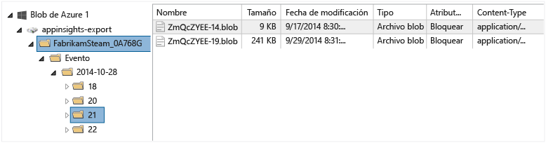
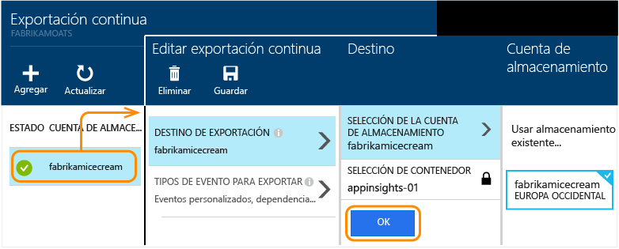

<properties 
	pageTitle="Exportación continua de telemetría desde Application Insights" 
	description="Exporte datos de diagnóstico y uso al almacenamiento en Microsoft Azure y descárguelos desde allí." 
	services="application-insights" 
    documentationCenter=""
	authors="alancameronwills" 
	manager="douge"/>

<tags 
	ms.service="application-insights" 
	ms.workload="tbd" 
	ms.tgt_pltfrm="ibiza" 
	ms.devlang="na" 
	ms.topic="article" 
	ms.date="11/15/2015" 
	ms.author="awills"/>
 
# Exportación de telemetría desde Application Insights

¿Desea hacer algún análisis personalizado en la telemetría? ¿O tal vez desee una alerta por correo electrónico en eventos con propiedades específicas? La exportación continua es lo más conveniente para ello. Los eventos que se ven en el portal de Application Insights pueden exportarse a almacenamiento en Microsoft Azure en formato JSON. Desde allí puede descargar los datos y escribir cualquier código necesario para procesarlos.

La Exportación continua está disponible durante el período de evaluación gratuita y en los [planes de precios Estándar y Premium](https://azure.microsoft.com/pricing/details/application-insights/).

(Si desea hacer una [exportación puntual](app-insights-metrics-explorer.md#export-to-excel) de lo que ve en una hoja de búsqueda o de métricas, haga clic en Exportar en la parte superior de la hoja. Si desea ver datos de Power BI, use [el adaptador](http://blogs.msdn.com/b/powerbi/archive/2015/11/04/explore-your-application-insights-data-with-power-bi.aspx) que *no* usa la exportación continua).

## Crear una cuenta de almacenamiento

Si aún no tiene una cuenta de almacenamiento "clásica", cree una ahora.

1. Cree una cuenta de almacenamiento "clásica" en su suscripción en el [Portal de Azure](https://portal.azure.com).

    

2. Cree un contenedor.

    

##  Configuración de la Exportación continua

En la hoja de información general del portal de Application Insights, abra Exportación continua:

Agregue una exportación y elija una [cuenta de almacenamiento de Azure](../storage-introduction.md) donde colocar los datos:

Elija los tipos de evento que desea exportar:

Una vez que ha creado la exportación, comienza el proceso. (Solo obtendrá los datos que lleguen después de crear la exportación.)

Puede haber un retraso de aproximadamente una hora antes de que aparezcan los datos en el blob.

Si desea cambiar los tipos de evento más tarde, simplemente edite la exportación:

Para detener la secuencia, haga clic en Deshabilitar. Al hacer clic en Habilitar de nuevo, la secuencia se reinicia con nuevos datos. No obtendrá los datos que llegaron al portal mientras estaba deshabilitada la exportación.

Para detener la secuencia de forma permanente, elimine la exportación. Al realizar esta acción no se eliminan los datos del almacenamiento.

#### ¿No puede agregar o cambiar una exportación?

* Para agregar o cambiar las exportaciones, necesita derechos de propietario, colaborador o colaborador de Application Insights. [Más información acerca de los roles][roles].

##  ¿Qué eventos obtiene?

Los datos exportados son la telemetría sin procesar que recibimos de la aplicación, aunque también agregamos los datos de ubicación que calculamos a partir de la dirección IP del cliente.

No se incluyen otras métricas calculadas. Por ejemplo, no exportamos el uso medio de la CPU, pero sí la telemetría sin procesar a partir de la que se calcula la media.

Los datos también incluyen los resultados de cualquier [prueba web de disponibilidad](app-insights-monitor-web-app-availability.md) que haya configurado.

> [AZURE.NOTE] **Muestreo.** Si la aplicación envía una gran cantidad de datos y usa el SDK de Application Insights para ASP.NET versión 2.0.0-beta3 o posterior, la característica de muestreo adaptativo puede operar y enviar solamente un porcentaje de los datos de telemetría. [Obtenga más información sobre el muestreo.](app-insights-sampling.md)

##  Inspección de los datos

Puede inspeccionar el almacenamiento directamente en el portal. Haga clic en **Examinar**, seleccione la cuenta de almacenamiento y abra **Contenedores**.

Para inspeccionar el almacenamiento de Azure en Visual Studio, abra **Ver**, **Cloud Explorer**. (Si no dispone de ese comando de menú, deberá instalar el SDK de Azure: abra el cuadro de diálogo **Nuevo proyecto**, expanda Visual C#/Cloud y elija **Obtener el SDK de Microsoft Azure para. NET**).

Al abrir el almacén de blobs, verá un contenedor con un conjunto de archivos blob. El URI de cada archivo que se deriva del nombre del recurso de Application Insights, su clave de instrumentación, y el tipo, fecha y hora de telemetría. (El nombre del recurso está todo en minúsculas y la clave de instrumentación omite guiones).

La fecha y hora son UTC e indican cuándo se depositó la telemetría en el almacén, no la hora en que se generó. De modo que si escribe código para descargar los datos, se puede mover linealmente a través de los datos.

##  Formato de datos

* Cada blob es un archivo de texto que contiene varias filas separadas por' \\n'.
* Cada fila es un documento JSON sin formato. Si quiere sentarse a mirarlo, ábralo en Visual Studio y elija Editar, Avanzadas, Archivo de formato:

Las duraciones de tiempo son tics, donde 10 000 tics = 1 ms. Por ejemplo, estos valores muestran una tiempo de 10 ms para enviar una solicitud desde el explorador, 30 ms para recibirla y 1,8 s para procesar la página en el explorador:

	"sendRequest": {"value": 10000.0},
	"receiveRequest": {"value": 30000.0},
	"clientProcess": {"value": 17970000.0}

[Referencia detallada del modelo de datos para los tipos y valores de propiedad.](app-insights-export-data-model.md)

## Procesamiento de los datos

En una pequeña escala, puede escribir código para separar sus datos, leerlos en una hoja de cálculo, etc. Por ejemplo:

    private IEnumerable<T> DeserializeMany<T>(string folderName)
    {
      var files = Directory.EnumerateFiles(folderName, "*.blob", SearchOption.AllDirectories);
      foreach (var file in files)
      {
         using (var fileReader = File.OpenText(file))
         {
            string fileContent = fileReader.ReadToEnd();
            IEnumerable<string> entities = fileContent.Split('\n').Where(s => !string.IsNullOrWhiteSpace(s));
            foreach (var entity in entities)
            {
                yield return JsonConvert.DeserializeObject<T>(entity);
            }
         }
      }
    }

Para obtener un ejemplo de código más grande, consulte el [uso de un rol de trabajo][exportasa].

## Eliminación de los datos antiguos
Tenga en cuenta que usted es responsable de administrar su capacidad de almacenamiento y eliminar los datos antiguos si es necesario.

## Si vuelve a generar la clave de almacenamiento...

Si cambia la clave para el almacenamiento, la exportación continua dejará de funcionar. Verá una notificación en su cuenta de Azure.

Abra la hoja Exportación continua y edite la exportación. Modifique el destino de exportación, pero deje el mismo almacenamiento seleccionado. Haga clic en Aceptar para confirmar.

La exportación continua se reiniciará.

## Ejemplos de exportación

* [Exportación a SQL con un rol de trabajo][exportcode]
* [Exportación a SQL con el Análisis de transmisiones][exportasa]
* [Exportación a PowerBI mediante Análisis de transmisiones](app-insights-export-power-bi.md)
 * Tenga en cuenta que esta no es la manera estándar de usar Power BI. Hay [un adaptador](http://blogs.msdn.com/b/powerbi/archive/2015/11/04/explore-your-application-insights-data-with-power-bi.aspx) que no requiere Exportación continua.

En escalas más grandes, considere la posibilidad de clústeres de Hadoop en [HDInsight](https://azure.microsoft.com/services/hdinsight/) en la nube. HDInsight ofrece diversas tecnologías para administrar y analizar Big Data.

## Preguntas y respuestas

* *Lo único que quiero es una descarga única de un gráfico.*  
 
    Sí, puede hacerlo. En la parte superior de la hoja, haga clic en [Exportar datos](app-insights-metrics-explorer.md#export-to-excel).

* *Configuro una exportación, pero no hay ningún dato en el almacén.*

    ¿Recibió Application Insights alguna telemetría de su aplicación desde que configuró la exportación? Solo recibirá datos nuevos.

* *Intenté configurar una exportación, pero se deniega el acceso.*

    Si la cuenta pertenece a su organización, debe ser miembro de los grupos de propietarios o colaboradores.

    <!-- Your account has to be either a paid-for account, or in the free trial period. -->

* *¿Puedo exportar directamente a mi propio almacén local?*

    Lamentablemente, no. Nuestro motor de exportación actualmente solo funciona con el almacenamiento de Azure.

* *¿Hay ningún límite para la cantidad de datos que puedo colocar en mi almacén?*

    No. Seguiremos insertando datos hasta que elimine la exportación. Pararemos si alcanzamos los límites externos del almacenamiento de blobs, pero hasta llegar ahí falta mucho. Depende de usted controlar la cantidad de almacenamiento que usa.

* *¿Cuántos blobs debería ver en el almacenamiento?*

 * Para cada tipo de datos que seleccionó para exportar, se crea un blob nuevo cada minuto (si los datos están disponibles).
 * Además, para las aplicaciones con mucho tráfico, se asignan unidades de partición adicionales. En este caso, cada unidad crea un blob cada minuto.

* *Volví a generar la clave de mi almacenamiento o cambié el nombre del contenedor, y ahora no funciona la exportación.*

    Edite la exportación y abra la hoja de destino de la exportación. Deje el mismo almacenamiento seleccionado que antes y haga clic en Aceptar para confirmar. La exportación se reiniciará. Si el cambio estaba dentro de los últimos días, no perderá datos.

* *¿Puedo detener la exportación?*

    Sí. Haga clic en Deshabilitar.

## Ejemplos de código

* [Transmisiones de Application Insights a Power BI](app-insights-export-power-bi.md)
* [Analizar JSON exportado mediante un rol de trabajo][exportcode]
* [Exportación a SQL con el Análisis de transmisiones][exportasa]

* [Referencia detallada del modelo de datos para los tipos y valores de propiedad.](app-insights-export-data-model.md)

<!--Link references-->

[exportcode]: app-insights-code-sample-export-telemetry-sql-database.md
[exportasa]: app-insights-code-sample-export-sql-stream-analytics.md
[roles]: app-insights-resources-roles-access-control.md

 

<!---HONumber=AcomDC_0128_2016-->