<properties
	pageTitle="Introducción a Application Insights para Visual Studio | Microsoft Azure"
	description="Analice el uso, la disponibilidad y el rendimiento de su aplicación web de Microsoft Azure o local con Application Insights para Visual Studio."
	services="application-insights"
    documentationCenter=""
	authors="alancameronwills"
	manager="douge"/>

<tags
	ms.service="application-insights"
	ms.workload="tbd"
	ms.tgt_pltfrm="ibiza"
	ms.devlang="na"
	ms.topic="hero-article"
	ms.date="11/17/2015"
	ms.author="awills"/>

# Introducción a Application Insights para Visual Studio

*Application Insights se encuentra en su versión de vista previa.*

Detecte problemas, resuelva problemas y mejore continuamente sus aplicaciones. Diagnostique rápidamente cualquier problema en su aplicación activa. Sepa lo que sus usuarios hacen con ella.

La configuración es muy sencilla y obtendrá resultados en cuestión de minutos.

Actualmente se admiten aplicaciones de iOS, Android y Windows; aplicaciones web de J2EE y ASP.NET, y servicios de WCF. Las aplicaciones web se pueden ejecutar en Azure o en sus propios servidores locales. El SDK de JavaScript se ejecuta en cualquier página web.

## Primeros pasos

Comience con cualquier combinación, en cualquier orden, de los puntos de entrada que aparecen en el siguiente diagrama. Siga la ruta de acceso que se adapte a sus necesidades.

Aplicación Insights funciona agregando un SDK a la aplicación, que envía la telemetría al [Portal de Azure](https://portal.azure.com). Hay diferentes SDK para las diversas combinaciones de plataformas, lenguajes e IDE que se admiten.

Obtenga una cuenta en [ Microsoft Azure](http://azure.com). Puede que ya tenga acceso a una cuenta de grupo a través de su organización, o que desee obtener una cuenta de pago por uso. Application Insights tiene un nivel gratuito, por lo que no tendrá que pagar hasta que su aplicación se haga popular. Consulte la [página de precios](https://azure.microsoft.com/pricing/details/application-insights/).

Lo que desea | Lo que debe hacer | Lo que obtiene
---|---|---
 <a href="app-insights-asp-net.md">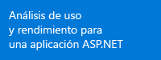</a> | <a href="app-insights-asp-net.md">Agregar el SDK de Application Insights al proyecto web</a>    | <a href="app-insights-asp-net.md">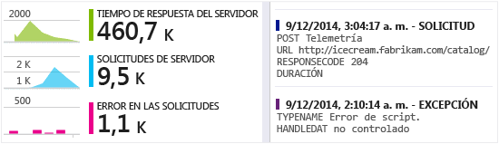</a>
<a href="app-insights-monitor-performance-live-website-now.md">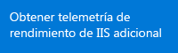</a> <a href="app-insights-monitor-performance-live-website-now.md">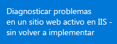</a>|<a href="app-insights-monitor-performance-live-website-now.md">Instalar el monitor de estado en el servidor IIS</a>    | <a href="app-insights-monitor-performance-live-website-now.md">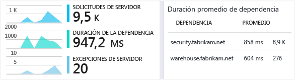</a>
<a href="insights-perf-analytics.md">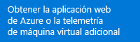</a>|<a href="insights-perf-analytics.md">Habilitar Insights en su máquina virtual o aplicación web de Azure</a>    | 
<a href="app-insights-java-get-started.md">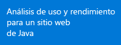</a>|<a href="app-insights-java-get-started.md">Agregar el SDK al proyecto de Java</a>  | 
<a href="app-insights-web-track-usage.md">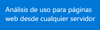</a>|<a href="app-insights-web-track-usage.md">Insertar el script de Application Insights en las páginas web</a>  | <a href="app-insights-web-track-usage.md">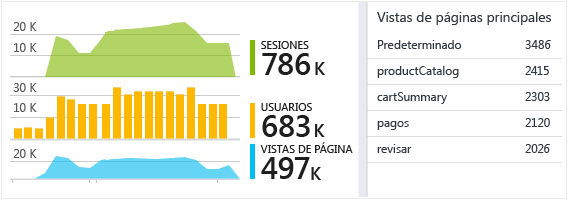</a>
<a href="app-insights-monitor-web-app-availability.md">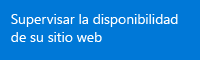</a>|<a href="app-insights-monitor-web-app-availability.md">Crear pruebas web</a>  | <a href="app-insights-monitor-web-app-availability.md">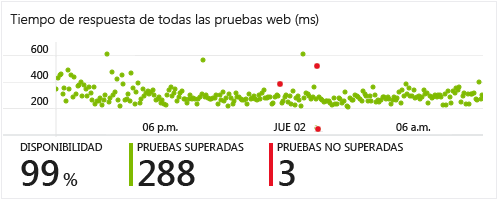</a>
<a href="app-insights-platforms.md">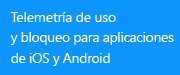</a>|<a href="http://hockeyapp.net">Usar HockeyApp</a>  | <a href="http://hockeyapp.net">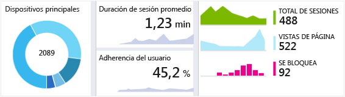</a>

## Soporte y comentarios

* Preguntas y problemas:
 * [Solución de problemas][qna]
 * [Foro de MSDN](https://social.msdn.microsoft.com/Forums/vstudio/es-ES/home?forum=ApplicationInsights)
 * [Stackoverflow](http://stackoverflow.com/questions/tagged/ms-application-insights)
* Errores:
 * [Conectar](https://connect.microsoft.com/VisualStudio/Feedback/LoadSubmitFeedbackForm?FormID=6076)
* Sugerencias
 * [Voz del usuario](http://visualstudio.uservoice.com/forums/121579-visual-studio/category/77108-application-insights)
* Ejemplos de código
 * [Ejemplos de código](app-insights-code-samples.md)

## Vídeos

> [AZURE.VIDEO 218]

> [AZURE.VIDEO usage-monitoring-application-insights]

> [AZURE.VIDEO performance-monitoring-application-insights]

<!--Link references-->

[qna]: app-insights-troubleshoot-faq.md

<!---HONumber=AcomDC_0128_2016-->