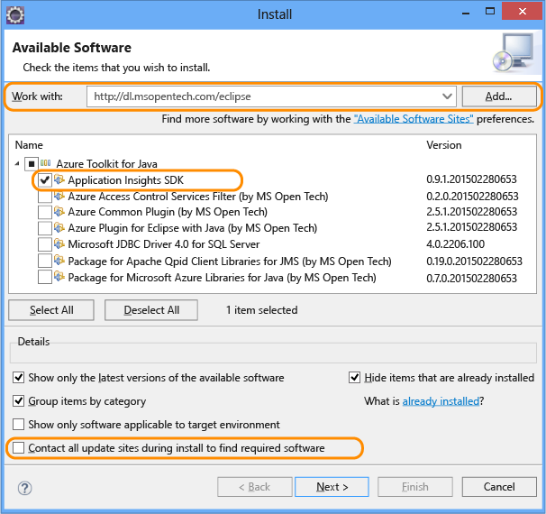
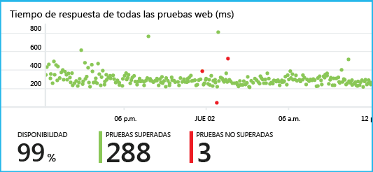

<properties 
	pageTitle="Introducción a Application Insights con Java en Eclipse" 
	description="Utilización del complemento de Eclipse para agregar supervisión del rendimiento y uso para su sitio web de Java con Application Insights" 
	services="application-insights" 
    documentationCenter="java"
	authors="alancameronwills" 
	manager="douge"/>

<tags 
	ms.service="application-insights" 
	ms.workload="tbd" 
	ms.tgt_pltfrm="ibiza" 
	ms.devlang="na" 
	ms.topic="article" 
	ms.date="03/02/2016" 
	ms.author="awills"/>
 
# Introducción a Application Insights con Java en Eclipse

El SDK de Application Insights envía telemetría desde la aplicación web de Java para que se pueda analizar el uso y el rendimiento. El complemento Eclipse de Application Insights instala automáticamente el SDK en el proyecto para que obtenga la telemetría de serie, además de una API que puede usar para escribir la telemetría personalizada.

## Requisitos previos

Actualmente el complemento funciona para proyectos Maven y proyectos web dinámicos en Eclipse. ([Agregue Application Insights a otros tipos de proyectos de Java][java]).

Necesitará:

* Oracle JRE 1.6 o posterior
* Una suscripción a [Microsoft Azure](https://azure.microsoft.com/). (Puede empezar con la [evaluación gratuita](https://azure.microsoft.com/pricing/free-trial/)).
* [Eclipse IDE para Java EE Developers](http://www.eclipse.org/downloads/), Indigo o superior.
* Windows 7 o posterior, o Windows Server 2008 o posterior

## Instalar el SDK en Eclipse (una vez)

Basta con hacerlo una vez por equipo. Este paso instala un kit de herramientas que puede agregar después el SDK a cada proyecto web dinámico.

1. En Eclipse, haga clic en Ayuda, Instalar nuevo software.

    

2. El SDK se encuentra en http://dl.windowsazure.com/eclipse, en el kit de herramientas de Azure.
3. Desactive **Ponerse en contacto con todos los sitios de actualización...**

    

Siga los pasos restantes para cada proyecto de Java.

## Creación de un recurso de Application Insights en Azure

1. Inicie sesión en el [Portal de Azure](https://portal.azure.com).
2. Cree un recurso de Application Insights.  

      
3. Establezca el tipo de aplicación a una aplicación web de Java.  

      
4. Busque la clave de instrumentación del nuevo recurso. En breve necesitará pegarlo en el proyecto de código.  

    

## Agregar Application Insights a un proyecto

1. Agregue Application Insights en el menú contextual del proyecto web de Java.

    

2. Pegue la clave de instrumentación que obtuvo en el portal de Azure.

    

La clave se envía junto con todos los elementos de telemetría e indica a Application Insights que se muestre en el recurso.

## Ejecución de la aplicación y visualización de las métricas

Ejecute la aplicación.

Vuelva al recurso Application Insights en Microsoft Azure.

Los datos de las solicitudes HTTP aparecerán en la hoja de información general. (Si todavía no está ahí, espere unos segundos y, a continuación, haga clic en Actualizar).

 

Haga clic en cualquier gráfico para ver métricas más detalladas.

[Más información acerca de las métricas][metrics]

 

Y cuando vea las propiedades de una solicitud, podrá ver los eventos de telemetría asociados, como solicitudes y excepciones.
 

## Telemetría de cliente

En la hoja Inicio rápido, haga clic en Obtener código para supervisar mis páginas web:

Inserte el fragmento de código en el encabezado de los archivos HTML.

#### Visualización de datos del lado cliente

Abra las páginas web actualizadas y úselas. Espere un minuto o dos, a continuación, vuelva a Application Insights y abra la hoja de uso. (En la hoja de información general, desplácese hacia abajo y haga clic en Uso.)

Las métricas de vistas de página, usuarios y sesiones aparecerán en la hoja de uso:

[Más información acerca de la configuración de la telemetría de cliente.][usage]

## Publicación de la aplicación

Ahora puede publicar la aplicación en el servidor, dejar que la utilicen los usuarios y ver la telemetría en el portal.

* Asegúrese de que el firewall permite que la aplicación envíe datos de telemetría a estos puertos:

 * dc.services.visualstudio.com:443
 * dc.services.visualstudio.com:80
 * f5.services.visualstudio.com:443
 * f5.services.visualstudio.com:80

* En los servidores de Windows, instale:

 * [Microsoft Visual C++ Redistributable](http://www.microsoft.com/download/details.aspx?id=40784)

    (Esto habilita los contadores de rendimiento.)

## Excepciones y errores de solicitud

Las excepciones no controladas se recopilan automáticamente:

Para recopilar datos de otras excepciones, tiene dos opciones:

* [Insertar llamadas a TrackException en el código](app-insights-api-custom-events-metrics.md#track-exception). 
* [Instalar el agente de Java en el servidor](app-insights-java-agent.md). Debe especificar los métodos que desee ver.

## Supervisión de llamadas a métodos y dependencias externas

[Instale el agente de Java](app-insights-java-agent.md) para registrar los métodos internos especificados y las llamadas realizadas a través de JDBC, con datos de tiempo.

## Contadores de rendimiento

En la hoja de Información general, desplácese hacia abajo y haga clic en el icono **Servidores**. Verá diferentes contadores de rendimiento.

### Personalizar la recopilación de contadores de rendimiento

Para deshabilitar la recopilación del conjunto estándar de contadores de rendimiento, agregue el siguiente código bajo el nodo raíz del archivo ApplicationInsights.xml:

    <PerformanceCounters>
       <UseBuiltIn>False</UseBuiltIn>
    </PerformanceCounters>

### Recopilar contadores de rendimiento adicionales

Puede especificar contadores de rendimiento adicionales que se van a recopilar.

#### Contadores JMX (expuestos por la máquina virtual de Java)

    <PerformanceCounters>
      <Jmx>
        <Add objectName="java.lang:type=ClassLoading" attribute="TotalLoadedClassCount" displayName="Loaded Class Count"/>
        <Add objectName="java.lang:type=Memory" attribute="HeapMemoryUsage.used" displayName="Heap Memory Usage-used" type="composite"/>
      </Jmx>
    </PerformanceCounters>

*	`displayName`: el nombre mostrado en el portal de Application Insights.
*	`objectName`: el nombre del objeto JMX.
*	`attribute`: el atributo del nombre del objeto JMX que se va a capturar
*	`type` (opcional): el tipo de atributo del objeto JMX:
 *	Valor predeterminado: un tipo simple como int o long.
 *	`composite`: los datos del contador de rendimiento tienen el formato 'Attribute.Data'
 *	`tabular`: los datos del contador de rendimiento tienen el formato de una fila de tabla

#### Contadores de rendimiento de Windows

Cada [contador de rendimiento de Windows](https://msdn.microsoft.com/library/windows/desktop/aa373083.aspx) es un miembro de una categoría (de la misma manera que un campo es un miembro de una clase). Las categorías puede ser globales, o pueden tener instancias con nombre o numeradas.

    <PerformanceCounters>
      <Windows>
        <Add displayName="Process User Time" categoryName="Process" counterName="%User Time" instanceName="__SELF__" />
        <Add displayName="Bytes Printed per Second" categoryName="Print Queue" counterName="Bytes Printed/sec" instanceName="Fax" />
      </Windows>
    </PerformanceCounters>

*	displayName: el nombre mostrado en el portal de Application Insights.
*	categoryName: la categoría de contador de rendimiento (objeto de rendimiento) con la que está asociada este contador de rendimiento.
*	counterName: el nombre del contador de rendimiento.
*	instanceName: el nombre de la instancia de categoría del contador de rendimiento o una cadena vacía (""), si la categoría contiene una sola instancia. Si categoryName es Proceso, y el contador de rendimiento que desea recopilar está en el proceso de JVM actual en que se ejecuta la aplicación, especifique `"__SELF__"`.

Los contadores de rendimiento están visibles como métricas personalizadas en el [Explorador de métricas][metrics].

### Contadores de rendimiento de Unix

* [Instale collectd con el complemento de Application Insights](app-insights-java-collectd.md) para obtener una amplia variedad de datos de red y del sistema.

## Pruebas web de disponibilidad

Application Insights puede probar su sitio web a intervalos regulares para comprobar que está activo y que responde correctamente. [Para configurarlo][availability], desplácese hacia abajo y haga clic en Disponibilidad.

Obtendrá gráficos de tiempos de respuesta, junto con notificaciones por correo electrónico si su sitio deja de funcionar.

[Más información acerca de las pruebas web de disponibilidad][availability]

## Registros de diagnóstico

Si está usando Logback o Log4J (v1.2 o v2.0) para el seguimiento, los registros de seguimiento se pueden enviar automáticamente a Application Insights, donde puede explorarlos y buscar en ellos.

[Más información acerca de los registros de diagnóstico][javalogs]

## Telemetría personalizada 

Inserte unas pocas líneas de código en la aplicación web de Java para averiguar qué hacen los usuarios con él o para ayudar a diagnosticar problemas.

Puede insertar código en el JavaScript de la página web y en Java del servidor.

[Obtenga información acerca de la telemetría personalizad][track]

## Pasos siguientes

#### Detección y diagnóstico de problemas

* [Agregue telemetría de cliente web][usage] para obtener telemetría de rendimiento desde el cliente web.
* [Configure las pruebas web][availability] para comprobar que la aplicación efectivamente está activa y responde adecuadamente.
* [Busque eventos y registros][diagnostic] para ayudar a diagnosticar problemas.
* [Captura de los seguimientos Log4J o Logback][javalogs]

#### Seguir el uso

* [Agregue telemetría de cliente web][usage] para supervisar las vistas de páginas y las métricas básicas de usuario.
* [Realice el seguimiento de métricas y eventos personalizado][track] para obtener más información acerca de cómo se usa la aplicación tanto en el servidor como en el cliente.

<!--Link references-->

[availability]: app-insights-monitor-web-app-availability.md
[diagnostic]: app-insights-diagnostic-search.md
[java]: app-insights-java-get-started.md
[javalogs]: app-insights-java-trace-logs.md
[metrics]: app-insights-metrics-explorer.md
[track]: app-insights-api-custom-events-metrics.md
[usage]: app-insights-web-track-usage.md

 

<!---HONumber=AcomDC_0302_2016-->