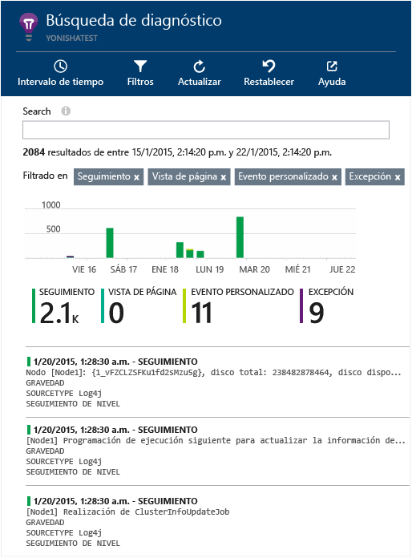

<properties 
	pageTitle="Exploración de los registros de seguimiento de Java en Application Insights" 
	description="Búsqueda de seguimiento Log4J o Logback en Application Insights" 
	services="application-insights" 
    documentationCenter="java"
	authors="alancameronwills" 
	manager="douge"/>

<tags 
	ms.service="application-insights" 
	ms.workload="tbd" 
	ms.tgt_pltfrm="ibiza" 
	ms.devlang="na" 
	ms.topic="article" 
	ms.date="01/21/2016" 
	ms.author="awills"/>

# Exploración de los registros de seguimiento de Java en Application Insights

Si está usando Logback o Log4J (v1.2 o v2.0) para el seguimiento, los registros de seguimiento se pueden enviar automáticamente a Application Insights, donde puede explorarlos y buscar en ellos.

Instale el [SDK de Application Insights para Java][java], si no ha hecho ya.

## Incorporación de bibliotecas de registro al proyecto

*Elija la forma adecuada para su proyecto.*

#### Si está usando Maven...

Si su proyecto ya se ha configurado para usar Maven para la compilación, combine uno de los siguientes fragmentos de código en el archivo pom.xml.

A continuación, actualice las dependencias del proyecto, para obtener los archivos binarios descargados.

*Logback*

    <dependencies>
       <dependency>
          <groupId>com.microsoft.azure</groupId>
          <artifactId>applicationinsights-logging-logback</artifactId>
          <version>[1.0,)</version>
       </dependency>
    </dependencies>

*Log4J v2.0*

    <dependencies>
       <dependency>
          <groupId>com.microsoft.azure</groupId>
          <artifactId>applicationinsights-logging-log4j2</artifactId>
          <version>[1.0,)</version>
       </dependency>
    </dependencies>

*Log4J v1.2*

    <dependencies>
       <dependency>
          <groupId>com.microsoft.azure</groupId>
          <artifactId>applicationinsights-logging-log4j1_2</artifactId>
          <version>[1.0,)</version>
       </dependency>
    </dependencies>

#### Si está usando Gradle...

Si el proyecto ya se ha configurado para usar Gradle para la compilación, agregue una de las líneas siguientes al grupo `dependencies` en el archivo build.gradle.

A continuación, actualice las dependencias del proyecto, para obtener los archivos binarios descargados.

**Logback**

    compile group: 'com.microsoft.azure', name: 'applicationinsights-logging-logback', version: '1.0.+'

**Log4J v2.0**

    compile group: 'com.microsoft.azure', name: 'applicationinsights-logging-log4j2', version: '1.0.+'

**Log4J v1.2**

    compile group: 'com.microsoft.azure', name: 'applicationinsights-logging-log4j1_2', version: '1.0.+'

#### De lo contrario...

Descargue, extraiga el appender adecuado y agregue después la biblioteca adecuada a su proyecto:

Registrador | Descargar | Biblioteca
----|----|----
Logback|[SDK con el appender de Logback](https://azuredownloads.blob.core.windows.net/applicationinsights/logbackAppender.zip)|applicationinsights-logging-logback
Log4J v2.0|[SDK con el appender de Log4J v2](https://azuredownloads.blob.core.windows.net/applicationinsights/log4j2Appender.zip)|applicationinsights-logging-log4j2 
Log4j v1.2|[SDK con el appender de Log4J v1.2](https://azuredownloads.blob.core.windows.net/applicationinsights/log4j1_2Appender.zip)|applicationinsights-logging-log4j1\_2 

## Incorporación del appender el marco de registro

Para empezar a recibir los seguimientos, combine el fragmento de código relevante al archivo de configuración Log4J o Logback:

*Logback*

    <appender name="aiAppender" 
      class="com.microsoft.applicationinsights.logback.ApplicationInsightsAppender">
    </appender>
    <root level="trace">
      <appender-ref ref="aiAppender" />
    </root>

*Log4J v2.0*

    
    <Appenders>
      <ApplicationInsightsAppender name="aiAppender" />
    </Appenders>
    <Loggers>
      <Root level="trace">
        <AppenderRef ref="aiAppender"/>
      </Root>
    </Loggers>

*Log4J v1.2*

    <appender name="aiAppender" 
         class="com.microsoft.applicationinsights.log4j.v1_2.ApplicationInsightsAppender">
    </appender>
    <root>
      <priority value ="trace" />
      <appender-ref ref="aiAppender" />
    </root>

Los appenders de Application Insights pueden hacer referencia a cualquier registrador configurado y no necesariamente por el registrador de raíz (como se muestra en los ejemplos de código anteriores).

## En el portal de Application Insights, explore los seguimientos.

Ahora que ha configurado el proyecto para enviar el seguimiento a Application Insights, puede ver y buscar estos seguimientos en el portal de Application Insights, en la hoja [Búsqueda de diagnóstico][diagnostic].

## Pasos siguientes

[Búsqueda de diagnóstico][diagnostic]

<!--Link references-->

[diagnostic]: app-insights-diagnostic-search.md
[java]: app-insights-java-get-started.md

 

<!---HONumber=AcomDC_0128_2016-->