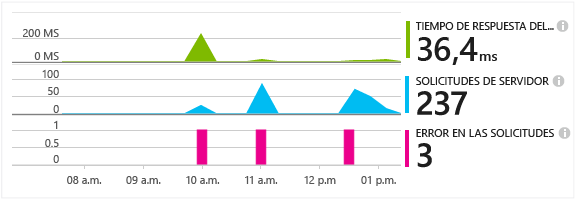
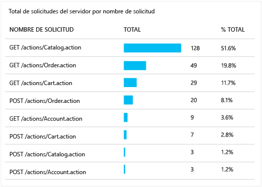
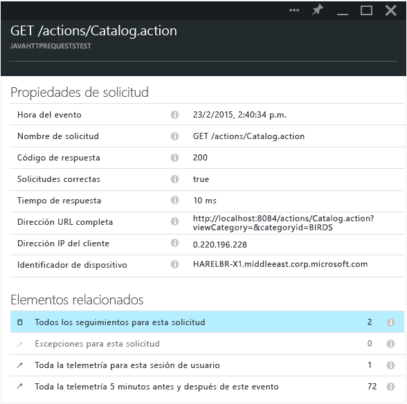

<properties 
	pageTitle="Seguimiento de las solicitudes HTTP en una aplicación web de Java" 
	description="Application Insights permite medir el rendimiento de la aplicación web de Java en web." 
	services="application-insights" 
    documentationCenter=""
	authors="alancameronwills" 
	manager="douge"/>

<tags 
	ms.service="application-insights" 
	ms.workload="tbd" 
	ms.tgt_pltfrm="ibiza" 
	ms.devlang="na" 
	ms.topic="article" 
	ms.date="10/21/2015" 
	ms.author="awills"/>
 
# Seguimiento de las solicitudes HTTP en una aplicación web de Java

Si está ejecutando una aplicación web de Java, puede ver información acerca de las solicitudes HTTP enviadas a la aplicación, como los recursos solicitados, las solicitudes con error y los tiempos de respuesta, en el portal de Application Insights.

Instale el [SDK de Application Insights para Java][java], si no ha hecho ya.

## Incorporación de archivos binarios al proyecto

*Elija la forma adecuada para su proyecto.*

### Si está usando Maven...

Si su proyecto ya se ha configurado para usar Maven para la compilación, combine el siguiente fragmento de código al archivo pom.xml.

A continuación, actualice las dependencias del proyecto, para obtener los archivos binarios descargados.

    <dependencies>
      <dependency>
        <groupId>com.microsoft.azure</groupId>
        <artifactId>applicationinsights-web</artifactId>
        <version>[1.0,)</version>
      </dependency>
    </dependencies>

### Si está usando Gradle...

Si su proyecto ya se ha configurado para usar Grade para la compilación, combine el siguiente fragmento de código al archivo build.gradle.

A continuación, actualice las dependencias del proyecto, para obtener los archivos binarios descargados.

    dependencies {
      compile group: 'com.microsoft.azure', name: 'applicationinsights-web', version: '1.0.+'
    }

## Incorporación del filtro HTTP de Application Insights al proyecto

Busque y abra el archivo web.xml en el proyecto y combine el siguiente fragmento de código bajo el nodo web-app, donde se han configurado los filtros de aplicación.

Para obtener los resultados más precisos, el filtro debe asignarse antes de todos los demás filtros.

    <filter>
      <filter-name>ApplicationInsightsWebFilter</filter-name>
      <filter-class>
        com.microsoft.applicationinsights.web.internal.WebRequestTrackingFilter
      </filter-class>
    </filter>
    <filter-mapping>
       <filter-name>ApplicationInsightsWebFilter</filter-name>
       <url-pattern>/*</url-pattern>
    </filter-mapping>

## Incorporación de módulos HTTP al proyecto

Busque y abra el archivo ApplicationInsights.xml en el proyecto y combine el siguiente fragmento de código bajo el elemento <TelemetryModules>.

Si no hay ningún elemento <TelemetryModules> en este archivo, agregue uno bajo el elemento <ApplicationInsights>.

    <TelemetryModules>
      <Add type="com.microsoft.applicationinsights.web.extensibility.modules.WebRequestTrackingTelemetryModule"/>
      <Add type="com.microsoft.applicationinsights.web.extensibility.modules.WebSessionTrackingTelemetryModule"/>
      <Add type="com.microsoft.applicationinsights.web.extensibility.modules.WebUserTrackingTelemetryModule"/>
    </TelemetryModules>

## Incorporación de inicializadores de telemetría para la correlación de eventos

Con la correlación de eventos, puede asociar una solicitud HTTP con todos los eventos de telemetría enviados durante el procesamiento de solicitudes mediante el uso de una propiedad de identificador de operación, que se adjunta a cada uno de estos eventos de telemetría. De esta forma, podrá explorar una solicitud HTTP junto con todos los eventos que se llaman desde ella y facilita el diagnóstico y solución de problemas.

Busque y abra el archivo ApplicationInsights.xml en el proyecto y combine el siguiente fragmento de código bajo el elemento <TelemetryInitializers>.

Si no hay ningún elemento < TelemetryInitializers> en este archivo, agregue uno bajo el elemento <ApplicationInsights>.

    <TelemetryInitializers>
     <Add  type="com.microsoft.applicationinsights.web.extensibility.initializers.WebOperationIdTelemetryInitializer"/>
     <Add type="com.microsoft.applicationinsights.web.extensibility.initializers.WebOperationNameTelemetryInitializer"/>
     <Add type="com.microsoft.applicationinsights.web.extensibility.initializers.WebSessionTelemetryInitializer"/>
     <Add type="com.microsoft.applicationinsights.web.extensibility.initializers.WebUserTelemetryInitializer"/>
     <Add type="com.microsoft.applicationinsights.web.extensibility.initializers.WebUserAgentTelemetryInitializer"/>
    </TelemetryInitializers>

## Consulta de la información de solicitudes en Application Insights

Ejecute la aplicación.

Vuelva al recurso Application Insights en Microsoft Azure.

Los datos de las solicitudes HTTP aparecerán en la hoja de información general. (Si todavía no está ahí, espere unos segundos y, a continuación, haga clic en Actualizar).

 

Haga clic en cualquier gráfico para ver métricas más detalladas.

[Más información acerca de las métricas][metrics]

 

Y cuando vea las propiedades de una solicitud, podrá ver los eventos de telemetría asociados, como solicitudes y excepciones.
 

## Pasos siguientes

* [Busque eventos y registros][diagnostic] para ayudar a diagnosticar problemas.
* [Captura de los seguimientos Log4J o Logback][javalogs]

<!--Link references-->

[diagnostic]: app-insights-diagnostic-search.md
[java]: app-insights-java-get-started.md
[javalogs]: app-insights-java-trace-logs.md
[metrics]: app-insights-metrics-explorer.md

 

<!---HONumber=Nov15_HO1-->