<properties
	pageTitle="Application Insights para aplicaciones web de JavaScript | Microsoft Azure"
	description="Obtenga recuentos de sesiones y vistas de página, además de datos de cliente web, y realice el seguimiento de los patrones de uso. Detecte problemas de rendimiento y excepciones en páginas web de JavaScript."
	services="application-insights"
    documentationCenter=""
	authors="alancameronwills"
	manager="douge"/>

<tags
	ms.service="application-insights"
	ms.workload="tbd"
	ms.tgt_pltfrm="ibiza"
	ms.devlang="na"
	ms.topic="get-started-article"
	ms.date="11/17/2015"
	ms.author="awills"/>

# Application Insights para aplicaciones web de JavaScript

[AZURE.INCLUDE [app-insights-selector-get-started-dotnet](../../includes/app-insights-selector-get-started-dotnet.md)]

Obtenga información sobre el rendimiento y el uso de su página web. Agregue Visual Studio Application Insights a su página y averigüe cuántos usuarios tiene, la frecuencia con que vuelven y las páginas que más usan. También obtendrá informes de tiempos de carga y las posibles excepciones. Agregue algunos [eventos y métricas personalizados](app-insights-api-custom-events-metrics.md) y podrá analizar en detalle las características más usadas y los errores más comunes; asimismo, podrá optimizar la página para tener éxito con los usuarios.

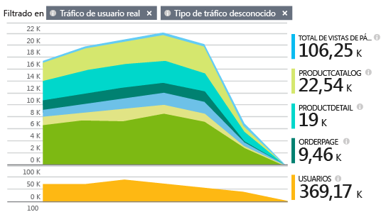

Si ya ha configurado la telemetría de servidor para su aplicación web [ASP.NET](app-insights-asp-net.md) o [Java](app-insights-java-get-started.md), tendrá una idea clara tanto desde el punto de vista del cliente como del servidor. Las dos secuencias se integrarán en el portal de Application Insights.

#### Demostración rápida

Si no tiene una suscripción de Azure y le gustaría probar Application Insights en la página web, visite [Probar Application Insights](http://aka.ms/ainow).

## Apertura de un recurso de Application Insights

El recurso de Application Insights es donde se muestran los datos sobre el rendimiento y el uso de la página. (Si ha ya creado un recurso, quizá para recopilar datos de su servidor web, omita este paso).

Inicie sesión en el [Portal de Azure](https://portal.azure.com).

Si ya ha configurado la supervisión del lado del servidor de su aplicación, ya tendrá un recurso:

Si no tiene uno, créelo:

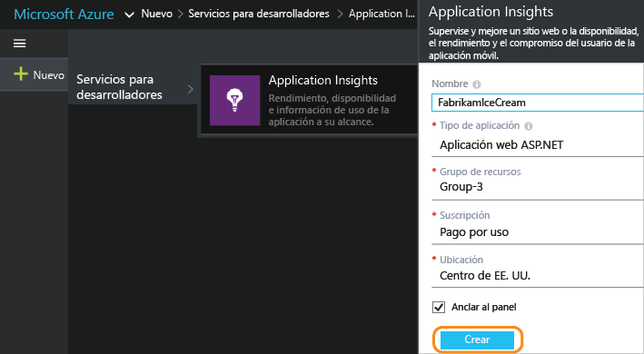

*¿Tiene ya alguna pregunta?* [Más información sobre cómo crear un recurso](app-insights-create-new-resource.md).

## Agregar el script de SDK a la aplicación o la página web

En Inicio rápido, obtenga el script para páginas web:

Inserte el script justo antes de la etiqueta &lt;/head&gt; de cada página de la que quiera realizar el seguimiento. Si su sitio web tiene una página maestra, puede colocar el script allí. Por ejemplo:

* En un proyecto de ASP.NET MVC, lo colocaría en View\\Shared\\_Layout.cshtml.
* En un sitio de SharePoint, en el panel de control, abra [Configuración del sitio/Página maestra](app-insights-sharepoint.md).

El script contiene la clave de instrumentación que dirige los datos al recurso de Application Insights.

([Una explicación más profunda del script](http://apmtips.com/blog/2015/03/18/javascript-snippet-explained/))

*(Si está usando un marco de página web conocido, mire a ver si encuentra adaptadores de Application Insights). Por ejemplo, hay [un módulo AngularJS](http://ngmodules.org/modules/angular-appinsights)).*

## Ejecución de la aplicación

Ejecute la aplicación web, úsela un rato para generar datos de telemetría y espere unos segundos. Puede ejecutarla con la tecla **F5** en la máquina de desarrollo, o publicarla y dejar que los usuarios jueguen con ella.

Si quiere comprobar la telemetría que envía una aplicación web a Application Insights, use las herramientas de depuración del explorador (**F12** en muchos exploradores). Los datos se envían a dc.services.visualstudio.com.

## Exploración de los datos

En la hoja de información general de la aplicación, hay un gráfico cerca de la parte superior que muestra el tiempo promedio para cargar páginas en el explorador:

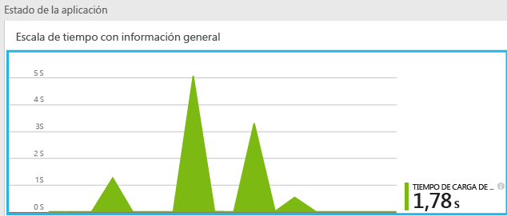

*¿Aún no hay datos? Haga clic en **Actualizar** en la parte superior de la página. ¿Todavía nada? Consulte [Solución de problemas](app-insights-troubleshoot-faq.md).*

Haga clic en ese gráfico y obtendrá una versión más detallada:

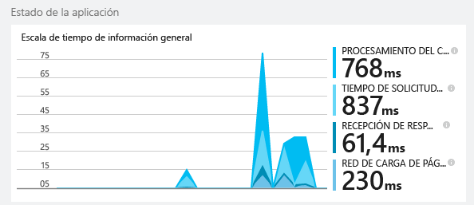

Se trata de un gráfico apilado que divide el tiempo de carga total de páginas en los [intervalos estándar definidos por W3C](http://www.w3.org/TR/navigation-timing/#processing-model).

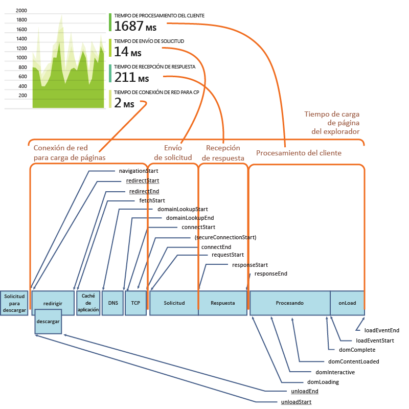

Tenga en cuenta que el tiempo de *conexión de red* es normalmente más bajo de lo que cabría esperar, porque es una media de todas las solicitudes del explorador al servidor. Muchas de las solicitudes individuales tienen un tiempo de conexión de 0 porque ya hay una conexión activa con el servidor.

### Rendimiento por página

Más abajo en la hoja de detalles, hay una cuadrícula segmentada por dirección URL de página:

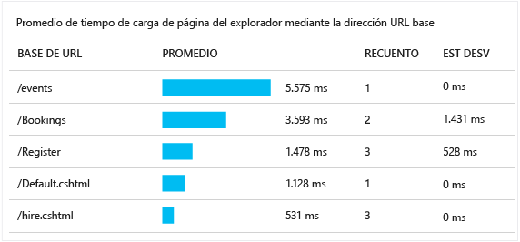

Si quiere ver el rendimiento de las páginas con el paso del tiempo, haga doble clic en la cuadrícula y cambie su tipo de gráfico:

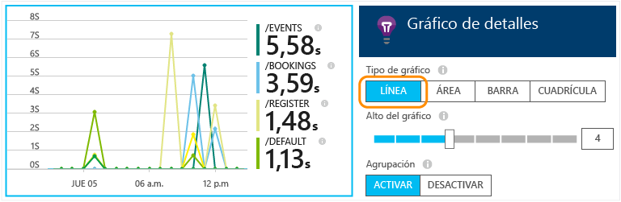

## Información general del uso de clientes

De vuelta en la hoja de información general, haga clic en **Uso**:

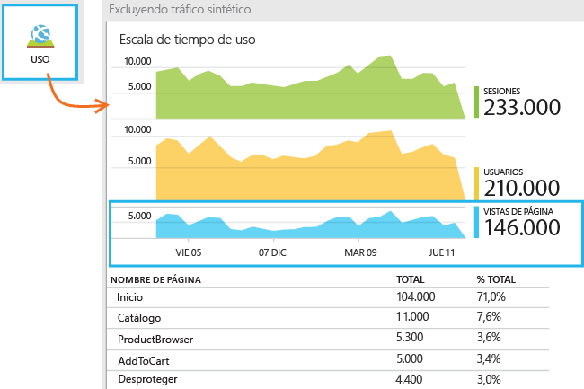

* **Usuarios:**: el número de usuarios diferentes durante el intervalo de tiempo del gráfico. (Las cookies se usan para identificar a los usuarios que vuelven).
* **Sesiones:**: una sesión se cuenta cuando un usuario no ha realizado ninguna solicitud durante 30 minutos.
* **Vistas de página**: cuenta el número de llamadas a trackPageView(), normalmente se llama una vez en cada página web.

### Siga haciendo clic hasta llegar a información más detallada.

Haga clic en cualquiera de los gráficos para ver su contenido con mayor detalle. Observe que puede cambiar el intervalo de tiempo de los gráficos.

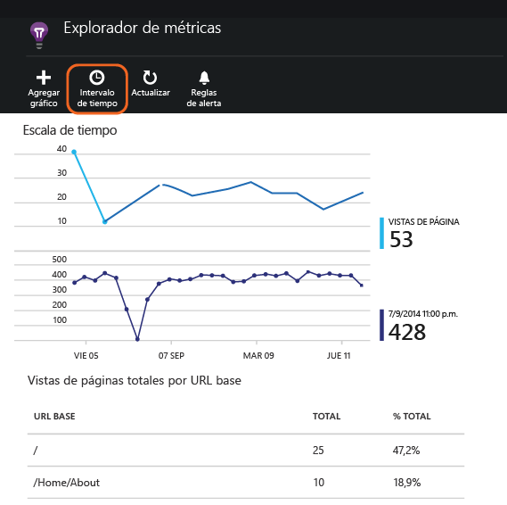

Haga clic en un gráfico para ver otras métricas que se pueden mostrar o agregue un gráfico nuevo y seleccione las métricas que muestra.

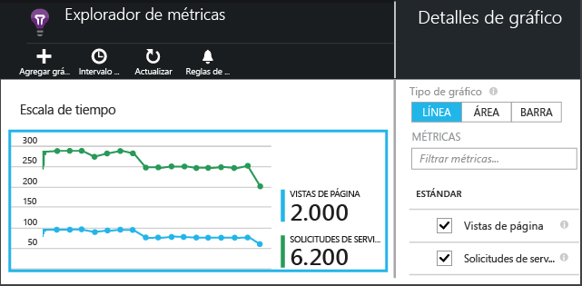

> [AZURE.NOTE] Las métricas solo se pueden mostrar en algunas combinaciones. Cuando selecciona una métrica, se deshabilitan las incompatibles.

## Recuentos de página personalizados

De forma predeterminada, se realiza un recuento de página cada vez que se carga una página nueva en el explorador del cliente. Sin embargo, tal vez quiera realizar un recuento de otras vistas de página. Por ejemplo, una página puede mostrar su contenido en pestañas y a usted puede interesarle realizar el recuento de una página cuando el usuario cambia de pestaña. O el código JavaScript de la página puede cargar contenido nuevo sin cambiar la URL del explorador.

Inserte una llamada de JavaScript como esta en el lugar adecuado del código de cliente:

    appInsights.trackPageView(myPageName);

El nombre de página puede contener los mismos caracteres que una URL, aunque se ignorarán los elementos situados tras "#" o "?".

## Inspección de eventos de vista de página individuales

Por lo general, Application Insights analiza la telemetría de vista de página y usted solo verá informes acumulativos, cuya media se ha calculado en función de todos los usuarios. Pero a efectos de depuración, también puede ver eventos de vista de página individuales.

En la hoja Búsqueda de diagnóstico, establezca Filtros en Vista de página.

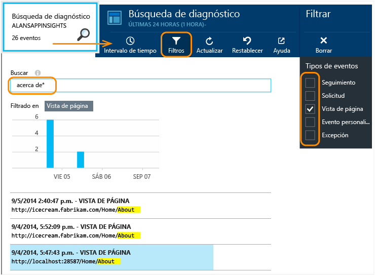

Seleccione el evento que desea ver con mayor detalle. En la página de detalles, haga clic en "..." para ver aún más detalles.

> [AZURE.NOTE] Si usa [Buscar](app-insights-diagnostic-search.md), tenga en cuenta que tiene que hacer coincidir palabras completas: "Acerc" y "cerca de" no coinciden con "Acerca de", pero "Acerca d*" sí lo hace. Tampoco puede iniciar un término de búsqueda con un carácter comodín. Por ejemplo, "*cerc" no coincide con "Acerca".

> [Más información sobre Búsqueda de diagnóstico](app-insights-diagnostic-search.md)

### Propiedades de la vista de página

* **Duración de la vista de página**&#151;Tiempo que se tarda en cargar la página e iniciar la ejecución de scripts. En concreto, el intervalo entre el inicio de la carga de la página y la ejecución de trackPageView. Si mueve trackPageView desde su posición habitual después de la inicialización del script, reflejará un valor diferente.

## Seguimiento de uso personalizado

¿Desea averiguar qué hacen los usuarios con su aplicación? Mediante la inserción de llamadas en el código de cliente y servidor, puede enviar su propia telemetría a Application Insights. Por ejemplo, puede averiguar el número de usuarios que crean pedidos sin completarlos o qué errores de validación aparecen con más frecuencia, o el promedio de puntuación en un juego.

* [Más información sobre las API para eventos y métricas personalizados](app-insights-api-custom-events-metrics.md).
* [Referencia de API](https://github.com/Microsoft/ApplicationInsights-JS/blob/master/API-reference.md)

## Telemetría de servidor

Si no lo ha hecho aún, puede obtener información de su servidor y mostrar los datos junto con los datos del lado cliente, lo que le permite evaluar el rendimiento en el servidor y diagnosticar cualquier problema. Agregue el SDK de Application Insights a la aplicación:

* [Agregar el SDK a una aplicación ASP.NET](app-insights-asp-net.md)
* [Agregar el SDK a una aplicación web Java](app-insights-java-get-started.md)

O bien, si la aplicación web ya está activa, puede agregar telemetría de servidor sin necesidad de compilar o implementar de nuevo:

* [Supervisión de una aplicación ASP.NET activa](app-insights-monitor-performance-live-website-now.md)
* [Supervisión de una aplicación Java activa](app-insights-java-live.md)

##  Vídeo: Seguimiento del uso

> [AZURE.VIDEO tracking-usage-with-application-insights]

##  Pasos siguientes

* [Seguir el uso](app-insights-web-track-usage.md)
* [Eventos y métricas personalizados](app-insights-api-custom-events-metrics.md)
* [Compilación - Métrica - Aprendizaje](app-insights-overview-usage.md)

<!---HONumber=AcomDC_0128_2016-->