<properties 
	pageTitle="Exploración de métricas en Application Insights" 
	description="Interpretación de los gráficos en el Explorador de métricas y personalización de las hojas del Explorador de métricas." 
	services="application-insights" 
    documentationCenter=""
	authors="alancameronwills" 
	manager="douge"/>

<tags 
	ms.service="application-insights" 
	ms.workload="tbd" 
	ms.tgt_pltfrm="ibiza" 
	ms.devlang="na" 
	ms.topic="article" 
	ms.date="11/23/2015" 
	ms.author="awills"/>
 
# Exploración de métricas en Application Insights

Las métricas en [Application Insights][start] son valores medidos y recuentos de eventos que se envían en telemetría desde la aplicación. Ayudar a detectar problemas de rendimiento y a observar las tendencias sobre cómo se utiliza la aplicación. Hay una amplia gama de métricas estándar y también se pueden crear los propios eventos y métricas personalizados.

Los recuentos de métricas y eventos se muestran en los gráficos de valores agregados, como sumas, promedios o recuentos.

Este es un gráfico de ejemplo:

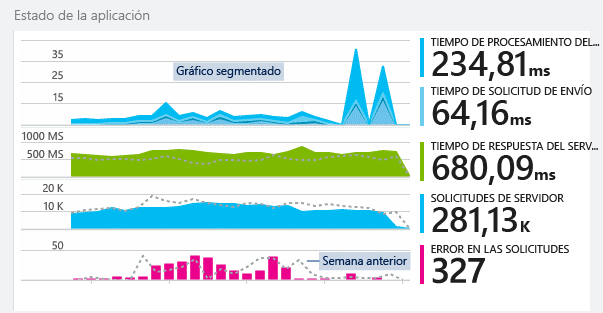

Algunos gráficos se segmentan: la altura total del gráfico en un momento determinado es la suma de las métricas mostradas. De manera predeterminada, la leyenda muestra las cantidades más grandes.

Las líneas de puntos muestran el valor de la métrica de una semana anterior.

## Intervalo de tiempo

En todas las hojas puede cambiar el intervalo de tiempo cubierto por los gráficos o cuadrículas.

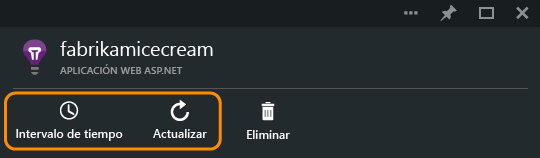

Si espera algunos datos que no ha aparecido todavía, haga clic en Actualizar. Los gráficos se actualizan a intervalos, pero los intervalos son más largos para intervalos de tiempo mayores. En modo de lanzamiento, puede tardar un tiempo que lleguen a través de la canalización de análisis en un gráfico de datos.

Para acercar parte de un gráfico, arrastre el puntero sobre él y, después, haga clic en el símbolo de lupa:

## Valores de granularidad y punto

Mantenga el cursor sobre el gráfico para mostrar los valores de las métricas en ese momento.

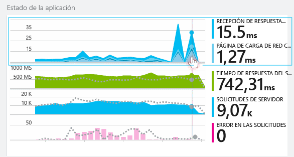

Se agrega el valor de la métrica en un momento determinado en el intervalo de muestreo anterior.

El intervalo de muestreo o "granularidad" se muestra en la parte superior de la hoja.

Puede ajustar la granularidad en la hoja Intervalo de tiempo:

La granularidad disponible depende del intervalo de tiempo que seleccione. Las granularidades explícitas son alternativas a la granularidad "automática" para el intervalo de tiempo.

## Explorador de métricas

Haga clic en cualquier gráfico de la hoja de información general para ver un conjunto más detallado de las cuadrículas y gráficos relacionados. Puede editar estos gráficos y cuadrículas para centrarse en los detalles que más le interesan.

O bien, simplemente puede hacer clic en el botón Explorador de métricas del encabezado de la hoja de información general.

Por ejemplo, haga clic en gráfico de solicitudes con errores de la aplicación web:

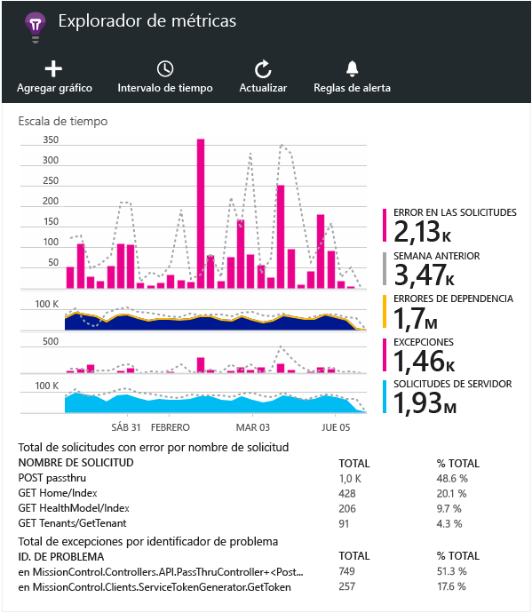

## ¿Qué significan las cifras?

La leyenda del lateral muestra normalmente de forma predeterminada el valor agregado durante el período del gráfico. Si mantiene el mouse sobre el gráfico, muestra el valor en ese momento.

Cada punto de datos en el gráfico es un agregado de los valores de datos recibidos en el intervalo de muestreo anterior o "granularidad". La granularidad se muestra en la parte superior de la hoja y varía en función de la escala de tiempo total del gráfico.

Se agregan métricas diferentes de distintas maneras:

 * **Suma** agrega los valores de todos los puntos de datos recibidos durante el intervalo de muestreo o el período del gráfico.
 * **Media** divide la suma por el número de puntos de datos recibidos durante el intervalo.
 * Los recuentos **únicos** se usan para los recuentos de usuarios y cuentas. Durante el intervalo de muestreo, o durante el período del gráfico, la ilustración muestra el recuento de usuarios diferentes que se ven en ese momento.

Puede cambiar el método de agregación:

El método predeterminado para cada métrica se muestra cuando se crea un nuevo gráfico:

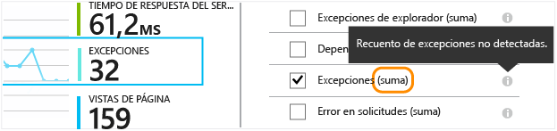

## Edición de gráficos y cuadrículas

Para agregar un nuevo gráfico a la hoja:

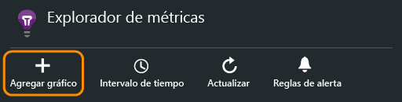

Seleccione un gráfico nuevo o uno existente para editar lo siguiente:

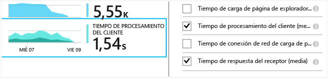

Puede mostrar más de una métrica en un gráfico, aunque hay restricciones sobre las combinaciones que se pueden mostrar juntas. Cuando elija una métrica, algunas otras se deshabilitan.

Si codifica las [métricas personalizadas][track] en la aplicación (llamadas a TrackMetric y TrackEvent), aparecerán aquí.

## Segmentación de los datos

Seleccione un diagrama o cuadrícula, cambie a agrupación y elija una propiedad para agruparla por:

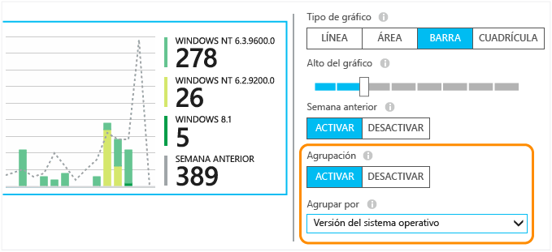

Si codifica las [métricas personalizadas][track] en la aplicación e incluyen los valores de propiedad, podrá seleccionar la propiedad en la lista.

¿Es demasiado pequeño el gráfico para los datos segmentados? Ajuste el alto:

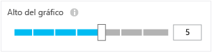

## Filtrado de los datos

Para ver solo las métricas para un conjunto de valores de propiedad seleccionado:

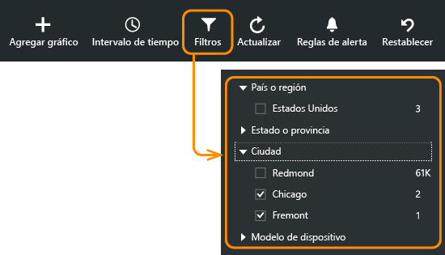

Si no selecciona ningún valor para una propiedad determinada, es lo mismo que seleccionar todas ellas: no hay ningún filtro en esa propiedad.

Observe los recuentos de eventos junto a cada valor de propiedad. Al seleccionar valores de una propiedad, se ajustan los recuentos junto con otros valores de propiedades.

### Para agregar propiedades a la lista de filtros

¿Quiere filtrar telemetría en una categoría de su propia elección? Por ejemplo, quizás divida los usuarios en distintas categorías y quiera segmentar los datos por estas categorías.

[Cree su propia propiedad](app-insights-api-custom-events-metrics.md#properties). Establézcala en un [inicializador de telemetría](app-insights-api-custom-events-metrics.md#telemetry-initializers) para que aparezca en toda la telemetría, incluida la telemetría estándar enviada por diferentes módulos de SDK.

## Supresión de bots y de tráfico de prueba web

Utilice el filtro **Tráfico real o sintético** y active+ **Real**.

También puede filtrar por **Origen del tráfico sintético**.

## Edición del tipo de gráfico

En concreto, tenga en cuenta que puede cambiar entre cuadrículas y gráficos:

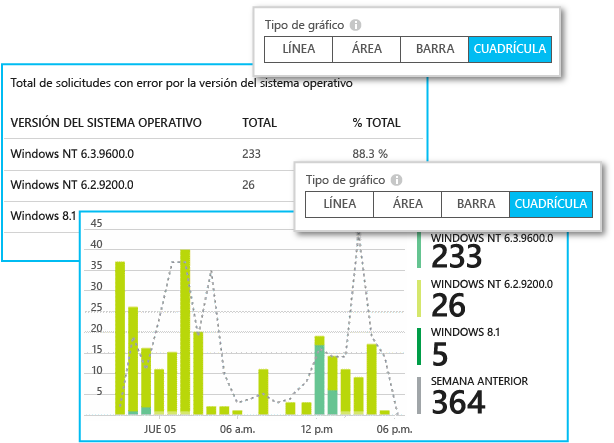

## Almacenamiento de la hoja de métricas

Cuando haya creado algunos gráficos, guárdelos como favorito. Si trabaja en una cuenta de organización, puede elegir si compartirlo con otros miembros del equipo.

Para ver de nuevo la hoja, **vaya a la hoja de información general** y abra Favoritos:

Si eligió el intervalo de tiempo relativo al guardar, la hoja se actualizará con la métrica más reciente. Si eligió el intervalo de tiempo absoluto, mostrará los mismos datos cada vez.

## Restablecimiento de la hoja

Si edita una hoja, pero le gustaría volver al conjunto original guardado, haga clic en Restablecer.

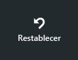

## Establecer alertas

Para recibir notificaciones por correo electrónico de los valores no habituales de cualquier métrica, agregue una alerta. Puede decidir si se debe enviar un mensaje de correo electrónico a los administradores de cuentas o a direcciones de correo electrónico específicas.

[Obtenga más información sobre alertas][alerts].

## Exportación a Excel

Puede exportar a un archivo de Excel los datos de métricas que se muestran en el Explorador de métricas. Entre los datos exportados, se incluyen datos de todos los gráficos y tablas, tal como se muestra en el portal.

Los datos para cada tabla o gráfico se exportan a una hoja independiente en el archivo de Excel.

Lo que se muestra es lo que se exporta. Cambie los filtros o el intervalo de tiempo si desea modificar el intervalo de los datos exportados. Para las tablas, si se muestra el comando para **cargar más datos**, puede hacer clic en él antes de hacer clic en el botón de exportación para que se exporten más datos.

*Actualmente, la función de exportación funciona solo para Internet Explorer y Chrome. Estamos trabajando para incluir compatibilidad con otros exploradores.*

### Exportación continua

Si desea que los datos se exporten continuamente para procesarlos externamente, puede usar la función de [exportación continua](app-insights-export-telemetry.md).

### Power BI

Si quiere obtener vistas aún más sofisticadas de los datos, puede [exportarlos a Power BI](http://blogs.msdn.com/b/powerbi/archive/2015/11/04/explore-your-application-insights-data-with-power-bi.aspx).

## Pasos siguientes

* [Supervisión del uso con Application Insights](app-insights-overview-usage.md)
* [Uso de la Búsqueda de diagnóstico](app-insights-diagnostic-search.md)

<!--Link references-->

[alerts]: app-insights-alerts.md
[start]: app-insights-overview.md
[track]: app-insights-api-custom-events-metrics.md

 

<!---HONumber=AcomDC_1125_2015-->