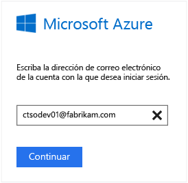
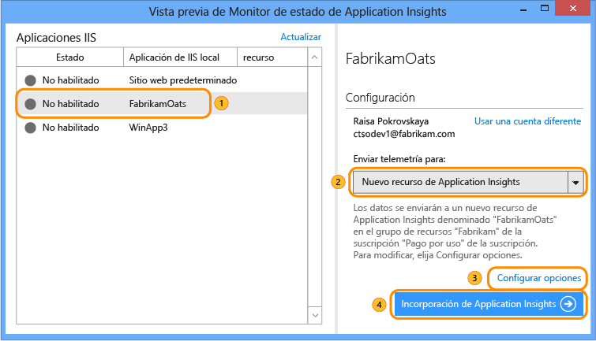
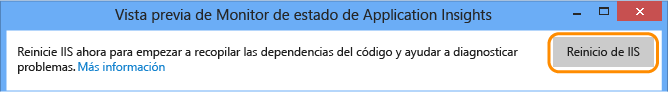
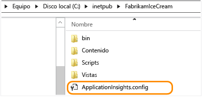
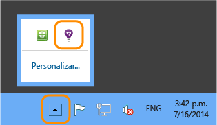
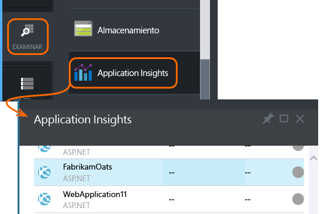
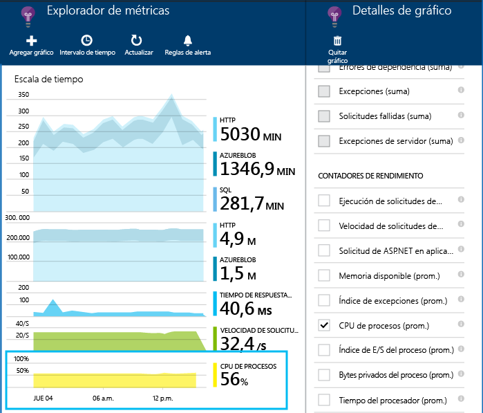
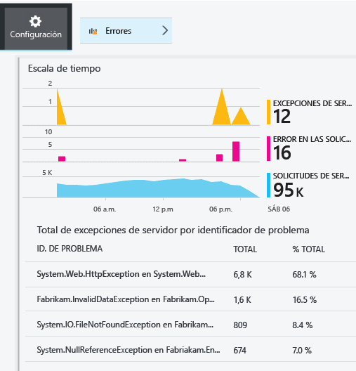
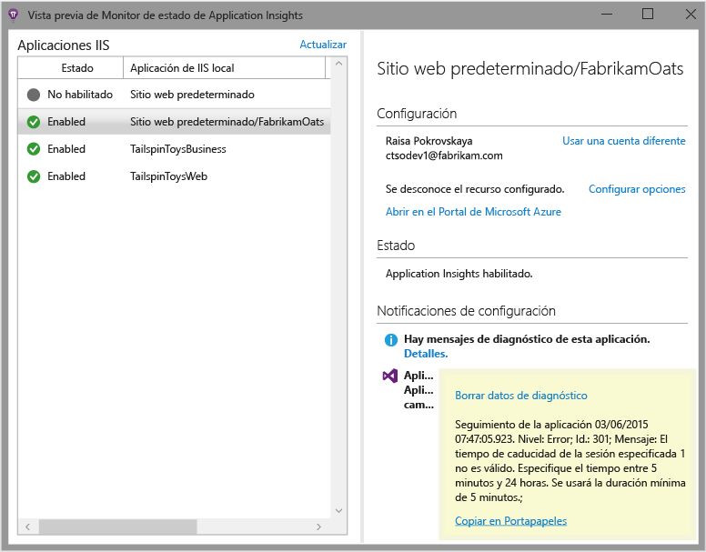

<properties
	pageTitle="Diagnóstico de problemas de rendimiento en un sitio web de IIS en ejecución | Microsoft Azure"
	description="Supervise el rendimiento de un sitio web sin volver a implementarlo. Úselo de forma independiente o con el SDK de Application Insights para obtener la telemetría de dependencia."
	services="application-insights"
    documentationCenter=".net"
	authors="alancameronwills"
	manager="douge"/>

<tags
	ms.service="application-insights"
	ms.workload="tbd"
	ms.tgt_pltfrm="ibiza"
	ms.devlang="na"
	ms.topic="get-started-article"
	ms.date="03/01/2016"
	ms.author="awills"/>

# Instalación del Monitor de estado de Application Insights para supervisar el rendimiento del sitio web

*Application Insights se encuentra en su versión de vista previa.*

El Monitor de estado de Application Insights de Visual Studio permite diagnosticar las excepciones y los problemas de rendimiento de las aplicaciones de ASP.NET.

> [AZURE.TIP] Existen varios artículos sobre cómo configurar [aplicaciones web en directo de J2EE](app-insights-java-live.md) y [Servicios en la nube de Azure](app-insights-cloudservices.md).

Puede optar entre tres formas de aplicar Application Insights a sus aplicaciones web IIS:

* **Tiempo de compilación:** [agregue el SDK de Application Insights][greenbrown] al código de la aplicación web. El resultado obtenido es el siguiente:
 * Un intervalo de telemetría estándar de diagnóstico y uso.
 * La [API de Application Insights][api] le permite escribir su propia telemetría para realizar un seguimiento detallado del uso o diagnosticar problemas.
* **Tiempo de ejecución:** utilice el Monitor de estado para instrumentar su aplicación web en el servidor.
 * Supervise las aplicaciones web que ya se están ejecutando, sin necesidad de volver a compilarlas o publicarlas.
 * Un intervalo de telemetría estándar de diagnóstico y uso.
 * Diagnóstico de dependencia&#151; busque errores o rendimiento deficiente donde su aplicación usa otros componentes, como bases de datos, API de REST u otros servicios.
 * Solucione cualquier problema con la telemetría.
* **Ambos:** compile el SDK en el código de la aplicación web y ejecute el Monitor de estado en el servidor web. Lo mejor de ambos mundos:
 * Telemetría estándar de diagnóstico y uso.
 * Diagnósticos de dependencia.
 * La API le permite escribir telemetría personalizada.
 * Solucione cualquier problema con el SDK y la telemetría.

## Instalación del Monitor de estado de Application Insights

Necesita una suscripción a [Microsoft Azure](http://azure.com)

### Si la aplicación se ejecuta en su servidor IIS

1. En el servidor web IIS, inicie sesión con las credenciales de administrador.
2. Descargue y ejecute el [instalador del Monitor de estado](http://go.microsoft.com/fwlink/?LinkId=506648).
4. En el asistente de instalación, inicie sesión en Microsoft Azure.

    

    *¿Errores de conexión? Consulte [Solución de problemas](#troubleshooting).*

5. Seleccione la aplicación web instalada o el sitio web que desea supervisar y, a continuación, configure el recurso en el cual desea ver los resultados del portal Application Insights.

    

    Normalmente, debe optar por configurar un nuevo recurso y un [grupo de recursos][roles].

    De lo contrario, usará un recurso existente si ya ha configurado [pruebas web][availability] para su sitio, o bien, la [supervisión de cliente web][client].

6. Reinicie IIS.

    

    El servicio web se interrumpirá durante un breve período.

6. Tenga en cuenta que ApplicationInsights.config se ha insertado en las aplicaciones web que desea supervisar.

    

   También hay algunos cambios en web.config.

#### ¿Desea (volver a) configurarlo después?

Una vez completado el asistente, puede volver a configurar el agente siempre que lo desee. También puede utilizarlo si ha instalado el agente pero hay algún problema con la configuración inicial.

### Si la aplicación es una aplicación web de Azure

En el panel de control de la aplicación web de Azure, agregue la extensión Application Insights.

### Si se trata de un proyecto de servicios en la nube de Azure

[Agregar scripts a roles web y de trabajo](app-insights-cloudservices.md)

## Visualización de la telemetría de rendimiento

Inicie sesión en el [Portal de Azure](https://portal.azure.com), examine Application Insights y abra el recurso que ha creado.

Abra la hoja Rendimiento para ver la solicitud, el tiempo de respuesta, la dependencia y otros datos.

Haga clic para ajustar los detalles de lo que se muestra, o agregue un nuevo gráfico.

## Dependencias

El gráfico de duración de dependencia muestra el tiempo que tardan las llamadas desde la aplicación a los componentes externos, como bases de datos, API de REST o almacenamiento de blobs de Azure.

Para segmentar el gráfico por llamadas a diferentes dependencias, seleccione el gráfico, active la agrupación y, luego, elija la dependencia, el tipo de dependencia o el rendimiento de dependencia.

También puede filtrar el gráfico para buscar en un depósito concreto de dependencia, tipo o rendimiento. Haga clic en Filtros.

## Contadores de rendimiento

(No para aplicaciones web de Azure). Haga clic en Servidores en la hoja de información general para ver los gráficos de contadores de rendimiento de servidor, como el uso de memoria y la ocupación de CPU.

Agregue un nuevo gráfico, o haga clic en cualquier gráfico para cambiar lo que se muestra.

También puede [cambiar el conjunto de contadores de rendimiento que se notifican mediante el SDK](app-insights-configuration-with-applicationinsights-config.md#nuget-package-3).

## Excepciones

Puede profundizar en las excepciones específicas (de los últimos siete días) y obtener seguimientos de la pila y datos de contexto.

## Muestreo

Si la aplicación envía una gran cantidad de datos y usa el SDK de Application Insights para ASP.NET versión 2.0.0-beta3 o posterior, la característica de muestreo adaptativo puede operar y enviar solamente un porcentaje de los datos de telemetría. [Aprenda más sobre el muestreo.](app-insights-sampling.md)

## Solución de problemas

### Errores de conexión

Deberá abrir algunos puertos de salida en el firewall del servidor para permitir que el Monitor de estado funcione:

+ Telemetría; estos puertos son necesarios todo el tiempo:
 +	`dc.services.visualstudio.com:80`
 +	`dc.services.visualstudio.com:443`
 +	`dc.applicationinsights.microsoft.com`
+ Configuración; solo son necesarios cuando se realizan cambios:
 -	`management.core.windows.net:443`
 -	`management.azure.com:443`
 -	`login.windows.net:443`
 -	`login.microsoftonline.com:443`
 -	`secure.addcdn.microsoftonline-p.com:443`
 -	`auth.gfx.ms:443`
 -	`login.live.com:443`
+ Instalación:
 +	`packages.nuget.org:443`
 +	`appinsightsstatusmonitor.blob.core.windows.net:80`

Esta lista puede cambiar de forma esporádica.

### ¿No hay telemetría?

  * Utilice su sitio para generar algunos datos.
  * Espere unos minutos a que lleguen los datos y, luego, haga clic en **Actualizar**.
  * Abra la Búsqueda de diagnóstico (icono Buscar) para ver los eventos individuales. Los eventos suelen estar visibles en la Búsqueda de diagnóstico antes de que los datos agregados aparezcan en los gráficos.
  * Abrir el Monitor de estado y seleccione la aplicación en el panel izquierdo. Compruebe si hay algún mensaje de diagnóstico para esta aplicación en la sección "Notificaciones de configuración":

  

  * Asegúrese de que el firewall del servidor permite el tráfico de saliente en los puertos indicados más arriba.
  * En el servidor, si ve en un mensaje acerca de "permisos insuficientes", intente lo siguiente:
    * En el Administrador de IIS, seleccione el grupo de aplicaciones, abra **Configuración avanzada** y en **Modelo de proceso**, anote la identidad.
    * En el panel de control de administración del equipo, agregue esta identidad al grupo Usuarios del monitor de sistema.
  * Si tiene instalado MMA/SCOM en el servidor, algunas versiones pueden entrar en conflicto. Desinstale SCOM y el Monitor de estado y vuelva a instalar las versiones más recientes.
  * Vea [Solución de problemas][qna].

## Requisitos del sistema

Compatibilidad de sistema operativo para el Monitor de estado de Application Insights en servidor:

- Windows Server 2008
- Windows Server 2008 R2
- Windows Server 2012
- Windows Server 2012 R2

con el último Service Pack y .NET Framework 4.0 y 4.5

En Windows 7, 8 y 8.1 del lado cliente, de nuevo con .NET Framework 4.0 y 4.5

La compatibilidad de IIS es: IIS 7, 7.5, 8 y 8.5 (se requiere IIS)

## Pasos siguientes

* [Cree pruebas web][availability] para asegurarse de que el sitio permanece activo.
* [Busque eventos y registros][diagnostic] para ayudar a diagnosticar problemas.
* [Agregue telemetría de cliente web][usage] para ver las excepciones de código de la página web y para que le permitan insertar llamadas de seguimiento.
* [Agregue el SDK de Application Insights SDK al código del servicio web][greenbrown] para que pueda insertar llamadas de seguimiento y registro en el código del servidor.

## Vídeo

#### Supervisión del rendimiento

[AZURE.VIDEO app-insights-performance-monitoring]

<!--Link references-->

[api]: app-insights-api-custom-events-metrics.md
[availability]: app-insights-monitor-web-app-availability.md
[client]: app-insights-javascript.md
[diagnostic]: app-insights-diagnostic-search.md
[greenbrown]: app-insights-asp-net.md
[qna]: app-insights-troubleshoot-faq.md
[roles]: app-insights-resources-roles-access-control.md
[usage]: app-insights-web-track-usage.md

<!----HONumber=AcomDC_0302_2016-->