<properties
	pageTitle="Supervisión de la disponibilidad y la capacidad de respuesta de cualquier sitio web | Microsoft Azure"
	description="Configure pruebas web en Application Insights. Obtenga alertas si un sitio web deja de estar disponible o responde con lentitud."
	services="application-insights"
    documentationCenter=""
	authors="alancameronwills"
	manager="douge"/>

<tags
	ms.service="application-insights"
	ms.workload="tbd"
	ms.tgt_pltfrm="ibiza"
	ms.devlang="na"
	ms.topic="get-started-article"
	ms.date="01/26/2016"
	ms.author="awills"/>

# Supervisión de la disponibilidad y la capacidad de respuesta de cualquier sito web

Después de haber implementado la aplicación web, puede configurar pruebas web para supervisar su disponibilidad y capacidad de respuesta. Application Insights enviará solicitudes web a intervalos regulares desde puntos de todo el mundo y puede alertarle si la aplicación responde lentamente o no responde en absoluto.

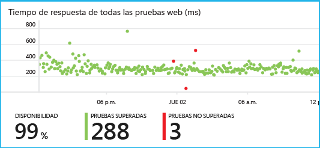

Puede configurar pruebas web para cualquier punto de conexión HTTP o HTTPS que sea accesible desde la red pública de Internet.

Existen dos tipos de prueba web:

* [Prueba de ping de la dirección URL](#set-up-a-url-ping-test): una prueba sencilla que se puede crear en el portal de Azure.
* [Prueba web de varios pasos](#multi-step-web-tests): que se crea en Visual Studio Ultimate o Visual Studio Enterprise y se carga en el portal.

## Configuración de una prueba de ping de la dirección URL

### 1. ¿Crear un nuevo recurso?

Omita este paso si ya ha [configurado un inicio de recurso de Application Insights][start] para esta aplicación y desea ver los datos de disponibilidad en el mismo lugar.

Suscríbase a [Microsoft Azure](http://azure.com), vaya al [portal de Azure](https://portal.azure.com) y cree un nuevo recurso de Application Insights.

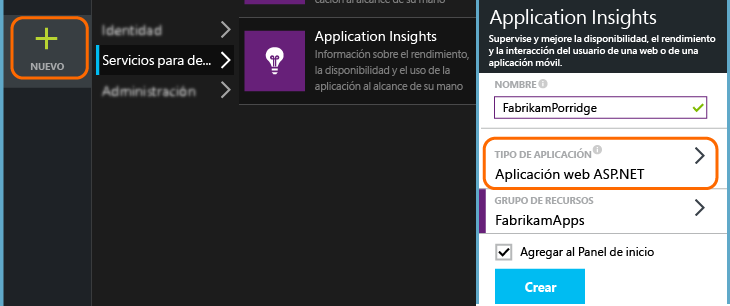

Se abrirá la hoja de información general para el nuevo recurso. Para encontrar esta opción en cualquier momento en el [Portal de Azure](https://portal.azure.com), haga clic en **Examinar**.

### 2. Crear una prueba web

En el recurso de Application Insights, busque el icono de disponibilidad. Haga clic para abrir la hoja de pruebas web para la aplicación y agregue una prueba web.

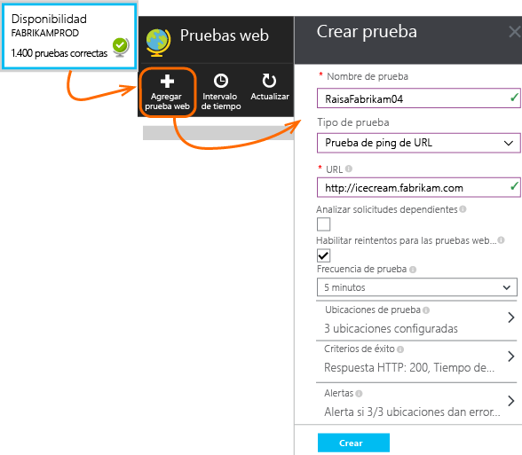

- **La dirección URL** debe ser visible desde la red pública de Internet. Puede incluir una cadena de consulta, así por ejemplo se puede ejercitar un poco la base de datos. Si la dirección URL se resuelve en una redirección, la seguiremos, con un máximo de 10 redirecciones.
- **Analizar solicitudes dependientes**: imágenes, scripts, archivos de estilo y otros recursos de la página se solicitan como parte de la prueba. La prueba da error si todos estos recursos no se pueden descargar correctamente dentro del tiempo de espera de la prueba entera.
- **Habilitar reintentos**: cuando la prueba da error, se reintenta tras un corto intervalo. Se notifica un error únicamente si los tres intentos sucesivos producen un error. Las sucesivas pruebas se realizan según la frecuencia habitual de la prueba. El reintento se suspende temporalmente hasta que uno se complete correctamente. Esta regla se aplica independientemente en cada ubicación de la prueba. (Se recomienda esta configuración. Como media, cerca del 80 % de los errores desaparecen al reintentar).
- **Frecuencia de prueba**: establece la frecuencia con que se ejecuta la prueba desde cada ubicación de prueba. Con una frecuencia de cinco minutos y cinco ubicaciones de prueba, el sitio se prueba cada minuto por término medio.
- Las **ubicaciones de prueba** son los lugares desde donde nuestros servidores envían solicitudes web a la dirección URL. Elija más de una de tal forma que pueda distinguir los problemas del sitio web a partir de los problemas de red. Puede seleccionar hasta 16 ubicaciones.

- **Criterios de éxito**:

    **Tiempo de espera de prueba**: reduzca este valor para recibir una alerta sobre las respuestas lentas. La prueba se considera un error si no se han recibido respuestas de su sitio dentro de este período. Si seleccionó **Analizar solicitudes dependientes**, todas las imágenes, archivos de estilo, scripts y otros recursos dependientes se deben haber recibido durante este período.

    **Respuesta HTTP**: el código de estado devuelto que se considera correcto. 200 es el código que indica que se ha devuelto una página web normal.

    **Coincidencia de contenido**: una cadena, como "Bienvenido". Realizaremos una prueba que tenga lugar en todas las respuestas. Debe ser una cadena sin formato, sin caracteres comodín. No se olvide de que si el contenido cambia, es posible que tenga que actualizarla.

- De forma predeterminada, se le envían **alertas** cuando hay errores en tres ubicaciones durante cinco minutos. Es probable que un error en una ubicación sea un problema de red y no un problema con su sitio. No obstante, puede cambiar el umbral a más o menos sensible, y también puede cambiar las personas a quienes se deben enviar los correos electrónicos.

#### Prueba de más URL

Agregue más pruebas. Por ejemplo, además de probar la página principal, puede asegurarse de que la base de datos se está ejecutando probando la URL con una búsqueda.

### 3. Ver informes de disponibilidad

Después de uno o dos minutos, haga clic en **Actualizar** en la hoja de pruebas de disponibilidad o web. (No se actualiza automáticamente).

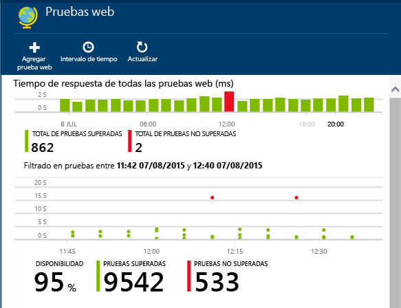

Haga clic en cualquier barra del gráfico de resumen en la parte superior para obtener una vista más detallada de ese período de tiempo.

Estos gráficos combinan los resultados de todas las pruebas web de esta aplicación.

#### Componentes de la página web

Como parte de la prueba se solicitan imágenes, hojas de estilo, scripts y otros componentes estáticos de la página web que está probando.

El tiempo de respuesta registrado es el tiempo necesario para que se complete la carga de todos los componentes.

Si no se puede cargar alguno de los componentes, la prueba se marca con errores.

## Si ve errores...

Haga clic en un punto rojo.

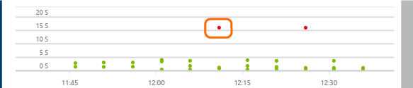

O bien, desplácese hacia abajo y haga clic en una prueba donde vea un éxito de menos del 100%.

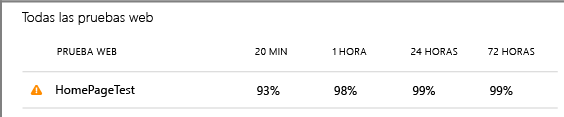

De este modo se muestran los resultados de la prueba.

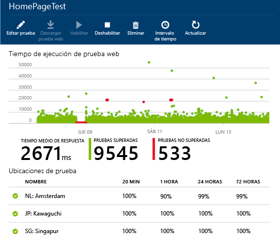

La prueba se ejecuta desde varias ubicaciones, elija una donde los resultados sean inferiores al 100 %.

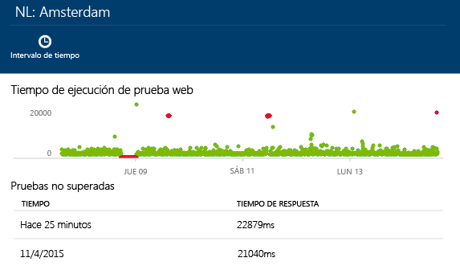

Desplácese hacia abajo hasta las **pruebas con errores** y elija un resultado.

Haga clic en el resultado para evaluarlo en el portal y ver el motivo del error.

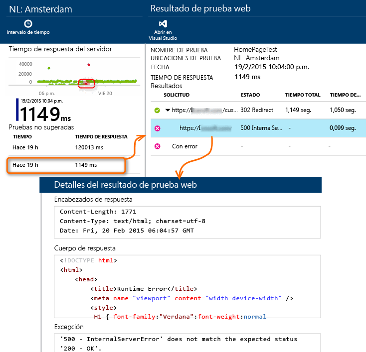

También puede descargar el archivo de resultados e inspeccionarlo en Visual Studio.

*¿Parece que se ha completado correctamente pero se notifica como un error?* Compruebe todas las imágenes, los scripts, las hojas de estilo y cualquier otro archivo cargado por la página. Si se produce un error en cualquiera de ellos, se notificará que la prueba ha concluido con errores, incluso si la página html principal se carga correctamente.

## Pruebas web de varios pasos

Puede supervisar un escenario que implique una secuencia de direcciones URL. Por ejemplo, si está supervisando un sitio web de ventas, puede probar que la incorporación de elementos al carro de la compra funciona correctamente.

Para crear una prueba de varios pasos, grabe el escenario con Visual Studio y, a continuación, cargue la grabación en Application Insights. Application Insights reproducirá el escenario a intervalos y comprobará las respuestas.

Tenga en cuenta que no puede usar funciones codificadas en las pruebas: los pasos del escenario deben incluirse como un script en el archivo .webtest.

#### 1. Grabar un escenario

Utilice Visual Studio Enterprise o Ultimate para grabar una sesión web.

1. Cree un proyecto de prueba de rendimiento web.

    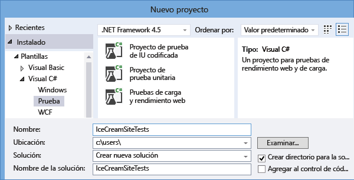

2. Abra el archivo .webtest y empiece a grabar.

    

3. Realice las acciones del usuario que desea simular en la prueba: abra el sitio web, agregue un producto al carro, etc. Después, detenga la prueba.

    

    No cree un escenario largo. Existe un límite de 100 pasos y 2 minutos.

4. Edite la prueba para:
 - Agregar validaciones que comprueben el texto recibido y los códigos de respuesta.
 - Quite las interacciones que sean superfluas. También puede quitar las solicitudes dependientes relacionadas con imágenes o con sitios de anuncios o de seguimiento.

    Recuerde que solo se puede editar el script de prueba: no se puede agregar código personalizado ni llamar a otras pruebas web. No inserte bucles en la prueba. Puede utilizar complementos de prueba web estándar.

5. Ejecute la prueba en Visual Studio para asegurarse de que funciona.

    El ejecutor de pruebas web abre un explorador web y repite las acciones grabadas. Asegúrese de que funciona como se esperaba.

    

#### 2. Cargar la prueba web en Application Insights

1. En el portal de Application Insights, cree una nueva prueba web.

    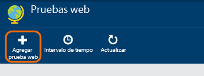

2. Seleccione la prueba de varios pasos y cargue el archivo .webtest.

    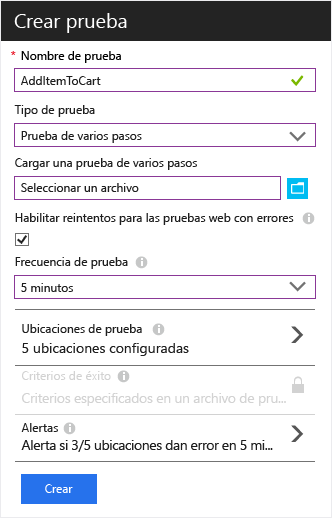

    Establezca las ubicaciones de prueba, la frecuencia y los parámetros de alerta de la misma manera que para las pruebas de ping.

Vea los resultados y los errores de la prueba igual que hace con las pruebas de una sola dirección URL.

Un motivo habitual de error es que la prueba se ejecuta durante demasiado tiempo. No deben ejecutar durante más de dos minutos.

No olvide que todos los recursos de una página se deben cargar correctamente para que la prueba sea correcta, incluidos los scripts, las hojas de estilo, las imágenes, etc.

Tenga en cuenta que la prueba web debe estar contenida totalmente en el archivo .webtest: no puede usar las funciones codificadas en la prueba.

### Conexión de tiempo y números aleatorios a su prueba de varios pasos

Suponga que está probando una herramienta que obtiene datos que dependen del tiempo, como acciones de una fuente externa. Cuando se graba la prueba web, debe utilizar horas específicas, pero las establece como parámetros de la prueba, StartTime y EndTime.

Al ejecutar la prueba, le gustaría que EndTime fuera siempre la hora actual y que StartTime fuera 15 minutos menos.

Los complementos de prueba web proporcionan la manera de hacerlo.

1. Agregue un complemento de prueba de web a cada valor variable que desee. En la barra de herramientas de pruebas web, elija **Agregar complemento de prueba web**.

    

    En este ejemplo, vamos a utilizar dos instancias del complemento de tiempo fecha. Es una instancia para "hace 15 minutos" y otra para "ahora".

2. Abra las propiedades de cada complemento. Asígnele un nombre y configúrelo para utilizar la hora actual. En cada uno de ellos, establezca Añadir minutos = -15.

    

3. En los parámetros de prueba en la web, utilice {{plug-in name}} para hacer referencia al nombre de un complemento.

    

Ahora puede cargar la prueba en el portal. Utilizará los valores dinámicos en cada ejecución de la prueba.

## Inicio de sesión de OAuth

Si los usuarios inician sesión en la aplicación con su contraseña de OAuth (por ejemplo, Microsoft, Google o Facebook), puede simular el inicio de sesión en su prueba web de varios pasos mediante el complemento SAML.

La prueba de ejemplo realiza estos pasos:

1. Pide a la aplicación web sometida a prueba la dirección del punto de conexión de OAuth.
2. Inicia sesión mediante el complemento SAML.
3. Realiza el resto de la prueba en el estado conectado.

El complemento SAML establece una variable `Assert` que se utiliza en el paso 2.

##  Modificación o deshabilitación de una prueba

Abra una prueba individual para editarla o deshabilitarla.

Es posible que desee deshabilitar las pruebas web mientras está realizando un mantenimiento en el servicio.

## ¿Tiene preguntas? ¿Tiene problemas?

* *¿Puedo llamar el código desde mi prueba web?*

    No. Los pasos de la prueba deben encontrarse en el archivo .webtest. Y no se puede llamar a otras pruebas web ni utilizar bucles. Pero hay varios complementos que pueden resultarle útiles.

* *¿Se admite HTTPS?*

    Actualmente, se admiten SSL 3.0 y TLS 1.0.

* *¿Existe alguna diferencia entre las "pruebas web" y las "pruebas de disponibilidad"?*

    Usamos ambos términos de manera intercambiable.

## Vídeo

> [AZURE.VIDEO monitoring-availability-with-application-insights]

## Pasos siguientes

[Búsqueda de registros de diagnóstico][diagnostic]

[Solución de problemas][qna]

<!--Link references-->

[azure-availability]: ../insights-create-web-tests.md
[diagnostic]: app-insights-diagnostic-search.md
[qna]: app-insights-troubleshoot-faq.md
[start]: app-insights-overview.md

<!---HONumber=AcomDC_0204_2016-->