<properties
	pageTitle="Análisis de uso con Application Insights"
	description="Información general del análisis de uso con Application Insights"
	services="application-insights"
    documentationCenter=""
	authors="alancameronwills"
	manager="douge"/>

<tags
	ms.service="application-insights"
	ms.workload="tbd"
	ms.tgt_pltfrm="ibiza"
	ms.devlang="multiple"
	ms.topic="article" 
	ms.date="11/24/2015"
	ms.author="awills"/>

# Análisis de uso con Application Insights

Saber cómo se usa la aplicación permite centrarse en el trabajo de desarrollo en los escenarios que son más importantes, así como obtener información sobre los objetivos que resulten más fáciles o más difíciles de lograr.

Application Insights puede proporcionar una visión clara del uso de la aplicación, lo que ayuda a mejorar la experiencia del usuario y a cumplir sus objetivos empresariales.

Application Insights funciona para aplicaciones independientes (en iOS, Android y Windows) y para aplicaciones web (hospedadas en .NET o J2EE).

## Agregar Application Insights a un proyecto

Para empezar, obtenga una suscripción a [Microsoft Azure](https://azure.com). (Hay una prueba gratuita y, después del período de prueba, puede continuar con el nivel gratuito del servicio).

En el [Portal de Azure](https://portal.azure.com), cree un nuevo recurso de Application Insights. Aquí es donde podrá ver datos de uso y rendimiento sobre la aplicación.

**Si su aplicación es una aplicación de dispositivo**, agregue el SDK de Application Insights al proyecto. El procedimiento exacto varía en función de su [IDE y plataforma](app-insights-platforms.md). Para las aplicaciones de Windows, haga clic con el botón derecho en el proyecto en Visual Studio y elija "Agregar Application Insights".

**Si se trata de una aplicación web**, abra la hoja Inicio rápido y obtenga el fragmento de código para agregar a sus páginas web. Vuelva a publicarlas con este fragmento de código.

También puede agregar Application Insights al código de servidor [ASP.NET](app-insights-asp-net.md) o [J2EE](app-insights-java-get-started.md) con el fin de combinar la telemetría de cliente y servidor.

### Ejecución del proyecto y visualización de los primeros resultados

Ejecute el proyecto en modo de depuración durante unos minutos, a continuación, vaya al [Portal de Azure](https://portal.azure.com) y vaya a los recursos del proyecto en Application Insights.

Publique la aplicación para obtener más telemetría y averiguar qué hacen los usuarios con su aplicación.

## Análisis de fábrica

Haga clic en el icono de vistas de página para ver los detalles de uso.

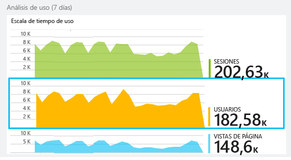

Pase el puntero por la parte en blanco sobre un gráfico para ver los recuentos en un momento determinado. Si no, los números muestran el valor agregado a lo largo del período, como un promedio, un total o un recuento de usuarios diferentes durante el período.

En aplicaciones web, se cuentan los usuarios mediante el uso de cookies. Una persona que utiliza varios exploradores, que borra las cookies o que utiliza la característica de privacidad se contará varias veces.

Se considera una sesión web después de 30 minutos de inactividad. Se considera una sesión en un teléfono u otro dispositivo cuando la aplicación se suspende durante más de unos segundos.

Haga clic en cualquier gráfico para ver su contenido con más detalle. Por ejemplo:

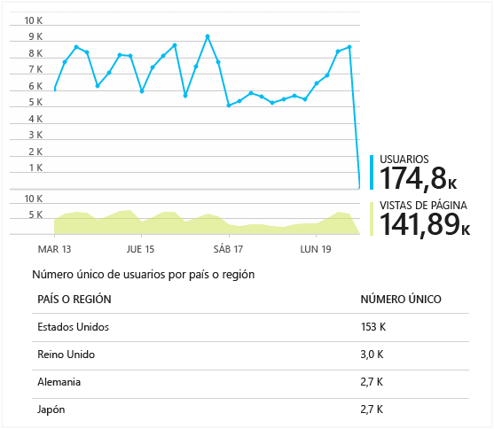

(Este ejemplo es de un sitio web, pero los gráficos son similares para las aplicaciones que se ejecutan en dispositivos).

Compárelo con el de la semana anterior para ver si ha cambiado algo:

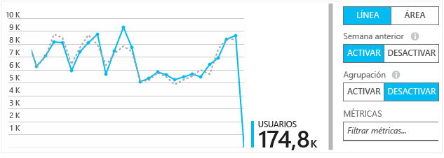

Compare dos métricas, por ejemplo, la de usuarios y la de usuarios nuevos:

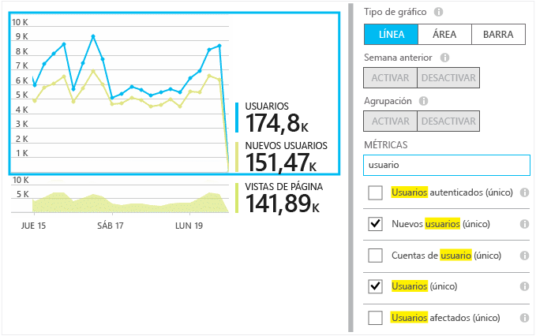

Agrupe (segmente) los datos por una propiedad, como Explorador, Sistema operativo o Ciudad:

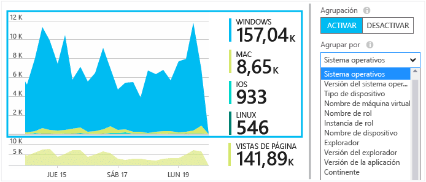

## Uso de las páginas

Haga clic en el icono de vistas de página para obtener un desglose de las páginas más populares:

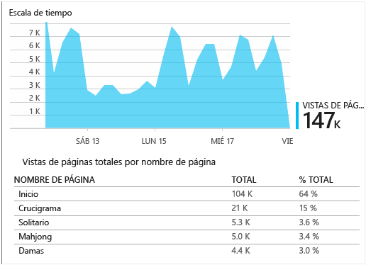

El ejemplo anterior es de un sitio web de juegos. De él se puede deducir al instante:

* El uso no ha mejorado durante la semana anterior. ¿Quizás debemos pensar en la optimización de motor de búsqueda?
* Muchas menos personas consultan las páginas de juegos que la página principal. ¿Por qué nuestra página de inicio no atrae a los jugadores?
* El 'Crucigrama' es el juego más popular. Debemos dar prioridad a nuevas ideas y mejoras.

## Seguimiento personalizado

Supongamos en lugar de implementar cada juego en una página web independiente se decide rediseñar todos para que estén en la misma aplicación de una página, con la mayoría de la funcionalidad codificada como Javascript en la página web. De esta forma el usuario puede cambiar rápidamente de un juego a otro, o incluso tener varios juegos en una sola página.

Pero todavía desea que Application Insights registre el número de veces que se abre cada juego, exactamente igual que cuando estaban en páginas web independientes. Es muy sencillo: inserte una llamada al módulo de telemetría en el JavaScript donde desea registrar que se ha abierto una nueva «página»:

	telemetryClient.trackPageView(game.Name);

## Eventos personalizados

Puede usar la telemetría de muchas maneras para entender cómo se utiliza la aplicación. Pero no siempre desea mezclar los mensajes con vistas de página. En este caso, use eventos personalizados. Puede enviarlos desde aplicaciones de dispositivo, páginas web o un servidor web:

(JavaScript)

    telemetryClient.trackEvent("GameEnd");

(C#)

    var tc = new Microsoft.ApplicationInsights.TelemetryClient();
    tc.TrackEvent("GameEnd");

(VB)

    Dim tc = New Microsoft.ApplicationInsights.TelemetryClient()
    tc.TrackEvent("GameEnd")

Los eventos personalizados más frecuentes se enumeran en la hoja de información general.

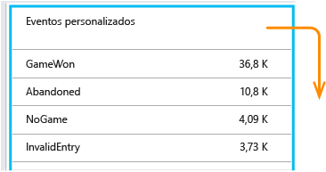

Haga clic en el encabezado de la tabla para ver el número total de eventos. El gráfico se puede segmentar por distintos atributos, como el nombre de evento:

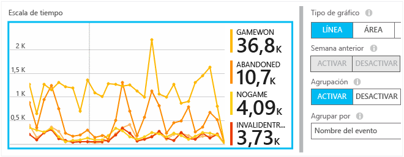

Una característica particularmente útil de escalas de tiempo es que puede correlacionar los cambios con otras métricas y eventos. Por ejemplo, a veces cuando se reproducen más juegos, lo habitual es que espere ver también un aumento de juegos abandonados. Pero el aumento de juegos abandonados es desproporcionado, desea averiguar si la carga alta está causando problemas que los usuarios encuentran inaceptables.

## Profundización en eventos específicos

Para comprender mejor cómo se desarrolla una sesión típica, debe centrarse en una sesión de usuario específica que contenga un tipo determinado de evento.

En este ejemplo, hemos codificado un evento personalizado "NoGame" que se llama si el usuario cierra la sesión sin iniciar un juego. ¿Por qué hace un usuario? Quizá si profundizamos en algunas instancias específicas, obtendremos una pista.

Los eventos personalizados recibidos de la aplicación se enumeran por nombre en la hoja de información general:

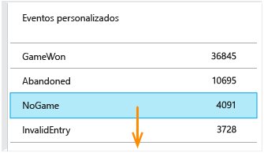

Haga clic en el evento de interés y seleccione una aparición específica reciente:

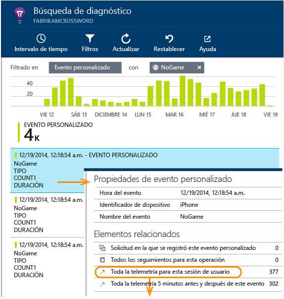

Echemos un vistazo a toda la telemetría de la sesión en la que se produjo un evento NoGame determinado.

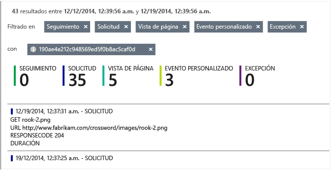

No había ninguna excepción, por lo que no se le impidió al usuario jugar debido a un error.

Podemos filtrar todos los tipos de telemetría excepto las vistas de páginas para esta sesión:

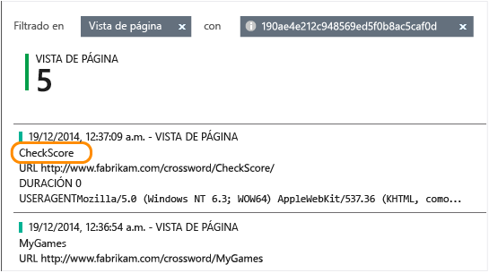

Y ahora podemos comprobar que este usuario se ha conectado simplemente para comprobar los últimos resultados. Tal vez haya que desarrollar un caso de usuario que facilite esta comprobación. (Y debemos implementar un evento personalizado para informar cuando se produzca este caso específico).

## Filtrar, buscar y segmentar los datos con propiedades
Puede adjuntar etiquetas arbitrarias y valores numéricos a los eventos.

JavaScript en el cliente

    appInsights.trackEvent("WinGame",
        // String properties:
        {Game: currentGame.name, Difficulty: currentGame.difficulty},
        // Numeric measurements:
        {Score: currentGame.score, Opponents: currentGame.opponentCount}
    );

C# en el servidor

    // Set up some properties:
    var properties = new Dictionary <string, string>
        {{"game", currentGame.Name}, {"difficulty", currentGame.Difficulty}};
    var measurements = new Dictionary <string, double>
        {{"Score", currentGame.Score}, {"Opponents", currentGame.OpponentCount}};

    // Send the event:
    telemetry.TrackEvent("WinGame", properties, measurements);

VB en el servidor

    ' Set up some properties:
    Dim properties = New Dictionary (Of String, String)
    properties.Add("game", currentGame.Name)
    properties.Add("difficulty", currentGame.Difficulty)

    Dim measurements = New Dictionary (Of String, Double)
    measurements.Add("Score", currentGame.Score)
    measurements.Add("Opponents", currentGame.OpponentCount)

    ' Send the event:
    telemetry.TrackEvent("WinGame", properties, measurements)

Asocie propiedades a vistas de página de la misma manera:

JavaScript en el cliente

    appInsights.trackPageView("Win",
        {Game: currentGame.Name},
        {Score: currentGame.Score});

En Búsqueda de diagnóstico, vea las propiedades haciendo clic a través de una única repetición de un evento.

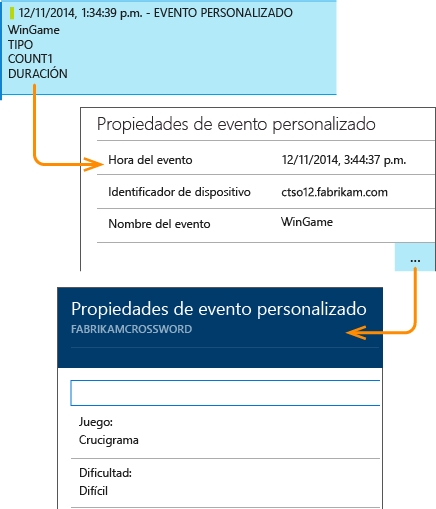

Utilice el campo de búsqueda para ver las apariciones del evento con un valor de propiedad concreto.

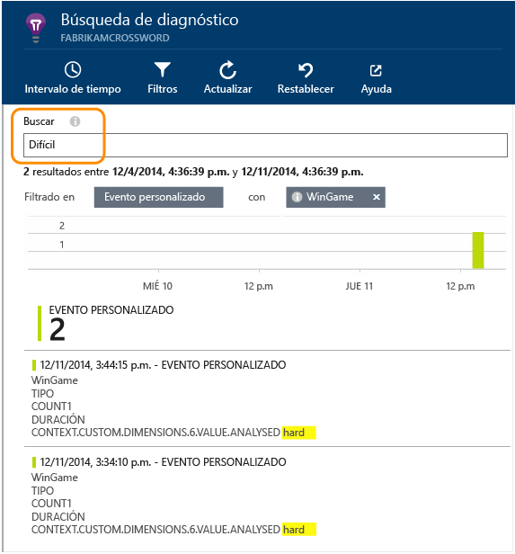

## Prueba A | B

Si no conoce qué variante de una característica tendrá más éxito, publique ambas para que estén accesibles a los diferentes usuarios. Mida el éxito de cada una y, a continuación, cambie a una versión unificada.

Para realizar esta técnica, adjunte etiquetas distintas a toda la telemetría que se envía con cada versión de la aplicación. Puede hacerlo al definir las propiedades en el TelemetryContext activo. Estas propiedades predeterminadas se agregan a cada mensaje de telemetría que envía la aplicación: no solo los mensajes personalizados, sino también la telemetría estándar.

En el portal de Application Insights, podrá filtrar y agrupar (segmentar) los datos en las etiquetas, con el fin de comparar las distintas versiones.

C# en el servidor

    using Microsoft.ApplicationInsights.DataContracts;

    var context = new TelemetryContext();
    context.Properties["Game"] = currentGame.Name;
    var telemetry = new TelemetryClient(context);
    // Now all telemetry will automatically be sent with the context property:
    telemetry.TrackEvent("WinGame");

VB en el servidor

    Dim context = New TelemetryContext
    context.Properties("Game") = currentGame.Name
    Dim telemetry = New TelemetryClient(context)
    ' Now all telemetry will automatically be sent with the context property:
    telemetry.TrackEvent("WinGame")

La telemetría individual puede invalidar los valores predeterminados.

Puede configurar un inicializador universal para que todos los TelemetryClients nuevos usen automáticamente el contexto.

    // Telemetry initializer class
    public class MyTelemetryInitializer : IContextInitializer
    {
        public void Initialize (TelemetryContext context)
        {
            context.Properties["AppVersion"] = "v2.1";
        }
    }

En el inicializador de la aplicación como Global.asax.cs:

    protected void Application_Start()
    {
        // ...
        TelemetryConfiguration.Active.ContextInitializers
        .Add(new MyTelemetryInitializer());
    }

## Compilación - Métrica - Aprendizaje

Cuando se utiliza el análisis, se convierte en una parte integrada de su ciclo de desarrollo, no solo en algo que se cree que puede ayudar a solucionar problemas. A continuación se incluyen algunas sugerencias:

* Determine la métrica clave de la aplicación. ¿Desea tantos usuarios como sea posible o preferiría un pequeño conjunto de usuarios satisfechos? ¿Desea potenciar al máximo las visitas o las ventas?
* Planee la medición de cada caso. Cuando esboza un nuevo caso de usuario o característica o planea actualizar uno existente, siempre piensa cómo medirá el éxito del cambio. Antes de que se inicie la codificación, pregunte "¿Qué efecto tendrá en nuestras estadísticas, si funciona? ¿Debemos realizar el seguimiento cualquier evento nuevo?" Y, por supuesto, cuando se activa la característica, asegúrese de mirar el análisis y actuar en los resultados.
* Relacione otras métricas con la métrica clave. Por ejemplo, si agrega una característica "Favoritos", le gustaría saber con qué frecuencia los usuarios agregan favoritos. Pero quizás sea más interesante saber con qué frecuencia vuelven a sus favoritos. Y lo más importante, los clientes que usan favoritos ¿compran al final más de su producto?
* Pruebas de valor controlado. Configure un modificador de característica que permite que una nueva característica sea visible solo para algunos usuarios. Use Application Insights para ver si se utiliza la nueva característica de la manera que había previsto. Realice ajustes y publíquelos para una audiencia más amplia.
* Hable con los usuarios. El análisis no es suficiente por sí solo, pero es una herramienta complementaria para mantener una excelente relación con el cliente.

## Más información

* [Detección, clasificación y diagnóstico de errores y problemas de rendimiento en su aplicación](app-insights-detect-triage-diagnose.md)
* [Introducción a Application Insights en muchas plataformas.](app-insights-detect-triage-diagnose.md)

## Vídeo

> [AZURE.VIDEO usage-monitoring-application-insights]

 

<!---HONumber=AcomDC_0128_2016-->