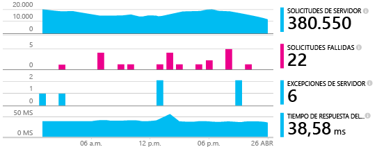
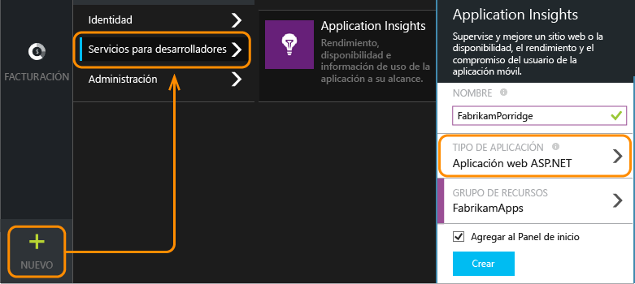
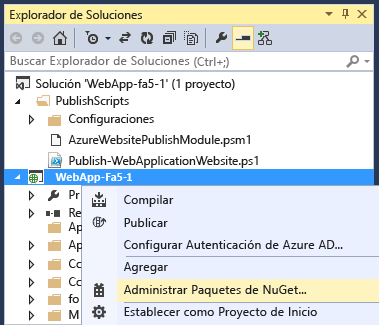
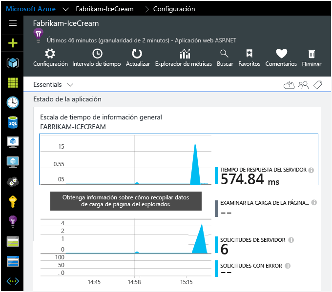
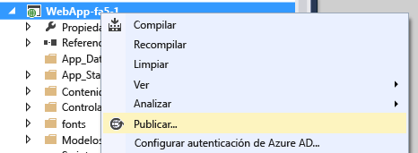
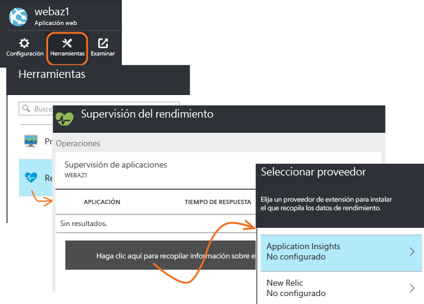

<properties
	pageTitle="Incorporación del SDK de Application Insights para supervisar la aplicación de ASP.NET | Microsoft Azure"
	description="Analice el uso, la disponibilidad y el rendimiento de su aplicación web de Microsoft Azure o local con Application Insights."
	services="application-insights"
    documentationCenter=".net"
	authors="alancameronwills"
	manager="douge"/>

<tags
	ms.service="application-insights"
	ms.workload="tbd"
	ms.tgt_pltfrm="ibiza"
	ms.devlang="na"
	ms.topic="get-started-article"
	ms.date="10/04/2015"
	ms.author="awills"/>


# Incorporación del SDK de Application Insights para supervisar la aplicación de ASP.NET

*Application Insights se encuentra en su versión de vista previa.*

[AZURE.INCLUDE [app-insights-selector-get-started](../../includes/app-insights-selector-get-started.md)]


Application Insights de Visual Studio supervisa su aplicación activa para ayudarle a [detectar y diagnosticar problemas y excepciones de rendimiento][detect], y [descubrir cómo se usa la aplicación][knowUsers]. Se puede usar con una amplia variedad de tipos de aplicación. Funciona con las aplicaciones hospedadas en máquinas virtuales de Azure o en sus servidores IIS locales propios, así como con las aplicaciones web de Azure.




*Consulte también:*

* [ASP.NET 5](app-insights-asp-net-five.md)
* [Aplicaciones para dispositivos y servidores Java][platforms]

#### Antes de comenzar

En muchos tipos de aplicaciones, [Visual Studio puede agregar Application Insights a la aplicación en cuestión](#ide) casi sin que usted se dé cuenta. Sin embargo, puesto que está leyendo esto para entender mejor el proceso, le guiaremos a través de los pasos manualmente.


Necesita:

* Una suscripción a [Microsoft Azure](http://azure.com). Si su equipo u organización tiene una suscripción a Azure, el propietario puede agregarle a esta con su [cuenta Microsoft](http://live.com).
* Visual Studio 2013 o posterior.

## <a name="add"></a> 1. Creación de recursos en Application Insights

Inicie sesión en el [Portal de Azure][portal] y cree un nuevo recurso de Application Insights. Elija ASP.NET como tipo de aplicación.



Un [recurso][roles] de Azure es una instancia de un servicio. Este recurso es donde se le presentará telemetría de su aplicación analizada.

La elección del tipo de aplicación establece el contenido predeterminado de las hojas de recursos y las propiedades que estarán visibles en el [Explorador de métricas][metrics].

#### Copia de la clave de instrumentación

La clave identifica al recurso y se instalará pronto en el SDK para dirigir los datos al recurso.


Los pasos que acaba de realizar para crear un recurso nuevo son una excelente manera de comenzar a supervisar cualquier aplicación. Ahora puede enviarle datos.

## <a name="sdk"></a> 2. Instale el SDK en su aplicación.

Instalar y configurar el SDK de Application Insights varía en función de la plataforma en la que trabaja. En el caso de las aplicaciones de ASP.NET, es fácil.

1. En Visual Studio, edite los paquetes de NuGet de su proyecto de aplicación web.

    

2. Instale el SDK de Application Insights para aplicaciones web.

    

3. Edite ApplicationInsights.config (que la instalación de NuGet agregó). Inserte esto justo antes de la etiqueta de cierre:

    `<InstrumentationKey>` *la clave de instrumentación que copió* `</InstrumentationKey>`

    (Asimismo, puede [establecer la clave escribiendo código][apikey] en su aplicación.)

#### Para actualizar a futuras versiones del SDK

De vez en cuando, lanzamos una versión nueva del SDK.

Para actualizar a una [nueva versión del SDK](app-insights-release-notes-dotnet.md), vuelva a abrir el Administrador de paquetes de NuGet y filtre los paquetes instalados. Seleccione **Microsoft.ApplicationInsights.Web** y elija **Actualizar**.

Si ha realizado personalizaciones en ApplicationInsights.config, guarde una copia del mismo antes de actualizar y después combine los cambios en la nueva versión.


## <a name="run"></a> 3. Ejecución del proyecto

Use **F5** para ejecutar la aplicación y pruébela. Abra varias páginas para generar telemetría.

En Visual Studio, aparecerá un recuento de los eventos que se han enviado.


## <a name="monitor"></a> 4. Visualización de la telemetría

Vuelva al [Portal de Azure][portal] y busque el recurso de Application Insights.


Busque los datos en los gráficos de Información general. Al principio, solo aparecerán uno o dos puntos. Por ejemplo:



Haga clic en cualquier gráfico para ver métricas más detalladas. [Más información acerca de las métricas][perf]

#### ¿No hay datos?

* Use la aplicación y abra varias páginas para generar telemetría.
* Abra el icono [Buscar][diagnostic] para ver los eventos individuales. A veces, los eventos tardan un poco en llegar a través de la canalización de métricas.
* Espere unos segundos y haga clic en **Actualizar**. Los gráficos se actualizan automáticamente de forma periódica, pero puede actualizarlos manualmente si espera que aparezcan algunos datos.
* Vea [Solución de problemas][qna].

## Publicación de la aplicación

Implemente ahora la aplicación en IIS o en Azure y observe cómo se acumulan los datos.



Si se trabaja en modo de depuración, la telemetría se agiliza a través de la canalización y los datos aparecen en cuestión de segundos. Al implementar la aplicación en la configuración de lanzamiento, los datos se acumulan más lentamente.

#### ¿No hay datos después de publicar en el servidor?

Abra estos puertos para el tráfico de salida en el firewall del servidor:

+ `dc.services.visualstudio.com:443`
+ `f5.services.visualstudio.com:443`


#### ¿Tiene problemas el servidor de compilación?

Consulte [este apartado de la solución de problemas](app-insights-troubleshoot-faq.md#NuGetBuild).

> [AZURE.NOTE]Si la aplicación genera muchos datos de telemetría (y está usando la versión 2.0.0-beta3, o una posterior, del SDK de ASP.NET), el módulo de muestreo adaptable reducirá automáticamente el volumen que se envía al portal mediante el envío de solamente una fracción representativa de los eventos. Sin embargo, los eventos relacionados con la misma solicitud se seleccionarán o se anulará su selección como grupo, por lo que puede navegar entre ellos. [Más información sobre el muestreo](app-insights-sampling.md).


## 5\. Agregar seguimiento de dependencias (y contadores de rendimiento de IIS)

El SDK necesita un poco de ayuda para obtener acceso a algunos datos. En concreto, este paso adicional será necesario para medir automáticamente las llamadas de la aplicación a las bases de datos, las API de REST y otros componentes externos. Estas métricas de dependencia pueden ser inestimables para ayudar a diagnosticar problemas de rendimiento.

Si realiza la ejecución en su propio servidor IIS, este paso también permitirá que los contadores de rendimiento del sistema se muestren en el [Explorador de métricas](app-insights-metrics-explorer.md).

#### Si la aplicación se ejecuta en su servidor IIS

Inicie sesión en el servidor con derechos de administrador e instale el [Monitor de estado de Application Insights](http://go.microsoft.com/fwlink/?LinkId=506648).

Puede que tenga que [abrir otros puertos de salida en el firewall](app-insights-monitor-performance-live-website-now.md#troubleshooting).

Este paso también permite [generar informes de contadores de rendimiento](app-insights-web-monitor-performance.md#system-performance-counters) como ocupación de red, de memoria o de CPU.

#### Si la aplicación es una aplicación web de Azure

En el panel de control de la aplicación web de Azure, agregue la extensión Application Insights.




#### Si se trata de un proyecto de servicios en la nube de Azure

[Agregar scripts a roles web y de trabajo](app-insights-cloudservices.md).


## 6\. Adición de la supervisión del lado cliente

Instaló el SDK que envía datos de telemetría desde el servidor (back-end) de la aplicación. Ahora puede agregar la supervisión del lado cliente. Esto proporciona datos sobre usuarios, sesiones, vistas de página y cualquier excepción o bloqueo que se produce en el explorador. También podrá escribir su propio código para realizar un seguimiento de cómo trabajan los usuarios con su aplicación, hasta el nivel detallado de clics y pulsaciones de teclas.


Agregue un fragmento de código de JavaScript a cada página. Obtenga el código del recurso de Application Insights:


Observe que el código contiene la clave de instrumentación que identifica al recurso de la aplicación.

[Obtenga más información sobre el seguimiento de páginas web.](app-insights-web-track-usage.md)


## Versión de la aplicación de seguimiento

Asegúrese de que el proceso de MSBuild genera `buildinfo.config`. En su archivo .csproj, agregue:

```XML

    <PropertyGroup>
      <GenerateBuildInfoConfigFile>true</GenerateBuildInfoConfigFile>    <IncludeServerNameInBuildInfo>true</IncludeServerNameInBuildInfo>
    </PropertyGroup> 
```

Cuando tenga la información de la compilación, el módulo web de Application Insights agregará automáticamente la **versión de la aplicación** como una propiedad a cada elemento de telemetría. Eso le permite filtrar por versión al realizar [búsquedas de diagnósticos][diagnostic] o al [explorar métricas][metrics].

Sin embargo, tenga en cuenta que el número de versión de compilación la genera únicamente MS Build, no la compilación de desarrollador en Visual Studio.

## 7\. Finalización de la instalación.

Para obtener la vista completa de 360 grados de la aplicación, debe realizar algunas tareas adicionales:

* [Configure las pruebas web][availability] para comprobar que la aplicación efectivamente está activa y responde adecuadamente.
* [Captura del seguimientos de registros][netlogs] de su marco de registro de favoritos
* [Realice el seguimiento de métricas y eventos personalizado][api] en el cliente, en el servidor o en ambos para obtener más información acerca de cómo se usa la aplicación.

## <a name="ide"></a> La forma automatizada

Al comienzo del presente artículo, indicamos que le mostraríamos la forma manual de crear un recurso de Application Insights y luego instalar el SDK. Creemos que es recomendable comprender las dos partes de ese procedimiento. Sin embargo, para las aplicaciones de ASP.NET (y muchas otras), existen una manera automatizada incluso más rápida.

Se requiere [Visual Studio](http://go.microsoft.com/fwlink/?linkid=397827&clcid=0x409) (2013 Update 3 o posterior) y una cuenta en [Microsoft Azure](http://azure.com).

#### Si se trata de un proyecto nuevo:

Cuando cree un nuevo proyecto en Visual Studio, asegúrese de que la opción **Agregar Application Insights** está seleccionada.


Visual Studio crea un recurso en Application Insights, agrega el SDK al proyecto y coloca la clave en el `.config` archivo.

Si el proyecto tiene páginas web, también agrega el [SDK de JavaScript][client] a la página web principal.

#### ....o si se trata de un proyecto existente

Haga clic con el botón derecho en el Explorador de soluciones y seleccione **Agregar Application Insights**.


Visual Studio crea un recurso en Application Insights, agrega el SDK al proyecto y coloca la clave en el `.config` archivo.

En este caso, no se agrega el [SDK de JavaScript][client] a las páginas web: le recomendamos que lo haga en el paso siguiente.

#### Opciones de configuración

La primera vez deberá iniciar sesión o registrarse en Microsoft Azure en vista previa.

Si esta aplicación forma parte de una aplicación mayor, es posible que quiera usar **Configurar valor** para colocarla en el mismo grupo de recursos que los demás componentes.

*¿No encuentra la opción Application Insights? Compruebe que está usando Visual Studio 2013 Update 3 o posterior y que las herramientas de Application Insights se encuentran habilitadas en Extensiones y actualizaciones.*

#### Abrir Application Insights desde un proyecto


## <a name="video"></a>Vídeo

> [AZURE.VIDEO getting-started-with-application-insights]


<!--Link references-->

[api]: app-insights-api-custom-events-metrics.md
[apikey]: app-insights-api-custom-events-metrics.md#ikey
[availability]: app-insights-monitor-web-app-availability.md
[azure]: ../insights-perf-analytics.md
[client]: app-insights-javascript.md
[detect]: app-insights-detect-triage-diagnose.md
[diagnostic]: app-insights-diagnostic-search.md
[knowUsers]: app-insights-overview-usage.md
[metrics]: app-insights-metrics-explorer.md
[netlogs]: app-insights-asp-net-trace-logs.md
[perf]: app-insights-web-monitor-performance.md
[platforms]: app-insights-platforms.md
[portal]: http://portal.azure.com/
[qna]: app-insights-troubleshoot-faq.md
[redfield]: app-insights-monitor-performance-live-website-now.md
[roles]: app-insights-resources-roles-access-control.md
[start]: app-insights-overview.md

<!---HONumber=AcomDC_1203_2015-->