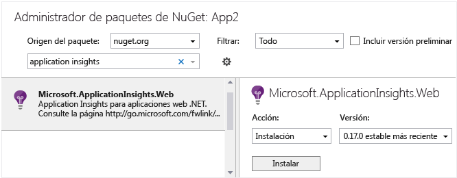

<properties 
	pageTitle="Application Insights para servicios y aplicaciones de escritorio de Windows" 
	description="Analice el uso y el rendimiento de la aplicación de escritorio de Windows con Application Insights." 
	services="application-insights" 
    documentationCenter="windows"
	authors="alancameronwills" 
	manager="douge"/>

<tags 
	ms.service="application-insights" 
	ms.workload="tbd" 
	ms.tgt_pltfrm="ibiza" 
	ms.devlang="na" 
	ms.topic="article" 
	ms.date="01/15/2016" 
	ms.author="awills"/>

# Application Insights en servicios, aplicaciones y roles de trabajo de escritorio de Windows

*Application Insights se encuentra en su versión de vista previa.*

[AZURE.INCLUDE [app-insights-selector-get-started](../../includes/app-insights-selector-get-started.md)]

Application Insights permite supervisar el uso y rendimiento de la aplicación implementada.

Todas las aplicaciones de Windows (incluidas las aplicaciones de escritorio, los servicios en segundo plano y los roles de trabajo) pueden usar el SDK de Application Insights para enviar telemetría a Application Insights. También puede agregar el SDK de Application Insights a un proyecto de biblioteca de clases.

Puede elegir qué recopiladores de datos estándar desea usar (por ejemplo, para supervisar contadores de rendimiento o llamadas de dependencia), o simplemente usar la API principal y escribir su propia telemetría.


## <a name="add"></a> Creación de recursos en Application Insights


1.  En el [portal de Azure][portal], cree un nuevo recurso de Application Insights. Para el tipo de aplicación, elija Aplicación de la Tienda Windows. 

    

    (Su elección del tipo de aplicación establece el contenido de la hoja de información general así como de las propiedades disponibles en el [explorador de métricas][metrics]).

2.  Realice una copia de la clave de instrumentación. Busque la clave en la lista desplegable Essentials del recurso que acaba de crear.

    

## <a name="sdk"></a>Instalación del SDK en la aplicación


1. En Visual Studio, edite los paquetes de NuGet de su proyecto de aplicación de escritorio.

    

2. Instale el paquete Application Insights Windows Server: Microsoft.ApplicationInsights.WindowsServer.

    

    *¿Puedo usar otros paquetes?*

    Sí. Elija la API principal (Microsoft.ApplicationInsights) si solo desea usar la API para enviar su propia telemetría. El paquete de Windows Server incluye automáticamente la API principal más otra serie de paquetes, como la recopilación de contadores de rendimiento y la supervisión de dependencias.

    (Pero no use Microsoft.ApplicationInsights.Windows que está destinado a aplicaciones de la Tienda Windows.)

3. Establezca InstrumentationKey

    * Si solo instaló el paquete de la API principal Microsoft.ApplicationInsights, debe establecer la clave en código, por ejemplo en main(): 

    `TelemetryConfiguration.Active.InstrumentationKey = "` **su clave** `";`

    Si instaló uno de los otros paquetes, puede establecer la clave mediante código o establecerla en ApplicationInsights.config:
 
    `<InstrumentationKey>`*su clave*`</InstrumentationKey>`

    Si usa ApplicationInsights.config, asegúrese de que sus propiedades en el Explorador de soluciones se establecen en **Acción de compilación = Contenido, Copiar en el directorio de salida = Copiar**.

## <a name="telemetry"></a>Inserción de llamadas de telemetría

Cree una instancia `TelemetryClient` y después [utilícela para enviar telemetría][api].


Por ejemplo, en una aplicación de Windows Forms, podría escribir:

```C#

    public partial class Form1 : Form
    {
        private TelemetryClient tc = new TelemetryClient();
        ...
        private void Form1_Load(object sender, EventArgs e)
        {
            // Alternative to setting ikey in config file:
            tc.InstrumentationKey = "key copied from portal";

            // Set session data:
            tc.Context.User.Id = Environment.GetUserName();
            tc.Context.Session.Id = Guid.NewGuid().ToString();
            tc.Context.Device.OperatingSystem = Environment.OSVersion.ToString();

            // Log a page view:
            tc.TrackPageView("Form1");
            ...
        }

        protected override void OnClosing(CancelEventArgs e)
        {
            stop = true;
            if (tc != null)
            {
                tc.Flush(); // only for desktop apps

                // Allow time for flushing:
                System.Threading.Thread.Sleep(1000);
            }
            base.OnClosing(e);
        }

```

Utilice cualquiera de las [API de Application Insights][api] para enviar telemetría. Si usa la API principal, la telemetría no se envía automáticamente. Normalmente se usaría:

* `TrackPageView(pageName)` al cambiar formularios, páginas o pestañas
* `TrackEvent(eventName)` para otras acciones de usuario
* `TrackMetric(name, value)` en una tarea en segundo plano para enviar informes periódicos de métricas no asociados a eventos específicos.
* `TrackTrace(logEvent)` para [registro de diagnósticos][diagnostic]
* `TrackException(exception)` en cláusulas catch
* `Flush()` para asegurarse de que toda la telemetría se envía antes de cerrar la aplicación. Úselo solo si está usando simplemente la API principal (Microsoft.ApplicationInsights). Los SDK web implementan este comportamiento automáticamente. (Si la aplicación se ejecuta en contextos donde Internet no está siempre disponible, consulte también [Canal de persistencia](#persistence-channel).)


#### Inicializadores de contexto

Para ver los recuentos de usuarios y sesiones, puede establecer los valores en cada instancia `TelemetryClient`. Como alternativa, puede utilizar un inicializador de contexto para realizar esta adición para todos los clientes:

```C#

    class UserSessionInitializer: IContextInitializer
    {
        public void Initialize(TelemetryContext context)
        {
            context.User.Id = Environment.UserName;
            context.Session.Id = Guid.NewGuid().ToString();
        }
    }

    static class Program
    {
        ...
        static void Main()
        {
            TelemetryConfiguration.Active.ContextInitializers.Add(
                new UserSessionInitializer());
            ...

```


## <a name="run"></a>Ejecución del proyecto

[Ejecute la aplicación con F5](http://msdn.microsoft.com/library/windows/apps/bg161304.aspx) y úsela para generar telemetría.

En Visual Studio, aparecerá un recuento de los eventos que se han enviado.


## <a name="monitor"></a>Consulta de los datos del monitor

Vuelva a la hoja de la aplicación en el portal de Azure.

Los primeros eventos aparecerán en [Búsqueda de diagnóstico](app-insights-diagnostic-search.md).

Si espera más datos, haga clic en Actualizar después de unos segundos.

Si ha usado TrackMetric o el parámetro de mediciones de TrackEvent, abra el [explorador de métricas][metrics] y la hoja Filtros. Debe ver las métricas allí pero a veces pueden tardar bastante tiempo en pasar a través de la canalización, por lo que tendrá que cerrar la hoja Filtros, esperar unos instantes y, a continuación, actualizar.


## Canal de persistencia 

Si la aplicación se ejecuta en un lugar en el que la conexión a Internet no está siempre disponible o es lenta, considere el uso del canal de persistencia en lugar del canal en memoria predeterminado.

El canal en memoria predeterminado pierde cualquier telemetría no enviada antes de cerrar la aplicación. Aunque puede usar `Flush()` para intentar enviar los datos que quedan en el búfer, seguirá perdiendo datos si no hay una ninguna conexión a Internet, o si la aplicación se cierra antes de completarse la transmisión.

Por el contrario, el canal de persistencia almacena en búfer la telemetría en un archivo, antes de enviarla al portal. `Flush()` garantiza que los datos se almacenan en el archivo. Si no se envía ningún dato en el momento en que se cierra la aplicación, permanecerá en el archivo. Cuando se reinicia la aplicación, se enviarán los datos si hay una conexión a Internet. Los datos se acumularán en el archivo el tiempo que sea necesario hasta que esté disponible una conexión.

### Uso del canal de persistencia

1. Importe el paquete de NuGet [Microsoft.ApplicationInsights.PersistenceChannel](https://www.nuget.org/packages/Microsoft.ApplicationInsights.PersistenceChannel/1.2.3).
2. Incluya este código en la aplicación, en una ubicación de inicialización adecuada:
 
    ```C# 

      using Microsoft.ApplicationInsights.Channel;
      using Microsoft.ApplicationInsights.Extensibility;
      ...

      // Set up 
      TelemetryConfiguration.Active.InstrumentationKey = "YOUR INSTRUMENTATION KEY";
 
      TelemetryConfiguration.Active.TelemetryChannel = new PersistenceChannel();
    
    ``` 
3. Use `telemetryClient.Flush()` antes de que se cierre la aplicación, para asegurarse de que se envíen los datos al portal o se guarden en el archivo.

    Tenga en cuenta que Flush() es sincrónico para el canal de persistencia, pero asincrónico para otros canales.

 
El canal de persistencia está optimizado para escenarios de dispositivos, en los que el número de eventos generados por la aplicación es relativamente pequeño y la conexión es a menudo poco confiable. Este canal escribirá eventos en el disco en un almacenamiento confiable en primer lugar y, a continuación, intentará enviarlo.

#### Ejemplo

Supongamos que desea supervisar las excepciones no controladas. Se suscribe al evento `UnhandledException`. En la devolución de llamada, incluye una llamada a Flush para asegurarse de que la telemetría será persistente.
 
```C# 

AppDomain.CurrentDomain.UnhandledException += CurrentDomain_UnhandledException; 
 
... 
 
private void CurrentDomain_UnhandledException(object sender, UnhandledExceptionEventArgs e) 
{ 
    ExceptionTelemetry excTelemetry = new ExceptionTelemetry((Exception)e.ExceptionObject); 
    excTelemetry.SeverityLevel = SeverityLevel.Critical; 
    excTelemetry.HandledAt = ExceptionHandledAt.Unhandled; 
 
    telemetryClient.TrackException(excTelemetry); 
 
    telemetryClient.Flush(); 
} 

``` 

Cuando se cierre la aplicación, verá un archivo en `%LocalAppData%\Microsoft\ApplicationInsights`, que contiene los eventos comprimidos.
 
La próxima vez que inicie esta aplicación, el canal seleccionará este archivo y proporcionará la telemetría a Application Insights si es posible.

#### Ejemplo de prueba

```C#

using Microsoft.ApplicationInsights;
using Microsoft.ApplicationInsights.Channel;
using Microsoft.ApplicationInsights.Extensibility;

namespace ConsoleApplication1
{
    class Program
    {
        static void Main(string[] args)
        {
            // Send data from the last time the app ran
            System.Threading.Thread.Sleep(5 * 1000);

            // Set up persistence channel

            TelemetryConfiguration.Active.InstrumentationKey = "YOUR KEY";
            TelemetryConfiguration.Active.TelemetryChannel = new PersistenceChannel();

            // Send some data

            var telemetry = new TelemetryClient();

            for (var i = 0; i < 100; i++)
            {
                var e1 = new Microsoft.ApplicationInsights.DataContracts.EventTelemetry("persistenceTest");
                e1.Properties["i"] = "" + i;
                telemetry.TrackEvent(e1);
            }

            // Make sure it's persisted before we close
            telemetry.Flush();
        }
    }
}

```


El código del canal de persistencia se encuentra en [github](https://github.com/Microsoft/ApplicationInsights-dotnet/tree/v1.2.3/src/TelemetryChannels/PersistenceChannel).


## <a name="usage"></a>Pasos siguientes

[Seguimiento del uso de la aplicación][knowUsers]

[Captura y búsqueda de registros de diagnóstico][diagnostic]

[Solución de problemas][qna]


<!--Link references-->

[diagnostic]: app-insights-diagnostic-search.md
[metrics]: app-insights-metrics-explorer.md
[portal]: http://portal.azure.com/
[qna]: app-insights-troubleshoot-faq.md
[knowUsers]: app-insights-overview-usage.md
[api]: app-insights-api-custom-events-metrics.md
[CoreNuGet]: https://www.nuget.org/packages/Microsoft.ApplicationInsights
 

<!---HONumber=AcomDC_0128_2016-->