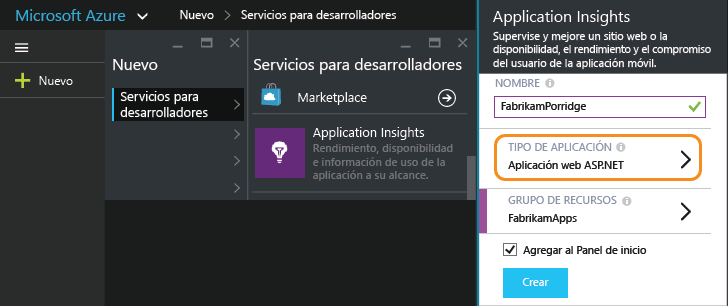
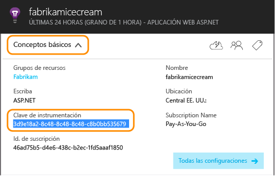
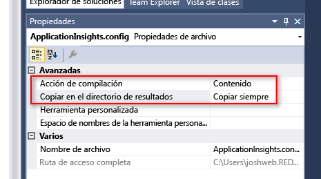
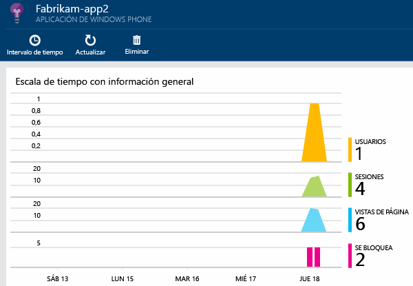

<properties
	pageTitle="Análisis para aplicaciones de Windows Phone y de la Tienda Windows | Microsoft Azure"
	description="Analice el uso y el rendimiento de la aplicación de su dispositivo Windows."
	services="application-insights"
    documentationCenter="windows"
	authors="alancameronwills"
	manager="douge"/>

<tags
	ms.service="application-insights"
	ms.workload="tbd"
	ms.tgt_pltfrm="ibiza"
	ms.devlang="na"
	ms.topic="get-started-article"
	ms.date="02/19/2016"
	ms.author="awills"/>

# Análisis para aplicaciones de Windows Phone y de la Tienda Windows

Microsoft ofrece dos soluciones para DevOps de dispositivos: [HockeyApp](http://hockeyapp.net/) para análisis del lado cliente y [Application Insights](app-insights-overview.md) para el del lado servidor.

[HockeyApp](http://hockeyapp.net/) es nuestra solución de DevOps de móviles para aplicaciones de dispositivos iOS, OS X, Android o Windows, así como aplicaciones multiplataforma basadas en Xamarin, Cordova y Unity. Con ella, podrá distribuir compilaciones a evaluadores de la versión beta, recopilar datos de bloqueo y obtener métricas y comentarios de los usuarios. Está integrada en Visual Studio Team Services, lo que facilita las implementaciones de compilaciones y la integración de elementos de trabajo.

Vaya a:

* [HockeyApp](http://support.hockeyapp.net/kb)
* [HockeyApp Blog](http://hockeyapp.net/blog/)
* Únase a [Hockeyapp Preseason](http://hockeyapp.net/preseason/) para obtener versiones anteriores.

Si la aplicación tiene un lado servidor, utilice [Application Insights](app-insights-overview.md) para supervisar el lado servidor web de la aplicación en [ASP.NET](app-insights-asp-net.md) o [J2EE](app-insights-java-get-started.md).

## SDK de Application Insights para dispositivos Windows

Aunque se recomienda HockeyApp, también hay una versión anterior del SDK de Application Insights que se puede utilizar para supervisar los [bloqueos][windowsCrash] y el [uso][windowsUsage] de las aplicaciones para dispositivos Windows.

Tenga en cuenta que el soporte para el SDK anterior del dispositivo se eliminará gradualmente.


Para instalar el SDK anterior, necesitará:

* Una suscripción a [Microsoft Azure][azure].
* Visual Studio 2013 o posterior.


### 1\. Obtención de un recurso de Application Insights 

En el [Portal de Azure][portal], cree un nuevo recurso de Application Insights.

Cree un nuevo recurso:



Un [recurso][roles] de Azure es una instancia de un servicio. Este recurso es donde se le presentará telemetría de su aplicación analizada.

#### Copia de la clave de instrumentación

La clave identifica el recurso. La necesitará pronto para configurar el SDK para enviar los datos al recurso.




### 2\. Incorporación del SDK de Application Insights a las aplicaciones

En Visual Studio, agregue el SDK adecuado a su proyecto.


* Si es una aplicación de C++, utilice el [SDK de C++](https://github.com/Microsoft/ApplicationInsights-CPP) en lugar del paquete NuGet que se muestra a continuación.

Si es una aplicación universal de Windows, repita los pasos que aparecen a continuación para el proyecto de Windows Phone y el proyecto de Windows.

1. Haga clic con el botón secundario en el proyecto en el Explorador de soluciones y seleccione **Administrar paquetes de NuGet**.

    

2. Busque "Application Insights".

    

3. Seleccione **Application Insights para aplicaciones de Windows**.

4. Agregue un archivo ApplicationInsights.config a la raíz del proyecto e inserte la clave de instrumentación que copió del portal. A continuación se muestra un archivo XML de ejemplo para este archivo de configuración.

	```xml

		<?xml version="1.0" encoding="utf-8" ?>
		<ApplicationInsights>
			<InstrumentationKey>YOUR COPIED INSTRUMENTATION KEY</InstrumentationKey>
		</ApplicationInsights>
	```

    Defina las propiedades del archivo ApplicationInsights.config: **Acción de compilación** == **Contenido** y **Copiar en el directorio de salida** == **Copiar siempre**.
	
	

5. Agregue el código de inicialización siguiente. Es más conveniente agregar este código al constructor `App()`. Si lo hace en otro lugar, podría perder la recopilación automática de las primeras vistas de página.

```C#

	public App()
	{
	   // Add this initilization line. 
	   WindowsAppInitializer.InitializeAsync();
	
	   this.InitializeComponent();
	   this.Suspending += OnSuspending;
	}  
```

**Aplicaciones universales de Windows**: repita los pasos para el proyecto de Windows Phone y de la Tienda Windows. [Ejemplo de una aplicación universal de Windows 8.1](https://github.com/Microsoft/ApplicationInsights-Home/tree/master/Samples/Windows%208.1%20Universal).

### <a name="network"></a>3. Habilitación del acceso de red para la aplicación

Si la aplicación no [solicita acceso de red saliente](https://msdn.microsoft.com/library/windows/apps/hh452752.aspx) aún, tendrá que agregar esta acción a su manifiesto como una [funcionalidad obligatoria](https://msdn.microsoft.com/library/windows/apps/br211477.aspx).

### <a name="run"></a>4. Ejecución del proyecto

[Ejecute la aplicación con F5](http://msdn.microsoft.com/library/windows/apps/bg161304.aspx) y úsela para generar telemetría.

En Visual Studio, aparecerá un recuento de los eventos que se han recibido.


En modo de depuración, la telemetría se envía tan pronto como se genera. En modo de lanzamiento, la telemetría se almacena en el dispositivo y solo se envía cuando se reanuda la aplicación.


### <a name="monitor"></a>5. Consulta de los datos del monitor

Abra Application Insights desde un proyecto.


Al principio, solo aparecerán uno o dos puntos. Por ejemplo:



Si espera más datos, haga clic en Actualizar después de unos segundos.

Haga clic en un gráfico para ver su contenido con mayor detalle.


### <a name="deploy"></a>5. Publicación de la aplicación en Azure

[Publique la aplicación](http://dev.windows.com/publish) y vea cómo se acumulan los datos a medida que los usuarios la descargan y la usan.

### Personalización de la telemetría

#### Selección de los recolectores

El SDK de Application Insights incluye varios recolectores que recopilan diferentes tipos de datos de la aplicación automáticamente. De forma predeterminada, todos están activos. Pero puede elegir los recolectores que quiere inicializar en el constructor de la aplicación:

    WindowsAppInitializer.InitializeAsync( "00000000-0000-0000-0000-000000000000",
       WindowsCollectors.Metadata
       | WindowsCollectors.PageView
       | WindowsCollectors.Session 
       | WindowsCollectors.UnhandledException);

#### Envío de datos de telemetría propios

Use la [API][api] para enviar eventos, métricas y datos de diagnóstico a Application Insights. En resumen:

```C#

 var tc = new TelemetryClient(); // Call once per thread

 // Send a user action or goal:
 tc.TrackEvent("Win Game");

 // Send a metric:
 tc.TrackMetric("Queue Length", q.Length);

 // Provide properties by which you can filter events:
 var properties = new Dictionary{"game", game.Name};

 // Provide metrics associated with an event:
 var measurements = new Dictionary{"score", game.score};

 tc.TrackEvent("Win Game", properties, measurements);

```

Para más información, consulte [Eventos y métricas personalizados][api].

## Pasos siguientes

* [Detección y diagnóstico de bloqueos en la aplicación][windowsCrash]
* [Más información sobre las métricas][metrics]
* [Más información sobre Búsqueda de diagnóstico][diagnostic]
* [Seguimiento del uso de la aplicación][windowsUsage]
* [Uso de la API para enviar telemetría personalizada][api]
* [Solución de problemas][qna]

* [Utilice HockeyApp para el análisis de bloqueos, distribución beta y comentarios de la aplicación.](http://hockeyapp.net/)


<!--Link references-->

[api]: app-insights-api-custom-events-metrics.md
[azure]: ../insights-perf-analytics.md
[diagnostic]: app-insights-diagnostic-search.md
[metrics]: app-insights-metrics-explorer.md
[portal]: http://portal.azure.com/
[qna]: app-insights-troubleshoot-faq.md
[roles]: app-insights-resources-roles-access-control.md
[windowsCrash]: app-insights-windows-crashes.md
[windowsUsage]: app-insights-windows-usage.md

<!----HONumber=AcomDC_0224_2016-->