<properties
	pageTitle="Copia de seguridad de las máquinas virtuales de Azures | Microsoft Azure"
	description="Detectar, registrar y realizar copias de seguridad de las máquinas virtuales con estos procedimientos de copia de seguridad de máquinas virtuales de Azure."
	services="backup"
	documentationCenter=""
	authors="markgalioto"
	manager="jwhit"
	editor=""
	keywords="copia de seguridad de máquinas virtuales; hacer copia de seguridad de máquinas virtuales; recuperación ante desastres y copia de seguridad; copia de seguridad de vm"/>

<tags
	ms.service="backup"
	ms.workload="storage-backup-recovery"
	ms.tgt_pltfrm="na"
	ms.devlang="na"
	ms.topic="hero-article"
	ms.date="01/22/2016"
	ms.author="trinadhk; jimpark; markgal;"/>

# Copia de seguridad de máquinas virtuales de Azure
Este artículo proporciona los procedimientos para realizar la copia de seguridad de máquinas virtuales de Azure existentes para protegerlas conforme a las directivas de recuperación ante desastres y de copia de seguridad de su empresa.

En primer lugar, hay algunas cosas que es necesario tener en cuenta antes de poder realizar una copia de seguridad de una máquina virtual de Azure. Si aún no lo ha hecho, antes de continuar complete los [requisitos previos](backup-azure-vms-prepare.md) para preparar el entorno para la copia de seguridad de máquinas virtuales.

Para obtener más información, vea los artículos sobre cómo [planear la infraestructura de copia de seguridad de máquinas virtuales en Azure](backup-azure-vms-introduction.md) y sobre las [máquinas virtuales de Azure](https://azure.microsoft.com/documentation/services/virtual-machines/).

La realización de copias de seguridad de máquinas virtuales de Azure consta tres pasos principales:

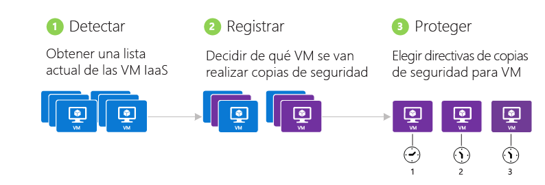

>[AZURE.NOTE] La copia de seguridad de máquinas virtuales es un proceso local. No puede realizar copias de seguridad de máquinas virtuales desde una región hasta un almacén de copia de seguridad de otra región. Por lo tanto, para cada región de Azure que tiene máquinas virtuales que necesiten una copia de seguridad, debe crearse al menos un almacén de copia de seguridad en esa región.

## Paso 1: Detección de máquinas virtuales de Azure
El proceso de detección debe ser siempre el primer paso para asegurarse de que se identifican las nuevas máquinas virtuales que se agregan a la suscripción. El proceso consulta a Azure la lista de máquinas virtuales incluidas en la suscripción, junto con información adicional, por ejemplo, el nombre del servicio en la nube y la región.

1. Vaya al almacén de copia de seguridad en **Servicios de recuperación** en el Portal de Azure y haga clic en **Elementos registrados**.

2. Seleccione **Máquina virtual de Azure** en el menú desplegable.

    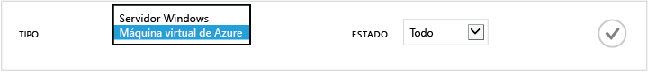

3. Haga clic en **DETECTAR** en la parte inferior de la página. 

    El proceso de detección puede tardar unos minutos mientras se tabulan las máquinas virtuales. Hay una notificación en la parte inferior de la pantalla que informa de que el proceso se está ejecutando.

    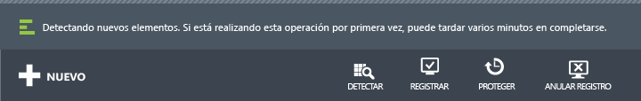

    La notificación cambia cuando el proceso se completa.

    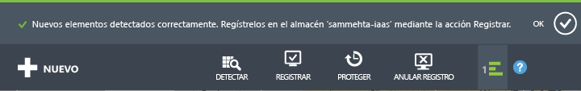

##  Paso 2: Registro de máquinas virtuales de Azure
Se registra una máquina virtual de Azure para asociarla con el servicio Copia de seguridad de Azure. El registro suele ser una actividad que solo se realiza una vez.

1. Vaya al almacén de copias de seguridad en **Servicios de recuperación**, en el Portal de Azure, y haga clic en **Elementos registrados**.

2. Seleccione **Máquina virtual de Azure** en el menú desplegable.

    

3. Haga clic en **REGISTRAR** en la parte inferior de la página. 

4. En el menú contextual **Elementos registrados**, seleccione las máquinas virtuales que desea registrar. Si hay dos o más máquinas virtuales con el mismo nombre, use el servicio en la nube para distinguirlas.

    >[AZURE.TIP] Se pueden registrar varias máquinas virtuales al mismo tiempo.

    Se crea un trabajo para cada máquina virtual que ha seleccionado.

5. Haga clic en **Ver trabajo** en la notificación para ir a la página **Trabajos**.

    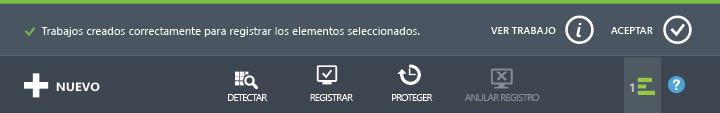

    La máquina virtual también aparece en la lista de elementos registrados junto con el estado de la operación de registro.

    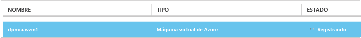

    Una vez completada la operación, el estado cambiará para reflejar el estado *registrado*.

    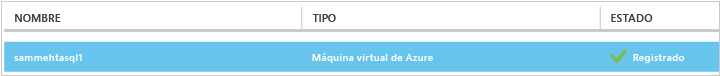

## Paso 3: Protección de las máquinas virtuales de Azure
Ahora puede configurar una directiva de retención y copia de seguridad para la máquina virtual. Se pueden proteger varias máquinas virtuales en una sola acción de protección.

Los almacenes de Copia de seguridad de Azure creados después de mayo de 2015 incluyen una directiva predeterminada integrada en el almacén. Esta directiva predeterminada viene con un período de retención predeterminado de 30 días y una programación de copia de seguridad diaria.

1. Vaya al almacén de copias de seguridad en **Servicios de recuperación**, en el Portal de Azure, y haga clic en **Elementos registrados**.
2. Seleccione **Máquina virtual de Azure** en el menú desplegable.

    

3. Haga clic en **PROTEGER**, en la parte inferior de la página.

    Se abrirá el **Asistente para protección de elementos**. El asistente solo muestra las máquinas virtuales que están registradas y que no están protegidas. Aquí es donde selecciona las máquinas virtuales que quiere proteger.

    Si hay dos o más máquinas virtuales con el mismo nombre, use el servicio en la nube para distinguir las máquinas virtuales.

    >[AZURE.TIP] Puede proteger varias máquinas virtuales al mismo tiempo.

    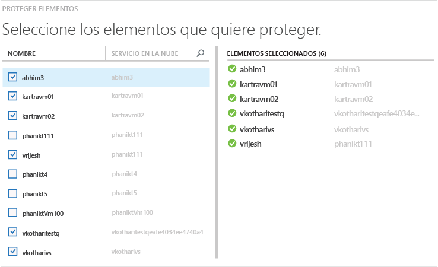

4. Elija una **programación de copia de seguridad** para hacer una copia de seguridad de las máquinas virtuales que seleccionó. Puede seleccionar una directiva de un conjunto existente o definir una nueva.

    Cada directiva de copia de seguridad puede tener asociadas varias máquinas virtuales. Sin embargo, la máquina virtual solo se puede asociar con una directiva en un momento determinado.

    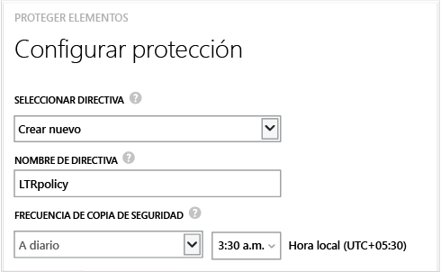

    >[AZURE.NOTE] Una directiva de copia de seguridad incluye un esquema de retención de las copias de seguridad programadas. Si selecciona una directiva de copia de seguridad existente, no podrá modificar las opciones de retención en el paso siguiente.

5. Elija un **intervalo de retención** para asociarlo a las copias de seguridad.

    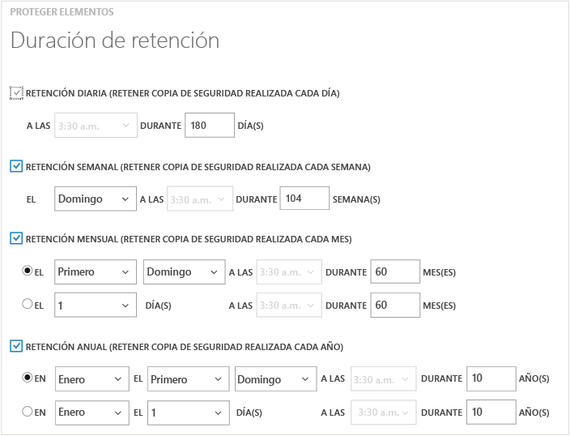

    La directiva de retención especifica el período de tiempo que se almacena una copia de seguridad. Puede especificar directivas de retención diferentes en función de cuándo se realizó la copia de seguridad. Por ejemplo, puede que el punto de copia de seguridad que se realiza al final de cada trimestre se tenga que conservar durante más tiempo (con fines de auditoría), mientras que el punto de copia de seguridad diario, que sirve como punto de recuperación operativo, solo debe mantenerse durante 90 días.

    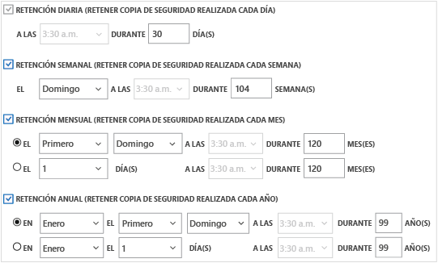

    En esta imagen de ejemplo:

    - **Directiva de retención diaria**: las copias de seguridad realizadas diariamente se almacenan durante 30 días.
    - **Directiva de retención semanal**: las copias de seguridad realizadas cada domingo se conservarán durante 104 semanas.
    - **Directiva de retención mensual**: las copias de seguridad realizadas el último domingo de cada mes se conservarán durante 120 meses.
    - **Directiva de retención anual**: las copias de seguridad realizadas el primer domingo de cada mes de enero se conservarán durante 99 años.

    Se crea un trabajo para configurar la directiva de protección y asociar a esa directiva cada máquina virtual que ha seleccionado.

6. Haga clic en **Trabajo** y elija el filtro adecuado para ver la lista de trabajos **Configurar protección**.

    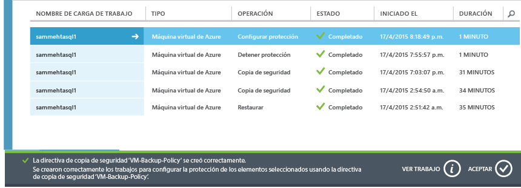

## Copia de seguridad inicial
Una vez que la máquina virtual está protegida con una directiva, aparecerá en la pestaña **Elementos protegidos** y tendrá un estado *Protegido (copia de seguridad inicial pendiente)*. De forma predeterminada, la primera copia de seguridad programada es la *copia de seguridad inicial*.

Para desencadenar la copia de seguridad inicial inmediatamente después de configurar la protección:

1. Haga clic en el botón **Copia de seguridad ahora** en la parte inferior de la página **Elementos protegidos**.

    El servicio Copia de seguridad de Azure crea un trabajo de copia de seguridad para la operación de copia de seguridad inicial.

2. Haga clic en la pestaña **Trabajos** para ver la lista de los trabajos.

    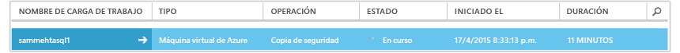

>[AZURE.NOTE] Como parte de la operación de copia de seguridad, el servicio Copia de seguridad de Azure emite un comando a la extensión de copia de seguridad en cada máquina virtual para vaciar toda la escritura y tomar una instantánea coherente.

Una vez completada la copia de seguridad inicial, el estado de la máquina virtual en la pestaña **Elementos protegidos** se mostrará como *Protegido*.

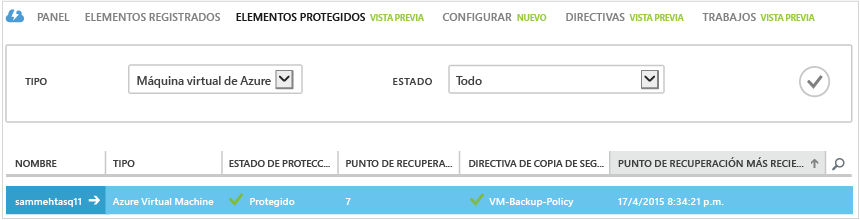

## Visualización de los detalles y el estado de la copia de seguridad
Una vez protegidas, el recuento de máquinas virtuales también aumenta en el resumen de la página **Panel**. La página **Panel** también muestra el número de trabajos de las últimas 24 horas que se realizaron *correctamente*, los que *causaron un error* y los que siguen *en curso*. Al hacer clic en una categoría, podrá examinarla en la página **Trabajos**.

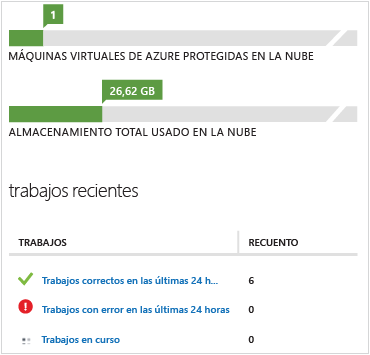

Los valores indicados en el panel se actualizan cada 24 horas.

## Solución de errores
Si se encuentra con problemas mientras realiza la copia de seguridad de la máquina virtual, eche un vistazo a la [guía de solución de problemas](backup-azure-vms-troubleshoot.md) para obtener ayuda.

## Pasos siguientes

- [Administración y supervisión de las máquinas virtuales](backup-azure-manage-vms.md)
- [Restauración de máquinas virtuales](backup-azure-restore-vms.md)

<!---HONumber=AcomDC_0302_2016-->