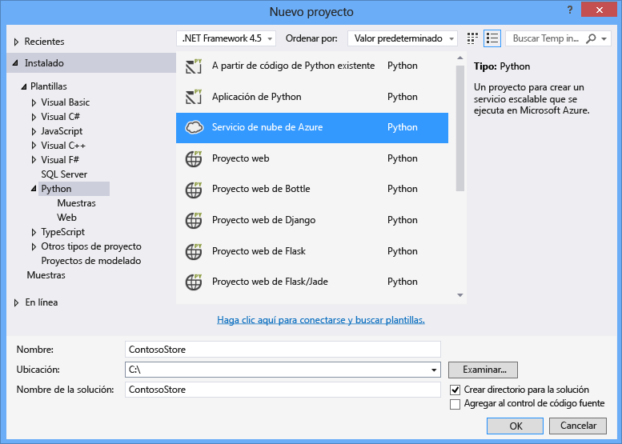
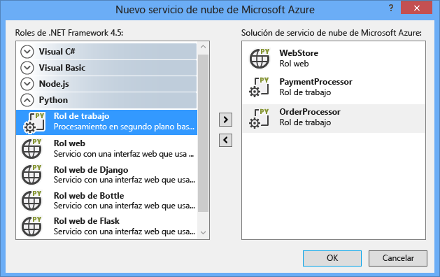
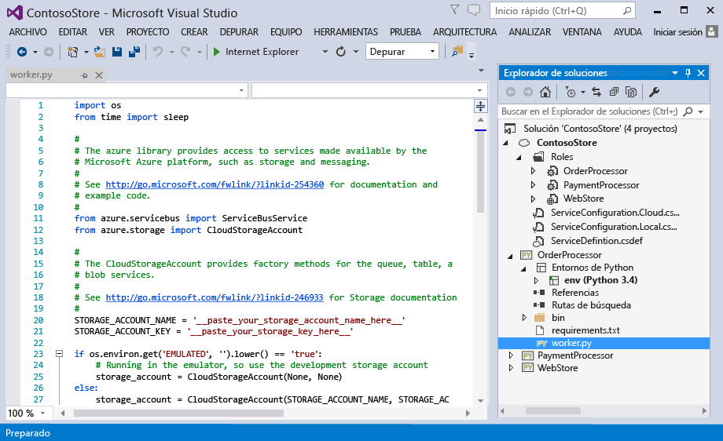
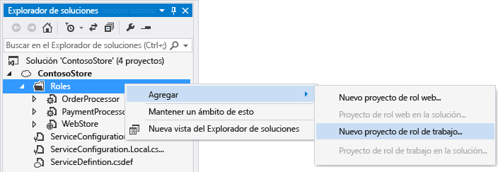
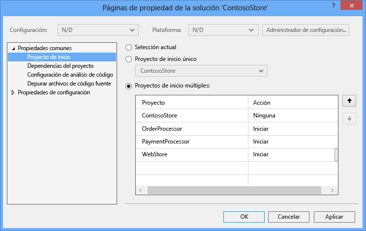
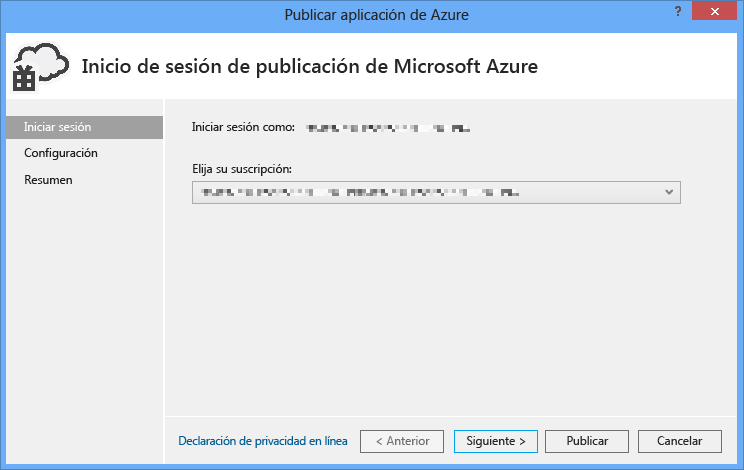
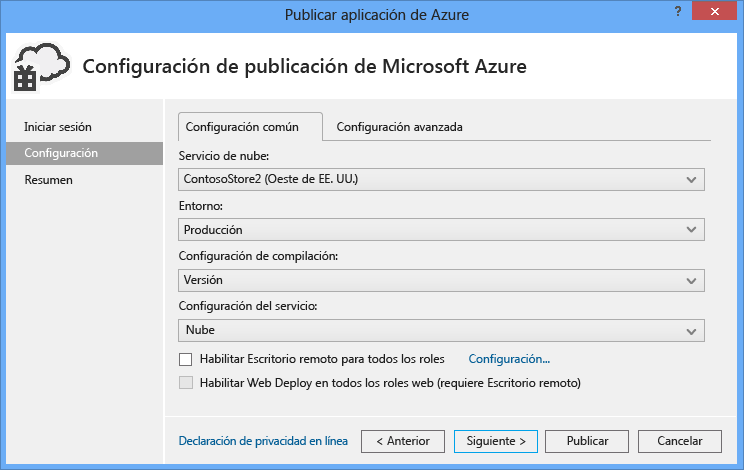
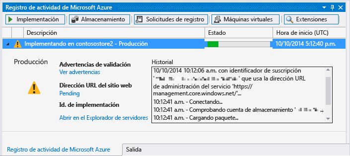

<properties
	pageTitle="Roles web y de trabajo de Python con Python Tools 2.2 para Visual Studio | Microsoft Azure"
	description="Información general sobre el uso de Python Tools para Visual Studio para crear servicios en la nube de Azure, incluidos roles web y roles de trabajo."
	services=""
	documentationCenter="python"
	authors="huguesv"
	manager="wpickett"
	editor=""/>

<tags
	ms.service="cloud-services"
	ms.workload="tbd"
	ms.tgt_pltfrm="na"
	ms.devlang="python"
	ms.topic="hero-article"
	ms.date="08/30/2015"
	ms.author="huvalo"/>

# Roles web y de trabajo de Python con Python Tools 2.2 para Visual Studio

En este artículo se ofrece información general sobre el uso de roles web y de trabajo de Python con [herramientas de Python para Visual Studio][].

## Requisitos previos

 - Visual Studio 2013 o 2015
 - [Python Tools 2.2 para Visual Studio][] (PTVS)
 - [Herramientas del SDK de Azure para 2013][] o [Herramientas del SDK de Azure para VS 2015][]
 - [Python 2.7 de 32 bits][] o [Python 3.4 de 32 bits][]

[AZURE.INCLUDE [create-account-and-websites-note](../includes/create-account-and-websites-note.md)]

## ¿Qué son los roles web y de trabajo de Python?

Azure ofrece tres modelos de proceso para la ejecución de aplicaciones: [característica de Aplicaciones web en el Servicio de aplicaciones de Azure][execution model-web sites], [Máquinas virtuales de Azure][execution model-vms] y [Servicios en la nube de Azure][execution model-cloud services]. Los tres modelos admiten Python. Servicios en la nube, que incluye roles web y de trabajo, ofrece el modelo *Plataforma como servicio (PaaS)*. En un servicio en la nube, un rol web ofrece un servidor web dedicado de Internet Information Services (IIS) para hospedar aplicaciones web front-end, mientras que un rol de trabajo puede ejecutar tareas asincrónicas, de ejecución prolongada o perpetuas independientes de la entrada o la interacción del usuario.

Para obtener más información, consulte [¿Qué es un servicio en la nube?].

> [AZURE.NOTE]*¿Desea compilar un sitio web sencillo?* Si el escenario solo requiere un sitio web de front-end sencillo, considere el uso de la característica Aplicaciones web ligera en el Servicio de aplicaciones de Azure. Puede actualizar a un Servicio en la nube más adelante, cuando su sitio web sea más grande y sus requisitos cambien. Consulte el <a href="/develop/python/">Centro para desarrolladores de Python</a> para obtener artículos sobre el desarrollo de la característica de aplicaciones web en el Servicio de aplicaciones de Azure.  

## Creación de un proyecto

En Visual Studio, puede seleccionar **Servicio en la nube de Azure** en el cuadro de diálogo **Nuevo proyecto**, en **Python**.

En el asistente Servicio en la nube de Azure, puede crear roles web y de trabajo nuevos.

La plantilla de rol de trabajo incluye código reutilizable que conecta a una cuenta de almacenamiento de Azure o el Bus de servicio de Azure.

Puede agregar roles web o de trabajo a un servicio en la nube que ya existe en cualquier momento. Puede optar por agregar proyectos existentes a su solución o por crear otros nuevos.

Su servicio en la nube puede contener roles implementados en diferentes lenguajes. Por ejemplo, puede tener un rol web de Python implementado con Django, con Python o con roles de trabajo de C#. Puede comunicarse fácilmente entre sus roles usando colas del Bus de servicio o colas de almacenamiento.

## Ejecución en modo local

Si establece su proyecto de servicio en la nube como proyecto de inicio y presiona F5, el servicio en la nube se ejecuta en el emulador de Azure local.

Aunque PTVS admite el inicio en el emulador, la depuración (por ejemplo, puntos de interrupción) no funcionará.

Para depurar roles web y de trabajo, puede establecer el proyecto de rol como proyecto de inicio y depurarlo. También puede establecer varios proyectos de inicio. Haga clic con el botón secundario en la solución y luego seleccione **Establecer proyectos de inicio**.

## Publicación en Azure

Para publicar, haga clic con el botón secundario en el proyecto del servicio en la nube de la solución y luego seleccione **Publicar**.

En la página de configuración, seleccione el servicio en la nube en el que desea publicar.

Puede crear un nuevo servicio en la nube si aún no tiene uno disponible.

Es muy útil también habilitar las conexiones con Escritorio remoto a máquinas para depurar errores.

Cuando haya terminado la configuración, haga clic en **Publicar**.

En la ventana de salida se verá cierto progreso y después se verá la ventana Registro de actividad de Microsoft Azure.

La implementación tardará varios minutos. Después, sus roles web y/o de trabajo estarán ejecutándose en Azure.

## Pasos siguientes

Para obtener información detallada sobre el trabajo con roles web y de trabajo en Python Tools para Visual Studio, consulte la documentación de PTVS:

- [Proyectos de servicio en la nube][]

Para obtener más información sobre el uso de servicios de Azure desde roles web y de trabajo, como el uso de almacenamiento o el Bus de servicio de Azure, consulte los siguientes artículos:

- [Servicio BLOB][]
- [Servicio Tabla][]
- [Servicio Cola][]
- [Colas de Bus de servicio][]
- [Temas de Bus de servicio][]

<!--Link references-->

[¿Qué es un servicio en la nube?]: /manage/services/cloud-services/what-is-a-cloud-service/
[execution model-web sites]: fundamentals-application-models.md#WebSites
[execution model-vms]: fundamentals-application-models.md#VMachine
[execution model-cloud services]: fundamentals-application-models.md#CloudServices
[Python Developer Center]: /develop/python/

[Servicio BLOB]: storage-python-how-to-use-blob-storage.md
[Servicio Cola]: storage-python-how-to-use-queue-storage.md
[Servicio Tabla]: storage-python-how-to-use-table-storage.md
[Colas de Bus de servicio]: service-bus-python-how-to-use-queues.md
[Temas de Bus de servicio]: service-bus-python-how-to-use-topics-subscriptions.md

<!--External Link references-->

[herramientas de Python para Visual Studio]: http://aka.ms/ptvs
[Python Tools for Visual Studio Documentation]: http://aka.ms/ptvsdocs
[Proyectos de servicio en la nube]: http://go.microsoft.com/fwlink/?LinkId=624028
[Python Tools 2.2 para Visual Studio]: http://go.microsoft.com/fwlink/?LinkID=624025
[Herramientas del SDK de Azure para 2013]: http://go.microsoft.com/fwlink/?LinkId=323510
[Herramientas del SDK de Azure para VS 2015]: http://go.microsoft.com/fwlink/?LinkId=518003
[Python 2.7 de 32 bits]: http://go.microsoft.com/fwlink/?LinkId=517190
[Python 3.4 de 32 bits]: http://go.microsoft.com/fwlink/?LinkId=517191

<!---HONumber=Oct15_HO3-->