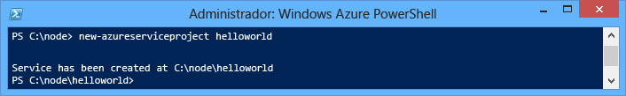
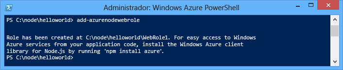
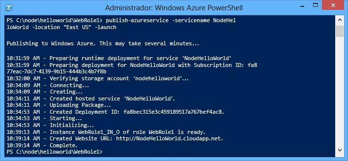
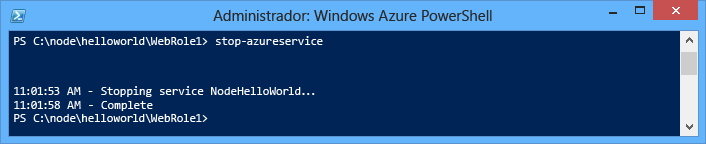
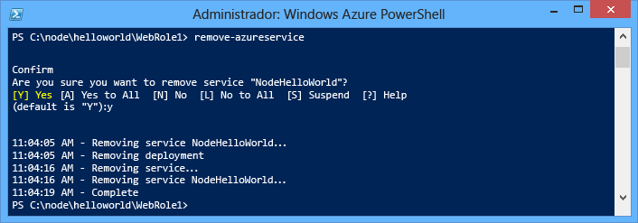

<properties
	pageTitle="Guía de introducción a Node.js | Microsoft Azure"
	description="Aprenda a crear una sencilla aplicación web de Node.js e impleméntela en un servicio en la nube de Azure."
	services="cloud-services"
	documentationCenter="nodejs"
	authors="rmcmurray"
	manager="wpickett"
	editor=""/>

<tags
	ms.service="cloud-services"
	ms.workload="tbd"
	ms.tgt_pltfrm="na" 
	ms.devlang="nodejs"
	ms.topic="hero-article"
	ms.date="02/04/2016" 
	ms.author="robmcm"/>

# Compilación e implementación de una aplicación Node.js en un Servicio en la nube de Azure

> [AZURE.SELECTOR]
- [Node.js](cloud-services-nodejs-develop-deploy-app.md)
- [.NET](cloud-services-dotnet-get-started.md)

En este tutorial se muestra cómo crear una aplicación de Node.js simple con Servicio en la nube de Azure. Los Servicios en la nube son los bloques de compilación de aplicaciones en la nube escalables en Azure. Permiten la separación y la administración independiente de los componentes front-end y back-end de su aplicación, así como su escalación horizontal. Los Servicios en la nube proporcionan una máquina virtual dedicada y robusta para hospedar los roles de forma fiable.

Para obtener más información sobre los Servicios en la nube y sobre su comparación con Sitios web Azure y Máquinas virtuales, consulte [Comparación entre Sitios web Azure, Servicios en la nube y Máquinas virtuales](../app-service-web/choose-web-site-cloud-service-vm.md).

>[AZURE.TIP] ¿Desea compilar un sitio web sencillo? Si el escenario solo requiere un sitio web de front-end sencillo, considere el <a href="../app-service-web/web-sites-nodejs-develop-deploy-mac.md">uso de una aplicación web ligera</a>. Puede actualizar a un Servicio en la nube más adelante, cuando su aplicación web sea más grande y sus requisitos cambien.

Siguiendo este tutorial, podrá compilar una aplicación web sencilla hospedada en un rol web. Utilizará el emulador de proceso para probar su aplicación localmente y, a continuación, la implementará con las herramientas de línea de comandos de PowerShell.

La aplicación es una aplicación sencilla de "Hola a todos":

## Requisitos previos

> [AZURE.NOTE] Este tutorial usa PowerShell de Azure, que requiere Windows.

- Instale y configure [Azure PowerShell](../powershell-install-configure.md).
- Descargar e instalar el [SDK de Azure para .NET 2.7](http://www.microsoft.com/es-ES/download/details.aspx?id=48178). En la configuración de la instalación, seleccione:
    - MicrosoftAzureAuthoringTools
    - MicrosoftAzureComputeEmulator

## Cree un proyecto del servicio de nube de Azure

Realice las siguientes tareas para crear un nuevo proyecto de Servicio en la nube de Azure, junto con scaffolding básico de Node.js:

1. Ejecute **Windows PowerShell** como administrador. (En el **menú Inicio** o la **pantalla Inicio**, busque **Windows PowerShell**).

2.  [Conecte PowerShell](powershell-install-configure.md#how-to-connect-to-your-subscription) a su suscripción.
3.  Escriba el siguiente cmdlet de PowerShell para crear el proyecto:

        New-AzureServiceProject helloworld

	

	El cmdlet **New-AzureServiceProject** genera una estructura básica para publicar una aplicación de Node.js en un servicio en la nube. Contiene archivos de configuración necesarios para la publicación en Azure. El cmdlet también cambia su directorio de trabajo al directorio del servicio.

	El cmdlet crea los siguientes archivos:

	-   **ServiceConfiguration.Cloud.cscfg**, **ServiceConfiguration.Local.cscfg** y **ServiceDefinition.csdef**: archivos específicos de Azure necesarios para publicar su aplicación. Para obtener más información, consulte [Información general de la creación de un servicio hospedado para Azure][].

	-   **deploymentSettings.json**: almacena la configuración local que utilizan los cmdlet de implementación de Azure PowerShell.

4.  Escriba el siguiente comando para agregar un rol web nuevo:

        Add-AzureNodeWebRole

	

	El cmdlet **Add-AzureNodeWebRole** crea una aplicación de Node.js básica. También modifica los archivos **.csfg** y **.csdef** para agregar entradas de configuración al nuevo rol.

	> [AZURE.NOTE] Si no especifica un nombre de rol, se usa el nombre predeterminado. Puede proporcionar un nombre como primer parámetro de cmdlet: `Add-AzureNodeWebRole MyRole`

La aplicación de Node.js se define en el archivo **server.js**, que se encuentra en el directorio del rol web (**WebRole1** de forma predeterminada). Este es el código:

	var http = require('http');
	var port = process.env.port || 1337;
	http.createServer(function (req, res) {
	    res.writeHead(200, { 'Content-Type': 'text/plain' });
	    res.end('Hello World\n');
	}).listen(port);

Este código es básicamente el mismo que el ejemplo "Hola a todos" del sitio web de [nodejs.org][], excepto en que utiliza el número de puerto asignado por el entorno de la nube.

## Implementación de la aplicación en Azure

	[AZURE.INCLUDE [create-account-note](../../includes/create-account-note.md)]

### Descarga de la configuración de publicación de Azure

Con el fin de implementar su aplicación en Azure, debe descargar primero la configuración de publicación para su suscripción de Azure.

1.  Ejecute el siguiente cmdlet de PowerShell de Azure:

        Get-AzurePublishSettingsFile

	Este cmdlet utilizará su explorador para navegar hasta la página de descarga de la configuración de publicación. Es posible que se le solicite iniciar sesión con una cuenta de Microsoft. En ese caso, utilice una cuenta asociada a su suscripción de Azure.

	Guarde el perfil descargado en un ubicación de archivo a la que pueda tener acceso fácilmente.

2.  Ejecute el siguiente cmdlet para importar el perfil de publicación que descargó:

        Import-AzurePublishSettingsFile [path to file]

	> [AZURE.NOTE] Después de importar la configuración de publicación, considere la posibilidad de eliminar el archivo .publishSettings descargado, ya que contiene información que podría permitir que alguien obtuviera acceso a su cuenta.

### Publicación de la aplicación

Para publicar, ejecute los siguientes comandos:

  	$ServiceName = "NodeHelloWorld" + $(Get-Date -Format ('ddhhmm'))   
	Publish-AzureServiceProject -ServiceName $ServiceName  -Location "East US" -Launch

- **-ServiceName** especifica el nombre de la implementación. Debe ser un nombre exclusivo. De lo contrario, se producirá un error en el proceso de publicación. El comando **Get-Date** se fija a una cadena de fecha y hora que debería hacer el nombre único.

- **-Location** especifica el centro de datos en que se hospedará la aplicación. Para ver una lista de los centros de datos disponibles, utilice el cmdlet **Get-AzureLocation**.

- **-Launch** abre una ventana del explorador y navega hasta el servicio hospedado después de que se haya completado la implementación.

Después de que finalice satisfactoriamente el proceso de publicación, verá una respuesta similar a la siguiente:

> [AZURE.NOTE]
La implementación de la aplicación puede tardar varios minutos y la aplicación estará disponible cuando se publique.

Una vez finalizada la implementación, se abrirá una ventana del explorador y navegará hasta el servicio en la nube.

La aplicación ya se está ejecutando en Azure.

El cmdlet **Publish-AzureServiceProject** realiza los siguientes pasos:

1.  Crea un paquete de implementación. El paquete contiene todos los archivos en la carpeta de la aplicación.

2.  Crea una nueva **cuenta de almacenamiento** si no hay ninguna disponible. La cuenta de almacenamiento de Azure se utiliza para almacenar el paquete de la aplicación durante la implementación. Una vez finalizada la implementación, puede eliminar de forma segura la cuenta de almacenamiento.

3.  Crea un nuevo **servicio en la nube** si no hay ninguno disponible. Un **servicio en la nube** es el contenedor en el que se hospeda la aplicación cuando se implementa en Azure. Para obtener más información, consulte [Información general de la creación de un servicio hospedado para Azure][].

4.  Publica el paquete de implementación en Azure.

## Detención y eliminación de la aplicación

Después de implementar su aplicación, es posible que desee deshabilitarla para evitar costes adicionales. Azure factura las instancias de rol web por hora consumida de tiempo de servidor. El tiempo de servidor se empieza a consumir una vez implementada su aplicación, incluso si las instancias no se están ejecutando y se encuentran detenidas.

1.  En la ventana de Windows PowerShell, detenga la implementación del servicio creado en la sección anterior con el siguiente cmdlet:

        Stop-AzureService

	La detención del servicio puede durar varios minutos. Una vez detenido el servicio, recibirá un mensaje que le avisará de su detención.

	

2.  Para eliminar el servicio, llame al siguiente cmdlet:

        Remove-AzureService

	Cuando se le solicite, escriba **Y** para eliminar el servicio.

	La eliminación del servicio puede durar varios minutos. Una vez eliminado el servicio, recibirá un mensaje que le avisará de su eliminación.

	

	> [AZURE.NOTE] La eliminación del servicio no elimina la cuenta de almacenamiento que se creó al publicar por primera vez el servicio, por lo que se le seguirá facturando por el almacenamiento utilizado. Para obtener más información acerca de la eliminación de una cuenta de almacenamiento, consulte [Eliminación de una cuenta de almacenamiento desde una suscripción de Azure](http://msdn.microsoft.com/library/windowsazure/hh531562.aspx).

## Pasos siguientes

Para obtener más información, consulte el [Centro para desarrolladores de Node.js](/develop/nodejs/).

[The Windows Start menu with the Azure SDK Node.js entry expanded]: ./media/cloud-services-nodejs-develop-deploy-app/azure-powershell-menu.png
[mkdir]: ./media/cloud-services-nodejs-develop-deploy-app/getting-started-6.png
[nodejs.org]: http://nodejs.org/
[A directory listing of the helloworld folder.]: ./media/cloud-services-nodejs-develop-deploy-app/getting-started-7.png
[Información general de la creación de un servicio hospedado para Azure]: http://msdn.microsoft.com/library/windowsazure/jj155995.aspx
[A directory listing of the WebRole1 folder]: ./media/cloud-services-nodejs-develop-deploy-app/getting-started-8.png
[The menu displayed when right-clicking the Azure emulator from the task bar.]: ./media/cloud-services-nodejs-develop-deploy-app/getting-started-11.png
[A browser window displaying http://www.windowsazure.com/ with the Free Trial link highlighted]: ./media/cloud-services-nodejs-develop-deploy-app/getting-started-12.png
[A browser window displaying the liveID sign in page]: ./media/cloud-services-nodejs-develop-deploy-app/getting-started-13.png
[Internet Explorer displaying the save as dialog for the publishSettings file.]: ./media/cloud-services-nodejs-develop-deploy-app/getting-started-14.png

[The full status output of the Publish-AzureService command]: ./media/cloud-services-nodejs-develop-deploy-app/node20.png
[How to Delete a Storage Account from an Azure Subscription]: https://www.windowsazure.com/manage/services/storage/how-to-manage-a-storage-account/
[powershell-menu]: ./media/cloud-services-nodejs-develop-deploy-app/azure-powershell-start.png
 

<!----HONumber=AcomDC_0218_2016-->