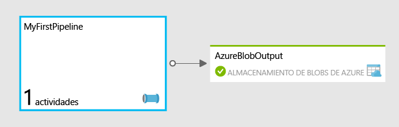

<properties
	pageTitle="Introducción a la Factoría de datos de Azure"
	description="En este tutorial se muestra cómo crear una canalización de datos de ejemplo que transforma los datos con HDInsight de Azure."
	services="data-factory"
	documentationCenter=""
	authors="spelluru"
	manager="jhubbard"
	editor="monicar"/>

<tags
	ms.service="data-factory"
	ms.workload="data-services"
	ms.tgt_pltfrm="na"
	ms.devlang="na"
	ms.topic="article" 
	ms.date="12/18/2015"
	ms.author="spelluru"/>

# Introducción a la Factoría de datos de Azure
> [AZURE.SELECTOR]
- [Tutorial Overview](data-factory-build-your-first-pipeline.md)
- [Using Data Factory Editor](data-factory-build-your-first-pipeline-using-editor.md)
- [Using PowerShell](data-factory-build-your-first-pipeline-using-powershell.md)
- [Using Visual Studio](data-factory-build-your-first-pipeline-using-vs.md)
- [Using Resource Manager Template](data-factory-build-your-first-pipeline-using-arm.md)

Este artículo le introduce en el creación de la primera Factoría de datos de Azure.

> [AZURE.NOTE] Este artículo no ofrece información general conceptual sobre el servicio Factoría de datos de Azure. Para una información general detallada del servicio, consulte [Introducción al servicio Factoría de datos de Azure](data-factory-introduction.md).

## Información general del tutorial
Este tutorial le guiará por los pasos necesarios para poner su primera factoría de datos en funcionamiento. Va a crear una canalización en la factoría de datos que transformará y procesará los datos de entrada para generar datos de salida.

## Requisitos previos
Antes de comenzar este tutorial, debe cumplir los siguientes requisitos previos:

1.	**Suscripción de Azure**: si no tiene ninguna, puede crear una cuenta de evaluación gratuita en un par de minutos. Consulte el artículo [Evaluación gratuita](https://azure.microsoft.com/pricing/free-trial/) sobre cómo puede obtener una cuenta de evaluación gratuita.

2.	**Almacenamiento de Azure**: usará una cuenta de Almacenamiento de Azure para almacenar los datos de este tutorial. Si no dispone de una cuenta de Almacenamiento de Azure, consulte el artículo [Creación de una cuenta de almacenamiento](../storage/storage-create-storage-account.md#create-a-storage-account). Tras crear la cuenta de almacenamiento, tendrá que obtener la clave de cuenta que se usa para tener acceso al almacenamiento. Consulte [Visualización y copia de las claves de acceso de almacenamiento](../storage/storage-create-storage-account.md#view-copy-and-regenerate-storage-access-keys).

## ¿Qué se va a tratar en este tutorial?	
**Factoría de datos de Azure** permite componer tareas de **movimiento** de datos y **procesamiento** de datos como un flujo de trabajo controlado por datos. Aprenderá a crear una primera canalización que use HDInsight para transformar y analizar registros web mensualmente.

En este tutorial, realizará los siguientes pasos:

1.	Crear la **factoría de datos**. Una factoría de datos puede contener una o más canalizaciones de datos que pueden mover y procesar datos. 
2.	Crear los **servicios vinculados**. Un servicio vinculado se crea para vincular un almacén de datos o servicio de proceso a la factoría de datos. Un almacén de datos como Almacenamiento de Azure contiene los datos de entrada y salida de las actividades de la canalización. Un servicio de proceso como HDInsight de Azure procesa y transforma los datos.    
3.	Crear **conjuntos de datos** de entrada y salida. Un conjunto de datos de entrada representa la entrada para una actividad de la canalización y un conjunto de datos de salida representa la salida de la actividad.
3.	Crear la **canalización**. Una canalización puede tener una o varias actividades como la actividad de copia para copiar datos desde un origen a un destino o la actividad de Hive de HDInsight para transformar los datos de entrada con el script de Hive para generar datos de salida. Este ejemplo usa la actividad de Hive de HDInsight que ejecuta un script de Hive. El script crea primero una tabla externa que hace referencia a los datos de blog sin procesar almacenados en Almacenamiento de blobs de Azure y, después, divide los datos sin procesar por año y mes.

La primera canalización, denominada **MyFirstPipeline**, usa una actividad de Hive para transformar y analizar un blog que va a cargar en la carpeta **inputdata** en el contenedor **adfgetstarted** (adfgetstarted/inputdata) en Almacenamiento de blobs de Azure.
 

En este tutorial, en adfgetstarted (contenedor) = > inputdata (carpeta) hay un archivo denominado input.log. Este archivo de registro tiene entradas de tres meses: enero, febrero y marzo de 2014. Aquí están las filas de ejemplo para cada mes en el archivo de entrada.

	2014-01-01,02:01:09,SAMPLEWEBSITE,GET,/blogposts/mvc4/step2.png,X-ARR-LOG-ID=2ec4b8ad-3cf0-4442-93ab-837317ece6a1,80,-,1.54.23.196,Mozilla/5.0+(Windows+NT+6.3;+WOW64)+AppleWebKit/537.36+(KHTML,+like+Gecko)+Chrome/31.0.1650.63+Safari/537.36,-,http://weblogs.asp.net/sample/archive/2007/12/09/asp-net-mvc-framework-part-4-handling-form-edit-and-post-scenarios.aspx,\N,200,0,0,53175,871 
	2014-02-01,02:01:10,SAMPLEWEBSITE,GET,/blogposts/mvc4/step7.png,X-ARR-LOG-ID=d7472a26-431a-4a4d-99eb-c7b4fda2cf4c,80,-,1.54.23.196,Mozilla/5.0+(Windows+NT+6.3;+WOW64)+AppleWebKit/537.36+(KHTML,+like+Gecko)+Chrome/31.0.1650.63+Safari/537.36,-,http://weblogs.asp.net/sample/archive/2007/12/09/asp-net-mvc-framework-part-4-handling-form-edit-and-post-scenarios.aspx,\N,200,0,0,30184,871
	2014-03-01,02:01:10,SAMPLEWEBSITE,GET,/blogposts/mvc4/step7.png,X-ARR-LOG-ID=d7472a26-431a-4a4d-99eb-c7b4fda2cf4c,80,-,1.54.23.196,Mozilla/5.0+(Windows+NT+6.3;+WOW64)+AppleWebKit/537.36+(KHTML,+like+Gecko)+Chrome/31.0.1650.63+Safari/537.36,-,http://weblogs.asp.net/sample/archive/2007/12/09/asp-net-mvc-framework-part-4-handling-form-edit-and-post-scenarios.aspx,\N,200,0,0,30184,871

Cuando la canalización procesa el archivo mediante la actividad de Hive de HDInsight, esta actividad ejecuta un script de Hive en el clúster de HDInsight que divide los datos de entrada por año y mes. El script crea tres carpetas de salida que contienen un archivo con entradas de cada mes.

	adfgetstarted/partitioneddata/year=2014/month=1/000000_0
	adfgetstarted/partitioneddata/year=2014/month=2/000000_0
	adfgetstarted/partitioneddata/year=2014/month=3/000000_0

De las líneas de ejemplo mostradas anteriormente, la primera de ellas (con 2014-01-01) se escribirá en el archivo 000000\_0 en la carpeta month=1. De igual manera, la segunda se escribirá en el archivo de la carpeta month=2 y la tercera se escribirá en el archivo de la carpeta month=3.

## Carga de archivos en Almacenamiento de Azure para el tutorial
Antes de comenzar el tutorial, tendrá que preparar el almacenamiento de Azure con los archivos necesarios para el tutorial.

En esta sección, hará lo siguiente:

2. Cargar el archivo de consulta de Hive (HQL) en la carpeta **script** del contenedor **adfgetstarted**.
3. Cargar el archivo de entrada en la carpeta **inputdata** del contenedor **adfgetstarted**. 

### Creación del archivo de script HQL 

1. Inicie el **Bloc de notas** y pegue el siguiente script HQL. Estos scripts de Hive crean dos tablas externas: **WebLogsRaw** y **WebLogsPartitioned**. Haga clic en **Archivo** en el menú y seleccione **Guardar como**. Cambie a la carpeta **C:\\adfgetstarted** en el disco duro. Seleccione **Todos los archivos (*.*)** en el campo **Guardar como tipo**. Escriba **partitionweblogs.hql** en **Nombre de archivo**. Confirme que el campo **Codificación** en la parte inferior del cuadro de diálogo está establecido en **ANSI**. Si no es así, establézcalo en **ANSI**.  
	
		set hive.exec.dynamic.partition.mode=nonstrict;
		
		DROP TABLE IF EXISTS WebLogsRaw; 
		CREATE TABLE WebLogsRaw (
		  date  date,
		  time  string,
		  ssitename string,
		  csmethod  string,
		  csuristem  string,
		  csuriquery string,
		  sport int,
		  susername string,
		  cipcsUserAgent string,
		  csCookie string,
		  csReferer string,
		  cshost  string,
		  scstatus  int,
		  scsubstatus  int,
		  scwin32status  int,
		  scbytes int,
		  csbytes int,
		  timetaken int
		)
		ROW FORMAT DELIMITED FIELDS TERMINATED BY ' '
		LINES TERMINATED BY '\n' 
		tblproperties ("skip.header.line.count"="2");
		
		LOAD DATA INPATH '${hiveconf:inputtable}' OVERWRITE INTO TABLE WebLogsRaw;
		
		DROP TABLE IF EXISTS WebLogsPartitioned ; 
		create external table WebLogsPartitioned (  
		  date  date,
		  time  string,
		  ssitename string,
		  csmethod  string,
		  csuristem  string,
		  csuriquery string,
		  sport int,
		  susername string,
		  cipcsUserAgent string,
		  csCookie string,
		  csReferer string,
		  cshost  string,
		  scstatus  int,
		  scsubstatus  int,
		  scwin32status  int,
		  scbytes int,
		  csbytes int,
		  timetaken int
		)
		partitioned by ( year int, month int)
		ROW FORMAT DELIMITED FIELDS TERMINATED BY ',' 
		STORED AS TEXTFILE 
		LOCATION '${hiveconf:partitionedtable}';
		
		INSERT INTO TABLE WebLogsPartitioned  PARTITION( year , month) 
		SELECT
		  date,
		  time,
		  ssitename,
		  csmethod,
		  csuristem,
		  csuriquery,
		  sport,
		  susername,
		  cipcsUserAgent,
		  csCookie,
		  csReferer,
		  cshost,
		  scstatus,
		  scsubstatus,
		  scwin32status,
		  scbytes,
		  csbytes,
		  timetaken,
		  year(date),
		  month(date)
		FROM WebLogsRaw

### Creación de un archivo de entrada de ejemplo
Mediante el Bloc de notas, cree un archivo denominado **input.log** en **c:\\adfgetstarted** con el siguiente contenido:

	#Software: Microsoft Internet Information Services 8.0
	#Fields: date time s-sitename cs-method cs-uri-stem cs-uri-query s-port cs-username c-ip cs(User-Agent) cs(Cookie) cs(Referer) cs-host sc-status sc-substatus sc-win32-status sc-bytes cs-bytes time-taken
	2014-01-01 02:01:09 SAMPLEWEBSITE GET /blogposts/mvc4/step2.png X-ARR-LOG-ID=2ec4b8ad-3cf0-4442-93ab-837317ece6a1 80 - 1.54.23.196 Mozilla/5.0+(Windows+NT+6.3;+WOW64)+AppleWebKit/537.36+(KHTML,+like+Gecko)+Chrome/31.0.1650.63+Safari/537.36 - http://weblogs.asp.net/sample/archive/2007/12/09/asp-net-mvc-framework-part-4-handling-form-edit-and-post-scenarios.aspx www.sample.com 200 0 0 53175 871 46
	2014-01-01 02:01:09 SAMPLEWEBSITE GET /blogposts/mvc4/step3.png X-ARR-LOG-ID=9eace870-2f49-4efd-b204-0d170da46b4a 80 - 1.54.23.196 Mozilla/5.0+(Windows+NT+6.3;+WOW64)+AppleWebKit/537.36+(KHTML,+like+Gecko)+Chrome/31.0.1650.63+Safari/537.36 - http://weblogs.asp.net/sample/archive/2007/12/09/asp-net-mvc-framework-part-4-handling-form-edit-and-post-scenarios.aspx www.sample.com 200 0 0 51237 871 32
	2014-01-01 02:01:09 SAMPLEWEBSITE GET /blogposts/mvc4/step4.png X-ARR-LOG-ID=4bea5b3d-8ac9-46c9-9b8c-ec3e9500cbea 80 - 1.54.23.196 Mozilla/5.0+(Windows+NT+6.3;+WOW64)+AppleWebKit/537.36+(KHTML,+like+Gecko)+Chrome/31.0.1650.63+Safari/537.36 - http://weblogs.asp.net/sample/archive/2007/12/09/asp-net-mvc-framework-part-4-handling-form-edit-and-post-scenarios.aspx www.sample.com 200 0 0 72177 871 47
	2014-01-01 02:01:09 SAMPLEWEBSITE GET /blogposts/mvc4/step5.png X-ARR-LOG-ID=9b0c14b1-434d-495a-9b0d-46775194257b 80 - 1.54.23.196 Mozilla/5.0+(Windows+NT+6.3;+WOW64)+AppleWebKit/537.36+(KHTML,+like+Gecko)+Chrome/31.0.1650.63+Safari/537.36 - http://weblogs.asp.net/sample/archive/2007/12/09/asp-net-mvc-framework-part-4-handling-form-edit-and-post-scenarios.aspx www.sample.com 200 0 0 37931 871 32
	2014-01-01 02:01:09 SAMPLEWEBSITE GET /blogposts/mvc4/step6.png X-ARR-LOG-ID=f99cff81-ec38-4a13-b2fe-21b10adca996 80 - 1.54.23.196 Mozilla/5.0+(Windows+NT+6.3;+WOW64)+AppleWebKit/537.36+(KHTML,+like+Gecko)+Chrome/31.0.1650.63+Safari/537.36 - http://weblogs.asp.net/sample/archive/2007/12/09/asp-net-mvc-framework-part-4-handling-form-edit-and-post-scenarios.aspx www.sample.com 200 0 0 27146 871 47
	2014-01-01 02:01:09 SAMPLEWEBSITE GET /blogposts/mvc4/step1.png X-ARR-LOG-ID=af94d3b4-8e05-4871-82c4-638f866d4e83 80 - 1.54.23.196 Mozilla/5.0+(Windows+NT+6.3;+WOW64)+AppleWebKit/537.36+(KHTML,+like+Gecko)+Chrome/31.0.1650.63+Safari/537.36 - http://weblogs.asp.net/sample/archive/2007/12/09/asp-net-mvc-framework-part-4-handling-form-edit-and-post-scenarios.aspx www.sample.com 200 0 0 66259 871 140
	2014-02-01 02:01:10 SAMPLEWEBSITE GET /blogposts/mvc4/step7.png X-ARR-LOG-ID=d7472a26-431a-4a4d-99eb-c7b4fda2cf4c 80 - 1.54.23.196 Mozilla/5.0+(Windows+NT+6.3;+WOW64)+AppleWebKit/537.36+(KHTML,+like+Gecko)+Chrome/31.0.1650.63+Safari/537.36 - http://weblogs.asp.net/sample/archive/2007/12/09/asp-net-mvc-framework-part-4-handling-form-edit-and-post-scenarios.aspx www.sample.com 200 0 0 30184 871 47
	2014-02-01 02:01:10 SAMPLEWEBSITE GET /blogposts/mvc4/step7.png X-ARR-LOG-ID=d7472a26-431a-4a4d-99eb-c7b4fda2cf4c 80 - 1.54.23.196 Mozilla/5.0+(Windows+NT+6.3;+WOW64)+AppleWebKit/537.36+(KHTML,+like+Gecko)+Chrome/31.0.1650.63+Safari/537.36 - http://weblogs.asp.net/sample/archive/2007/12/09/asp-net-mvc-framework-part-4-handling-form-edit-and-post-scenarios.aspx www.sample.com 200 0 0 30184 871 47
	2014-02-01 02:01:10 SAMPLEWEBSITE GET /blogposts/mvc4/step7.png X-ARR-LOG-ID=d7472a26-431a-4a4d-99eb-c7b4fda2cf4c 80 - 1.54.23.196 Mozilla/5.0+(Windows+NT+6.3;+WOW64)+AppleWebKit/537.36+(KHTML,+like+Gecko)+Chrome/31.0.1650.63+Safari/537.36 - http://weblogs.asp.net/sample/archive/2007/12/09/asp-net-mvc-framework-part-4-handling-form-edit-and-post-scenarios.aspx www.sample.com 200 0 0 30184 871 47
	2014-02-01 02:01:10 SAMPLEWEBSITE GET /blogposts/mvc4/step7.png X-ARR-LOG-ID=d7472a26-431a-4a4d-99eb-c7b4fda2cf4c 80 - 1.54.23.196 Mozilla/5.0+(Windows+NT+6.3;+WOW64)+AppleWebKit/537.36+(KHTML,+like+Gecko)+Chrome/31.0.1650.63+Safari/537.36 - http://weblogs.asp.net/sample/archive/2007/12/09/asp-net-mvc-framework-part-4-handling-form-edit-and-post-scenarios.aspx www.sample.com 200 0 0 30184 871 47
	2014-02-01 02:01:10 SAMPLEWEBSITE GET /blogposts/mvc4/step7.png X-ARR-LOG-ID=d7472a26-431a-4a4d-99eb-c7b4fda2cf4c 80 - 1.54.23.196 Mozilla/5.0+(Windows+NT+6.3;+WOW64)+AppleWebKit/537.36+(KHTML,+like+Gecko)+Chrome/31.0.1650.63+Safari/537.36 - http://weblogs.asp.net/sample/archive/2007/12/09/asp-net-mvc-framework-part-4-handling-form-edit-and-post-scenarios.aspx www.sample.com 200 0 0 30184 871 47
	2014-02-01 02:01:10 SAMPLEWEBSITE GET /blogposts/mvc4/step7.png X-ARR-LOG-ID=d7472a26-431a-4a4d-99eb-c7b4fda2cf4c 80 - 1.54.23.196 Mozilla/5.0+(Windows+NT+6.3;+WOW64)+AppleWebKit/537.36+(KHTML,+like+Gecko)+Chrome/31.0.1650.63+Safari/537.36 - http://weblogs.asp.net/sample/archive/2007/12/09/asp-net-mvc-framework-part-4-handling-form-edit-and-post-scenarios.aspx www.sample.com 200 0 0 30184 871 47
	2014-02-01 02:01:10 SAMPLEWEBSITE GET /blogposts/mvc4/step7.png X-ARR-LOG-ID=d7472a26-431a-4a4d-99eb-c7b4fda2cf4c 80 - 1.54.23.196 Mozilla/5.0+(Windows+NT+6.3;+WOW64)+AppleWebKit/537.36+(KHTML,+like+Gecko)+Chrome/31.0.1650.63+Safari/537.36 - http://weblogs.asp.net/sample/archive/2007/12/09/asp-net-mvc-framework-part-4-handling-form-edit-and-post-scenarios.aspx www.sample.com 200 0 0 30184 871 47
	2014-02-01 02:01:10 SAMPLEWEBSITE GET /blogposts/mvc4/step7.png X-ARR-LOG-ID=d7472a26-431a-4a4d-99eb-c7b4fda2cf4c 80 - 1.54.23.196 Mozilla/5.0+(Windows+NT+6.3;+WOW64)+AppleWebKit/537.36+(KHTML,+like+Gecko)+Chrome/31.0.1650.63+Safari/537.36 - http://weblogs.asp.net/sample/archive/2007/12/09/asp-net-mvc-framework-part-4-handling-form-edit-and-post-scenarios.aspx www.sample.com 200 0 0 30184 871 47
	2014-03-01 02:01:10 SAMPLEWEBSITE GET /blogposts/mvc4/step7.png X-ARR-LOG-ID=d7472a26-431a-4a4d-99eb-c7b4fda2cf4c 80 - 1.54.23.196 Mozilla/5.0+(Windows+NT+6.3;+WOW64)+AppleWebKit/537.36+(KHTML,+like+Gecko)+Chrome/31.0.1650.63+Safari/537.36 - http://weblogs.asp.net/sample/archive/2007/12/09/asp-net-mvc-framework-part-4-handling-form-edit-and-post-scenarios.aspx www.sample.com 200 0 0 30184 871 47
	2014-03-01 02:01:10 SAMPLEWEBSITE GET /blogposts/mvc4/step7.png X-ARR-LOG-ID=d7472a26-431a-4a4d-99eb-c7b4fda2cf4c 80 - 1.54.23.196 Mozilla/5.0+(Windows+NT+6.3;+WOW64)+AppleWebKit/537.36+(KHTML,+like+Gecko)+Chrome/31.0.1650.63+Safari/537.36 - http://weblogs.asp.net/sample/archive/2007/12/09/asp-net-mvc-framework-part-4-handling-form-edit-and-post-scenarios.aspx www.sample.com 200 0 0 30184 871 47
	2014-03-01 02:01:10 SAMPLEWEBSITE GET /blogposts/mvc4/step7.png X-ARR-LOG-ID=d7472a26-431a-4a4d-99eb-c7b4fda2cf4c 80 - 1.54.23.196 Mozilla/5.0+(Windows+NT+6.3;+WOW64)+AppleWebKit/537.36+(KHTML,+like+Gecko)+Chrome/31.0.1650.63+Safari/537.36 - http://weblogs.asp.net/sample/archive/2007/12/09/asp-net-mvc-framework-part-4-handling-form-edit-and-post-scenarios.aspx www.sample.com 200 0 0 30184 871 47
	2014-03-01 02:01:10 SAMPLEWEBSITE GET /blogposts/mvc4/step7.png X-ARR-LOG-ID=d7472a26-431a-4a4d-99eb-c7b4fda2cf4c 80 - 1.54.23.196 Mozilla/5.0+(Windows+NT+6.3;+WOW64)+AppleWebKit/537.36+(KHTML,+like+Gecko)+Chrome/31.0.1650.63+Safari/537.36 - http://weblogs.asp.net/sample/archive/2007/12/09/asp-net-mvc-framework-part-4-handling-form-edit-and-post-scenarios.aspx www.sample.com 200 0 0 30184 871 47
	2014-03-01 02:01:10 SAMPLEWEBSITE GET /blogposts/mvc4/step7.png X-ARR-LOG-ID=d7472a26-431a-4a4d-99eb-c7b4fda2cf4c 80 - 1.54.23.196 Mozilla/5.0+(Windows+NT+6.3;+WOW64)+AppleWebKit/537.36+(KHTML,+like+Gecko)+Chrome/31.0.1650.63+Safari/537.36 - http://weblogs.asp.net/sample/archive/2007/12/09/asp-net-mvc-framework-part-4-handling-form-edit-and-post-scenarios.aspx www.sample.com 200 0 0 30184 871 47

### Carga del archivo de entrada y del archivo HQL en Almacenamiento de blobs de Azure

Puede usar cualquier herramienta de su elección (por ejemplo: el [Explorador de Almacenamiento de Microsoft Azure](http://storageexplorer.com/), CloudXPlorer de ClumsyLeaf Software) para realizar esta tarea. Esta sección proporciona instrucciones sobre cómo usar la herramienta AzCopy.
	 
2. Para preparar el almacenamiento de Azure para el tutorial:
	1. Descargue la [versión más reciente de [**AzCopy**](http://aka.ms/downloadazcopypr) o [la versión más reciente de vista previa](http://aka.ms/downloadazcopy). Consulte el artículo [Uso de AzCopy](../storage/storage-use-azcopy.md) para obtener instrucciones sobre cómo usar la utilidad.
	2. Después de instalar AzCopy, puede agregarlo a la ruta de acceso del sistema ejecutando el comando siguiente en un símbolo del sistema. 
	
			set path=%path%;C:\Program Files (x86)\Microsoft SDKs\Azure\AzCopy

	3. Navegue hasta la carpeta c:\\adfgetstarted y ejecute el siguiente comando para cargar el archivo **input.log** en la cuenta de almacenamiento (contenedor **adfgetstarted** y carpeta **inputdata**). Reemplace **StorageAccountName** por el nombre de la cuenta de almacenamiento y **Storage Key** por la clave de la cuenta de almacenamiento.

			AzCopy /Source:. /Dest:https://<storageaccountname>.blob.core.windows.net/adfgetstarted/inputdata /DestKey:<storagekey>  /Pattern:input.log

		> [AZURE.NOTE] El comando anterior crea un contenedor llamado **adfgetstarted** en Almacenamiento de blobs de Azure y copia el archivo **partitionweblogs.hql** desde la unidad local a la carpeta **inputdata** del contenedor.
	
	5. Una vez cargado correctamente el archivo, verá un resultado similar al siguiente de AzCopy.
	
			Finished 1 of total 1 file(s).
			[2015/12/16 23:07:33] Transfer summary:
			-----------------
			Total files transferred: 1
			Transfer successfully:   1
			Transfer skipped:        0
			Transfer failed:         0
			Elapsed time:            00.00:00:01
	1. Ejecute el comando siguiente para cargar el archivo **partitionweblogs.hql** en la carpeta **script** del contenedor **adfgetstarted**. Este es el comando: 
	
			AzCopy /Source:. /Dest:https://<storageaccountname>.blob.core.windows.net/adfgetstarted/script /DestKey:<storagekey>  /Pattern:partitionweblogs.hql

Ahora ya está listo para comenzar el tutorial. Haga clic en una de las pestañas de la parte superior para crear su primera factoría de datos de Azure mediante una de las siguientes herramientas:

- Portal de Azure (Editor de la Factoría de datos)
- Azure PowerShell
- Visual Studio
- Plantillas del Administrador de recursos de Azure 

<!---HONumber=AcomDC_0204_2016-->