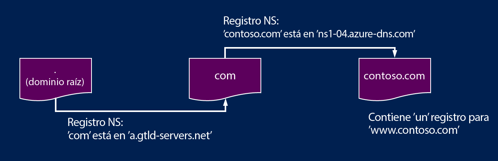

<properties
   pageTitle="Delegación de dominios en DNS de Azure | Microsoft Azure"
   description="Información sobre cómo cambiar la delegación de dominios y usar los servidores de nombres DNS de Azure para ofrecer hospedaje de dominios."
   services="dns"
   documentationCenter="na"
   authors="joaoma"
   manager="carmonm"
   editor=""/>

<tags
   ms.service="dns"
   ms.devlang="na"
   ms.topic="get-started-article"
   ms.tgt_pltfrm="na"
   ms.workload="infrastructure-services"
   ms.date="12/15/2015"
   ms.author="joaoma"/>

# Delegación de dominios en DNS de Azure

DNS de Azure es un servicio de hospedaje para dominios DNS. Para que las consultas DNS de un dominio lleguen a DNS de Azure, es necesario haber delegado dicho dominio en DNS de Azure desde el dominio primario. En este artículo se explica cómo funciona la delegación de dominios y cómo delegar dominios en DNS de Azure.

## Funcionamiento de la delegación de DNS

### Dominios y zonas

Un dominio es un nombre exclusivo dentro del sistema de nombres de dominio, como por ejemplo “contoso.com”. Un registrador de dominios es una empresa que puede ofrecer nombres de dominio de Internet. Verificará si el dominio de Internet deseado se encuentra disponible para que pueda adquirirlo. Tras haber registrado el nombre de dominio, será el titular legal de dicho nombre. Si ya dispone de un dominio de Internet, utilizará al registrador de dominios actual para delegar en DNS de Azure.

>[AZURE.NOTE]Para obtener más información sobre quién posee un nombre de dominio determinado, o para obtener información sobre cómo comprar un dominio, consulte [Administración de dominios de Internet en Azure AD](https://msdn.microsoft.com/library/azure/hh969248.aspx).

Una zona DNS se usa para hospedar los registros DNS de un dominio concreto. Por ejemplo, el dominio “contoso.com” puede contener una serie de registros DNS como “mail.contoso.com” (para un servidor de correo) y “www.contoso.com” (para un sitio web).

DNS de Azure le permite hospedar una zona DNS desde donde poder administrar los registros DNS de un dominio en Azure. Tenga en cuenta que DNS de Azure no es el registrador de dominios.

El sistema de nombres de dominio es una jerarquía de dominios. La jerarquía empieza por el dominio “raíz”, cuyo nombre es sencillamente “.”. Después de él, se encuentran los dominios de primer nivel, a saber, “com”, “net”, “org”, “uk” o “jp”. A continuación, se colocan los dominios de segundo nivel, como “org.uk” o “co.jp”, y así sucesivamente.

Los dominios de la jerarquía de DNS se hospedan en zonas DNS independientes. Estas zonas están distribuidas globalmente, hospedadas por servidores de nombres DNS de todo el mundo.

### Resolución y delegación

Existen dos tipos de servidores DNS:

- Un servidor DNS _autoritativo_ hospeda zonas DNS. Solo responde a las consultas DNS de los registros de dichas zonas.
- Un servidor DNS _recursivo_ no hospeda zonas DNS. Responde a todas las consultas DNS, para lo que realiza una llamada a los servidores DNS autoritativos a fin de recopilar los datos que necesita.

Los clientes DNS de equipos o dispositivos móviles suelen llamar a un servidor DNS recursivo para realizar todas las consultas DNS que las aplicaciones cliente necesitan.

Cuando un servidor DNS recursivo recibe una consulta para un registro DNS, como “www.contoso.com”, primero necesita encontrar el servidor de nombres que hospeda la zona para el dominio “contoso.com”. Para ello, empieza por los servidores de nombres raíz y, a partir de ahí, busca los servidores de nombres que hospedan la zona “com”. A continuación, consulta los servidores de nombres “com” para encontrar los servidores de nombres que hospedan la zona “contoso.com”. Por último, puede consultar estos servidores de nombres para “www.contoso.com”.

A esto es a lo que se le denomina la resolución del nombre DNS (en el sentido estricto, la resolución DNS incluye pasos adicionales, como seguir los CNAME, pero no es importante saber cómo funciona la delegación DNS).

¿Cómo “apunta” una zona primaria a los servidores de nombres de una zona secundaria? Para ello usa un tipo especial de registro DNS, denominado registro NS (NS, por sus siglas en inglés, significa “servidor de nombres”). Por ejemplo, la zona raíz contiene registros NS para “com”, donde se muestran los servidores de nombres de la zona “com”. A su vez, la zona “com” contiene registros NS para “contoso.com”, donde se muestran los servidores de nombres para la zona “contoso.com”. A la acción que conlleva configurar los registros NS para una zona secundaria en una zona primaria se le denomina delegación de dominios.

Cada delegación realmente contiene dos copias de los registros NS, una en la zona primaria que apunta a la secundaria y otra en la misma zona secundaria. La zona “contoso.com” contiene los registros NS para “contoso.com” (además de los registros NS de “com”). Estos registros se corresponden con registros NS autoritativos, que se sitúan en la cúspide de la zona secundaria.

## Delegación de un dominio en DNS de Azure

Después de haber creado la zona DNS en DNS de Azure, es necesario configurar los registros NS en la zona primaria para que DNS de Azure se convierta en el origen de autoridad para la resolución de nombres de la zona correspondiente. Si se trata de dominios adquiridos a un registrador, este último ofrecerá la opción de configurar tales registros NS.

>[AZURE.NOTE]No tiene que poseer un dominio para poder crear una zona DNS con dicho nombre de dominio en DNS de Azure. No obstante, sí necesita disponer de un dominio para configurar la delegación en DNS de Azure con un registrador.

Por ejemplo, supongamos que adquiere el dominio “contoso.com” y que crea una zona con el nombre “contoso.com” en DNS de Azure. Como propietario del dominio, el registrador le ofrecerá la opción de configurar las direcciones del servidor de nombres (es decir, los registros NS) para el dominio. El registrador almacenará estos registros NS en el dominio primario, en este caso, “.com”. A los clientes de todo el mundo se les remitirá entonces al dominio en cuestión en la zona DNS de Azure al tratar de resolver registros DNS en “contoso.com”.

Para configurar la delegación, necesita saber los nombres del servidor de nombres de la zona de que se trate. DNS de Azure asigna los servidores de nombres a partir de un grupo cada vez que se crea una zona y los almacena en registros NS autoritativos que se crean automáticamente dentro de la zona correspondiente. Por tanto, para ver los nombres del servidor de nombres, solo necesita recuperar estos registros.

Mediante Azure PowerShell, los registros NS autoritativos pueden recuperarse como se explica a continuación (el nombre de registro “@” se usa para hacer referencia a los registros que se encuentran en la cúspide de la zona).

	PS C:> $zone = Get-AzureRmDnsZone –Name contoso.com –ResourceGroupName MyAzureResourceGroup
	PS C:> Get-AzureRmDnsRecordSet –Name “@” –RecordType NS –Zone $zone

	Name              : @
	ZoneName          : contoso.com
	ResourceGroupName : MyResourceGroup
	Ttl               : 3600
	Etag              : 5fe92e48-cc76-4912-a78c-7652d362ca18
	RecordType        : NS
	Records           : {ns1-04.azure-dns.com, ns2-04.azure-dns.net, ns3-04.azure-dns.org,
                     ns4-04.azure-dns.info}
	Tags              : {}

En este ejemplo, a la zona “contoso.com” se le han asignado los servidores de nombres “ns1-04.azure-dns.com”, “ns2-04.azure-dns.net”, “ns3-04.azure-dns.org” y “ns4-04.azure-dns.info”.

Cada registrador dispone de sus propias herramientas de administración de DNS para cambiar los registros de servidores de nombres de un dominio. En la página de administración de DNS del registrador, edite los registros NS y reemplácelos con los que DNS de Azure ha creado.

>[AZURE.NOTE]Al delegar un dominio a DNS de Azure, debe usar los nombres de servidor DNS proporcionados por DNS de Azure. No debe usar 'registros de adherencia' para apuntar a direcciones IP del servidor DNS de Azure, ya que estas direcciones IP pueden cambiar en el futuro. Las delegaciones que usan nombres de servidor DNS en su propia zona (a veces denominado "servidores DNS personales") no se admiten de momento en DNS de Azure.

Cuando finalice la delegación, puede verificar la resolución de nombres funciona con una herramienta como “nslookup” para consultar el registro SOA para la zona pertinente (que también se crea automáticamente cuando se crea la zona).

Tenga en cuenta que no es necesario especificar los servidores de nombres DNS de Azure, ya que el proceso de resolución DNS normal encontrará los servidores de nombres automáticamente si la delegación se ha configurado correctamente.

	PS C:\> nslookup –type=SOA contoso.com

	Server: ns1-04.azure-dns.com
	Address: 208.76.47.4

	contoso.com
	primary name server = ns1-04.azure-dns.com
	responsible mail addr = msnhst.microsoft.com
	serial = 1
	refresh = 900 (15 mins)
	retry = 300 (5 mins)
	expire = 604800 (7 days)
	default TTL = 300 (5 mins)

## Delegación de subdominios en DNS de Azure

Tras configurar y delegar "contoso.com" en DNS de Azure, suponga que desea configurar una zona secundaria independiente, 'partners.contoso.com'. Esto sigue un proceso similar al de una delegación normal:

1. Cree la zona secundaria 'partners.contoso.com' en DNS de Azure.
2. Busque los registros NS autoritativos en la zona secundaria para obtener los servidores de nombres que hospedan la zona secundaria en DNS de Azure.
3. Delegue la zona secundaria mediante la configuración de los registros NS de la zona principal que apuntan a la zona secundaria.

La única diferencia es que en el paso 3 los registros NS deben crearse en la zona principal "contoso.com" de DNS de Azure, en lugar de configurarse a través de un registrador de dominios.

En el siguiente ejemplo de PowerShell se muestra. En primer lugar, se crean las zonas primaria y secundaria (dichas zonas pueden estar en el mismo grupo de recursos o grupos diferentes).

	PS C:\> $parent = New-AzureRmDnsZone -Name contoso.com -ResourceGroupName RG1
	PS C:\> $child = New-AzureRmDnsZone -Name partners.contoso.com -ResourceGroupName RG1

A continuación, se recuperan los registros NS autoritativos de la zona secundaria, tal como se muestra en el ejemplo siguiente:

	PS C:\> $child_ns_recordset = Get-AzureRmDnsRecordSet -Zone $child -Name "@" -RecordType NS

Por último, se crea el conjunto de registros NS correspondiente en la zona primaria para completar la delegación (tenga en cuenta que el nombre del conjunto de registros de la zona primaria coincide con el nombre de la zona secundaria, en este caso "partners").

	PS C:\> $parent_ns_recordset = New-AzureRmDnsRecordSet -Zone $parent -Name "partners" -RecordType NS -Ttl 3600
	PS C:\> $parent_ns_recordset.Records = $child_ns_recordset.Records
	PS C:\> Set-AzureRmDnsRecordSet -RecordSet $parent_ns_recordset

Como al delegar mediante un registrador, es posible comprobar que todo esté configurado correctamente mediante la búsqueda del registro SOA de la zona secundaria.

	PS C:\> nslookup –type=SOA partners.contoso.com

	Server: ns1-08.azure-dns.com
	Address: 208.76.47.8

	partners.contoso.com
		primary name server = ns1-08.azure-dns.com
		responsible mail addr = msnhst.microsoft.com
		serial = 1
		refresh = 900 (15 mins)
		retry = 300 (5 mins)
		expire = 604800 (7 days)
		default TTL = 300 (5 mins)

## Pasos siguientes

[Administración de zonas DNS](dns-operations-dnszones.md)

[Administración de registros DNS](dns-operations-recordsets.md)

[Automatización de operaciones de Azure con .NET SDK](dns-sdk.md)

[Referencia de la API de REST a DNS de Azure](https://msdn.microsoft.com/library/azure/mt163862.aspx)

<!---HONumber=AcomDC_0121_2016-->