<properties 
	pageTitle="Tutorial de ASP.NET MVC para DocumentDB: desarrollo de aplicaciones web | Microsoft Azure" 
	description="Tutorial de ASP.NET MVC para crear una aplicación web MVC con DocumentDB. Almacenará el código JSON y accederá a los datos desde una aplicación ToDo hospedada en Sitios web de Azure. Tutorial de ASP NET MVC paso a paso." 
	keywords="tutorial de asp.net mvc, desarrollo de aplicaciones web, aplicación web de mvc, tutorial de asp net mvc paso a paso"
	services="documentdb" 
	documentationCenter=".net" 
	authors="ryancrawcour" 
	manager="jhubbard" 
	editor="cgronlun"/>

<tags 
	ms.service="documentdb" 
	ms.workload="data-services" 
	ms.tgt_pltfrm="na" 
	ms.devlang="dotnet" 
	ms.topic="hero-article" 
	ms.date="02/09/2016" 
	ms.author="ryancraw"/>

#Tutorial de ASP.NET MVC: Desarrollo de una aplicación web con DocumentDB

> [AZURE.SELECTOR]
- [.NET](documentdb-dotnet-application.md)
- [Node.js](documentdb-nodejs-application.md)
- [Java](documentdb-java-application.md)
- [Python](documentdb-python-application.md) 

Para resaltar cómo puede aprovechar eficazmente Azure DocumentDB para almacenar y consultar documentos JSON, este artículo proporciona un tutorial completo que muestra cómo crear una aplicación ToDo mediante Azure DocumentDB. Las tareas se almacenarán como documentos JSON en Azure DocumentDB.

Este tutorial muestra cómo utilizar el servicio de DocumentDB proporcionado por Azure para almacenar y tener acceso a datos desde una aplicación web de ASP.NET MVC hospedada en Azure.

> [AZURE.TIP] En este tutorial se supone que tiene experiencia previa con ASP.NET MVC y Sitios web Azure. Si no está familiarizado con ASP.NET o con las [herramientas de requisitos previos](#_Toc395637760), le recomendamos que descargue el proyecto de ejemplo completo de [GitHub][] y siga las instrucciones de este ejemplo. Una vez compilado, puede revisar este artículo para obtener información sobre el código en el contexto del proyecto.

## Requisitos previos del tutorial de base de datos

Antes de seguir las instrucciones del presente artículo, debe asegurarse de tener lo siguiente:

- Una cuenta de Azure activa. En caso de no tener ninguna, puede crear una cuenta de evaluación gratuita en tan solo unos minutos. Para obtener más información, consulte [Evaluación gratuita de Azure](https://azure.microsoft.com/pricing/free-trial/).
- [Visual Studio 2013](http://www.visualstudio.com/) Update 4 o superior.
- SDK de Azure para .NET versión 2.5.1 o posterior, disponible a través del [Instalador de plataforma web de Microsoft][].

Todas las capturas de pantalla en este artículo se han tomado con Visual Studio 2013 con Update 4 aplicado y el SDK de Azure para .NET versión 2.5.1. Si el sistema está configurado con versiones diferentes, es probable que las pantallas y las opciones no coincidan completamente, pero si cumple los requisitos previos mencionados, esta solución debe funcionar.

## Paso 1: Creación de una cuenta de base de datos de DocumentDB

Comenzaremos por crear una cuenta de DocumentDB. Si ya tiene una cuenta, puede ir a [Creación de una nueva aplicación ASP.NET MVC](#_Toc395637762).

[AZURE.INCLUDE [documentdb-create-dbaccount](../../includes/documentdb-create-dbaccount.md)]

[AZURE.INCLUDE [documentdb-keys](../../includes/documentdb-keys.md)]

  Ahora veremos cómo crear una aplicación ASP.NET MVC nueva desde el principio.

## Paso 2: Creación de una aplicación ASP.NET MVC nueva

Ahora que tiene una cuenta, creemos nuestro nuevo proyecto de ASP.NET.

1. En Visual Studio, en el menú **Archivo**, seleccione **Nuevo** y, a continuación, haga clic en **Proyecto**.

   	Aparecerá el cuadro de diálogo **Nuevo proyecto**.
2. En el panel **Tipos de proyecto**, expanda **Plantillas**, **Visual C#**, **Web** y, a continuación, seleccione **Aplicación web ASP.NET**.

  	

3. En el cuadro **Nombre** , escriba el nombre del proyecto. Este tutorial utiliza el nombre "todo". Si decide usar otro nombre distinto, siempre que en el tutorial se hable del espacio de nombres todo, deberá adaptar los ejemplos de código proporcionados para usar el nombre que haya dado a la aplicación.

4. Haga clic en **Examinar** para navegar hasta la carpeta donde desea crear el proyecto y, a continuación, haga clic en **Aceptar**.

  	Aparece el cuadro de diálogo **Nuevo proyecto de ASP.NET**.

  	

5. En el panel Plantillas, seleccione **MVC**.

6. Si va a hospedar la aplicación en Azure, seleccione **Hospedar en la nube** en la esquina inferior derecha para que Azure hospede la aplicación. Hemos seleccionado hospedar en la nube y ejecutar la aplicación hospedada en Sitio web Azure. Al seleccionar esta opción se aprovisionará previamente Sitio web Azure para usted y le será mucho más fácil implementar la aplicación de trabajo final. Si desea hospedar en otro sitio o no desea configurar Azure por adelantado, simplemente borre **Hospedar en la nube**.

7. Haga clic en **Aceptar** y deje que Visual Studio realice la tarea de scaffolding de la plantilla ASP.NET MVC vacía.

8. Si decide alojarla en la nube, verá al menos una pantalla adicional que le solicitará que inicie sesión en su cuenta de Azure y proporcione valores para el nuevo sitio web. Proporcione todos los valores adicionales y continúe.

  	No he elegido "Servidor de base de datos" aquí porque no estamos usando un servidor de Base de datos SQL de Azure aquí, vamos a crear una nueva cuenta de Azure DocumentDB más adelante en el Portal de Azure.

	Para obtener más información sobre cómo elegir un **plan del Servicio de aplicaciones** y un **grupo de recursos**, consulte [Introducción detallada sobre los planes del Servicio de aplicaciones de Azure](../app-service/azure-web-sites-web-hosting-plans-in-depth-overview.md).

  	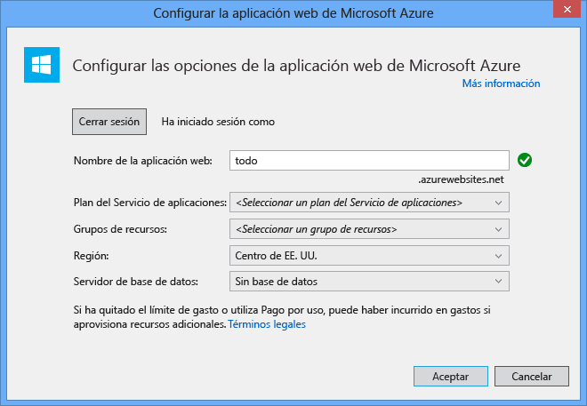

9. Después de que Visual Studio haya terminado de crear la aplicación MVC reutilizable, tiene una aplicación ASP.NET vacía que puede ejecutar de manera local.

	Omitiremos la ejecución del proyecto localmente, ya que estoy seguro de que todos hemos visto la aplicación "Hola a todos" de ASP.NET. Vayamos directo a agregar DocumentDB a este proyecto y compilar la aplicación.

## Paso 3: Incorporación de DocumentDB al proyecto de aplicación web MVC

Ahora que ya tenemos la mayoría de los mecanismos de ASP.NET MVC que necesitamos para esta solución vayamos ahora al objetivo real de este tutorial, la incorporación de Azure DocumentDB a nuestra aplicación web MVC.

1. El SDK .NET de DocumentDB se empaqueta y distribuye como un paquete de NuGet. Para obtener el paquete de NuGet en Visual Studio, utilice el Administrador de paquetes de NuGet en Visual Studio haciendo clic con el botón secundario en el proyecto en el **Explorador de soluciones** y, a continuación, haciendo clic en **Administrar paquetes de NuGet**.

  	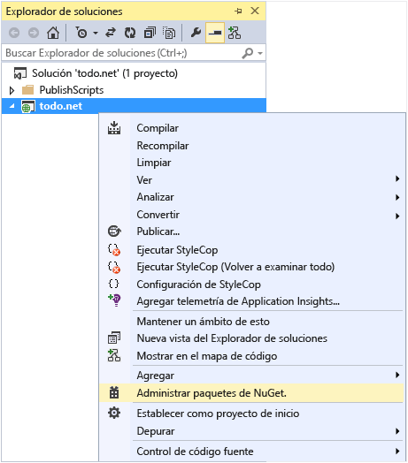

    Aparecerá el cuadro de diálogo **Administrar paquetes de NuGet**.

2. En el cuadro **Buscar en línea**, escriba ***Azure DocumentDB***.
    
    En los resultados, instale el paquete **Biblioteca de cliente de Microsoft Azure DocumentDB**. De esta manera se descarga e instala el paquete de DocumentDB además de todas las dependencias, como Newtonsoft.Json.

  	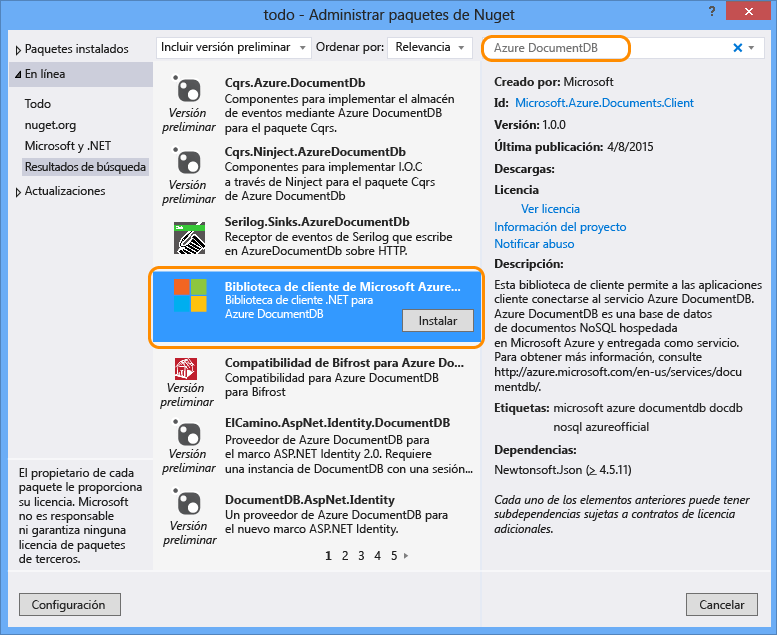

  	También puede usar la Consola del Administrador de paquetes para instalar el paquete. Para ello, en el menú **Herramientas**, haga clic en **Administrador de paquetes de NuGet** y, a continuación, haga clic en **Consola del Administrador de paquetes**. En el símbolo del sistema, escriba lo siguiente:

    	Install-Package Microsoft.Azure.DocumentDB

3. Una vez instalado el paquete, la solución de Visual Studio debe ser similar a lo siguiente con dos nuevas referencias agregadas, Microsoft.Azure.Documents.Client y Newtonsoft.Json.

  	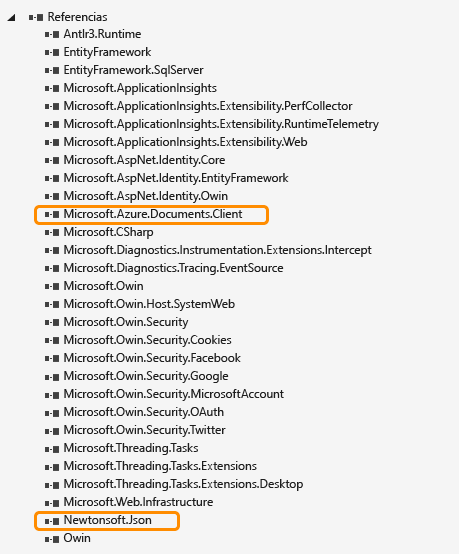

##Paso 4: Configuración de la aplicación ASP.NET MVC
 
Ahora vamos a agregar a esta aplicación de MVC modelos, vistas y controladores:

- [Adición de un modelo](#_Toc395637764).
- [Adición de un controlador](#_Toc395637765).
- [Adición de vistas](#_Toc395637766).

### Adición de un modelo de datos JSON

Comencemos creando la **M** en MVC, el modelo.

1. En el **Explorador de soluciones**, haga clic con el botón derecho en la carpeta **Modelos**, haga clic en **Agregar** y, a continuación, haga clic en **Clase**.

  	Aparecerá el cuadro de diálogo **Agregar nuevo elemento**.

2. Ponga a la nueva clase el nombre **Item.cs** y haga clic en **Agregar**.

3. En este nuevo archivo **Item.cs**, agregue lo siguiente después de la última *instrucción using*.
		
		using Newtonsoft.Json;
	
4. Ahora, reemplace este código
		
		public class Item
		{
		}

	por el siguiente.
		
        public class Item
        {
        	[JsonProperty(PropertyName="id")]
        	public string Id { get; set; }
		
        	[JsonProperty(PropertyName="name")]
        	public string Name { get; set; }
		
        	[JsonProperty(PropertyName = "desc")]
        	public string Description { get; set; }
		
       		[JsonProperty(PropertyName="isComplete")]
        	public bool Completed { get; set; }    
		}

	Todos los datos de DocumentDB se transmiten mediante la conexión y se almacenan como JSON. Para controlar la forma en la que JSON.NET serializa y deserializa los objetos, puede usar el atributo **JsonProperty** como se mostró en la clase de **elemento** que acabamos de crear. No **tiene** que hacer esto pero quería asegurarme de que mis propiedades siguen las convenciones de nomenclatura de mezcla de mayúsculas y minúsculas de JSON.
	
	No solo puede controlar el formato del nombre de propiedad cuando va en JSON, sino que puede cambiar el nombre por completo de las propiedades de .NET como hice con la propiedad **Description**.
	

### Adición de un controlador

Se encarga de **M**. Creemos ahora la **C** de MVC, una clase de controlador.

1. En el **Explorador de soluciones**, haga clic con el botón secundario en la carpeta **Controladores** y, a continuación, haga clic en **Agregar** y, por último, en **Controlador**.

    Aparecerá el cuadro de diálogo **Agregar scaffold**.

2. Seleccione **Controlador MVC 5 - Vacío** y, a continuación, haga clic en **Agregar**.

	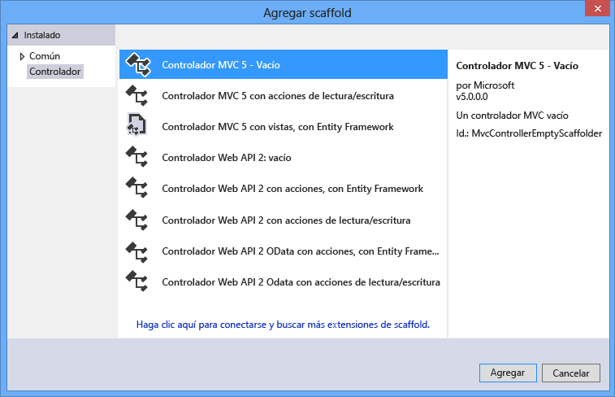

3. Asigne un nombre al nuevo controlador, **ItemController.**

	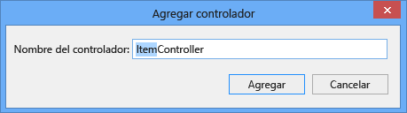

	Una vez creado el archivo, la solución de Visual Studio debe ser similar a lo siguiente con el nuevo archivo ItemController.cs en el **Explorador de soluciones**. También se muestra el nuevo archivo Item.cs creado anteriormente.

	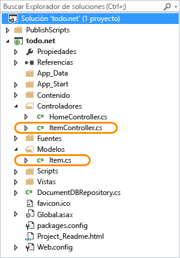

	Puede cerrar ItemController.cs, volveremos a él más tarde.

### Adición de vistas

Por último, vamos a crear la **V** de MVC, las vistas.

- [Adición de una vista de índice de elementos](#AddItemIndexView).
- [Adición de una vista de elementos nuevos](#AddNewIndexView).
- [Adición de una vista de edición de elementos](#_Toc395888515).

#### Adición de una vista de índice de elementos

1. En el **Explorador de soluciones**, expanda la carpeta **Vistas**, haga clic con el botón derecho en la carpeta **Elemento** vacía que ha creado Visual Studio para usted cuando agregó **ItemController** anteriormente, haga clic en **Agregar** y, a continuación, haga clic en **Vista**.

	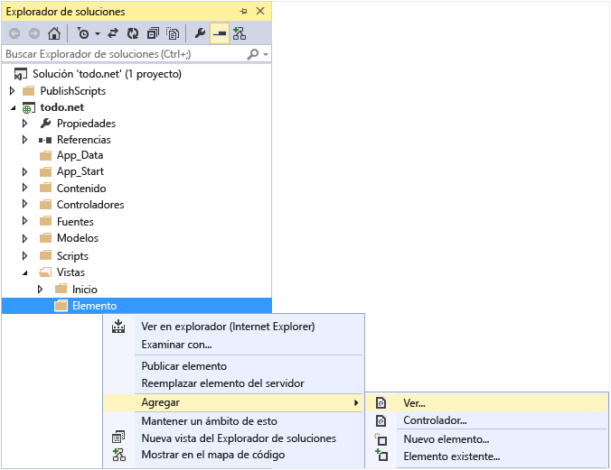

2. En el cuadro de diálogo **Agregar vista**, realice lo siguiente:
	- En el cuadro **Nombre de vista**, escriba ***Índice***.
	- En el cuadro **Plantilla**, seleccione ***Lista***.
	- En el cuadro **Clase de modelo**, seleccione ***Elemento (todo.Models)***.
	- Deje el cuadro **Clase de contexto de datos** vacío. 
	- En el cuadro de página de diseño, escriba ***~/Views/Shared/\_Layout.cshtml***.
	
	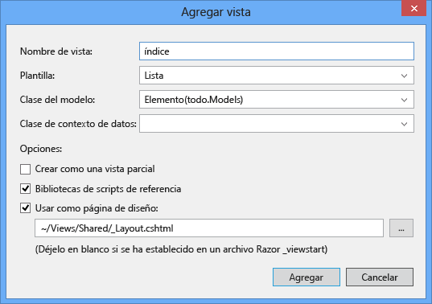

3. Después de que se hayan establecido todos estos valores, haga clic en **Agregar** y permita que Visual Studio cree una nueva vista de plantilla. Después de esto, se abrirá el archivo cshtml que se creó. Podemos cerrar este archivo en Visual Studio, ya que volveremos a él más tarde.

#### Adición de una vista de elementos nuevos

De forma parecida a cómo se crea una vista de **índice de elementos**, crearemos ahora una nueva vista para crear nuevos **elementos**.

1. En el **Explorador de soluciones**, vuelva a hacer clic con el botón derecho en la carpeta **Elemento**, haga clic en **Agregar** y, a continuación, haga clic en **Vista**.

2. En el cuadro de diálogo **Agregar vista**, realice lo siguiente:
    - En el cuadro **Nombre de vista**, escriba ***Crear***.
    - En el cuadro **Plantilla**, seleccione ***Crear***.
    - En el cuadro **Clase de modelo**, seleccione ***Elemento (todo.Models)***.
    - Deje el cuadro **Clase de contexto de datos** vacío.
    - En el cuadro de página de diseño, escriba ***~/Views/Shared/\_Layout.cshtml***.
    - Haga clic en **Agregar**.

#### Adición de una vista de edición de elementos

Finalmente, agregue una última vista para editar un **elemento** como se hizo anteriormente.

1. En el **Explorador de soluciones**, vuelva a hacer clic con el botón derecho en la carpeta **Elemento**, haga clic en **Agregar** y, a continuación, haga clic en **Vista**.

2. En el cuadro de diálogo **Agregar vista**, realice lo siguiente:
    - En el cuadro **Nombre de vista**, escriba ***Editar***.
    - En el cuadro **Plantilla**, seleccione ***Editar***.
    - En el cuadro **Clase de modelo**, seleccione ***Elemento (todo.Models)***.
    - Deje el cuadro **Clase de contexto de datos** vacío. 
    - En el cuadro de página de diseño, escriba ***~/Views/Shared/\_Layout.cshtml***.
    - Haga clic en **Agregar**.

Una vez hecho esto, cierre todos los documentos cshtml en Visual Studio, ya que volveremos a estas vistas más tarde.

## Paso 5: Conexión de DocumentDB

Ahora que el material de MVC estándar se tiene en cuenta, agreguemos el código para DocumentDB.

En esta sección, agregaremos código para controlar lo siguiente:

- [Lista de elementos incompletos](#_Toc395637770).
- [Adición de elementos](#_Toc395637771).
- [Edición de elementos](#_Toc395637772).

### Lista de elementos incompletos en la aplicación web MVC

Lo primero que debe hacerse es agregar una clase que contenga toda la lógica para utilizar y conectarse a DocumentDB. Para este tutorial, encapsularemos toda esta lógica en una clase de repositorio denominada DocumentDBRepository.

1. En el **Explorador de soluciones**, haga clic con el botón derecho en el proyecto, haga clic en **Agregar** y, a continuación, haga clic en **Clase**. Ponga a la nueva clase el nombre **DocumentDBRepository** y haga clic en **Agregar**.
 
2. En **DocumentDBRepository** recién creada, clasifique y agregue las *instrucciones using* siguientes sobre la declaración *namespace*
		
		using Microsoft.Azure.Documents; 
	    using Microsoft.Azure.Documents.Client; 
	    using Microsoft.Azure.Documents.Linq; 
		using System.Configuration;
		using System.Linq.Expressions;
		using System.Threading.Tasks;

	Ahora, reemplace este código

		public class DocumentDBRepository
		{
    	}

	por el siguiente.

    	
		public static class DocumentDBRepository<T>
    	{
			//Use the Database if it exists, if not create a new Database
	    	private static Database ReadOrCreateDatabase()
	    	{
	        	var db = Client.CreateDatabaseQuery()
	        	                .Where(d => d.Id == DatabaseId)
	        	                .AsEnumerable()
	        	                .FirstOrDefault();
				
	        	if (db == null)
	        	{
	        	    db = Client.CreateDatabaseAsync(new Database { Id = DatabaseId }).Result;
	        	}
				
	        	return db;
	    	}
			
			//Use the DocumentCollection if it exists, if not create a new Collection
	    	private static DocumentCollection ReadOrCreateCollection(string databaseLink)
	   		{
	    	    var col = Client.CreateDocumentCollectionQuery(databaseLink)
	        	                  .Where(c => c.Id == CollectionId)
	        	                  .AsEnumerable()
	        	                  .FirstOrDefault();
		
	        	if (col == null)
	        	{
					var collectionSpec = new DocumentCollection { Id = CollectionId };
					var requestOptions = new RequestOptions {OfferType = "S1" };
					
	        	    col = Client.CreateDocumentCollectionAsync(databaseLink, collectionSpec, requestOptions).Result;
	        	}
				
	        	return col;
	    	}
			
			//Expose the "database" value from configuration as a property for internal use
     	   	private static string databaseId;
     	   	private static String DatabaseId
     	   	{
				get
				{
					if (string.IsNullOrEmpty(databaseId))
					{
						databaseId = ConfigurationManager.AppSettings["database"];
					}
				
					return databaseId;
				}
       	 	}
			
			//Expose the "collection" value from configuration as a property for internal use
    	    private static string collectionId;
    	    private static String CollectionId
    	    {
				get
				{
					if (string.IsNullOrEmpty(collectionId))
					{
						collectionId = ConfigurationManager.AppSettings["collection"];
					}
				
					return collectionId;
				}
    	    }
			
			//Use the ReadOrCreateDatabase function to get a reference to the database.
    	    private static Database database;
    	    private static Database Database
    	    {
				get
				{
					if (database == null)
					{
						database = ReadOrCreateDatabase();
					}
					
					return database;
				}
    	    }
			
			//Use the ReadOrCreateCollection function to get a reference to the collection.
    	    private static DocumentCollection collection;
    	    private static DocumentCollection Collection
    	    {
				get
				{
					if (collection == null)
					{
						collection = ReadOrCreateCollection(Database.SelfLink);
					}
					
					return collection;
				}
    	    }
			
			//This property establishes a new connection to DocumentDB the first time it is used, 
			//and then reuses this instance for the duration of the application avoiding the
			//overhead of instantiating a new instance of DocumentClient with each request
    	    private static DocumentClient client;
    	    private static DocumentClient Client
    	    {
    	        get
    	        {
    	            if (client == null)
    	            {
						string endpoint = ConfigurationManager.AppSettings["endpoint"];
						string authKey = ConfigurationManager.AppSettings["authKey"];
						Uri endpointUri = new Uri(endpoint);
						client = new DocumentClient(endpointUri, authKey);
    	            }
    	            
    	            return client;
    	        }
    	    }
    	}

	> [AZURE.TIP] Al crear DocumentCollection nuevo, puede proporcionar un parámetro RequestOptions opcional de OfferType, que le permite especificar el nivel de rendimiento de la nueva colección. Si no se pasa este parámetro, se utilizará el tipo de oferta predeterminado. Para obtener más información sobre los tipos de oferta de DocumentDB , consulte [Niveles de coherencia de DocumentDB](documentdb-performance-levels.md)

3. Estamos leyendo algunos valores de la configuración; por tanto, abra el archivo **Web.config** de su aplicación y agregue las siguientes líneas debajo de la sección `<AppSettings>`.
	
    	<add key="endpoint" value="enter the URI from the Keys blade of the Azure Portal"/>
    	<add key="authKey" value="enter the PRIMARY KEY, or the SECONDARY KEY, from the Keys blade of the Azure  Portal"/>
    	<add key="database" value="ToDoList"/>
    	<add key="collection" value="Items"/>
	
4. Ahora, actualice los valores de *endpoint* y *authKey* mediante la hoja Claves del Portal de Azure. Utilice el **URI** de la hoja Claves como el valor de la configuración de endpoint y utilice **CLAVE PRINCIPAL** o **CLAVE SECUNDARIA** de la hoja Claves como el valor de la configuración de authKey.

    Se encarga de cableado del repositorio de DocumentDB; agreguemos ahora nuestra lógica de aplicación.

5. Lo primero que queremos poder hacer con una aplicación de lista todo es mostrar los elementos incompletos. Copie y pegue el siguiente fragmento de código en cualquier parte dentro de la clase **DocumentDBRepository**.

	    public static IEnumerable<T> GetItems(Expression<Func<T, bool>> predicate) 
	    {
			return Client.CreateDocumentQuery<T>(Collection.DocumentsLink) 
				.Where(predicate) 
				.AsEnumerable(); 
		} 

6. Abra **ItemController** que agregamos anteriormente y agregue las *instrucciones using* siguientes sobre la declaración namespace.

		using System.Net;
		using System.Threading.Tasks;
		using todo.Models;

	Si el proyecto no se denomina "todo", deberá actualizar con "todo. Models"; para reflejar el nombre del proyecto.

	Ahora, reemplace este código

		//GET: Item
		public ActionResult Index()
		{
			return View();
		}

	por el siguiente.

    	public ActionResult Index()
    	{
			var items = DocumentDBRepository<Item>.GetItems(d => !d.Completed);
			return View(items);
    	}
	
En este punto, la solución debe ser capaz de compilar sin errores.

Si ejecuta la aplicación ahora, irá a **HomeController** y a la vista de **índice** de ese controlador. Este es el comportamiento predeterminado para el proyecto de plantillas MVC que seleccionamos al comienzo, pero no queremos eso. Cambiemos el enrutamiento en esta aplicación MVC para modificar este comportamiento.

Abra ***App\\_Start\\RouteConfig.cs***, busque la línea que empieza con "defaults:" y cámbiela para que se parezca a lo siguiente.

    	defaults: new { controller = "Item", action = "Index", id = UrlParameter.Optional }

Esto indica ahora a ASP.NET MVC que si no ha especificado un valor en la dirección URL para controlar el comportamiento de enrutamiento que, en lugar de **Inicio**, usa **Elemento** como controlador e **Índice** de usuario como vista.

Si ejecuta la aplicación, llamará a su **ItemController**, que llamará a la clase de repositorio y usará el método GetItems para devolver todos los elementos incompletos a la vista **Vistas**\\**Elemento**\\**Índice**.

Si crea y ejecuta este proyecto ahora, deberá ver algo parecido a esto.

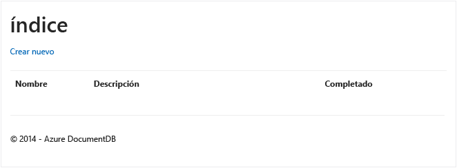

### Adición de elementos

Pongamos algunos elementos en nuestra base de datos de modo que tengamos algo más que una cuadrícula vacía que ver.

Agreguemos algo de código a DocumentDBRepository e ItemController para mantener el registro en DocumentDB.

1.  Agregue el siguiente método a su clase **DocumentDBRepository**.

    	public static async Task<Document> CreateItemAsync(T item)
   	 	{
   	   		return await Client.CreateDocumentAsync(Collection.SelfLink, item);
   		}

	Este método simplemente toma un objeto que se le haya pasado y lo mantiene en DocumentDB.

2. Abra el archivo ItemController.cs y agregue el siguiente fragmento de código en la clase. Así es cómo ASP.NET MVC sabe qué hacer para la acción **Crear**. En este caso basta con presentar la vista Create.cshtml asociada creada anteriormente.

    	public ActionResult Create()
    	{ 
			return View(); 
   		}

	Ahora necesitamos un poco más de código en este controlador que aceptará el envío desde la vista **Crear**.

2. Agregue el siguiente bloque de código a la clase ItemController.cs que le indica a ASP.NET MVC lo que debe hacer con un formulario POST para este controlador.
	
    	[HttpPost]
    	[ValidateAntiForgeryToken]
   	 	public async Task<ActionResult> Create([Bind(Include = 	"Id,Name,Description,Completed")] Item item)  
  	  	{
			if (ModelState.IsValid)  
			{  
			    await DocumentDBRepository<Item>.CreateItemAsync(item);
			    return RedirectToAction("Index");  
			}   
			return View(item);   
		}
	Este código llama a DocumentDBRepository y usa el método CreateItemAsync para conservar el nuevo elemento todo en la base de datos.
 
	**Security Note**: el atributo **ValidateAntiForgeryToken** se usa aquí para ayudarle a proteger esta aplicación contra ataques de falsificación de solicitud entre sitios. Es más que solo agregar este atributo, sus vistas también necesitan trabajar con este token antifalsificación. Para obtener más información acerca del tema, así como ejemplos de cómo implementarlo correctamente, consulte [Prevención de la falsificación de solicitud entre sitios][]. El código de origen proporcionado en [GitHub][] tiene la implementación completa en su lugar.

	**Nota de seguridad**: también usamos el atributo **Bind** en el parámetro de método para ayudar a proteger contra ataques de publicación en exceso. Para obtener más información, consulte [Operaciones CRUD básicas en ASP.NET MVC][].

Esto finaliza el código necesario para agregar elementos nuevos en nuestra base de datos.

### Edición de elementos

Hay una última cosa que tenemos que hacer, que es agregar la capacidad de editar **elementos** en la base de datos y marcarlos como completados. La vista de edición ya se ha agregado al proyecto, por lo que necesitamos agregar código a nuestro controlador y a la clase **DocumentDBRepository** de nuevo.

1. Agregue lo siguiente a la clase **DocumentDBRepository**.

    	public static T GetItem(Expression<Func<T, bool>> predicate)
    	{
        	return Client.CreateDocumentQuery<T>(Collection.DocumentsLink)
                    	.Where(predicate)
                    	.AsEnumerable()
                    	.FirstOrDefault();
    	}		

    	public static async Task<Document> UpdateItemAsync(string id, T item)
    	{
        	Document doc = GetDocument(id);	
        	return await Client.ReplaceDocumentAsync(doc.SelfLink, item);
    	}

		private static Document GetDocument(string id) 
		{ 
			return Client.CreateDocumentQuery(Collection.DocumentsLink) 
				.Where(d => d.Id == id) 
				.AsEnumerable() 
				.FirstOrDefault(); 
		} 
	
	El primero de estos métodos, **GetItem** captura un elemento de DocumentDB que pasa de vuelta a **ItemController** y luego continúa hasta la vista de **edición**.
	
	El segundo de los métodos que acabamos de agregar reemplaza el **documento** en DocumentDB con la versión del **documento** que se pasó desde **ItemController**.

2. Agregue lo siguiente a la clase **ItemController**.

		public ActionResult Edit(string id)
		{
		    if (string.IsNullOrEmpty(id))
		    {
		        return new HttpStatusCodeResult(HttpStatusCode.BadRequest);
		    }
					 
		    Item item = (Item)DocumentDBRepository<Item>.GetItem(d => d.Id == id);
		 	
		    if (item == null)
		    {
		        return HttpNotFound();
		    }
		 	
		    return View(item);
		}
		
    	[HttpPost]
   		[ValidateAntiForgeryToken]
    	public async Task<ActionResult> Edit([Bind(Include = "Id,Name,Description,Completed")] Item item)
    	{
     	   if (ModelState.IsValid)
    	    {
    	        await DocumentDBRepository<Item>.UpdateItemAsync(item.Id, item);
    	        return RedirectToAction("Index");
    	    }

  	      return View(item);
 	   	}
		
	
	El primer método controla el Http GET que ocurrirá cuando el usuario haga clic en el vínculo de **edición** en la vista de **índice**. Este método captura un [**documento**](http://msdn.microsoft.com/library/azure/microsoft.azure.documents.document.aspx) de DocumentDB y lo pasa a la vista de **edición**.

	La vista de **edición** realizará un Http POST en **IndexController**.
	
	El segundo método que agregamos controla el paso del objeto actualizado en DocumentDB para que se conserve en la base de datos.

Eso es todo lo necesario para ejecutar la aplicación, enumerar **elementos** incompletos, agregar nuevos **elementos** y editar **elementos**.

## Paso 6: Ejecución de la aplicación de forma local

Lleve a cabo los siguientes pasos para probar la aplicación en su máquina local:

1. Presione F5 en Visual Studio para compilar la aplicación en modo de depuración. De esa forma, se debe compilar la aplicación e iniciar un explorador con la página de cuadrícula vacía que vimos anteriormente:

	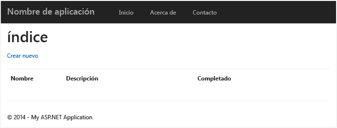

	Si se producen errores en ese momento, puede comparar su código con el proyecto de ejemplo en [GitHub][].

2. Haga clic en el vínculo **Crear nuevo** y agregue valores a los campos **Nombre** y **Descripción**. Deje la casilla **Completado** sin seleccionar; de lo contrario, el **elemento** nuevo se agregará en estado completado y no aparecerá en la lista inicial.

	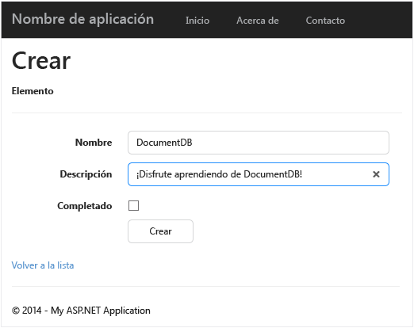

3. Haga clic en **Crear**, se le redirigirá a la vista de **índice** y aparecerá el **elemento** en la lista.

	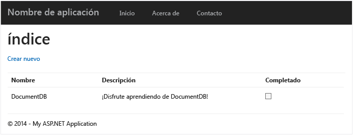

	Puede agregar algunos **elementos** más en su lista todo.

3. Haga clic en **Editar** junto a un **elemento** de la lista y llegará a la vista de **edición**, donde puede actualizar cualquier propiedad de su objeto, incluida la marca **Completado**. Si selecciona la marca **Completado** y hace clic en **Guardar**, el **elemento** se quita de la lista de tareas incompletas.

	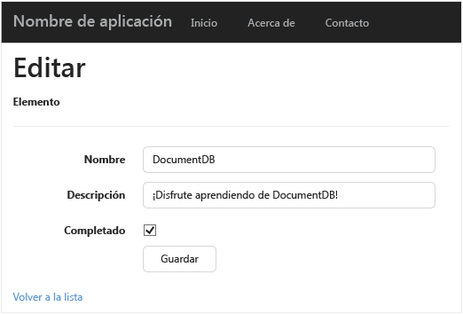

4. Una vez que haya probado la aplicación, presione Ctrl+F5 para detener la depuración de la aplicación. Está listo para la implementación.

##Paso 7: Implementación de la aplicación en Sitios web Azure

Ahora que tiene la aplicación completa funcionando correctamente con DocumentDB, vamos a implementar esta aplicación web en Sitios web Azure. Si seleccionó **Hospedar en la nube** cuando creó el proyecto vacío ASP.NET MVC, Visual Studio realmente facilita la tarea y hace gran parte del trabajo por usted.

1. Para publicar esta aplicación, todo lo que necesita hacer es hacer clic con el botón secundario en el proyecto en el **Explorador de soluciones** y hacer clic en **Publicar**.

    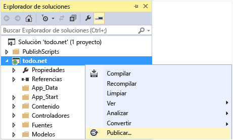

2. Todo debería estar configurado según sus credenciales; de hecho, el sitio web ya se ha creado en Azure en la **Dirección URL de destino** que se muestra. Solo tiene que hacer clic en **Publicar**.

    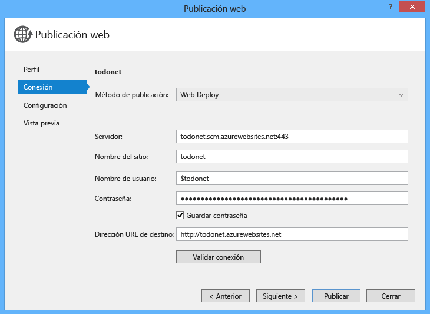

En pocos segundos, Visual Studio terminará de publicar su aplicación web y ejecutará un explorador donde podrá ver su útil trabajo ejecutándose en Azure.

##Pasos siguientes

¡Enhorabuena! Acaba de compilar su primera aplicación web ASP.NET MVC mediante Azure DocumentDB y la ha publicado en Sitios web de Azure. El código fuente de la aplicación completa, incluida la funcionalidad de detalle y eliminación que no se incluyeron en este tutorial, se puede descargar o clonar desde [GitHub][]. Por lo tanto, si está interesado en agregarlo a la aplicación, seleccione el código y agréguelo a esta aplicación.

Para agregar la funcionalidad adicional a la aplicación, revise las API disponibles en la [biblioteca de .NET de DocumentDB](https://msdn.microsoft.com/library/azure/dn948556.aspx) y haga sus aportaciones libremente a la biblioteca de .NET de DocumentDB en [GitHub][].

[*]: https://microsoft.sharepoint.com/teams/DocDB/Shared%20Documents/Documentation/Docs.LatestVersions/PicExportError
[Visual Studio Express]: http://www.visualstudio.com/products/visual-studio-express-vs.aspx
[Instalador de plataforma web de Microsoft]: http://www.microsoft.com/web/downloads/platform.aspx
[Prevención de la falsificación de solicitud entre sitios]: http://go.microsoft.com/fwlink/?LinkID=517254
[Operaciones CRUD básicas en ASP.NET MVC]: http://go.microsoft.com/fwlink/?LinkId=317598
[GitHub]: https://github.com/Azure-Samples/documentdb-net-todo-app

<!---HONumber=AcomDC_0211_2016-->