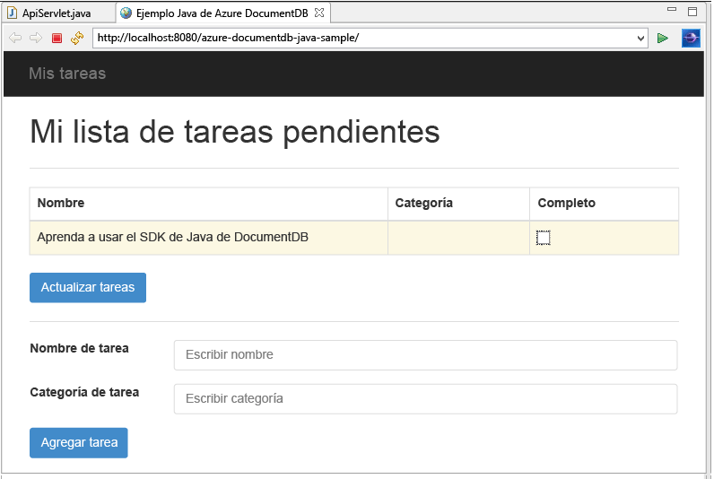
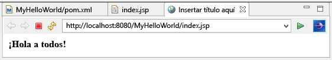

<properties 
	pageTitle="Tutorial de desarrollo de aplicaciones Java usando DocumentDB | Microsoft Azure"
	description="En este tutorial de aplicación web Java aprenderá a usar el servicio Azure DocumentDB para almacenar datos y obtener acceso a ellos desde una aplicación Java hospedada en Sitios web Azure."
	keywords="Application development, database tutorial, java application, java web application tutorial, documentdb, azure, Microsoft azure"
	services="documentdb" 
	documentationCenter="java" 
	authors="aliuy" 
	manager="jhubbard" 
	editor="mimig"/>

<tags 
	ms.service="documentdb" 
	ms.devlang="java" 
	ms.topic="hero-article" 
	ms.tgt_pltfrm="NA" 
	ms.workload="data-services" 
	ms.date="01/29/2016" 
	ms.author="andrl"/>

# Creación de una aplicación web de Java mediante DocumentDB

> [AZURE.SELECTOR]
- [.NET](documentdb-dotnet-application.md)
- [Node.js](documentdb-nodejs-application.md)
- [Java](documentdb-java-application.md)
- [Python](documentdb-python-application.md)

En este tutorial de aplicación web de Java aprenderá a usar el servicio [Microsoft Azure DocumentDB](https://portal.azure.com/#gallery/Microsoft.DocumentDB) para almacenar datos y obtener acceso a ellos desde una aplicación Java hospedada en Sitios web de Azure. En este tema, aprenderá:

- Cómo crear una aplicación de JSP básica en Eclipse.
- Uso del servicio de Azure DocumentDB mediante el [SDK de Java de DocumentDB](https://github.com/Azure/azure-documentdb-java).

Este tutorial de aplicación Java muestra cómo crear una aplicación de administración de tareas basadas en web que permite crear, recuperar y marcar tareas como completadas, tal como se muestra en la siguiente imagen. Cada una de las tareas en la lista ToDo se almacena como documentos JSON en Azure DocumentDB.

> [AZURE.TIP] En este tutorial de desarrollo de aplicaciones se supone que tiene experiencia anterior en el uso de Java. Si no está familiarizado con Java o con las herramientas de [requisitos previos](#Prerequisites), se recomienda que descargue el proyecto completo [todo](https://github.com/Azure-Samples/documentdb-java-todo-app) de GitHub y lo compile mediante [las instrucciones que se encuentran al final de este artículo](#GetProject). Una vez compilado, puede revisar el artículo para obtener información sobre el código en el contexto del proyecto.

##Requisitos previos para este tutorial de aplicación web de Java
Antes de comenzar este tutorial de desarrollo de aplicaciones, debe disponer de lo siguiente:

- Una cuenta de Azure activa. En caso de no tener ninguna, puede crear una cuenta de evaluación gratuita en tan solo unos minutos. Para obtener más información, consulte [Evaluación gratuita de Azure](https://azure.microsoft.com/pricing/free-trial/).
- [Kit de desarrollo de Java (JDK) 7+.](http://www.oracle.com/technetwork/java/javase/downloads/index.html).
- [IDE de Eclipse para desarrolladores de Java EE.](http://www.eclipse.org/downloads/packages/eclipse-ide-java-ee-developers/lunasr1)
- [Un sitio web de Azure con un entorno de tiempo de ejecución Java (por ejemplo, Tomcat o Jetty) habilitado.](../app-service-web/web-sites-java-get-started.md)

Si va a instalar estas herramientas por primera vez, coreservlets.com proporciona un ejemplo paso a paso del proceso de instalación en la sección de inicio rápido de su artículo [Tutorial: Instalación de TomCat7 y uso con Eclipse](http://www.coreservlets.com/Apache-Tomcat-Tutorial/tomcat-7-with-eclipse.html).

##Paso 1: Creación de una cuenta de base de datos de DocumentDB
Para aprovisionar una cuenta de base de datos de DocumentDB en Azure:

1. Si ya no tiene una cuenta de base de datos, cree una siguiendo las instrucciones en [Creación de una cuenta de base de datos](documentdb-create-account.md). Si ya tiene una cuenta, vaya al paso 2.
2. Con la hoja **Claves** que se muestra en la siguiente ilustración, copie el extremo **URI** y **CLAVE PRINCIPAL** en el portapapeles y mantenga los valores a mano, ya que se utilizarán en la aplicación web que crearemos a continuación.

![Creación de una cuenta de DocumentDB | Tutorial de base de datos. Captura de pantalla del Portal de Azure, que muestra una cuenta de DocumentDB, con el concentrador ACTIVO resaltado, el botón Claves resaltado en la hoja de cuenta de DocumentDB y los valores URI, CLAVE PRINCIPAL y CLAVE SECUNDARIA resaltados en la hoja Claves][1]

##Paso 2: Creación de la aplicación JSP de Java

Para crear la aplicación JSP:

1. En primer lugar, empezaremos por la creación de un proyecto Java. Inicie Eclipse, haga clic en **Archivo**, haga clic en **Nuevo** y, a continuación, haga clic en **Proyecto web dinámico**. Si **Proyecto web dinámico** no aparece como proyecto disponible, haga lo siguiente: haga clic en **Archivo**, en **Nuevo**, en **Proyecto**..., expanda **Web**, haga clic en **Proyecto web dinámico** y haga clic en **Siguiente**. 

	

2. Escriba un nombre de proyecto en el cuadro **Nombre de proyecto** y en el menú desplegable **Tiempo de ejecución de destino**, seleccione opcionalmente un valor (por ejemplo, Apache Tomcat v7.0) y, a continuación, haga clic en **Finalizar**. Si selecciona un tiempo de ejecución de destino, puede ejecutar el proyecto localmente a través de Eclipse.
3. En Eclipse, en la vista del explorador de proyectos, expanda el proyecto. Haga clic con el botón secundario en **WebContent**, luego haga clic en **Nuevo** y, a continuación, en **JSP File**.
4. En el cuadro de diálogo **Nuevo archivo JSP**, asigne al archivo el nombre **index.jsp**. Mantenga la carpeta principal como **WebContent**, como se muestra en la ilustración siguiente y, a continuación, haga clic en **Siguiente**.

	

5. En el cuadro de diálogo **Seleccionar plantilla JSP**, para cumplir con el objetivo de este tutorial, seleccione **Nuevo archivo JSP (html)** y haga clic en **Finalizar**.

6. Cuando el archivo index.jsp se abra en Eclipse, agregue texto para mostrar **Hola a todos** dentro del elemento <body> existente. El contenido actualizado <body> debe ser similar al código siguiente:
    
	    <body>
	        <% out.println("Hello World!"); %>
	    </body>

8. Guarde el archivo index.jsp.
9. Si ha establecido un tiempo de ejecución de destino en el paso 2, puede hacer clic en **Proyecto** y, a continuación, en **Ejecutar** para ejecutar su aplicación de JSP localmente:

	

##Paso 3: Instalación del SDK de Java de DocumentDB ##

La manera más sencilla de insertar el SDK de Java de DocumentDB y sus dependencias es a través de [Apache Maven](http://maven.apache.org/).

Para ello, deberá convertir su proyecto en un proyecto Maven realizando los pasos siguientes:

1. Haga clic con el botón secundario en el proyecto en el Explorador de proyectos, haga clic en **Configurar** y en **Convertir en proyecto Maven**.
2. En la ventana **Crear nueva POM**, acepte los valores predeterminados y haga clic en **Finalizar**.
3. En **Explorador de proyectos**, abra el archivo pom.xml. 
4. En la ficha **Dependencias**, en el panel **Dependencias**, haga clic en **Agregar**.
4. En la ventana **Seleccionar dependencia**, haga lo siguiente:
 - En **GroupId**, escriba com.microsoft.azure.
 - En **Id. de artefacto**, escriba azure-documentdb.
 - En el cuadro **Versión**, escriba 1.5.1.

	

	O bien, agregue el XML de dependencia para GroupId y ArtifactId directamente al archivo pom.xml mediante un editor de texto:

	    <dependency>
		    <groupId>com.microsoft.azure</groupId>
		    <artifactId>azure-documentdb</artifactId>
		    <version>1.5.1</version>
	    </dependency>

5. Haga clic en **Aceptar** y Maven instalará el SDK de Java de DocumentDB.
6. Guarde el archivo pom.xml.

##Paso 4: Uso del servicio de DocumentDB en una aplicación Java 

1. En primer lugar, vamos a definir el objeto TodoItem:

	    @Data
	    @Builder
	    public class TodoItem {
		    private String category;
		    private boolean complete;
		    private String id;
		    private String name;
	    }

	En este proyecto, estamos usando [Project Lombok](http://projectlombok.org/) para generar el constructor, los captadores, los establecedores y un generador. Como alternativa, puede escribir este código manualmente o dejar que el IDE lo genere.

2. Para invocar el servicio de DocumentDB, debe crear instancias de un nuevo **DocumentClient**. En general, es mejor volver a utilizar **DocumentClient**, en lugar de construir un nuevo cliente para cada solicitud posterior. Podemos volver a usar el cliente ajustando el cliente en una **DocumentClientFactory**. Aquí es también donde tienes que pegar el valor URI y CLAVE PRINCIPAL que guardó en el portapapeles en el [paso 1](#CreateDB). Reemplace [YOUR\_ENDPOINT\_HERE] por el URI y reemplace [YOUR\_KEY\_HERE] por su CLAVE PRINCIPAL.

	    private static final String HOST = "[YOUR_ENDPOINT_HERE]";
	    private static final String MASTER_KEY = "[YOUR_KEY_HERE]";
	
	    private static DocumentClient documentClient;
	
	    public static DocumentClient getDocumentClient() {
	        if (documentClient == null) {
	            documentClient = new DocumentClient(HOST, MASTER_KEY,
	                    ConnectionPolicy.GetDefault(), ConsistencyLevel.Session);
	        }
	
	        return documentClient;
	    }

3. Ahora vamos a crear un objeto de acceso a datos (DAO) para abstraer la conservación de nuestros elementos ToDo en DocumentDB.

	Para guardar los elementos ToDo en una colección, el cliente necesitará saber en qué base de datos y colección se conservarán (como se hace referencia por los self-links). En general, es mejor almacenar en memoria caché la base de datos y la colección cuando sea posible para evitar recorridos de ida y vuelta adicionales a la base de datos.

	El código siguiente muestra cómo recuperar nuestra base de datos y colección si existe, o crear una nueva si no existe:

		public class DocDbDao implements TodoDao {
		    // The name of our database.
		    private static final String DATABASE_ID = "TodoDB";
		
		    // The name of our collection.
		    private static final String COLLECTION_ID = "TodoCollection";
		
		    // The DocumentDB Client
		    private static DocumentClient documentClient = DocumentClientFactory
		            .getDocumentClient();
		
		    // Cache for the database object, so we don't have to query for it to
		    // retrieve self links.
		    private static Database databaseCache;
		
		    // Cache for the collection object, so we don't have to query for it to
		    // retrieve self links.
		    private static DocumentCollection collectionCache;
		
		    private Database getTodoDatabase() {
		        if (databaseCache == null) {
		            // Get the database if it exists
		            List<Database> databaseList = documentClient
		                    .queryDatabases(
		                            "SELECT * FROM root r WHERE r.id='" + DATABASE_ID
		                                    + "'", null).getQueryIterable().toList();
		
		            if (databaseList.size() > 0) {
		                // Cache the database object so we won't have to query for it
		                // later to retrieve the selfLink.
		                databaseCache = databaseList.get(0);
		            } else {
		                // Create the database if it doesn't exist.
		                try {
		                    Database databaseDefinition = new Database();
		                    databaseDefinition.setId(DATABASE_ID);
		
		                    databaseCache = documentClient.createDatabase(
		                            databaseDefinition, null).getResource();
		                } catch (DocumentClientException e) {
		                    // TODO: Something has gone terribly wrong - the app wasn't
		                    // able to query or create the collection.
		                    // Verify your connection, endpoint, and key.
		                    e.printStackTrace();
		                }
		            }
		        }
		
		        return databaseCache;
		    }
		
		    private DocumentCollection getTodoCollection() {
		        if (collectionCache == null) {
		            // Get the collection if it exists.
		            List<DocumentCollection> collectionList = documentClient
		                    .queryCollections(
		                            getTodoDatabase().getSelfLink(),
		                            "SELECT * FROM root r WHERE r.id='" + COLLECTION_ID
		                                    + "'", null).getQueryIterable().toList();
		
		            if (collectionList.size() > 0) {
		                // Cache the collection object so we won't have to query for it
		                // later to retrieve the selfLink.
		                collectionCache = collectionList.get(0);
		            } else {
		                // Create the collection if it doesn't exist.
		                try {
		                    DocumentCollection collectionDefinition = new DocumentCollection();
		                    collectionDefinition.setId(COLLECTION_ID);

		                    // Configure the new collection performance tier to S1.
		                    RequestOptions requestOptions = new RequestOptions();
		                    requestOptions.setOfferType("S1");
		
		                    collectionCache = documentClient.createCollection(
		                            getTodoDatabase().getSelfLink(),
		                            collectionDefinition, requestOptions).getResource();
		                } catch (DocumentClientException e) {
		                    // TODO: Something has gone terribly wrong - the app wasn't
		                    // able to query or create the collection.
		                    // Verify your connection, endpoint, and key.
		                    e.printStackTrace();
		                }
		            }
		        }
		
		        return collectionCache;
		    }
		}

4. El siguiente paso es escribir algo de código para conservar los TodoItems en la colección. En este ejemplo, usaremos [Gson](https://code.google.com/p/google-gson/) para serializar y deserializar TodoItem Plain Old Java Objects (POJO, objetos de Java antiguos sin formato de tareas pendientes) en los documentos JSON. [Jackson](http://jackson.codehaus.org/) o su propio serializador personalizado también son excelentes alternativas para serializar POJO.

	    // We'll use Gson for POJO <=> JSON serialization for this example.
	    private static Gson gson = new Gson();

	    @Override
	    public TodoItem createTodoItem(TodoItem todoItem) {
	        // Serialize the TodoItem as a JSON Document.
	        Document todoItemDocument = new Document(gson.toJson(todoItem));
	
	        // Annotate the document as a TodoItem for retrieval (so that we can
	        // store multiple entity types in the collection).
	        todoItemDocument.set("entityType", "todoItem");
	
	        try {
	            // Persist the document using the DocumentClient.
	            todoItemDocument = documentClient.createDocument(
	                    getTodoCollection().getSelfLink(), todoItemDocument, null,
	                    false).getResource();
	        } catch (DocumentClientException e) {
	            e.printStackTrace();
	            return null;
	        }
	
	        return gson.fromJson(todoItemDocument.toString(), TodoItem.class);
	    }

5. Al igual que las colecciones y las bases de datos DocumentDB, a los documentos también se hace referencia mediante self-links. La siguiente función auxiliar nos permite recuperar documentos por otro atributo (por ejemplo, "id") en lugar del self-link:

	    private Document getDocumentById(String id) {
	        // Retrieve the document using the DocumentClient.
	        List<Document> documentList = documentClient
	                .queryDocuments(getTodoCollection().getSelfLink(),
	                        "SELECT * FROM root r WHERE r.id='" + id + "'", null)
	                .getQueryIterable().toList();
	
	        if (documentList.size() > 0) {
	            return documentList.get(0);
	        } else {
	            return null;
	        }
	    }

6. Podemos usar el método auxiliar del paso 5 para recuperar un documento JSON de TodoItem por id. y deserializarlo para un POJO:

	    @Override
	    public TodoItem readTodoItem(String id) {
	        // Retrieve the document by id using our helper method.
	        Document todoItemDocument = getDocumentById(id);
	
	        if (todoItemDocument != null) {
	            // De-serialize the document in to a TodoItem.
	            return gson.fromJson(todoItemDocument.toString(), TodoItem.class);
	        } else {
	            return null;
	        }
	    }

7. También podemos utilizar el DocumentClient para obtener una colección o lista de TodoItems con SQL de DocumentDB:
	
	    @Override
	    public List<TodoItem> readTodoItems() {
	        List<TodoItem> todoItems = new ArrayList<TodoItem>();
	
	        // Retrieve the TodoItem documents
	        List<Document> documentList = documentClient
	                .queryDocuments(getTodoCollection().getSelfLink(),
	                        "SELECT * FROM root r WHERE r.entityType = 'todoItem'",
	                        null).getQueryIterable().toList();
	
	        // De-serialize the documents in to TodoItems.
	        for (Document todoItemDocument : documentList) {
	            todoItems.add(gson.fromJson(todoItemDocument.toString(),
	                    TodoItem.class));
	        }
	
	        return todoItems;
	    }

8. Hay muchas maneras de actualizar un documento con el DocumentClient. En nuestra aplicación de lista Todo, queremos poder alternar si se ha completado un TodoItem. Esto se logra actualizando el atributo "completado" dentro del documento:
	
	    @Override
	    public TodoItem updateTodoItem(String id, boolean isComplete) {
	        // Retrieve the document from the database
	        Document todoItemDocument = getDocumentById(id);
	
	        // You can update the document as a JSON document directly.
	        // For more complex operations - you could de-serialize the document in
	        // to a POJO, update the POJO, and then re-serialize the POJO back in to
	        // a document.
	        todoItemDocument.set("complete", isComplete);
	
	        try {
	            // Persist/replace the updated document.
	            todoItemDocument = documentClient.replaceDocument(todoItemDocument,
	                    null).getResource();
	        } catch (DocumentClientException e) {
	            e.printStackTrace();
	            return null;
	        }
	
	        return gson.fromJson(todoItemDocument.toString(), TodoItem.class);
	    }

9. Por último, queremos la capacidad de eliminar un TodoItem de nuestra lista. Para ello, podemos utilizar el método auxiliar que hemos escrito anteriormente para recuperar el self-link y, a continuación, indicar al cliente que lo elimine:
	
	    @Override
	    public boolean deleteTodoItem(String id) {
	        // DocumentDB refers to documents by self link rather than id.
	
	        // Query for the document to retrieve the self link.
	        Document todoItemDocument = getDocumentById(id);
	
	        try {
	            // Delete the document by self link.
	            documentClient.deleteDocument(todoItemDocument.getSelfLink(), null);
	        } catch (DocumentClientException e) {
	            e.printStackTrace();
	            return false;
	        }
	
	        return true;
	    }

##Paso 5: Reunión del resto del proyecto de desarrollo de la aplicación Java

Ahora que hemos terminado la parte divertida, todo lo que queda por hacer es crear una interfaz de usuario rápida y conectarla a nuestro DAO.

1. En primer lugar, empecemos por crear un controlador para llamar a nuestro DAO:

		public class TodoItemController {
		    public static TodoItemController getInstance() {
		        if (todoItemController == null) {
		            todoItemController = new TodoItemController(TodoDaoFactory.getDao());
		        }
		        return todoItemController;
		    }
		
		    private static TodoItemController todoItemController;
		
		    private final TodoDao todoDao;
		
		    TodoItemController(TodoDao todoDao) {
		        this.todoDao = todoDao;
		    }
		
		    public TodoItem createTodoItem(@NonNull String name,
		            @NonNull String category, boolean isComplete) {
		        TodoItem todoItem = TodoItem.builder().name(name).category(category)
		                .complete(isComplete).build();
		        return todoDao.createTodoItem(todoItem);
		    }
		
		    public boolean deleteTodoItem(@NonNull String id) {
		        return todoDao.deleteTodoItem(id);
		    }
		
		    public TodoItem getTodoItemById(@NonNull String id) {
		        return todoDao.readTodoItem(id);
		    }
		
		    public List<TodoItem> getTodoItems() {
		        return todoDao.readTodoItems();
		    }
		
		    public TodoItem updateTodoItem(@NonNull String id, boolean isComplete) {
		        return todoDao.updateTodoItem(id, isComplete);
		    }
		}

	En una aplicación más compleja, el controlador puede alojar lógica empresarial complicada encima del DAO.

2. A continuación, crearemos un servlet para enrutar las solicitudes HTTP al controlador:

		public class TodoServlet extends HttpServlet {
			// API Keys
			public static final String API_METHOD = "method";
		
			// API Methods
			public static final String CREATE_TODO_ITEM = "createTodoItem";
			public static final String GET_TODO_ITEMS = "getTodoItems";
			public static final String UPDATE_TODO_ITEM = "updateTodoItem";
		
			// API Parameters
			public static final String TODO_ITEM_ID = "todoItemId";
			public static final String TODO_ITEM_NAME = "todoItemName";
			public static final String TODO_ITEM_CATEGORY = "todoItemCategory";
			public static final String TODO_ITEM_COMPLETE = "todoItemComplete";
		
			public static final String MESSAGE_ERROR_INVALID_METHOD = "{'error': 'Invalid method'}";
		
			private static final long serialVersionUID = 1L;
			private static final Gson gson = new Gson();
		
			@Override
			protected void doGet(HttpServletRequest request,
					HttpServletResponse response) throws ServletException, IOException {
		
				String apiResponse = MESSAGE_ERROR_INVALID_METHOD;
		
				TodoItemController todoItemController = TodoItemController
						.getInstance();
		
				String id = request.getParameter(TODO_ITEM_ID);
				String name = request.getParameter(TODO_ITEM_NAME);
				String category = request.getParameter(TODO_ITEM_CATEGORY);
				boolean isComplete = StringUtils.equalsIgnoreCase("true",
						request.getParameter(TODO_ITEM_COMPLETE)) ? true : false;
		
				switch (request.getParameter(API_METHOD)) {
				case CREATE_TODO_ITEM:
					apiResponse = gson.toJson(todoItemController.createTodoItem(name,
							category, isComplete));
					break;
				case GET_TODO_ITEMS:
					apiResponse = gson.toJson(todoItemController.getTodoItems());
					break;
				case UPDATE_TODO_ITEM:
					apiResponse = gson.toJson(todoItemController.updateTodoItem(id,
							isComplete));
					break;
				default:
					break;
				}
		
				response.getWriter().println(apiResponse);
			}
	
			@Override
			protected void doPost(HttpServletRequest request,
					HttpServletResponse response) throws ServletException, IOException {
				doGet(request, response);
			}
		}

3. Necesitaremos una interfaz de usuario web que mostrar al usuario. Vamos volver a escribir el archivo index.jsp que creamos anteriormente:

		<html>
		<head>
		  <meta http-equiv="Content-Type" content="text/html; charset=ISO-8859-1">
          <meta http-equiv="X-UA-Compatible" content="IE=edge;" />
		  <title>Azure DocumentDB Java Sample</title>
		
		  <!-- Bootstrap -->
		  <link href="//ajax.aspnetcdn.com/ajax/bootstrap/3.2.0/css/bootstrap.min.css" rel="stylesheet">
		
		  
		</head>
		<body>
		  <!-- Nav Bar -->
		  

		    

		      

		        <a class="navbar-brand" href="#">My Tasks</a>
		      

		    

		  

		
		  <!-- Body -->
		  

		    <h1>My ToDo List</h1>
		
		    

		
		    <!-- The ToDo List -->
		    

		      <table class="table table-bordered table-striped" id="todoItems">
		        <thead>
		          <tr>
		            <th>Name</th>
		            <th>Category</th>
		            <th>Complete</th>
		          </tr>
		        </thead>
		        <tbody>
		        </tbody>
		      </table>
		
		      <!-- Update Button -->
		      

		        <form class="form-horizontal" role="form">
		          <button type="button" class="btn btn-primary">Update Tasks</button>
		        </form>
		      

		
		    

		
		    

		
		    <!-- Item Input Form -->
		    

		      <form class="form-horizontal" role="form">
		        

		          <label for="inputItemName" class="col-sm-2">Task Name</label>
		          

		            <input type="text" class="form-control" id="inputItemName" placeholder="Enter name">
		          

		        

		
		        

		          <label for="inputItemCategory" class="col-sm-2">Task Category</label>
		          

		            <input type="text" class="form-control" id="inputItemCategory" placeholder="Enter category">
		          

		        

		
		        <button type="button" class="btn btn-primary">Add Task</button>
		      </form>
		    

		
		  

		
		  <!-- Placed at the end of the document so the pages load faster -->
		  
		  
		  
		</body>
		</html>

4. Y por último, escriba algo de Javascript del lado del cliente para vincular juntos la interfaz de usuario web y el servlet:
	
		var todoApp = {
		  /*
		   * API methods to call Java backend.
		   */
		  apiEndpoint: "api",
		
		  createTodoItem: function(name, category, isComplete) {
		    $.post(todoApp.apiEndpoint, {
		        "method": "createTodoItem",
		        "todoItemName": name,
		        "todoItemCategory": category,
		        "todoItemComplete": isComplete
		      },
		      function(data) {
		        var todoItem = data;
		        todoApp.addTodoItemToTable(todoItem.id, todoItem.name, todoItem.category, todoItem.complete);
		      },
		      "json");
		  },
		
		  getTodoItems: function() {
		    $.post(todoApp.apiEndpoint, {
		        "method": "getTodoItems"
		      },
		      function(data) {
		        var todoItemArr = data;
		        $.each(todoItemArr, function(index, value) {
		          todoApp.addTodoItemToTable(value.id, value.name, value.category, value.complete);
		        });
		      },
		      "json");
		  },
		
		  updateTodoItem: function(id, isComplete) {
		    $.post(todoApp.apiEndpoint, {
		        "method": "updateTodoItem",
		        "todoItemId": id,
		        "todoItemComplete": isComplete
		      },
		      function(data) {},
		      "json");
		  },
		
		  /*
		   * UI Methods
		   */
		  addTodoItemToTable: function(id, name, category, isComplete) {
		    var rowColor = isComplete ? "active" : "warning";
		
		    todoApp.ui_table().append($("<tr>")
		      .append($("<td>").text(name))
		      .append($("<td>").text(category))
		      .append($("<td>")
		        .append($("<input>")
		          .attr("type", "checkbox")
		          .attr("id", id)
		          .attr("checked", isComplete)
		          .attr("class", "isComplete")
		        ))
		      .addClass(rowColor)
		    );
		  },
		
		  /*
		   * UI Bindings
		   */
		  bindCreateButton: function() {
		    todoApp.ui_createButton().click(function() {
		      todoApp.createTodoItem(todoApp.ui_createNameInput().val(), todoApp.ui_createCategoryInput().val(), false);
		      todoApp.ui_createNameInput().val("");
		      todoApp.ui_createCategoryInput().val("");
		    });
		  },
		
		  bindUpdateButton: function() {
		    todoApp.ui_updateButton().click(function() {
		      // Disable button temporarily.
		      var myButton = $(this);
		      var originalText = myButton.text();
		      $(this).text("Updating...");
		      $(this).prop("disabled", true);
		
		      // Call api to update todo items.
		      $.each(todoApp.ui_updateId(), function(index, value) {
		        todoApp.updateTodoItem(value.name, value.value);
		        $(value).remove();
		      });
		
		      // Re-enable button.
		      setTimeout(function() {
		        myButton.prop("disabled", false);
		        myButton.text(originalText);
		      }, 500);
		    });
		  },
		
		  bindUpdateCheckboxes: function() {
		    todoApp.ui_table().on("click", ".isComplete", function(event) {
		      var checkboxElement = $(event.currentTarget);
		      var rowElement = $(event.currentTarget).parents('tr');
		      var id = checkboxElement.attr('id');
		      var isComplete = checkboxElement.is(':checked');
		
		      // Toggle table row color
		      if (isComplete) {
		        rowElement.addClass("active");
		        rowElement.removeClass("warning");
		      } else {
		        rowElement.removeClass("active");
		        rowElement.addClass("warning");
		      }
		
		      // Update hidden inputs for update panel.
		      todoApp.ui_updateForm().children("input[name='" + id + "']").remove();
		
		      todoApp.ui_updateForm().append($("<input>")
		        .attr("type", "hidden")
		        .attr("class", "updateComplete")
		        .attr("name", id)
		        .attr("value", isComplete));
		
		    });
		  },
		
		  /*
		   * UI Elements
		   */
		  ui_createNameInput: function() {
		    return $(".todoForm #inputItemName");
		  },
		
		  ui_createCategoryInput: function() {
		    return $(".todoForm #inputItemCategory");
		  },
		
		  ui_createButton: function() {
		    return $(".todoForm button");
		  },
		
		  ui_table: function() {
		    return $(".todoList table tbody");
		  },
		
		  ui_updateButton: function() {
		    return $(".todoUpdatePanel button");
		  },
		
		  ui_updateForm: function() {
		    return $(".todoUpdatePanel form");
		  },
		
		  ui_updateId: function() {
		    return $(".todoUpdatePanel .updateComplete");
		  },
		
		  /*
		   * Install the TodoApp
		   */
		  install: function() {
		    todoApp.bindCreateButton();
		    todoApp.bindUpdateButton();
		    todoApp.bindUpdateCheckboxes();
		
		    todoApp.getTodoItems();
		  }
		};
		
		$(document).ready(function() {
		  todoApp.install();
		});

5. ¡Increíble! Ahora todo lo que queda por hacer es probar la aplicación. Ejecute la aplicación localmente y agregue algunos elementos Todo rellenando el nombre del elemento y la categoría y haciendo clic en **Agregar tarea**.

6. Una vez que aparece el elemento, puede actualizar si está completo. Para ello, alterne la casilla y haga clic en **Actualizar tareas**.

##Paso 6: Implementación de la aplicación Java en Sitios web de Azure

Sitios web de Azure hace que la implementación de aplicaciones de Java sean tan sencillas como exportar su aplicación como un archivo WAR y cargarla mediante el control de código fuente (por ejemplo, GIT) o FTP.

1. Para exportar la aplicación como WAR, haga doble clic en el proyecto en **Explorador de proyectos**, haga clic en **Exportar** y, a continuación, haga clic en **Archivo WAR**. 
2. En la ventana **Exportar WAR**, haga lo siguiente:
 - En el cuadro Proyecto web, escriba azure-documentdb-java-sample.
 - En el cuadro de destino, seleccione un destino para guardar el archivo WAR.
 - Haga clic en **Finalizar**

3. Ahora que tiene a mano un archivo WAR, simplemente puede cargarlo en el directorio **webapps** del sitio web de Azure. Para obtener instrucciones acerca de cómo cargar el archivo, consulte [Adición de una aplicación al sitio web de Java en Azure](../app-service-web/web-sites-java-add-app.md).

	Una vez que se cargue el archivo WAR en el directorio webapps, el entorno de tiempo de ejecución detectará que lo ha agregado y lo cargará automáticamente.
4. Para ver el producto terminado, vaya a http://YOUR\_SITE\_NAME.azurewebsites.net/azure-documentdb-java-sample/ y comience a agregar las tareas.

##Obtenga el proyecto desde GitHub

Todos los ejemplos de este tutorial se incluyen en el proyecto [todo](https://github.com/Azure-Samples/documentdb-java-todo-app) en GitHub. Para importar el proyecto todo en Eclipse, asegúrese de disponer del software y los recursos que aparecen en la sección [Requisitos previos](#Prerequisites) y haga lo siguiente:

1. Instale [Project Lombok](http://projectlombok.org/). Lombok se utiliza para generar constructores, captadores y establecedores en el proyecto. Una vez haya descargado el archivo lombok.jar, haga doble clic en él para instalarlo o instálelo desde la línea de comandos. 
2. Si Eclipse está abierto, ciérrelo y reinícielo para cargar Lombok.
3. En Eclipse, en el menú **Archivo** , haga clic en **Importación**.
4. En la ventana **Importación**, haga clic en **Git**, en **Proyectos de Git** y, a continuación, en **Siguiente**. 
5. En la pantalla **Seleccionar origen de repositorio**, haga clic en **Clonar URI**.
6. En la pantalla **Repositorio Git de origen**, en el cuadro **URI**, escriba https://github.com/Azure-Samples/documentdb-java-todo-app.git y, a continuación, haga clic en **Siguiente**.
7. En la pantalla **Selección de rama**, asegúrese de que está seleccionado **principal** y, a continuación, haga clic en **Siguiente**.
8. En la pantalla **Destino local**, haga clic en **Examinar** para seleccionar una carpeta donde se pueda copiar el repositorio y, a continuación, haga clic en **Siguiente**.
9. En la pantalla **Seleccionar un asistente que utilizar para la importación de proyectos**, asegúrese de que está seleccionada la opción **Importar proyectos existentes** y, a continuación, haga clic en **Siguiente**.
10. En la pantalla **Importar proyectos**, anule la selección del proyecto de **DocumentDB** y, a continuación, haga clic en **Finalizar**. El proyecto DocumentDB contiene el SDK de Java de DocumentDB, que se agregará como una dependencia en su lugar.
11. En **Explorador de proyectos**, vaya a azure-documentdb-java-sample\\src\\com.microsoft.azure.documentdb.sample.dao\\DocumentClientFactory.java y reemplace los valores HOST y CLAVE\_MAESTRA por los de URI y CLAVE PRINCIPAL de la cuenta de DocumentDB y, a continuación, guarde el archivo. Para obtener más información, consulte el [paso 1. Cree una cuenta de base de datos de DocumentDB](#CreateDB).
12. En **Explorador de proyectos**, haga clic con el botón derecho en **azure-documentdb-java-sample**, haga clic en **Ruta de acceso de compilación** y, a continuación, haga clic en **Configurar ruta de acceso de compilación**.
13. En la pantalla **Ruta de acceso de compilación** de Java, en el panel derecho, seleccione la ficha **Bibliotecas** y, a continuación, haga clic en **Agregar JAR externos**. Desplácese hasta la ubicación del archivo lombok.jar y haga clic en **Abrir** y, a continuación, en **Aceptar**.
14. Use el paso 12 para abrir la ventana **Propiedades** de nuevo y, a continuación, en el panel izquierdo haga clic en **Tiempos de ejecución de destino**.
15. En la pantalla **Tiempos de ejecución de destino**, haga clic en **Nuevo**, seleccione **Apache Tomcat v7.0** y, a continuación, haga clic en **Aceptar**.
16. Utilice el paso 12 para abrir de nuevo la ventana **Propiedades** y, a continuación, en el panel izquierdo, haga clic en **Facetas del proyecto**.
17. En la pantalla **Facetas del proyecto**, seleccione **Módulo web dinámico** y **Java** y, a continuación, haga clic en **Aceptar**.
18. En la ficha **Servidores** en la parte inferior de la pantalla, haga clic con el botón secundario en **Tomcat v7.0 Server en localhost** y, a continuación, haga clic en **Agregar y quitar**.
19. En la ventana **Agregar y quitar**, mueva **azure-documentdb-java-sample** al cuadro **Configurado** y, a continuación, haga clic en **Finalizar**. 
20. En la ficha **Servidor**, haga clic en **Tomcat v7.0 Server en localhost** y, a continuación, haga clic en **Reiniciar**.
21. En un explorador, vaya a http://localhost:8080/azure-documentdb-java-sample/ y comience a agregar a la lista de tareas. Tenga en cuenta que si ha cambiado los valores de puerto predeterminados, debe cambiar 8080 por el valor seleccionado.
22. Para implementar el proyecto en un sitio web de Azure, consulte el [paso 6. Implementación de su aplicación en sitios web de Azure](#Deploy). 

[1]: media/documentdb-java-application/keys.png
 

<!---HONumber=AcomDC_0211_2016-->