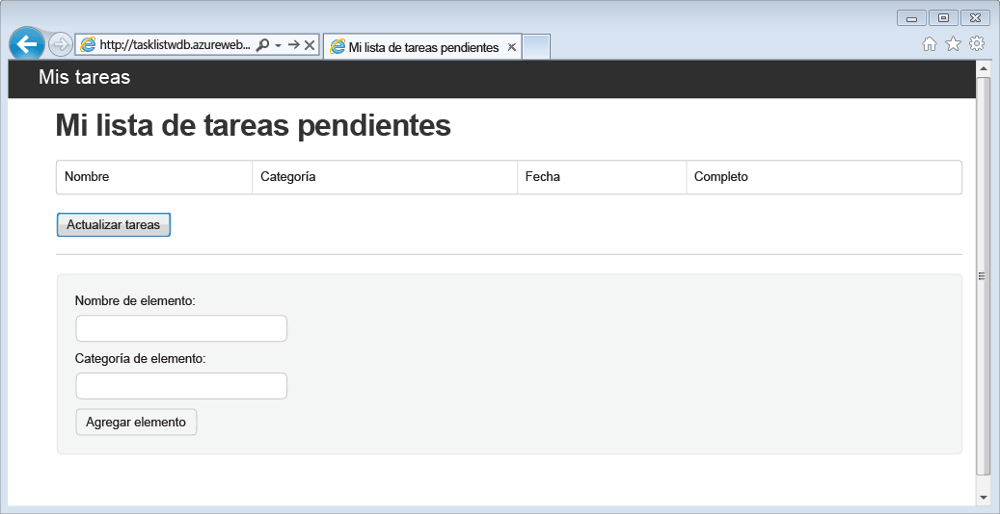
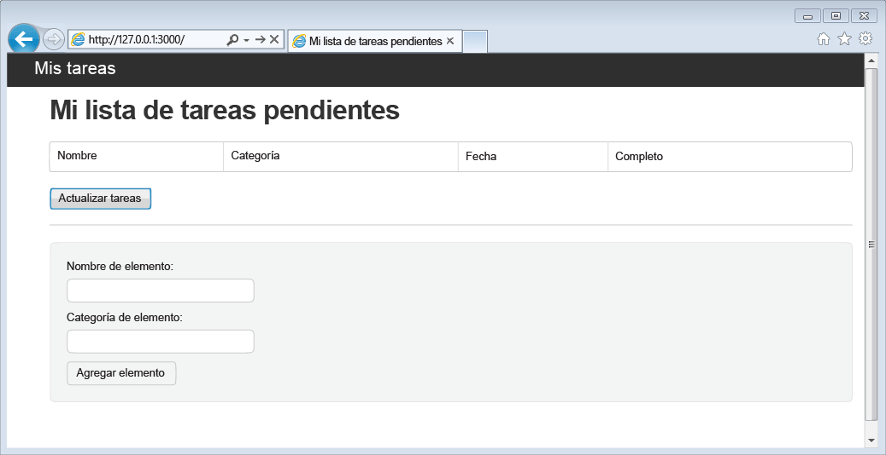
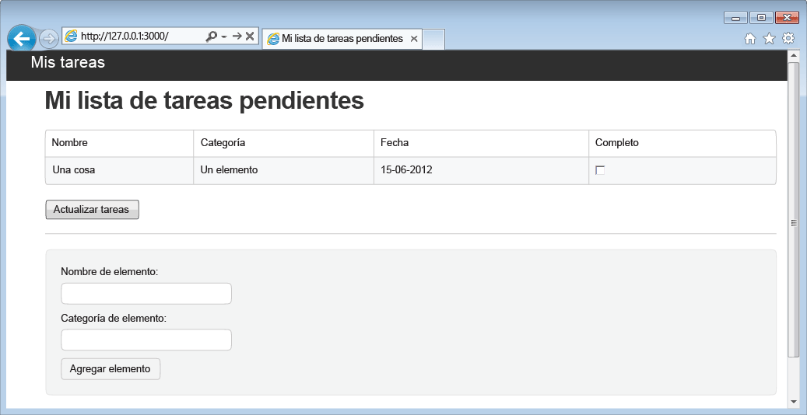

<properties 
	pageTitle="Aprendizaje de Node.js - Tutorial de Node.js de DocumentDB | Microsoft Azure" 
	description="Aprenda Node.js. El tutorial explora cómo usar DocumentDB de Microsoft Azure para almacenar datos desde una aplicación web Node.js Express hospedada en sitios web de Azure y cómo obtener acceso a dichos datos." 
	keywords="Desarrollo de aplicaciones, tutorial de base de datos, información sobre node.js, tutorial de node.js, documentdb, azure, Microsoft azure"
	services="documentdb" 
	documentationCenter="nodejs" 
	authors="ryancrawcour" 
	manager="jhubbard" 
	editor="cgronlun"/>

<tags 
	ms.service="documentdb" 
	ms.workload="data-services" 
	ms.tgt_pltfrm="na" 
	ms.devlang="nodejs" 
	ms.topic="hero-article" 
	ms.date="02/03/2016" 
	ms.author="ryancraw"/>

# Compilación de una aplicación web Node.js mediante DocumentDB

> [AZURE.SELECTOR]
- [.NET](documentdb-dotnet-application.md)
- [Node.js](documentdb-nodejs-application.md)
- [Java](documentdb-java-application.md)
- [Python](documentdb-python-application.md)

En este tutorial de Node.js aprenderá a usar el servicio de Azure DocumentDB para almacenar datos desde una aplicación Node.js Express hospedada en sitios web de Azure y obtener acceso a ellos.

Se recomienda comenzar por ver el vídeo siguiente, donde aprenderá a aprovisionar una cuenta de base de datos de Azure DocumentDB y almacenar documentos JSON en su aplicación Node.js.

> [AZURE.VIDEO azure-demo-getting-started-with-azure-documentdb-on-nodejs-in-linux]

A continuación, vuelva a este tutorial de Node.js, donde conocerá las respuestas a las preguntas siguientes:

- ¿Cómo se trabaja con DocumentDB usando el módulo npm de documentdb?
- ¿Cómo se implementa la aplicación web en los sitios web de Azure?

Al seguir este tutorial de base de datos, podrá crear una aplicación de administración de tareas basadas en web sencilla que permite crear, recuperar y completar tareas. Las tareas se almacenarán como documentos JSON en Azure DocumentDB.

¿No tiene tiempo para completar el tutorial y solo desea obtener la solución completa? No es un problema, puede obtener la solución de ejemplo completa en [GitHub][].

## Requisitos previos

> [AZURE.TIP] En este tutorial de Node.js se presupone que tiene experiencia previa con el uso de Node.js y los sitios web de Azure.

Antes de seguir las instrucciones del presente artículo, debe asegurarse de tener lo siguiente:

- Una cuenta de Azure activa. En caso de no tener ninguna, puede crear una cuenta de evaluación gratuita en tan solo unos minutos. Para obtener más información, consulte [Evaluación gratuita de Azure](https://azure.microsoft.com/pricing/free-trial/).
- [Node.js][] versión v0.10.29 o superior
- [Express Generator](http://www.expressjs.com/starter/generator.html) (puede instalarlo mediante `npm install express-generator -g`)
- [Git][].

## Paso 1: Creación de una cuenta de base de datos de DocumentDB

Comenzaremos por crear una cuenta de DocumentDB. Si ya tiene una cuenta, puede ir a [Paso 2: Creación de una nueva aplicación Node.js](#_Toc395783178).

[AZURE.INCLUDE [documentdb-create-dbaccount](../../includes/documentdb-create-dbaccount.md)]

[AZURE.INCLUDE [documentdb-keys](../../includes/documentdb-keys.md)]

## Paso 2: Creación de una nueva aplicación Node.js

Ahora aprendamos a crear un proyecto Node.js básico de Hello World usando el marco [Express](http://expressjs.com/).

1. Abra su terminal favorito.

2. Use Express Generator para generar una nueva aplicación denominada **todo**.

		express todo

3. Abra el nuevo directorio **todo** e instale las dependencias.

		cd todo
		npm install

4. Ejecute la nueva aplicación.

		npm start

5. Para ver la nueva aplicación, obtenga acceso con el explorador a [http://localhost:3000](http://localhost:3000).

	

## Paso 3: Instalación de módulos adicionales

El archivo **package.json** es uno de los archivos creados en la raíz del proyecto. Este archivo contiene una lista de módulos adicionales necesarios para una aplicación Node.js. Posteriormente, cuando implemente esta aplicación en un sitio web de Azure, este archivo se usará para determinar qué módulos se deben instalar en Azure para ofrecer respaldo a su aplicación. Todavía hay que instalar dos paquetes más para este tutorial.

1. De nuevo en el terminal, instale el módulo **async** mediante npm.

		npm install async --save

1. Instale el módulo **documentdb** mediante npm. En este módulo es donde ocurre toda la magia de DocumentDB.

		npm install documentdb --save

3. Una comprobación rápida del archivo **package.json** de la aplicación debe mostrar los módulos adicionales. Este archivo indicará a Azure qué paquetes debe descargar e instalar cuando ejecute la aplicación. El aspecto debe ser similar al siguiente.

	

       Esto indica a Node (y a Azure más tarde) que la aplicación depende de estos módulos adicionales.

## Paso 4: Uso del servicio de DocumentDB en una aplicación Node

Se encarga de toda la configuración e instalación inicial; ahora volvamos a la razón por la que estamos aquí que es escribir código mediante Azure DocumentDB.

### Crear el modelo

1. En el directorio del proyecto, cree un nuevo directorio con el nombre **models**.
2. En el directorio **models**, cree un archivo nuevo con el nombre **taskDao.js**. Este archivo contendrá el modelo para las tareas que crea nuestra aplicación.
3. En el mismo directorio **models**, cree otro nuevo archivo denominado **docdbUtils.js**. Este archivo contendrá código útil y reutilizable que se utilizará en toda nuestra aplicación. 
4. Copie el siguiente código en **docdbUtils.js**

		var DocumentDBClient = require('documentdb').DocumentClient;
			
		var DocDBUtils = {
		    getOrCreateDatabase: function (client, databaseId, callback) {
		        var querySpec = {
		            query: 'SELECT * FROM root r WHERE r.id=@id',
		            parameters: [{
		                name: '@id',
		                value: databaseId
		            }]
		        };
		
		        client.queryDatabases(querySpec).toArray(function (err, results) {
		            if (err) {
		                callback(err);
		
		            } else {
		                if (results.length === 0) {
		                    var databaseSpec = {
		                        id: databaseId
		                    };
		
		                    client.createDatabase(databaseSpec, function (err, created) {
		                        callback(null, created);
		                    });
		
		                } else {
		                    callback(null, results[0]);
		                }
		            }
		        });
		    },
		
		    getOrCreateCollection: function (client, databaseLink, collectionId, callback) {
		        var querySpec = {
		            query: 'SELECT * FROM root r WHERE r.id=@id',
		            parameters: [{
		                name: '@id',
		                value: collectionId
		            }]
		        };		       
				
		        client.queryCollections(databaseLink, querySpec).toArray(function (err, results) {
		            if (err) {
		                callback(err);
		
		            } else {		
		                if (results.length === 0) {
		                    var collectionSpec = {
		                        id: collectionId
		                    };
							
				 			var requestOptions = {
								offerType: 'S1'
							};
							
		                    client.createCollection(databaseLink, collectionSpec, requestOptions, function (err, created) {
		                        callback(null, created);
		                    });
		
		                } else {
		                    callback(null, results[0]);
		                }
		            }
		        });
		    }
		};
				
		module.exports = DocDBUtils;

> [AZURE.TIP] createCollection toma un parámetro de requestOptions opcional que puede utilizarse para especificar el tipo de la oferta para la colección. Si no se proporciona ningún valor requestOptions.offerType, la colección se creará con el tipo de oferta predeterminada. Para obtener más información sobre los tipos de oferta de DocumentDB , consulte [Niveles de rendimiento de DocumentDB](documentdb-performance-levels.md)
		
3. Guarde y cierre el archivo **docdbUtils.js**.

4. Al principio del archivo **taskDao.js**, agregue el código siguiente para hacer referencia a los elementos **DocumentDBClient** y **docdbUtils.js** creados anteriormente:

        var DocumentDBClient = require('documentdb').DocumentClient;
		var docdbUtils = require('./docdbUtils');

4. A continuación, agregará código para definir y exportar el objeto Task. Esta función se encarga de inicializar el objeto Task y de configurar la base de datos y la colección de documentos que se utilizarán.

		function TaskDao(documentDBClient, databaseId, collectionId) {
		  this.client = documentDBClient;
		  this.databaseId = databaseId;
		  this.collectionId = collectionId;
		
		  this.database = null;
		  this.collection = null;
		}
		
		module.exports = TaskDao;

5. A continuación, agregue el siguiente código para definir métodos adicionales en el objeto Task, que permite las interacciones con los datos almacenados en DocumentDB.

		TaskDao.prototype = {
		    init: function (callback) {
		        var self = this;
		
		        docdbUtils.getOrCreateDatabase(self.client, self.databaseId, function (err, db) {
		            if (err) {
		                callback(err);

		            } else {
		                self.database = db;
		                docdbUtils.getOrCreateCollection(self.client, self.database._self, self.collectionId, function (err, coll) {
		                    if (err) {
		                        callback(err);
		
		                    } else {
		                        self.collection = coll;
		                    }
		                });
		            }
		        });
		    },
		
		    find: function (querySpec, callback) {
		        var self = this;
		
		        self.client.queryDocuments(self.collection._self, querySpec).toArray(function (err, results) {
		            if (err) {
		                callback(err);
		
		            } else {
		                callback(null, results);
		            }
		        });
		    },
		
		    addItem: function (item, callback) {
		        var self = this;
		
		        item.date = Date.now();
		        item.completed = false;
		
		        self.client.createDocument(self.collection._self, item, function (err, doc) {
		            if (err) {
		                callback(err);
		
		            } else {
		                callback(null, doc);
		            }
		        });
		    },
		
		    updateItem: function (itemId, callback) {
		        var self = this;
		
		        self.getItem(itemId, function (err, doc) {
		            if (err) {
		                callback(err);
		
		            } else {
		                doc.completed = true;
		
		                self.client.replaceDocument(doc._self, doc, function (err, replaced) {
		                    if (err) {
		                        callback(err);
		
		                    } else {
		                        callback(null, replaced);
		                    }
		                });
		            }
		        });
		    },
		
		    getItem: function (itemId, callback) {
		        var self = this;
		
		        var querySpec = {
		            query: 'SELECT * FROM root r WHERE r.id=@id',
		            parameters: [{
		                name: '@id',
		                value: itemId
		            }]
		        };
		
		        self.client.queryDocuments(self.collection._self, querySpec).toArray(function (err, results) {
		            if (err) {
		                callback(err);
		
		            } else {
		                callback(null, results[0]);
		            }
		        });
		    }
		};

6. Guarde y cierre el archivo **taskDao.js**.

### Crear el controlador

1. En el directorio **routes** del nuevo proyecto, cree un nuevo archivo denominado **tasklist.js**. 
2. Agregue el siguiente código a **tasklist.js**. De este modo, se cargan los módulos DocumentDBClient y async, que utiliza **tasklist.js**. También se define la función **TaskList**, que pasa a una sesión del objeto **Task** que definimos anteriormente:

		var DocumentDBClient = require('documentdb').DocumentClient;
		var async = require('async');
		
		function TaskList(taskDao) {
		  this.taskDao = taskDao;
		}
		
		module.exports = TaskList;

3. Continúe agregando al archivo **tasklist.js** los métodos usados para **showTasks, addTask** y **completeTasks**:
		
		TaskList.prototype = {
		    showTasks: function (req, res) {
		        var self = this;
		
		        var querySpec = {
		            query: 'SELECT * FROM root r WHERE r.completed=@completed',
		            parameters: [{
		                name: '@completed',
		                value: false
		            }]
		        };
		
		        self.taskDao.find(querySpec, function (err, items) {
		            if (err) {
		                throw (err);
		            }
		
		            res.render('index', {
		                title: 'My ToDo List ',
		                tasks: items
		            });
		        });
		    },
		
		    addTask: function (req, res) {
		        var self = this;
		        var item = req.body;
		
		        self.taskDao.addItem(item, function (err) {
		            if (err) {
		                throw (err);
		            }
		
		            res.redirect('/');
		        });
		    },
		
		    completeTask: function (req, res) {
		        var self = this;
		        var completedTasks = Object.keys(req.body);
		
		        async.forEach(completedTasks, function taskIterator(completedTask, callback) {
		            self.taskDao.updateItem(completedTask, function (err) {
		                if (err) {
		                    callback(err);
		                } else {
		                    callback(null);
		                }
		            });
		        }, function goHome(err) {
		            if (err) {
		                throw err;
		            } else {
		                res.redirect('/');
		            }
		        });
		    }
		};

4. Guarde y cierre el archivo **tasklist.js**.
 
### Agregar config.js

1. En el directorio del proyecto, cree un nuevo archivo con el nombre **config.js**.
2. Agregue lo siguiente a **config.js**. Así se definen las opciones de configuración y los valores necesarios para nuestra aplicación.

		var config = {}
		
		config.host = process.env.HOST || "[the URI value from the DocumentDB Keys blade on http://portal.azure.com]";
		config.authKey = process.env.AUTH_KEY || "[the PRIMARY KEY value from the DocumentDB Keys blade on http://portal.azure.com]";
		config.databaseId = "ToDoList";
		config.collectionId = "Items";
		
		module.exports = config;

3. En el archivo **config.js**, actualice los valores de HOST y AUTH\_KEY con los valores encontrados en la hoja de claves de la cuenta de DocumentDB en el [Portal de Microsoft Azure](https://portal.azure.com):

4. Guarde y cierre el archivo **config.js**.
 
### Modificar app.js

1. En el directorio del proyecto, abra el archivo **app.js**. Este archivo se creó anteriormente, cuando se creó la aplicación web de Express.
2. Agregue el código siguiente al principio del archivo **app.js**.
	
		var DocumentDBClient = require('documentdb').DocumentClient;
		var config = require('./config');
		var TaskList = require('./routes/tasklist');
		var TaskDao = require('./models/taskDao');

3. Este código determina el archivo de configuración que se debe usar. Además, lee los valores de este archivo en algunas variables que usaremos pronto.
4. Sustituya las dos líneas siguientes en el archivo **app.js**:

		app.use('/', routes);
		app.use('/users', users); 

      por el siguiente fragmento de código:

		var docDbClient = new DocumentDBClient(config.host, {
		    masterKey: config.authKey
		});
		var taskDao = new TaskDao(docDbClient, config.databaseId, config.collectionId);
		var taskList = new TaskList(taskDao);
		taskDao.init();
		
		app.get('/', taskList.showTasks.bind(taskList));
		app.post('/addtask', taskList.addTask.bind(taskList));
		app.post('/completetask', taskList.completeTask.bind(taskList));
		app.set('view engine', 'jade');

6. Estas líneas definen una nueva sesión de nuestro objeto **TaskDao**, con una nueva conexión a DocumentDB (utilizando los valores de lectura de **config.js**). Además, inicializan el objeto de la tarea y, a continuación, enlazan las acciones del formulario con los métodos de nuestro controlador de **TaskList**.

7. Por último, guarde y cierre el archivo **app.js**. Estamos a punto de terminar.
 
## Paso 5: Creación de una interfaz de usuario

Ahora dirijamos nuestra atención a la generación de la interfaz de usuario para que un usuario pueda realmente interactuar con nuestra aplicación. La aplicación Express que hemos creado utiliza **Jade** como motor de vistas. Para obtener más información sobre Jade, consulte [http://jade-lang.com/](http://jade-lang.com/).

1. El archivo **layout.jade** del directorio **views** se utiliza como plantilla global para otros archivos **.jade**. En este paso podrá modificarlo para utilizar [Twitter Bootstrap](https://github.com/twbs/bootstrap), un kit de herramientas que facilita el diseño de un sitio web atractivo. 
2. Abra el archivo **layout.jade** que se encuentra en la carpeta **views** y reemplace el contenido con lo siguiente:
	
		doctype html
		html
		  head
		    title= title
		    link(rel='stylesheet', href='//ajax.aspnetcdn.com/ajax/bootstrap/3.3.2/css/bootstrap.min.css')
		    link(rel='stylesheet', href='/stylesheets/style.css')
		  body
		    nav.navbar.navbar-inverse.navbar-fixed-top
		      div.navbar-header
		        a.navbar-brand(href='#') My Tasks
		    block content
		    script(src='//ajax.aspnetcdn.com/ajax/jQuery/jquery-1.11.2.min.js')
		    script(src='//ajax.aspnetcdn.com/ajax/bootstrap/3.3.2/bootstrap.min.js')

	Esto indica al motor **Jade** que represente HTML de nuestra aplicación y que cree un **block** llamado **content** donde podemos especificar el diseño de nuestras páginas de contenido. Guarde y cierre este archivo **layout.jade**.

4. Ahora abra el archivo **index.jade**, la vista que utilizará nuestra aplicación, y reemplace el contenido del archivo por lo siguiente:

		extends layout
		
		block content
		  h1 #{title}
		  br
		
		  form(action="/completetask", method="post")
		    table.table.table-striped.table-bordered
		      tr
		        td Name
		        td Category
		        td Date
		        td Complete
		      if (typeof tasks === "undefined")
		        tr
		          td
		      else
		        each task in tasks
		          tr
		            td #{task.name}
		            td #{task.category}
		            - var date  = new Date(task.date);
		            - var day   = date.getDate();
		            - var month = date.getMonth() + 1;
		            - var year  = date.getFullYear();
		            td #{month + "/" + day + "/" + year}
		            td
		              input(type="checkbox", name="#{task.id}", value="#{!task.completed}", checked=task.completed)
		    button.btn(type="submit") Update tasks
		  hr
		  form.well(action="/addtask", method="post")
		    label Item Name:
		    input(name="name", type="textbox")
		    label Item Category:
		    input(name="category", type="textbox")
		    br
		    button.btn(type="submit") Add item

	Esto amplía el diseño y proporciona contenido para el marcador de posición **content** que hemos visto anteriormente en el archivo **layout.jade**.
	
	En este diseño hemos creado dos formularios HTML. El primer formulario contiene una tabla para nuestros datos y un botón que nos permite actualizar los elementos publicando en el método **/completetask** de nuestro controlador. El segundo formulario contiene dos campos de entrada y un botón que nos permite crear un nuevo elemento publicando en el método **/addtask** de nuestro controlador.
	
	Esto debería ser todo lo que necesitamos para que nuestra aplicación funcione.

5. Abra el archivo**style.css** ubicado en el directorio **public\\stylesheets** y reemplace el código por lo siguiente:

		body {
		  padding: 50px;
		  font: 14px "Lucida Grande", Helvetica, Arial, sans-serif;
		}
		a {
		  color: #00B7FF;
		}
		.well label {
		  display: block;
		}
		.well input {
		  margin-bottom: 5px;
		}
		.btn {
		  margin-top: 5px;
		  border: outset 1px #C8C8C8;
		}

	Guarde y cierre el archivo **style.css**.

## Paso 6: Ejecución de la aplicación de forma local

1. Para probar la aplicación en su equipo local, ejecute `npm start` en un terminal para iniciar su aplicación. Ejecute también un explorador con una página similar a la de la siguiente imagen:

	

2. Utilice los campos proporcionados para Elemento, Nombre de elemento y Categoría para especificar información. A continuación, haga clic en **Agregar elemento**.

3. La página debería actualizarse para mostrar el elemento recién creado en la lista ToDo.

	

4. Para completar una tarea, simplemente marque la casilla en la columna Complete y, a continuación, haga clic en **Actualizar tareas**.

## Paso 7: Implementación del proyecto de desarrollo de aplicación en Sitios web de Azure

1. Si todavía no lo ha hecho, habilite un repositorio para el sitio web de Azure. Puede encontrar instrucciones sobre cómo hacerlo en el tema [Implementación continua mediante GIT en el Servicio de aplicaciones de Azure](../app-service-web/web-sites-publish-source-control.md).

2. Agregue el sitio web de Azure como un git remoto.

		git remote add azure https://username@your-azure-website.scm.azurewebsites.net:443/your-azure-website.git

3. Efectúe la implementación enviando los cambios al equipo remoto.

		git push azure master

4. En pocos segundos, git terminará de publicar su aplicación web y ejecutará un explorador donde podrá ver su útil trabajo ejecutándose en Azure.

## Pasos siguientes

¡Enhorabuena! Acaba de generar su primera aplicación web Express de Node.js mediante Azure DocumentDB y publicarlos en los sitios web de Azure.

El código fuente de la aplicación de referencia completa se puede descargar de [GitHub][].

Para obtener más información, consulte el [Centro para desarrolladores de Node.js](https://azure.microsoft.com/develop/nodejs/).

[Node.js]: http://nodejs.org/
[Git]: http://git-scm.com/
[Github]: https://github.com/Azure-Samples/documentdb-node-todo-app
 

<!---HONumber=AcomDC_0211_2016-->