<properties
    pageTitle="Desarrollo de aplicaciones web de Python Flask con DocumentDB | Microsoft Azure"
    description="Vea un tutorial de base de datos sobre el uso de DocumentDB para almacenar datos y acceder a ellos desde una aplicación web de Python Flask hospedada en Azure. Encuentre soluciones de desarrollo de aplicaciones." 
	keywords="Desarrollo de aplicaciones, tutorial de base de datos, python flask, aplicación web de python, desarrollo web de python, documentdb, azure, Microsoft azure"
    services="documentdb"
    documentationCenter="python"
    authors="ryancrawcour"
    manager="jhubbard"
    editor="cgronlun"/>

<tags
    ms.service="documentdb"
    ms.workload="data-management"
    ms.tgt_pltfrm="na"
    ms.devlang="python"
    ms.topic="hero-article"
    ms.date="01/05/2016"
    ms.author="ryancraw"/>

# Desarrollo de aplicaciones web de Python Flask con DocumentDB

> [AZURE.SELECTOR]
- [.NET](documentdb-dotnet-application.md)
- [Node.js](documentdb-nodejs-application.md)
- [Java](documentdb-java-application.md)
- [Python](documentdb-python-application.md)

En este tutorial aprenderá a usar el servicio DocumentDB de Azure para almacenar datos y obtener acceso a ellos desde cualquier aplicación web Phyton hospedada en Azure. En él se presupone que tiene experiencia previa en el uso de los sitios web de Phyton y Azure.

En este tutorial de base de datos se trata lo siguiente:

1. Crear y aprovisionar una cuenta de DocumentDB.
2. Crear una aplicación Phyton MVC.
3. Conectarse y utilizar DocumentDB desde su aplicación web.
4. Implementar la aplicación web en Sitios web Azure.

Siguiendo este tutorial, podrá compilar una aplicación de votación simple que le permita votar en un sondeo.

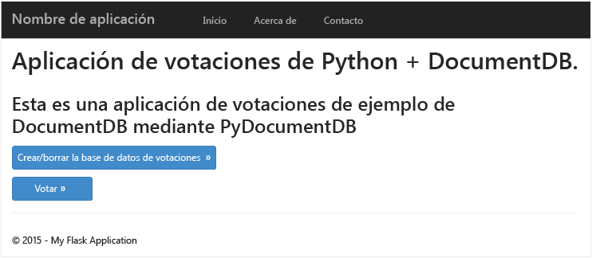


## Requisitos previos del tutorial de base de datos

Antes de seguir las instrucciones del presente artículo, debe asegurarse de tener instalados los siguientes elementos:

- Una cuenta de Azure activa. En caso de no tener ninguna, puede crear una cuenta de evaluación gratuita en tan solo unos minutos. Para obtener más información, consulte [Evaluación gratuita de Azure](https://azure.microsoft.com/pricing/free-trial/).
- [Visual Studio 2013](http://www.visualstudio.com/) o versiones posteriores, o [Visual Studio Express](), que es la versión gratis. Las instrucciones de este tutorial están escritas específicamente para Visual Studio 2015. 
- Herramientas de Python para Visual Studio desde [GitHub](http://microsoft.github.io/PTVS/). En este tutorial se usan las herramientas de Python para VS 2015. 
- SDK de Azure Python para Visual Studio, versión 2.4 o posteriores disponible en [azure.com](https://azure.microsoft.com/downloads/). Usamos el SDK de Microsoft Azure para Python 2.7.
- Python 2.7 en [python.org][2]. Usamos Python 2.7.11. 

> [AZURE.IMPORTANT]Si va a instalar Python 2.7 por primera vez, asegúrese de que en la pantalla Personalizar Python 2.7.11 selecciona **Agregar python.exe a la ruta de acceso**.
> 
>    

- Compilador de Microsoft Visual C++ para Python 2.7 desde el [Centro de descarga de Microsoft][3].

## Paso 1: Creación de una cuenta de base de datos de DocumentDB

Comenzaremos por crear una cuenta de DocumentDB. Si ya tiene una cuenta, puede ir directamente al [Paso 2: Creación de una nueva aplicación web de Python Flask](#step-2:-create-a-new-python-flask-web-application).

[AZURE.INCLUDE [documentdb-create-dbaccount](../../includes/documentdb-create-dbaccount.md)]

<br/> Ahora veremos cómo crear una nueva aplicación web de Phyton Flask partiendo de cero.

## Paso 2: Creación de una nueva aplicación web de Phyton Flask

1. En Visual Studio, en el menú **Archivo**, seleccione **Nuevo** y, a continuación, haga clic en **Proyecto**.

    Aparecerá el cuadro de diálogo **Nuevo proyecto**.

2. En el panel izquierdo, expanda **Plantillas**, **Python** y, después, haga clic en **Web**.

3. Seleccione **Proyecto web Flask** en el panel central; después en el cuadro **Nombre** escriba **Tutorial** y, finalmente, haga clic en **Aceptar**. Recuerde que los nombres de paquete de Python deben escribirse en minúsculas, tal como se describe en [Style Guide for Python Code](https://www.python.org/dev/peps/pep-0008/#package-and-module-names).

	Para aquellos que desconozcan Python Flask, se trata de un marco de desarrollo de aplicaciones web que ayuda a compilar aplicaciones web en Python más rápidamente.

	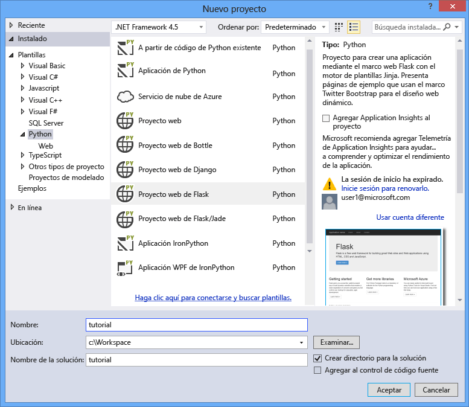

4. En la ventana **Herramientas de Python para Visual Studio**, haga clic en **Instalar en un entorno virtual**.

	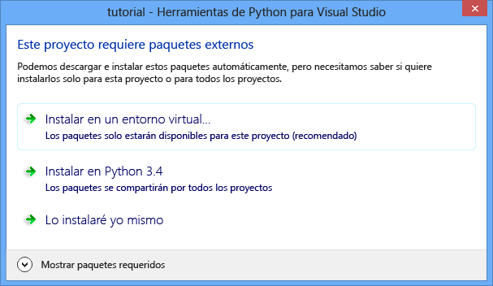

5. En la ventana **Agregar entorno virtual**, puede aceptar los valores predeterminados y usar Python 2.7 como entorno de base, ya que PyDocumentDB no admite de momento Python 3.x y, después, haga clic en **Crear**. Esto configura el entorno virtual de Python requerido para el proyecto.

	

    Muestra la ventana de salida `Successfully installed Flask-0.10.1 Jinja2-2.8 MarkupSafe-0.23 Werkzeug-0.11.3 itsdangerous-0.24 'requirements.txt' was installed successfully.` cuando el entorno está instalado correctamente.

## Paso 3: Modificación de la aplicación web de Python Flask

### Adición de paquetes de Python Flask al proyecto

Después de que el proyecto esté configurado, es preciso agregar el paquete Flask necesario al proyecto, incluido pydocumentdb, el paquete de Python para DocumentDB.

1. En el Explorador de soluciones, abra el archivo llamado **requirements.txt** y reemplace su contenido por lo siguiente y después guarde el archivo:

    	flask==0.9
    	flask-mail==0.7.6
    	sqlalchemy==0.7.9
    	flask-sqlalchemy==0.16
    	sqlalchemy-migrate==0.7.2
    	flask-whooshalchemy==0.55a
    	flask-wtf==0.8.4
    	pytz==2013b
    	flask-babel==0.8
    	flup
    	pydocumentdb>=1.0.0

2. En el Explorador de soluciones, haga clic con el botón derecho en **env** y haga clic en **Install from requirements.txt**.

	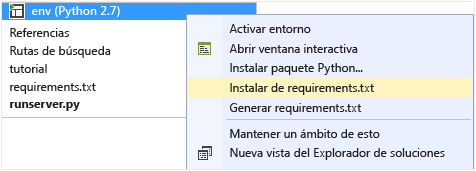

    Después de una instalación correcta, la ventana de salidas muestra lo siguiente:

        Successfully installed Babel-2.1.1 Tempita-0.5.2 WTForms-2.1 Whoosh-2.7.0 blinker-1.4 decorator-4.0.6 flask-0.9 flask-babel-0.8 flask-mail-0.7.6 flask-sqlalchemy-0.16 flask-whooshalchemy-0.55a0 flask-wtf-0.8.4 flup-1.0.2 pydocumentdb-1.4.2 pytz-2013b0 speaklater-1.3 sqlalchemy-0.7.9 sqlalchemy-migrate-0.7.2

    > [AZURE.NOTE]En casos excepcionales, es posible que aparezca un error en la ventana de salida. De ser así, compruebe si el error está relacionado con la limpieza. En ocasiones, se produce un error en la limpieza, pero la instalación se realiza correctamente (desplácese hacia arriba en la ventana de salida para comprobarlo). Puede comprobar la instalación mediante la [comprobación del entorno virtual](#verify-the-virtual-environment). Si se produjo un error en la instalación, pero la comprobación es correcta, se puede continuar sin problemas.

### Comprobación del entorno virtual

Asegurémonos de que todo esté instalado correctamente.

1. Compile la solución presionando **Ctrl**+**MAYÚS**+**B**.
2. Una vez realizada correctamente la compilación, inicie el sitio web presionando **F5**. De este modo se iniciará el servidor de desarrollo de Flask y el explorador web. Debe ver la página siguiente.

	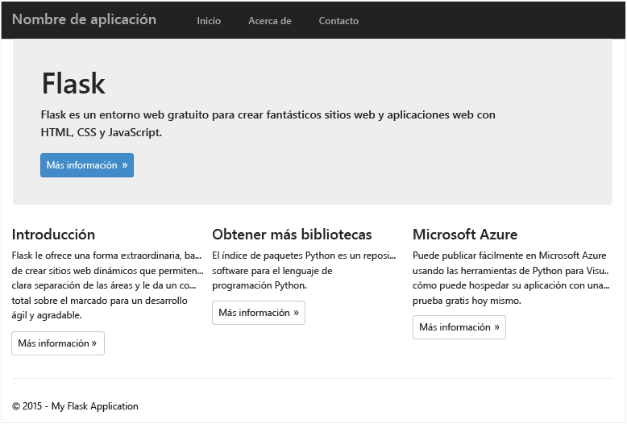

3. Detenga la depuración del sitio web presionando **MAYÚS**+**F5**.

### Creación de definiciones de base de datos, colección y documento

Ahora vamos a crear la aplicación de votación mediante la adición de archivos nuevos y de la actualización de otros.

1. En el Explorador de soluciones, haga clic con el botón derecho en el proyecto de **tutorial**, a continuación haga clic en **Agregar **y, por último, en **Nuevo elemento**. Seleccione **Archivo Python vacío** y asigne el nombre **forms.py** al archivo.  
2. Agregue el código siguiente al archivo forms.py y, después, guárdelo.

```python
from flask.ext.wtf import Form
from wtforms import RadioField

class VoteForm(Form):
	deploy_preference  = RadioField('Deployment Preference', choices=[
        ('Web Site', 'Web Site'),
        ('Cloud Service', 'Cloud Service'),
        ('Virtual Machine', 'Virtual Machine')], default='Web Site')
```


### Agregue las importaciones necesarias a views.py.

1. En el Explorador de soluciones, expanda la carpeta **tutorial** y abra el archivo **views.py**. 
2. Agregue las siguientes instrucciones de importación a la parte superior del archivo **views.py** y, después, guarde el archivo: Dichas instrucciones importarán los paquetes de PythonSDK y Flask de DocumentDB.

	```python
	from forms import VoteForm
	import config
	import pydocumentdb.document_client as document_client
	```


### Creación de base de datos, colección y documento

- Todavía en **views.py**, agregue el siguiente código al final del archivo. Esta acción se encarga de crear la base de datos que usa el formulario. No elimine el código existente en **views.py**. Solo tiene que incluir esto al final.

```python
@app.route('/create')
def create():
    """Renders the contact page."""
    client = document_client.DocumentClient(config.DOCUMENTDB_HOST, {'masterKey': config.DOCUMENTDB_KEY})

    # Attempt to delete the database.  This allows this to be used to recreate as well as create
    try:
        db = next((data for data in client.ReadDatabases() if data['id'] == config.DOCUMENTDB_DATABASE))
        client.DeleteDatabase(db['_self'])
    except:
        pass

    # Create database
    db = client.CreateDatabase({ 'id': config.DOCUMENTDB_DATABASE })

    # Create collection
    collection = client.CreateCollection(db['_self'],{ 'id': config.DOCUMENTDB_COLLECTION }, { 'offerType': 'S1' })

    # Create document
    document = client.CreateDocument(collection['_self'],
        { 'id': config.DOCUMENTDB_DOCUMENT,
          'Web Site': 0,
          'Cloud Service': 0,
          'Virtual Machine': 0,
          'name': config.DOCUMENTDB_DOCUMENT 
        })

    return render_template(
       'create.html',
        title='Create Page',
        year=datetime.now().year,
        message='You just created a new database, collection, and document.  Your old votes have been deleted')
```

> [AZURE.TIP]El método **CreateCollection** usa una clase **RequestOptions** opcional como tercer parámetro. Dicha clase puede usarse para especificar el tipo de oferta para la colección. Si no se proporciona ningún valor offerType, la colección se creará con el tipo de oferta predeterminada. Para obtener más información sobre los tipos de oferta de DocumentDB, consulte [Niveles de rendimiento en DocumentDB](documentdb-performance-levels.md).


### Lectura de la base de datos, la colección y el documento, y envío del formulario

- Todavía en **views.py**, agregue el siguiente código al final del archivo. Esta acción se encarga de configurar el formulario mediante la lectura de la base de datos, la colección y el documento. No elimine el código existente en **views.py**. Solo tiene que incluir esto al final.

```python
@app.route('/vote', methods=['GET', 'POST'])
def vote(): 
    form = VoteForm()
    replaced_document ={}
    if form.validate_on_submit(): # is user submitted vote  
        client = document_client.DocumentClient(config.DOCUMENTDB_HOST, {'masterKey': config.DOCUMENTDB_KEY})

        # Read databases and take first since id should not be duplicated.
        db = next((data for data in client.ReadDatabases() if data['id'] == config.DOCUMENTDB_DATABASE))

        # Read collections and take first since id should not be duplicated.
        coll = next((coll for coll in client.ReadCollections(db['_self']) if coll['id'] == config.DOCUMENTDB_COLLECTION))

        # Read documents and take first since id should not be duplicated.
        doc = next((doc for doc in client.ReadDocuments(coll['_self']) if doc['id'] == config.DOCUMENTDB_DOCUMENT))

        # Take the data from the deploy_preference and increment our database
        doc[form.deploy_preference.data] = doc[form.deploy_preference.data] + 1
        replaced_document = client.ReplaceDocument(doc['_self'], doc)

        # Create a model to pass to results.html
        class VoteObject:
            choices = dict()
            total_votes = 0

        vote_object = VoteObject()
        vote_object.choices = {
            "Web Site" : doc['Web Site'],
            "Cloud Service" : doc['Cloud Service'],
            "Virtual Machine" : doc['Virtual Machine']
        }
        vote_object.total_votes = sum(vote_object.choices.values())

        return render_template(
            'results.html', 
            year=datetime.now().year, 
            vote_object = vote_object)

    else :
        return render_template(
            'vote.html', 
            title = 'Vote',
            year=datetime.now().year,
            form = form)
```


### Creación de los archivos HTML

1. En el Explorador de soluciones, en la carpeta **tutorial**, haga clic con el botón derecho en la carpeta **templates**, haga clic en **Agregar** y, después, haga clic en **Nuevo elemento**. 
2. Seleccione **Página HTML** y, a continuación, en el cuadro Nombre escriba **create.html**. 
3. Repita los pasos 1 y 2 para crear dos archivos HTML adicionales: results.html y vote.html.
4. Agregue el siguiente código a **create.html** en el elemento <body>. Se muestra un mensaje que indica que hemos creado una nueva base de datos, colección y documento.

	```html
	
	
	<h2>{{ title }}.</h2>
	<h3>{{ message }}</h3>
	<p><a href="{{ url_for('vote') }}" class="btn btn-primary btn-large">Vote &raquo;</a></p>
	
	```

5. Agregue el siguiente código a **results.html** en el elemento <body>. Se muestran los resultados del sondeo.

	```html
	
	
	<h2>Results of the vote</h2>
		<br />
		
	
	<div class="row">
		<div class="col-sm-5">{{choice}}</div>
	        <div class="col-sm-5">
	        	<div class="progress">
	        		<div class="progress-bar" role="progressbar" aria-valuenow="{{vote_object.choices[choice]}}" aria-valuemin="0" aria-valuemax="{{vote_object.total_votes}}" style="width: {{(vote_object.choices[choice]/vote_object.total_votes)*100}}%;">
	                    		{{vote_object.choices[choice]}}
				</div>
			</div>
	        </div>
	</div>
	
	
	<br />
	<a class="btn btn-primary" href="{{ url_for('vote') }}">Vote again?</a>
	
	```

6. Agregue el siguiente código a **vote.html** en el elemento <body>. Muestra el sondeo y acepta los votos. Al registrar los votos, el control se pasa a views.py, donde reconoceremos el voto emitido y se anexará al documento en consecuencia.

	```html
	
	
	<h2>What is your favorite way to host an application on Azure?</h2>
	<form action="" method="post" name="vote">
		{{form.hidden_tag()}}
	        {{form.deploy_preference}}
	        <button class="btn btn-primary" type="submit">Vote</button>
	</form>
	
	```

7. En la carpeta **templates**, reemplace el contenido de **index.html** por lo siguiente. Esto sirve como la página de aterrizaje de la aplicación.
	
	```html
	
	
	<h2>Python + DocumentDB Voting Application.</h2>
	<h3>This is a sample DocumentDB voting application using PyDocumentDB</h3>
	<p><a href="{{ url_for('create') }}" class="btn btn-primary btn-large">Create/Clear the Voting Database &raquo;</a></p>
	<p><a href="{{ url_for('vote') }}" class="btn btn-primary btn-large">Vote &raquo;</a></p>
	
	```

### Adición de un archivo de configuración y modificación de \_\_init\_\_.py

1. En el Explorador de soluciones, haga clic con el botón derecho en el proyecto **tutorial**, haga clic en **Agregar**, en **Nuevo elemento**, seleccione **Archivo Python vacío** y, a continuación, asigne al archivo el nombre de **config.py**. Los formularios de Flask requieren este archivo de configuración. También se puede usar para proporcionar una clave secreta. Sin embargo, dicha clave no es necesaria para este tutorial.

2. Agregue el siguiente código a config.py, deberá modificar los valores de **DOCUMENTDB\_HOST** y **DOCUMENTDB\_KEY** en el paso siguiente.

	```python
	CSRF_ENABLED = True
	SECRET_KEY = 'you-will-never-guess'
	
	DOCUMENTDB_HOST = 'https://YOUR_DOCUMENTDB_NAME.documents.azure.com:443/'
	DOCUMENTDB_KEY = 'YOUR_SECRET_KEY_ENDING_IN_=='
	
	DOCUMENTDB_DATABASE = 'voting database'
	DOCUMENTDB_COLLECTION = 'voting collection'
	DOCUMENTDB_DOCUMENT = 'voting document'
	```

3. En el [Portal de Azure](https://portal.azure.com/), navegue a la hoja **Claves** haciendo clic en **Examinar** y en **Cuentas de DocumentDB**; después haga doble clic en el nombre de la cuenta que desea usar y, a continuación, haga clic en **Claves**. En la hoja **Claves**, copie el valor del identificador **URI** y péguelo en el archivo **config.py**, como valor de la propiedad **DOCUMENTDB\_HOST**.
4. De nuevo en el Portal de Azure, en la hoja **Claves**, copie el valor de la **clave principal** o de la **clave secundaria** y péguelo en el archivo **config.py**, como valor de la propiedad **DOCUMENTDB\_KEY**.
5. En el archivo **\_\_init\_\_.py**, agregue la siguiente línea. 

        app.config.from_object('config')

    Por lo tanto, el contenido del archivo es:

	```python
	from flask import Flask
	app = Flask(__name__)
	app.config.from_object('config')
	import tutorial.views
	```

6. Después de agregar todos los archivos, Explorador de soluciones debe ser similar al siguiente:

	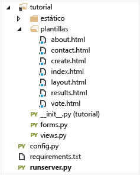


## Paso 4: Ejecución local de la aplicación web

1. Compile la solución presionando **Ctrl**+**MAYÚS**+**B**.
2. Una vez realizada correctamente la compilación, inicie el sitio web presionando **F5**. Debería ver lo siguiente en la pantalla.

	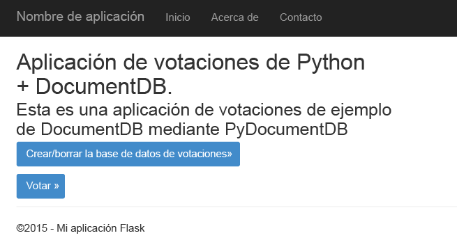

3. Haga clic en **Create/Clear the Voting Database** (Crear/borrar la base de datos de votos) para generar la base de datos.

	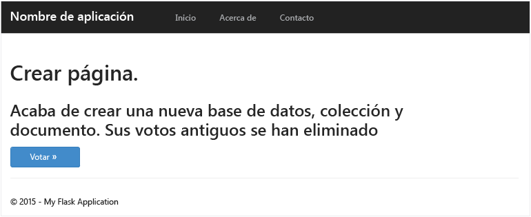

4. A continuación, haga clic en **Vote** (Votar) y seleccione su opción.

	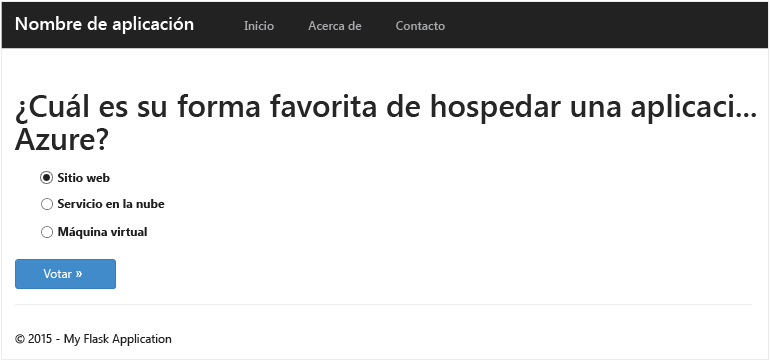

5. Por cada voto que emita se incrementará el contador correspondiente.

	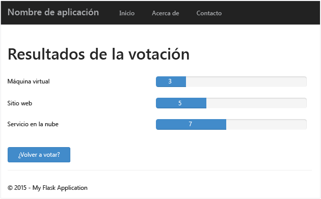

6. Detenga la depuración del proyecto presionando MAYÚS+F5.

## Paso 5: Implementación de la aplicación en Sitios web Azure

Ahora que toda la aplicación funciona correctamente con DocumentDB, vamos a implementarla en Sitios web de Azure.

1. Haga clic con el botón derecho en el proyecto en el Explorador de soluciones (asegúrese de que no se ejecuta localmente) y seleccione **Publicar**.  

 	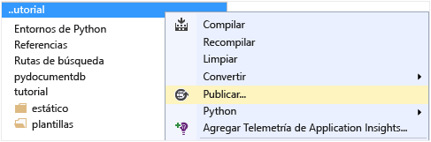

2. En la ventana **Publicar web**, seleccione **Sitios web Microsoft Azure**.

	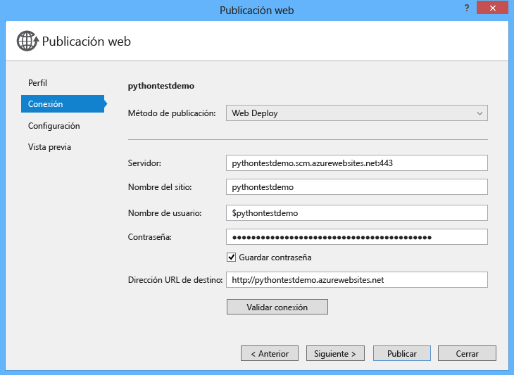

3. En la ventana **Seleccionar sitio web existente**, haga clic en **Nuevo**.

	

4. En la ventana **Crear sitio en Microsoft Azure**, escriba un valor en **Nombre del sitio**, seleccione un valor en **Región** y haga clic en **Crear**.

	

5. En la ventana **Publicación web**, haga clic en **Publicar**.

	

3. En pocos segundos, Visual Studio terminará de publicar su aplicación web y ejecutará un explorador donde podrá ver su útil trabajo ejecutándose en Azure.

## Solución de problemas

Si esta es la primera aplicación de Python que se ejecuta en el equipo, asegúrese de que las carpetas siguientes (o las ubicaciones de instalación equivalentes) se incluyen en la variable PATH:

    C:\Python27\site-packages;C:\Python27\;C:\Python27\Scripts;

Si recibe un error en la página de votos y asignó al proyecto otro nombre distinto del de **tutorial**, asegúrese de que **\_\_init\_\_.py** hace referencia al nombre de proyecto correcto en la línea: `import tutorial.view`.

## Pasos siguientes

¡Enhorabuena! Acaba de completar su primera aplicación web de Phyton con Azure DocumentDB y de publicarla en Sitios web Azure.

Actualizamos y mejoramos este tema con frecuencia en función de los comentarios que recibimos. Una vez completado el tutorial, no olvide incluir sus comentarios sobre las mejoras que quiera que se hagan. Para ello, use los botones de voto de la parte superior e inferior de esta página. Si quiere que nos pongamos en contacto directamente con usted, puede incluir su dirección de correo electrónico en los comentarios.

Para agregar funcionalidad adicional a la aplicación web, revise las API disponibles en el [SDK de Python de DocumentDB](documentdb-sdk-python.md).

Para más información acerca de Azure, Visual Studio y Python, consulte el [Python Developer Center](https://azure.microsoft.com/develop/python/).

Para ver tutoriales adicionales sobre Python Flask, consulte el tutorial [The Flask Mega-Tutorial, Part I: Hello, World!](http://blog.miguelgrinberg.com/post/the-flask-mega-tutorial-part-i-hello-world).

  [Visual Studio Express]: http://www.visualstudio.com/products/visual-studio-express-vs.aspx
  [2]: https://www.python.org/downloads/windows/
  [3]: https://www.microsoft.com/download/details.aspx?id=44266
  [Microsoft Web Platform Installer]: http://www.microsoft.com/web/downloads/platform.aspx
  [Azure portal]: http://portal.azure.com

<!---HONumber=AcomDC_0107_2016-->