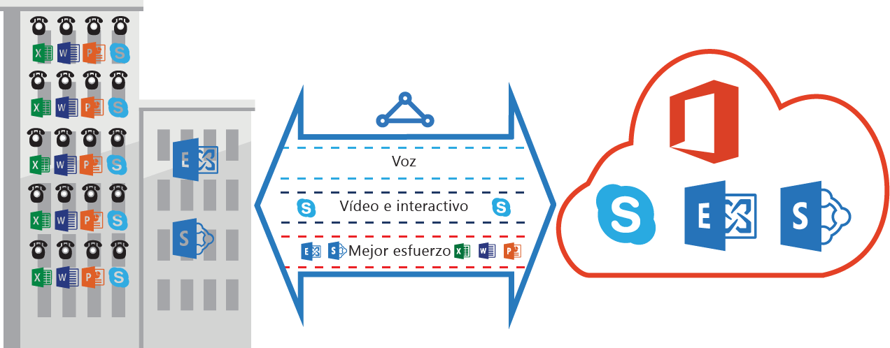

<properties
   pageTitle="Requisitos de QoS para ExpressRoute | Microsoft Azure"
   description="En esta página se proporcionan requisitos detallados para configurar y administrar QoS para circuitos ExpressRoute."
   documentationCenter="na"
   services="expressroute"
   authors="cherylmc"
   manager="carolz"
   editor=""/>
<tags
   ms.service="expressroute"
   ms.devlang="na"
   ms.topic="get-started-article"
   ms.tgt_pltfrm="na"
   ms.workload="infrastructure-services"
   ms.date="01/16/2016"
   ms.author="cherylmc"/>

# Requisitos de QoS ExpressRoute

Skype Empresarial tiene varias cargas de trabajo que requieren tratamiento diferenciado de QoS. Si piensa consumir servicios de voz a través de ExpressRoute, debe cumplir los requisitos descritos a continuación.

**Nota:** los requisitos de QoS solo se aplican al emparejamiento de Microsoft.

En la tabla siguiente se proporciona una lista de marcados de DSCP usados por Skype Empresarial. Consulte [Administración de QoS para Skype Empresarial](https://technet.microsoft.com/library/gg405409.aspx) para obtener más información.

| **Clase de tráfico** | **Tratamiento (marcado de DSCP)** | **Cargas de trabajo de Skype Empresarial** |
|---|---|---|
| **Voz** | EF (46) | Voz de Skype o Lync |
| **Interactivo** | AF41 (34) | Vídeo |
| | AF21 (18) | Uso compartido de aplicaciones | 
| | CS3 (24) | Señalización de SIP |
| **Valor predeterminado** | AF11 (10) | Transferencia de archivos|
| | CS0 (0) | Nada más| 

- Debe clasificar las cargas de trabajo y marcar los valores de DSCP correctos. Siga las instrucciones proporcionadas [aquí](https://technet.microsoft.com/library/gg405409.aspx) sobre cómo establecer marcados de DSCP en la red.

- Debe configurar y admitir varias colas de QoS dentro de la red. La voz debe ser una clase independiente y recibir el tratamiento EF especificado en RFC 3246.

- Puede decidir el mecanismo de puesta en cola, la directiva de detección de congestión y la asignación de ancho de banda por clase de tráfico. Sin embargo, se debe preservar el marcado de DSCP para cargas de trabajo de Skype Empresarial. Si utiliza marcados de DSCP no enumerados anteriormente, por ejemplo, AF31 (26), debe reescribir este valor de DSCP a 0 antes de enviar el paquete a Microsoft. Microsoft solo envía paquetes marcados con el valor de DSCP que se muestra en la tabla anterior.

## Pasos siguientes

- Consulte los requisitos de [enrutamiento](expressroute-routing.md) y [NAT](expressroute-nat.md).
- Consulte los vínculos siguientes para configurar la conexión ExpressRoute.

	- [Creación de un circuito ExpressRoute](expressroute-howto-circuit-classic.md)
	- [Configuración del enrutamiento](expressroute-howto-routing-classic.md)
	- [Vinculación de redes virtuales a circuitos ExpressRoute](expressroute-howto-linkvnet-classic.md)

<!---HONumber=AcomDC_0121_2016-->