<properties
	pageTitle="Tutorial de Apache Storm: Introducción a Storm | Microsoft Azure"
	description="Introducción al análisis de grandes cantidades de datos con Apache Storm y muestras de inicio de Storm en HDInsight. Aprenda a usar Storm para procesar datos en tiempo real."
	keywords="Storm de Apache, tutorial de Storm de Apache, análisis de macrodatos, inicio de Storm"
	services="hdinsight"
	documentationCenter=""
	authors="Blackmist"
	manager="paulettm"
	editor="cgronlun"
	tags="azure-portal"/>

<tags
   ms.service="hdinsight"
   ms.devlang="java"
   ms.topic="get-started-article"
   ms.tgt_pltfrm="na"
   ms.workload="big-data"
   ms.date="02/05/2016"
   ms.author="larryfr"/>

# Tutorial de Apache Storm: introducción a las muestras de Inicio de Storm para análisis de grandes cantidades de datos en HDInsight

Apache Storm es un sistema de cálculo distribuido, escalable, con tolerancia a errores y en tiempo real para el procesamiento de secuencias de datos. Con Storm en HDInsight de Microsoft Azure, puede crear un clúster de Storm basado en la nube que realice análisis de macrodatos en tiempo real.

> [AZURE.NOTE] En los pasos de este artículo se crea un clúster de HDInsight basado en Windows. Para conocer los pasos para crear un clúster Storm basado en Linux en HDInsight, consulte [Tutorial de Apache Storm: Introducción al ejemplo de inicio de Storm mediante el análisis de datos en HDInsight](hdinsight-apache-storm-tutorial-get-started-linux.md)

## Requisitos previos

Debe cumplir los siguientes requisitos previos para poder completar correctamente este tutorial sobre Apache Storm.

- **Una suscripción de Azure**. Vea [Obtener evaluación gratuita de Azure](https://azure.microsoft.com/documentation/videos/get-azure-free-trial-for-testing-hadoop-in-hdinsight/).

## Creación de un clúster de Storm

Storm en HDInsight usa el almacenamiento de blobs de Azure para almacenar archivos de registro y topologías enviadas al clúster. Siga estos pasos para crear una cuenta de almacenamiento de Azure para usarla con el clúster:

1. Inicie sesión en el [Portal de Azure][preview-portal].

2. Seleccione **NUEVO**, __Análisis de datos__ y, finalmente, __HDInsight__

	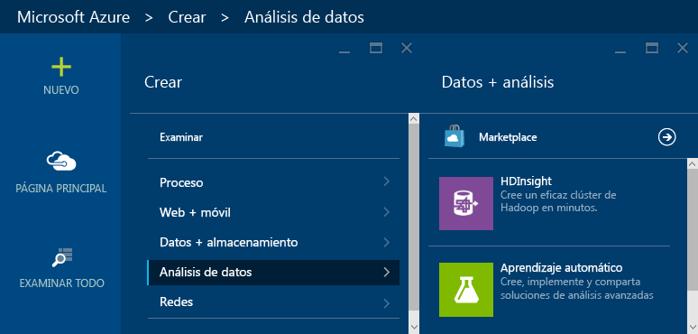

3. Escriba un __Nombre de clúster__ y seleccione __Storm__ como __Tipo de clúster__. Si está disponible, aparece una marca de verificación verde junto a __Nombre de clúster__.

	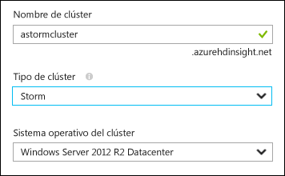

4. Si tienes más de una suscripción, selecciona la entrada __Suscripción__ entrada para seleccionar la suscripción de Azure que se usará para el clúster.

5. Para el __Grupo de recursos__, puedes seleccionar la entrada para ver una lista de grupos de recursos existentes y después seleccionar en el que quieras crear el clúster. También puede seleccionar __Crear nuevo__ y, a continuación, escribir el nombre del nuevo grupo de recursos. Aparece una marca de verificación verde para indicar si el nuevo nombre de grupo está disponible.

	> [AZURE.NOTE] Esta entrada se establece de manera predeterminada en uno de los grupos de recursos existentes, si hay alguno disponible.

6. Seleccione __Credenciales__ y luego especifique la información correspondiente en __Nombre de usuario de inicio de sesión del clúster__ y __Contraseña de inicio de sesión de clúster__. Por último, use __Seleccionar__ para establecer las credenciales. Escritorio remoto no se usará en este documento, por lo que puede dejarlo deshabilitado.

	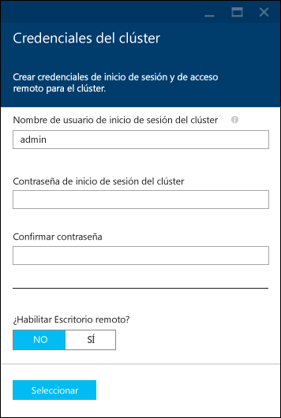

6. Para __Origen de datos__, puede seleccionar la entrada para elegir un origen de datos existente o crear uno nuevo.

	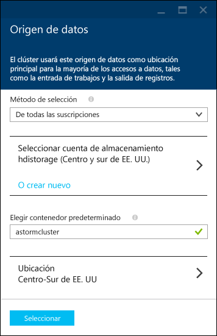

	Actualmente puede seleccionar una cuenta de almacenamiento de Azure como origen de datos para un clúster de HDInsight. Use lo siguiente para comprender las entradas de la hoja __Origen de datos__.

	- __Método de selección__: establézcalo en __De todas las suscripciones__ para habilitar la exploración de cuentas de almacenamiento en sus suscripciones. Establézcalo como __Tecla de acceso__ si desea especificar el __Nombre de almacenamiento__ y la __Tecla de acceso__ de una cuenta de almacenamiento existente.

	- __Crear nuevo__: use esta opción para crear una nueva cuenta de almacenamiento. Use el campo que aparece para especificar el nombre de la cuenta de almacenamiento. Si el nombre está disponible, aparece una marca de verificación verde.

	- __Elegir contenedor predeterminado__: use esta opción para escribir el nombre del contenedor predeterminado que se usará para el clúster. Aunque se puede escribir cualquier nombre aquí, se recomienda usar el mismo nombre que el del clúster para que pueda reconocer fácilmente que el contenedor se usa para este clúster concreto.

	- __Ubicación__: la región geográfica en la que se encuentra o donde se creará la cuenta de almacenamiento.

		> [AZURE.IMPORTANT] Al seleccionar la ubicación del origen de datos predeterminado también establece la ubicación del clúster de HDInsight. El origen de datos predeterminado y el clúster deben encontrarse en la misma región.

	- __Seleccionar__: use esta opción para guardar la configuración del origen de datos.

7. Seleccione __Planes de tarifa de nodo__ para mostrar información sobre los nodos que se crearán para este clúster. De forma predeterminada, el número de nodos de trabajo es __4__. Establézcalo en __1__, ya que es suficiente para este tutorial y reduce el costo del clúster. El costo estimado del clúster se muestra en la parte inferior de esta hoja.

	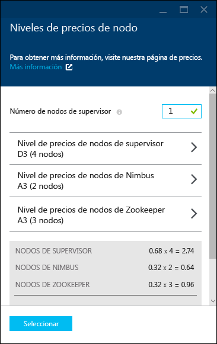

	Use __Seleccionar__ para guardar la información de __Planes de tarifa de nodo__.

8. Seleccione __Configuración opcional__. Esta hoja permite seleccionar la versión del clúster y configurar otros valores de configuración opcionales, por ejemplo, unirse a una __red virtual__ o configurar una __tienda de metadatos externa__ para almacenar datos de Hive y Oozie.

	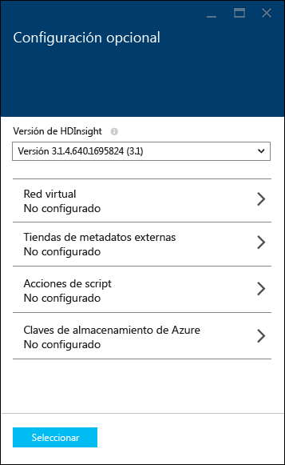

9. Asegúrese de que la opción __Anclar a Panel de inicio__ está seleccionada y luego elija __Crear__. Esto crea el clúster y agrega un icono para él en el panel de inicio de su Portal de Azure. El icono indica que el clúster se está aprovisionando y cambia para mostrar el icono de HDInsight cuando el aprovisionamiento se haya completado.

	| Durante el aprovisionamiento | Aprovisionamiento completado |
	| ------------------ | --------------------- |
	|  |  |

	> [AZURE.NOTE] El clúster tarda algo de tiempo en crearse, normalmente unos 15 minutos. Use el icono del Panel de inicio o la entrada __Notificaciones__ de la izquierda de la página para comprobar el proceso de aprovisionamiento.

## Ejecución de una muestra de inicio de Storm en HDInsight

Este tutorial de Apache Storm le sirve como introducción al análisis de grandes cantidades de datos con las muestras de inicio de Storm en GitHub.

Cada clúster de Storm en HDInsight incluye el panel Storm, que puede usarse para cargar y ejecutar topologías de Storm en el clúster. Cada clúster incluye también las topologías de muestra que se pueden ejecutar directamente desde el panel Storm.

### Conexión con el panel

El panel se encuentra en **https://&lt;clustername>.azurehdinsight.net//**, donde **clustername** es el nombre del clúster. De manera alternativa, para encontrar un vínculo al panel, seleccione el clúster en el Panel de inicio y el vínculo __Panel__ en la parte superior de la hoja.

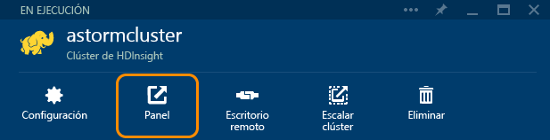

> [AZURE.NOTE] Al conectarse con el panel, se le pide que escriba un nombre de usuario y una contraseña. Se trata del nombre del administrador (**admin**) y la contraseña que usó al crear el clúster.

Cuando se haya cargado el panel Storm, verá el formulario **Enviar topología**.

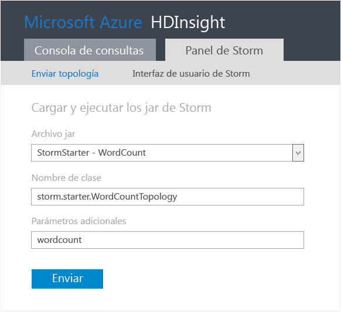

El formulario **Enviar topología** sirve para cargar y ejecutar archivos .jar que contienen topologías de Storm. También incluye varias muestras básicas que se ofrecen con el clúster.

### Ejecución de la muestra de recuento de palabras desde el proyecto de inicio de Storm en GitHub

Las muestras que se facilitan con el clúster incluyen ciertas variaciones de una topología de recuento de palabras. Estos ejemplos incluyen un **spout** que emite oraciones de forma aleatoria y **bolts** que dividen una frase en palabras individuales para, a continuación, contar cuántas veces se ha encontrado cada palabra. Estos ejemplos proceden de los [Ejemplos de inicio de Storm](https://github.com/apache/storm/tree/master/examples/storm-starter), que forman parte de Apache Storm.

Siga estos pasos para ejecutar una muestra de inicio de Storm:

1. Seleccione **StormStarter - WordCount** en la lista desplegable **Archivo Jar**. De este modo se rellenan los campos **Nombre de clase** y **Parámetros adicionales** con los parámetros del ejemplo.

	

	* **Nombre de la clase**: la clase en el archivo .jar que envía la topología.
	* **Parámetros adicionales**: los parámetros que requiere la topología. En este ejemplo, el campo se usa para proporcionar un nombre descriptivo para la topología enviada.

2. Haga clic en **Enviar**. Tras unos instantes, el campo **Resultado** muestra el comando usado para enviar el trabajo, así como los resultados del comando. El campo **Error** muestra los errores que se producen en el envío de la topología.

	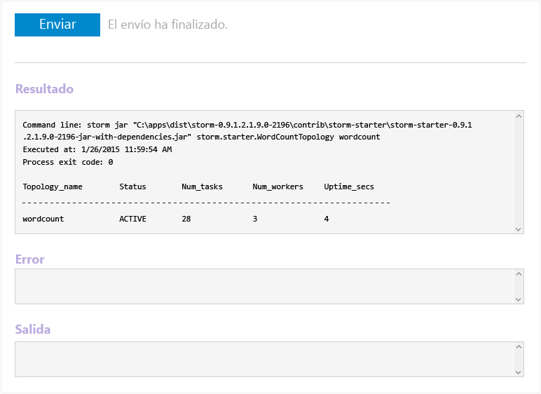

	> [AZURE.NOTE] Los resultados no indican que haya finalizado la topología: **una topología Storm, una vez iniciada, se ejecuta hasta que la detenga.** La topología de recuento de palabras genera frases aleatorias y mantiene un recuento del número de veces que encuentra cada palabra hasta que la detenga.

### Supervisión de la topología

La interfaz de usuario de Storm se puede usar para supervisar la topología.

1. Seleccione **IU de Storm** en la parte superior del panel de Storm. Se muestra información de resumen del clúster y de las topologías en ejecución.

	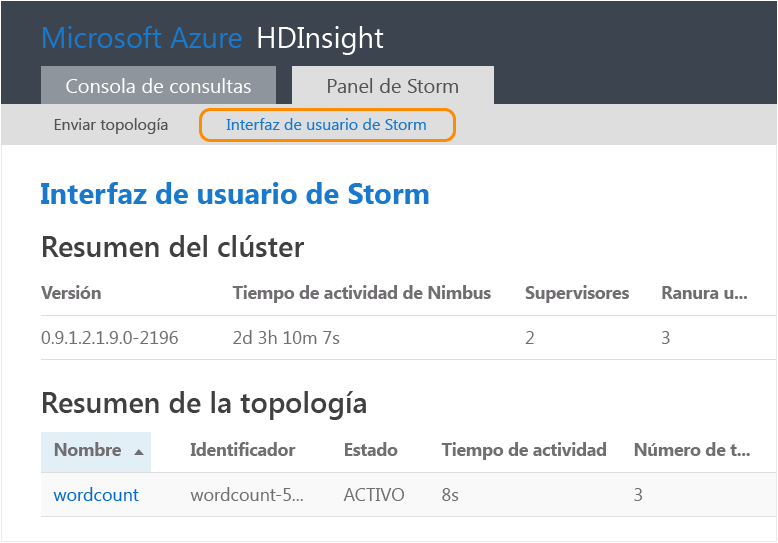

	En la página anterior, puede ver el tiempo que ha estado activa la topología, así como el número de trabajos, ejecutores y tareas que se usan.

	> [AZURE.NOTE] La columna **Nombre** contiene el nombre descriptivo que se proporcionó anteriormente mediante el campo **Parámetros adicionales**.

4. En el **resumen de la topología**, seleccione la entrada **wordcount** de la columna **Nombre**. Se muestra más información sobre la topología.

	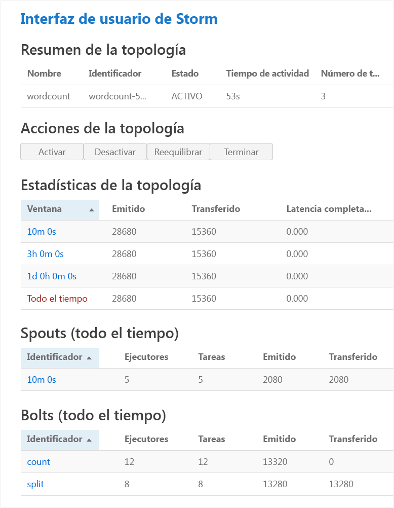

	Esta página ofrece la siguiente información:

	* **Estadísticas de topología**: información básica sobre el rendimiento de la topología, organizada en ventanas de tiempo.

		> [AZURE.NOTE] Al seleccionar una ventana de tiempo específica, se cambia la ventana de tiempo de la información que aparece en otras secciones de la página.

	* **Spouts**: información básica sobre spouts, entre la que se incluye el último error que ha devuelto cada spout.

	* **Bolts**: información básica sobre bolts.

	* **Configuración de la topología**: información detallada sobre la configuración de la topología.

	Esta página también ofrece acciones que se pueden realizar en la topología:

	* **Activar**: reanuda el procesamiento de una topología desactivada.

	* **Desactivar**: pausa una topología en ejecución.

	* **Reequilibrar**: ajusta el paralelismo de la topología. Debe volver a equilibrar las topologías en ejecución después de haber cambiado el número de nodos del clúster. Esto permite que la topología ajuste el paralelismo para compensar el mayor o menor número de nodos del clúster. Para más información, consulte la entrada de blog [Understanding the parallelism of a Storm topology](http://storm.apache.org/documentation/Understanding-the-parallelism-of-a-Storm-topology.html).

	* **Eliminar**: finaliza una topología de Storm tras el tiempo de espera especificado.

5. En esta página, seleccione una entrada en la sección **Spouts** o **Bolts**. Se muestra información sobre el componente seleccionado.

	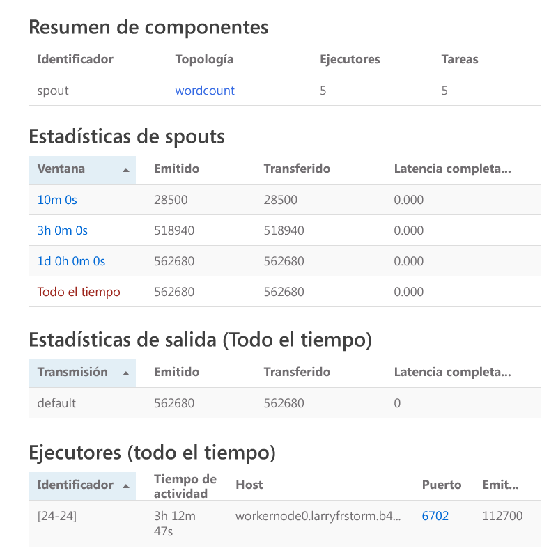

	En esta página se muestra la siguiente información:

	* **Estadísticas de spouts y bolts**: información básica sobre el rendimiento de los componentes, organizada en ventanas de tiempo.

		> [AZURE.NOTE] Al seleccionar una ventana de tiempo específica, se cambia la ventana de tiempo de la información que aparece en otras secciones de la página.

	* **Estadísticas de entrada** (solo bolt): información sobre los componentes que generan los datos que consume el bolt.

	* **Estadísticas de salida**: información sobre los datos que emite este bolt.

	* **Ejecutores**: información sobre las instancias de este componente.

	* **Errores**: errores que ha generado este componente.

5. Al visualizar los detalles de un spout o bolt, seleccione una entrada de la columna **Puerto** en la sección **Ejecutores** para ver los detalles de una instancia específica del componente.

		2015-01-27 14:18:02 b.s.d.task [INFO] Emitting: split default ["with"]
		2015-01-27 14:18:02 b.s.d.task [INFO] Emitting: split default ["nature"]
		2015-01-27 14:18:02 b.s.d.executor [INFO] Processing received message source: split:21, stream: default, id: {}, [snow]
		2015-01-27 14:18:02 b.s.d.task [INFO] Emitting: count default [snow, 747293]
		2015-01-27 14:18:02 b.s.d.executor [INFO] Processing received message source: split:21, stream: default, id: {}, [white]
		2015-01-27 14:18:02 b.s.d.task [INFO] Emitting: count default [white, 747293]
		2015-01-27 14:18:02 b.s.d.executor [INFO] Processing received message source: split:21, stream: default, id: {}, [seven]
		2015-01-27 14:18:02 b.s.d.task [INFO] Emitting: count default [seven, 1493957]

	A partir de estos datos, puede ver que la palabra **seven** se ha repetido 1 493 957 veces. Ese es el número de veces que se ha encontrado desde que se inició esta topología.

### Detención de la topología

Vuelva a la página **Resumen de la topología** de la topología de recuento de palabras y seleccione **Eliminar** de la sección **Acciones de topología**. Cuando se le solicite, escriba 10 como los segundos de espera antes de detener la topología. Tras el período de tiempo de espera, ya no aparece la topología cuando visita la sección **IU de Storm** del panel.

## Resumen

En este tutorial de Apache Storm, usó el inicio de Storm para aprender a crear un clúster de Storm en HDInsight y usar el panel de Storm para implementar, supervisar y administrar topologías de Storm.

## Pasos siguientes

* **Herramientas de HDInsight para Visual Studio**: las herramientas de HDInsight le permiten usar Visual Studio para enviar, supervisar y administrar topologías Storm de forma similar al panel Storm mencionado anteriormente. Las herramientas de HDInsight también ofrecen la posibilidad de crear topologías de Storm en C# e incluyen topologías de muestra que puede implementar y ejecutar en el clúster.

	Para obtener más información, consulte [Introducción al uso de las herramientas de HDInsight para Visual Studio](hdinsight-hadoop-visual-studio-tools-get-started.md).

* **Archivos de muestra**: el clúster de Storm en HDInsight ofrece varios ejemplos en el directorio **%STORM\_HOME%\\contrib**. Cada ejemplo debe contener lo siguiente:

	* El código fuente, por ejemplo, storm-starter-0.9.1.2.1.5.0-2057-sources.jar

	* Los documentos de Java, por ejemplo, storm-starter-0.9.1.2.1.5.0-2057-javadoc.jar

	* El ejemplo, por ejemplo, storm-starter-0.9.1.2.1.5.0-2057-jar-with-dependencies.jar

	Use el comando 'jar' para extraer el código fuente o los documentos de Java. Por ejemplo, 'jar -xvf storm-starter-0.9.1.2.1.5.0.2057-javadoc.jar'.

	> [AZURE.NOTE] Los documentos de Java constan de páginas web. Una vez extraídos, use un explorador para ver el archivo **index.html**.

	Para obtener acceso a estas muestras, debe habilitar Escritorio remoto para el clúster de Storm en HDInsight y, después, copiar los archivos desde **%STORM\_HOME%\\contrib**.

* El documento siguiente contiene una lista de otros ejemplos que se pueden usar con Storm en HDInsight:

	* [Topologías de ejemplo para Storm en HDInsight](hdinsight-storm-example-topology.md)

[apachestorm]: https://storm.incubator.apache.org
[stormdocs]: http://storm.incubator.apache.org/documentation/Documentation.html
[stormstarter]: https://github.com/apache/storm/tree/master/examples/storm-starter
[stormjavadocs]: https://storm.incubator.apache.org/apidocs/
[azureportal]: https://manage.windowsazure.com/
[hdinsight-provision]: hdinsight-provision-clusters.md
[preview-portal]: https://portal.azure.com/

<!---HONumber=AcomDC_0211_2016-->