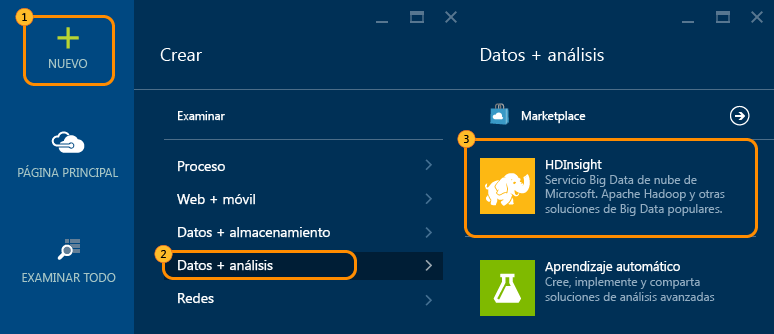
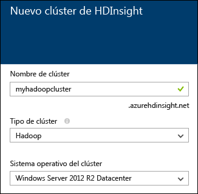
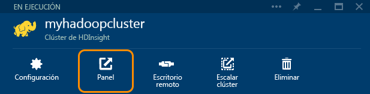

<properties
   pageTitle="Tutorial de Hadoop: introducción a Hadoop en Windows | Microsoft Azure"
   description="Introducción a Hadoop en HDInsight. Aprenda a crear clústeres de Hadoop en Windows, a ejecutar una consulta de Hive en datos y analizar los resultados en Excel."
   keywords="tutorial de hadoop,hadoop en windows,clúster de hadoop,aprender hadoop,consulta de hive"
   services="hdinsight"
   documentationCenter=""
   authors="nitinme"
   manager="paulettm"
   editor="cgronlun"
   tags="azure-portal"/>

<tags
   ms.service="hdinsight"
   ms.devlang="na"
   ms.topic="hero-article"
   ms.tgt_pltfrm="na"
   ms.workload="big-data"
   ms.date="02/25/2016"
   ms.author="nitinme"/>

# Tutorial de Hadoop: Introducción al uso de Hadoop en HDInsight en Windows

> [AZURE.SELECTOR]
- [Windows](../hdinsight-hadoop-tutorial-get-started-windows.md)
- [Linux](../hdinsight-hadoop-linux-tutorial-get-started.md)

Para ayudarle a aprender a usar Hadoop en Windows y a empezar a usar HDInsight, en este tutorial se muestra cómo ejecutar una consulta de Hive en datos no estructurados en un clúster de Hadoop y, a continuación, analizar los resultados en Microsoft Excel.

Supongamos que tiene un gran conjunto de datos no estructurados y que quiere ejecutar una consulta de Hive en él para extraer alguna información significativa. Eso es exactamente lo que vamos a hacer en este tutorial. Siga los pasos siguientes para lograrlo:

   !["Tutorial de Hadoop: Creación de una cuenta; creación de un clúster de Hadoop; envío de una consulta de Hive; análisis de datos en Excel.][image-hdi-getstarted-flow]

Vea un vídeo de demostración de este tutorial para aprender Hadoop en HDInsight:

![Vídeo de un primer tutorial de Hadoop: enviar una consulta de Hive en un clúster de Hadoop y analizar resultados en Excel.][img-hdi-getstarted-video]

**[Ver el tutorial de Hadoop para HDInsight en YouTube](https://www.youtube.com/watch?v=Y4aNjnoeaHA&list=PLDrz-Fkcb9WWdY-Yp6D4fTC1ll_3lU-QS)**

Además de poner HDInsight de Azure a disposición de los usuarios, Microsoft también proporciona el emulador de HDInsight para Azure, anteriormente conocido como *Microsoft HDInsight Developer Preview*. El emulador está destinado a los desarrolladores y solo admite implementaciones de un solo nodo. Para usar el emulador de HDInsight, consulte [Introducción al emulador de HDInsight][hdinsight-emulator].

### Requisitos previos

Antes de empezar este tutorial para Hadoop en Windows, debe contar con lo siguiente:

- **Una suscripción de Azure**. Consulte [How to get Azure Free trial for testing Hadoop in HDInsight (Obtención de una versión de prueba gratuita de Azure para probar Hadoop en HDInsight)](https://azure.microsoft.com/documentation/videos/get-azure-free-trial-for-testing-hadoop-in-hdinsight/).
- Una **estación de trabajo** con Office Professional Plus 2013, Office 365 Pro Plus, Excel 2013 Standalone u Office Professional Plus 2010.

##Creación de clústeres de Hadoop

Cuando crea un clúster, crea recursos de proceso de Azure que contienen aplicaciones de Hadoop y aplicaciones relacionadas. En esta sección, se crea un clúster de HDInsight versión 3.2. También puede crear clústeres de Hadoop para otras versiones. Para obtener instrucciones, vea [Creación de clústeres de HDInsight usando opciones personalizadas][hdinsight-provision]. Para obtener información acerca de las diferentes versiones de HDInsight y sus contratos de nivel de servicio, consulte la página [Control de versiones de componentes de HDInsight](hdinsight-component-versioning.md).

**Para crear un clúster de Hadoop**

1. Inicie sesión en el [Portal de Azure](https://ms.portal.azure.com/).
2. Haga clic en **NUEVO**, en **Análisis de datos** y luego en **HDInsight**. El portal abrirá una hoja **Nuevo clúster de HDInsight**.

    

3. Escriba o seleccione lo siguiente:

	
	
	|Nombre del campo| Valor|
	|----------|------|
	|Cluster Name| Nombre único que identifica al clúster|
	|Tipo de clúster| Seleccione **Hadoop** para este tutorial. |
	|Sistema operativo de clústeres| Seleccione **Windows Server 2012 R2 Datacenter**.|
	|Versión de HDInsight| Seleccione la versión más reciente de este tutorial.|
	|La suscripción| Seleccione la suscripción de Azure que se usará para el clúster.|
	|El grupos de recursos | Seleccione un grupo de recursos de Azure existente o cree uno nuevo. Un clúster de HDInsight básico contiene un clúster y su cuenta de almacenamiento predeterminada. Puede agrupar los dos en un grupo de recursos para facilitar su administración.|
	|Credenciales| Escriba el nombre de usuario y la contraseña de inicio de sesión del clúster. Los clústeres basados en Windows pueden tener dos cuentas de usuario. El usuario de clúster (o usuario HTTP) se usa para administrar el clúster y enviar trabajos. También puede crear una cuenta de usuario de Escritorio remoto (RDP) para conectarse al clúster de forma remota. Si decide habilitar Escritorio remoto, se creará la cuenta de usuario RDP.|
	|Origen de datos| Haga clic en Crear nueva para crear una cuenta de almacenamiento de Azure predeterminada. Use el nombre del clúster como nombre de contenedor predeterminado. Cada clúster de HDinsight tiene un contenedor de blobs predeterminado en una cuenta de almacenamiento de Azure. La ubicación de la cuenta de almacenamiento de Azure predeterminada determina la ubicación del clúster de HDInsight.|
	|Niveles de precios de nodo| Use uno o dos nodos de trabajo con el plan de tarifa predeterminado de nodo principal y nodo de trabajo para este tutorial.|
	|Configuración opcional| Omitir esto|

9. En la hoja **Nuevo clúster de HDInsight**, asegúrese de que la opción **Anclar a Panel de inicio** está seleccionada y haga clic en **Crear**. Esto creará el clúster y agregará un icono para él en el panel de inicio de su Portal de Azure. El icono indicará que el clúster se está creando y, cuando se haya completado el proceso, cambiará para mostrar el icono de HDInsight.

	| Durante la creación | Creación completa |
	| ------------------ | --------------------- |
	|  |  |

	> [AZURE.NOTE] El clúster tardará algo de tiempo en crearse, normalmente unos 15 minutos. Use el icono del Panel de inicio o la entrada **Notificaciones** de la izquierda de la página para comprobar el proceso de creación.

10. Cuando termine la creación, haga clic en el icono del clúster desde el panel de inicio para iniciar la hoja del clúster.

## Ejecución de una consulta de Hive en el portal
Ahora que ha creado un clúster de HDInsight, el paso siguiente es ejecutar un trabajo de Hive para consultar una tabla de muestra de Hive. Usaremos *hivesampletable*, que viene con los clústeres de HDInsight. La tabla contiene datos sobre los fabricantes de dispositivos móviles, las plataformas y los modelos. Una consulta de Hive en esta tabla recupera datos para dispositivos móviles por un fabricante especificado.

> [AZURE.NOTE] En las herramientas de HDInsight para Visual Studio, se incluye el SDK de Azure para la versión 2.5 o posterior de .NET. Mediante las herramientas de Visual Studio, puede conectarse al clúster de HDInsight, crear tablas de Hive y ejecutar consultas de Hive. Para obtener más información, consulte [Introducción al uso de las herramientas de Hadoop de HDInsight para Visual Studio][1].

**Para ejecutar un trabajo de Hive desde el panel del clúster**

1. Inicie sesión en el [Portal de Azure](https://ms.portal.azure.com/).
2. Haga clic en **EXAMINAR TODO** y luego en **Clústeres de HDInsight** para ver una lista de los clústeres, incluido el que acaba de crear en la sección anterior.
3. Haga clic en el nombre del clúster que quiere usar para ejecutar el trabajo de Hive y luego en **Panel** en la parte superior de la hoja.
4. Se abre una página web en una pestaña de explorador diferente. Escriba la cuenta de usuario y la contraseña de Hadoop. El nombre de usuario predeterminado es **admin** y la contraseña es la que escribió durante el proceso de creación del clúster.
5. En el panel, haga clic en la pestaña **Editor de Hive**. Se abre la página web siguiente.

	![Pestaña Editor de Hive en el panel del clúster en HDInsight.][img-hdi-dashboard]

	Hay varias pestañas en la parte superior de la página. La pestaña predeterminada es **Editor de Hive** y las otras pestañas son **Historial de trabajos** y **Explorador de archivos**. Mediante el panel, puede enviar consultas de Hive, comprobar registros de trabajo de Hadoop y examinar archivos del almacenamiento.

	> [AZURE.NOTE] Tenga en cuenta que la dirección URL de la página web es *&lt;NombreClúster&gt;.azurehdinsight.net*. Por tanto, en lugar de abrir el panel desde el Portal, puede abrirlo desde el explorador web mediante la dirección URL.

6. En la pestaña **Editor de Hive**, para **Nombre de la consulta**, escriba **HTC20**. El nombre de la consulta es el título del trabajo. En el panel de consulta, escriba la consulta de Hive como se muestra en la imagen:

	![Consulta de Hive especificada en el panel de consulta del Editor de Hive.][img-hdi-dashboard-query-select]

4. Haga clic en **Enviar**. Los resultados tardan unos segundos en aparecer. La pantalla se actualiza cada 30 segundos. También puede hacer clic en **Actualizar** para renovar la pantalla.

    ![Resultados de una consulta de Hive en la parte inferior del panel del clúster.][img-hdi-dashboard-query-select-result]

5. Cuando el estado muestra que se ha completado el trabajo, haga clic en el nombre de la consulta en la pantalla para ver el resultado. Anote el valor de **Hora de inicio del trabajo (UTC)**. Lo necesitará más adelante.

    ![La hora de inicio del trabajo en la pestaña Historial de trabajos del panel del clúster de HDInsight.][img-hdi-dashboard-query-select-result-output]

    La página también muestra los campos **Salida del trabajo** y **Registro de trabajo**. También tiene la posibilidad de descargar el archivo de salida (\_stdout) y el archivo de registro (\_stderr).

**Para examinar el archivo de salida**

1. En el panel del clúster, haga clic en **Explorador de archivos**.
2. Haga clic en el nombre de la cuenta de almacenamiento, haga clic en el nombre del contenedor (que coincide con el del clúster) y, después, haga clic en **usuario**.
3. Haga clic en **admin** y, después, haga clic en el GUID que tiene la hora de la última modificación (un poco después de la hora de inicio del trabajo que ha anotado anteriormente). Copie este GUID. Lo necesitará en la siguiente sección.

   	![GUID del archivo de salida de la consulta de Hive mostrado en la pestaña Explorador de archivos.][img-hdi-dashboard-query-browse-output]

##Conexión a las herramientas de inteligencia empresarial de Microsoft para Excel

Puede usar el complemento Power Query para Microsoft Excel para importar la salida del trabajo desde HDInsight hasta Excel, donde se pueden usar las herramientas de inteligencia empresarial de Microsoft para analizar más en profundidad los resultados.

Para completar esta parte del tutorial, debe tener instalado Excel 2013 o 2010.

**Para descargar Microsoft Power Query para Excel**

- Descargue Microsoft Power Query para Microsoft Excel desde el [Centro de descarga de Microsoft](http://www.microsoft.com/download/details.aspx?id=39379) e instálelo.

**Para importar datos de HDInsight**

1. Abra Excel y cree un libro nuevo.
3. Haga clic en el menú **Power Query**, en **Desde otros orígenes** y, a continuación, en **De HDInsight de Azure**.

	![Menú de importación de PowerQuery de Excel abierto para HDInsight de Azure.][image-hdi-gettingstarted-powerquery-importdata]

3. En **Nombre de cuenta**, escriba el nombre de la cuenta de almacenamiento de blobs de Azure asociada al clúster y, a continuación, haga clic en **Aceptar**. (Esta es la cuenta de almacenamiento creada previamente en el tutorial).
4. En **Clave de cuenta**, escriba la clave de la cuenta de almacenamiento de blobs de Azure y, a continuación, haga clic en **Guardar**.
5. En el panel derecho, haga doble clic en el nombre del blob. De forma predeterminada, el nombre del blob es el mismo que el del clúster.

6. Busque **stdout** en la columna **Nombre**. Compruebe que el GUID de la columna **Ruta de acceso de la carpeta** correspondiente coincide con el GUID que copió anteriormente. Una coincidencia sugiere que los datos de salida corresponden al trabajo que envió. Haga clic en **Binario** en la columna izquierda de **stdout**.

	![Búsqueda de salidas de datos mediante GUID en la lista de contenido.][image-hdi-gettingstarted-powerquery-importdata2]

9. Haga clic en **Cerrar y cargar** en la esquina superior izquierda para importar la salida del trabajo de Hive en Excel.

##Ejecución de ejemplos

Un clúster de HDInsight ofrece una consola de consultas que incluye una Galería de introducción para ejecutar muestras directamente en el portal. Puede usar las muestras para aprender a trabajar con HDInsight explorando algunos escenarios básicos. Estas muestras vienen con todos los componentes necesarios como, por ejemplo, los datos objeto del análisis y las consultas que se ejecutan en los datos. Para obtener más información acerca de las muestras de la Galería de introducción, consulte [Información sobre Hadoop en HDInsight con la Galería de introducción de HDInsight](hdinsight-learn-hadoop-use-sample-gallery.md).

**Para ejecutar el ejemplo**

1. En el Panel de inicio del Portal de Azure, haga clic en el icono del clúster que acaba de crear.
 
2. En la hoja del nuevo clúster, haga clic en **Panel**. Cuando se le solicite, escriba el nombre de usuario y la contraseña de administrador para el clúster.

	
 
3. En la página web que se abre, haga clic en la pestaña **Galería de introducción** y, en la categoría **Soluciones con datos de muestra**, haga clic en la muestra que desea ejecutar. Siga las instrucciones de la página web para finalizar la muestra. En la tabla siguiente, figuran algunas de las muestras y se proporciona más información acerca de lo que hace cada una.

Muestra | ¿Para qué sirve?
------ | ---------------
[Análisis de datos del sensor][hdinsight-sensor-data-sample] | Aprenda a usar HDInsight para procesar datos históricos producidos por sistemas de aire acondicionado, ventilación y calefacción (HVAC) para identificar sistemas que no pueden mantener de manera confiable una temperatura establecida.
[Análisis del registro del sitio web][hdinsight-weblogs-sample] | Aprenda a usar HDInsight para analizar los archivos de registro del sitio web con objeto de conocer la frecuencia de las visitas diarias al mismo desde sitios web externos y obtener un resumen de los errores que experimentan los usuarios en el sitio web.
[Análisis de tendencias de Twitter](hdinsight-analyze-twitter-data.md) | Aprenda a usar HDInsight para analizar las tendencias en Twitter.

##Pasos siguientes
En este tutorial de Hadoop, ha aprendido a crear un clúster de Hadoop en Windows en HDInsight, a ejecutar una consulta de Hive sobre los datos y a importar los resultados en Excel, para procesarlos mejor y representarlos gráficamente con las herramientas de inteligencia empresarial. Para obtener más información, consulte los tutoriales siguientes:

- [Introducción al uso de herramientas de Hadoop de HDInsight para Visual Studio][1]
- [Introducción al Emulador de HDInsight][hdinsight-emulator]
- [Uso del almacenamiento de blobs de Azure con HDInsight][hdinsight-storage]
- [Administración de HDInsight con PowerShell][hdinsight-admin-powershell]
- [Carga de datos en HDInsight][hdinsight-upload-data]
- [Uso de MapReduce con HDInsight][hdinsight-use-mapreduce]
- [Uso de Hive con HDInsight][hdinsight-use-hive]
- [Uso de Pig con HDInsight][hdinsight-use-pig]
- [Uso de Oozie con HDInsight][hdinsight-use-oozie]
- [Desarrollo de programas de streaming de Hadoop C# para HDInsight][hdinsight-develop-streaming]
- [Desarrollo de programas de MapReduce de Java para HDInsight][hdinsight-develop-mapreduce]

[1]: ../HDInsight/hdinsight-hadoop-visual-studio-tools-get-started.md

[hdinsight-versions]: hdinsight-component-versioning.md

[hdinsight-provision]: hdinsight-provision-clusters.md
[hdinsight-admin-powershell]: hdinsight-administer-use-powershell.md
[hdinsight-upload-data]: hdinsight-upload-data.md
[hdinsight-use-mapreduce]: hdinsight-use-mapreduce.md
[hdinsight-use-hive]: hdinsight-use-hive.md
[hdinsight-use-pig]: hdinsight-use-pig.md
[hdinsight-use-oozie]: hdinsight-use-oozie.md
[hdinsight-storage]: hdinsight-hadoop-use-blob-storage.md
[hdinsight-emulator]: hdinsight-hadoop-emulator-get-started.md
[hdinsight-develop-streaming]: hdinsight-hadoop-develop-deploy-streaming-jobs.md
[hdinsight-develop-mapreduce]: hdinsight-develop-deploy-java-mapreduce.md
[hadoop-hdinsight-intro]: hdinsight-hadoop-introduction.md
[hdinsight-weblogs-sample]: hdinsight-hive-analyze-website-log.md
[hdinsight-sensor-data-sample]: hdinsight-hive-analyze-sensor-data.md

[azure-purchase-options]: http://azure.microsoft.com/pricing/purchase-options/
[azure-member-offers]: http://azure.microsoft.com/pricing/member-offers/
[azure-free-trial]: http://azure.microsoft.com/pricing/free-trial/
[azure-management-portal]: https://ms.portal.azure.com/
[azure-create-storageaccount]: ../storage-create-storage-account.md

[apache-hadoop]: http://go.microsoft.com/fwlink/?LinkId=510084
[apache-hive]: http://go.microsoft.com/fwlink/?LinkId=510085
[apache-mapreduce]: http://go.microsoft.com/fwlink/?LinkId=510086
[apache-hdfs]: http://go.microsoft.com/fwlink/?LinkId=510087
[hdinsight-hbase-custom-provision]: hdinsight-hbase-tutorial-get-started.md

[powershell-download]: http://go.microsoft.com/fwlink/p/?linkid=320376&clcid=0x409
[powershell-install-configure]: powershell-install-configure.md
[powershell-open]: powershell-install-configure.md#step-1-install

[img-hdi-dashboard]: ./media/hdinsight-hadoop-tutorial-get-started-windows/HDI.dashboard.png
[img-hdi-dashboard-query-select]: ./media/hdinsight-hadoop-tutorial-get-started-windows/HDI.dashboard.query.select.png
[img-hdi-dashboard-query-select-result]: ./media/hdinsight-hadoop-tutorial-get-started-windows/HDI.dashboard.query.select.result.png
[img-hdi-dashboard-query-select-result-output]: ./media/hdinsight-hadoop-tutorial-get-started-windows/HDI.dashboard.query.select.result.output.png
[img-hdi-dashboard-query-browse-output]: ./media/hdinsight-hadoop-tutorial-get-started-windows/HDI.dashboard.query.browse.output.png

[img-hdi-getstarted-video]: ./media/hdinsight-hadoop-tutorial-get-started-windows/hdi-get-started-video.png

[image-hdi-storageaccount-quickcreate]: ./media/hdinsight-hadoop-tutorial-get-started-windows/HDI.StorageAccount.QuickCreate.png
[image-hdi-clusterstatus]: ./media/hdinsight-hadoop-tutorial-get-started-windows/HDI.ClusterStatus.png
[image-hdi-quickcreatecluster]: ./media/hdinsight-hadoop-tutorial-get-started-windows/HDI.QuickCreateCluster.png
[image-hdi-getstarted-flow]: ./media/hdinsight-hadoop-tutorial-get-started-windows/HDI.GetStartedFlow.png

[image-hdi-gettingstarted-powerquery-importdata]: ./media/hdinsight-hadoop-tutorial-get-started-windows/HDI.GettingStarted.PowerQuery.ImportData.png
[image-hdi-gettingstarted-powerquery-importdata2]: ./media/hdinsight-hadoop-tutorial-get-started-windows/HDI.GettingStarted.PowerQuery.ImportData2.png
 

<!----HONumber=AcomDC_0302_2016-->