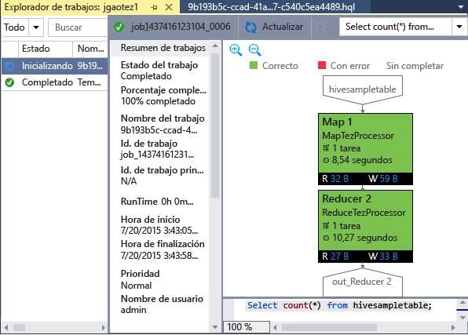

<properties
	pageTitle="Aprenda a usar las herramientas de Hadoop para Visual Studio en HDInsight | Microsoft Azure"
	description="Aprenda a instalar y usar las herramientas de Hadoop en HDInsight para conectarse a un clúster de Hadoop y ejecutar una consulta de Hive."
	keywords="herramientas de hadoop,consulta de hive,visual studio"
	services="HDInsight"
	documentationCenter=""
	tags="azure-portal"
	authors="mumian"
	manager="paulettm"
	editor="cgronlun"/>

<tags
	ms.service="hdinsight"
	ms.devlang="na"
	ms.topic="get-started-article"
	ms.tgt_pltfrm="na"
	ms.workload="big-data"
	ms.date="01/27/2016"
	ms.author="jgao"/>

# Introducción al uso de herramientas de Hadoop en Visual Studio para HDInsight para ejecutar una consulta de Hive

Aprenda a usar las herramientas de HDInsight para Visual Studio para conectarse a clústeres de HDInsight y enviar consultas de Hive. Para obtener más información sobre el uso de HDInsight, consulte [Introducción a HDInsight][hdinsight.introduction] y [Primeros pasos con HDInsight][hdinsight.get.started]. Para obtener más información acerca de cómo conectarse a un clúster de Storm, consulte [Desarrollo de topologías de C# para Apache Storm en HDInsight con Visual Studio][hdinsight.storm.visual.studio.tools].

**Requisitos previos**

Para completar este tutorial y utilizar las herramientas de Hadoop en Visual Studio, necesitará lo siguiente:

- Un clúster de HDInsight de Azure: un clúster basado en Windows o Linux funcionará con los pasos descritos en este documento. Consulte uno de los temas siguientes para obtener información sobre la creación de un clúster:

	- [Introducción al uso de HDInsight en Linux](hdinsight-hadoop-linux-tutorial-get-started.md)
	- [Introducción al uso de HDInsight en Windows](hdinsight-hadoop-tutorial-get-started-windows.md)

- Una estación de trabajo con el siguiente software:

	- Windows 8.1, Windows 8 o Windows 7
	- Visual Studio (una de las siguientes versiones):
		- Visual Studio 2013 Comunidad/Professional/Premium/Ultimate con [actualización 4](https://www.microsoft.com/download/details.aspx?id=44921)
		- Visual Studio 2015 (Community/Enterprise)

	>[AZURE.NOTE] Actualmente, las herramientas de HDInsight para Visual Studio solo se incluyen en la versión en inglés.

## Instalación de las herramientas de Hadoop para Visual Studio

Las herramientas de HDInsight para Visual Studio y el controlador ODBC de Microsoft Hive se incluyen en el SDK de Microsoft Azure para la versión 2.5.1, o posterior, de .NET. Puede instalarlo mediante el [Instalador de plataforma web](http://go.microsoft.com/fwlink/?LinkId=255386). Debe elegir el que coincida con su versión de Visual Studio. Si no tiene instalado Visual Studio, puede instalar el SDK de Azure y la Visual Studio Community más recientes mediante el [Instalador de plataforma web](http://go.microsoft.com/fwlink/?LinkId=255386) o mediante los siguientes vínculos:

- [Visual Studio Community 2015 con el SDK de Microsoft Azure](https://www.microsoft.com/web/handlers/webpi.ashx/getinstaller/VS2015CommunityAzurePack.appids) 
- [Visual Studio Community 2013 con el SDK de Microsoft Azure](https://www.microsoft.com/web/handlers/webpi.ashx/getinstaller/VS2013CommunityAzurePack.appids) 
- [SDK de Microsoft Azure para .NET (VS 2015)](https://www.microsoft.com/web/handlers/webpi.ashx/getinstaller/VWDOrVs2015AzurePack.appids) 
- [SDK de Microsoft Azure para .NET (VS 2013)](https://www.microsoft.com/web/handlers/webpi.ashx/getinstaller/VWDOrVs2013AzurePack.appids) 

![Herramientas de Hadoop: herramientas de HDInsight para el Instalador de plataforma web de Visual Studio.][1]

## Conexión a suscripciones de Azure
Las herramientas de HDInsight para Visual Studio permiten conectarse a los clústeres de HDInsight, realizar algunas operaciones básicas de administración y ejecutar consultas de Hive.

>[AZURE.NOTE] Para más información acerca de cómo conectarse a un clúster de Hadoop genérico, consulte [How to write and submit Hive queries using Visual Studio](http://blogs.msdn.com/b/xiaoyong/archive/2015/05/04/how-to-write-and-submit-hive-queries-using-visual-studio.aspx) (Escritura y envío de consultas de Hive usando Visual Studio).

**Para conectarse a su suscripción de Azure**

1.	Abra Visual Studio.
2.	Desde el menú **Ver**, haga clic en **Explorador de servidores** para abrir la ventana del Explorador de servidores.
3.	Expanda **Azure** y, a continuación, haga lo propio con **HDInsight**.

	>[AZURE.NOTE]Debe abrirse la ventana **Lista de tareas de HDInsight**. Si no la ve, haga clic en **Otras ventanas** en el menú **Ver** y luego en **Ventana Lista de tareas de HDInsight**.  
4.	Escriba sus credenciales de suscripción de Azure y, a continuación, haga clic en **Iniciar sesión**. Esto solo es necesario si nunca se ha conectado a la suscripción de Azure desde Visual Studio en esta estación de trabajo.
5.	En el Explorador de servidores, se mostrará una lista de los clústeres de HDInsight existentes. Si no tiene ningún clúster, puede aprovisionar uno mediante el Portal de Azure, Azure PowerShell o el SDK de HDInsight. Para obtener más información, consulte [Aprovisionamiento de clústeres de HDInsight][hdinsight-provision].

	![Herramientas de Hadoop: herramientas de HDInsight para la lista de clústeres del Explorador de servidores de Visual Studio][5]
6.	Expanda un clúster de HDInsight. Verá las **bases de datos de Hive**, una cuenta de almacenamiento predeterminada, las cuentas de almacenamiento vinculadas y el **registro del servicio Hadoop**. Puede expandir las entidades.

Una vez conectado a su suscripción de Azure, podrá realizar lo siguiente:

**Para conectarse al Portal de Azure desde Visual Studio, siga estos pasos:**

- En el Explorador de servidores, expanda **Azure** > **HDInsight**, haga clic con el botón derecho en un clúster de HDInsight y, a continuación, haga clic en **Administrar el clúster en el Portal de Azure**.

**Para hacer preguntas y proporcionar comentarios desde Visual Studio, siga estos pasos:**

- Desde el menú **Herramientas**, haga clic en **HDInsight** y, a continuación, haga clic en **Foro de MSDN** para realizar preguntas o **Enviar comentarios**.

## Navegación por los recursos vinculados

Desde el Explorador de servidores, podrá ver la cuenta de almacenamiento predeterminada y las cuentas de almacenamiento vinculadas. Expanda la cuenta de almacenamiento predeterminada para ver los contenedores en la cuenta de almacenamiento. Se marcarán la cuenta de almacenamiento predeterminada y el contenedor predeterminado. También puede hacer clic con el botón derecho en cualquiera de los contenedores para ver el contenido.

![Herramientas de HDInsight para Visual Studio lista de clústeres del Explorador de servidores][2]

## Ejecución de una consulta de Hive
[Apache Hive][apache.hive] es una infraestructura de almacenamiento de datos basada en Hadoop para proporcionar resúmenes de datos, consultas y análisis. Las herramientas de HDInsight para Visual Studio admiten la ejecución de consultas de Hive desde Visual Studio. Para obtener más información acerca de Hive, consulte [Uso de Hive con HDInsight][hdinsight.hive].

Se necesita mucho tiempo para probar el script de Hive en un clúster de HDInsight. Puede tardar varios minutos o más tiempo. Las herramientas de HDInsight para Visual Studio pueden validar el script de Hive localmente sin conectarse a un clúster activo.

Las herramientas de HDInsight para Visual Studio también permiten a los usuarios ver lo que hay dentro del trabajo de Hive al recopilar y exponer los registros de Yarn de determinados trabajos de Hive.

### Visualización de la tabla **hivesampletable Hive**
Todos los clústeres de HDInsight incluyen una tabla Hive de ejemplo denominada *hivesampletable*. Usaremos esta tabla para ilustrar cómo mostrar las tablas de Hive, ver los esquemas de tabla y mostrar las filas de la tabla de Hive.

**Para mostrar las tablas de Hive y ver el esquema de la tabla de Hive, siga estos pasos:**

1.	En el **Explorador de servidores**, expanda **Azure** > **HDInsight** > el clúster de su elección > **Bases de datos de Hive** > **Predeterminada** > **hivesampletable** para ver el esquema de la tabla.
4.	Haga clic con el botón derecho en **hivesampletable** y, a continuación, haga clic en **Ver las primeras 100 filas** para mostrar las filas. Esta operación equivale a ejecutar la siguiente consulta de Hive usando el controlador ODBC de Hive:

		SELECT * FROM hivesampletable LIMIT 100

	Puede personalizar el recuento de filas.

	![Herramientas de Hadoop: consulta de esquema de Visual Studio para Hive en HDinsight][6]

### Crear tablas de Hive

Puede usar la interfaz gráfica de usuario para crear una tabla de Hive o usar las consultas de Hive. Para obtener información acerca del uso de consultas de Hive, consulte [Ejecución de consultas de Hive](#run.queries).

**Para crear una tabla de Hive, siga estos pasos:**

1. En el **Explorador de servidores**, expanda **Azure** > **Clústeres de HDInsight** un clúster de HDInsight > **Bases de datos de Hive** y haga clic con el botón derecho en **predeterminada**, luego haga clic en **Crear tabla**.
2. Configure la tabla.
3. Haga clic en **Crear tabla** para enviar el trabajo de creación de la nueva tabla de Hive.

	![Herramientas de Hadoop: herramientas de visual studio para hdinsight crear tabla de hive][7]

### Validación y ejecución de consultas de Hive
Existen dos formas de crear y ejecutar consultas de Hive:

- Crear consultas ad hoc
- Crear una aplicación de Hive

**Para crear, validar y ejecutar consultas ad hoc, siga estos pasos:**

1. En el **Explorador de servidores**, expanda **Azure** y luego expanda **Clústeres de HDInsight**.
2. Haga clic con el botón derecho en el clúster donde desea ejecutar la consulta y, a continuación, haga clic en **Escribir una consulta de Hive**.
3. Escriba las consultas de Hive. Observe que el editor de Hive es compatible con Intellisense. Las herramientas de HDInsight para Visual Studio son compatibles con la carga de metadatos remotos cuando se edita un script de Hive. Por ejemplo, al escribir "SELECT * FROM", IntelliSense mostrará todos los nombres de tabla sugeridos. Cuando se especifica un nombre de tabla, IntelliSense muestra los nombres de columna. La herramienta admite casi todas las instrucciones DML Hive, subconsultas y las UDF integradas.

	![Herramientas de Hadoop: herramientas de Visual Studio en HDInsight IntelliSense][13]

	![Herramientas de Hadoop: herramientas de Visual Studio en HDInsight IntelliSense][14]

	> [AZURE.NOTE] Solo se sugerirán los metadatos de los clústeres que están seleccionado en la barra de herramientas de HDInsight.
4. (Opcional) Haga clic en **Validar script** para comprobar los errores de sintaxis del script.

	![Herramientas de Hadoop: herramientas de HDInsight para la validación local de Visual Studio.][10]

4. Haga clic en **Enviar** o en **Enviar (avanzado)**. Con la opción de envío avanzado, configurará el **nombre del trabajo**, los **argumentos**, las **configuraciones adicionales** y el **estado de directorio** para el script:

	![hadoop en hdinsight consulta de hive][9]

	Una vez enviado el trabajo, se mostrará la ventana **Resumen del trabajo de Hive**.

	![Resumen de una consulta de Hive de Hadoop en HDInsight][8]
5. Utilice el botón **Actualizar** para actualizar el estado hasta que el estado del trabajo cambie a **Completado**.
6. Haga clic en los vínculos de la parte inferior para ver la **consulta del trabajo**, la **salida del trabajo**, el **registro de trabajo** o el **registro Yarn**.

**Para crear y ejecutar una solución de Hive, siga estos pasos:**

1. En el menú **Archivo**, haga clic en **Nuevo** y, a continuación, en **Proyecto**.
2. Seleccione **HDInsight** en el panel izquierdo, seleccione **Aplicación de Hive** en el panel central, especifique las propiedades y, a continuación, haga clic en **Aceptar**.

	![Herramientas de Hadoop: herramientas de visual studio en hdinsight nuevo proyecto de hive][11]
3. En el **Explorador de soluciones**, haga doble clic en **Script.hql** para abrirlo.
4. Para validar el script de Hive, puede hacer clic en el botón **Validar script**, o hacer clic con el botón derecho en el script del editor de Hive y, a continuación, hacer clic en **Validar script** en el menú contextual.

### Ver trabajos de Hive
Puede ver consultas de trabajo, salidas de trabajo, registros de trabajo y registros Yarn para trabajos de Hive. Para obtener más información, consulte la captura de pantalla anterior.

La versión más reciente de la herramienta permite ver el contenido de los trabajos de Hive al recopilar y exponer los registros Yarn. El registro Yarn puede ayudarle a investigar problemas de rendimiento. Para obtener más información acerca de cómo HDInsight recopila registros YARN, consulte [Acceso a registros de aplicación de HDInsight mediante programación][hdinsight.access.application.logs].

**Para ver los trabajos de Hive, siga estos pasos:**

1. En el **Explorador de servidores**, expanda **Azure** y, a continuación, expanda **HDInsight**.
2. Haga clic con el botón derecho en un clúster de HDInsight y luego haga clic en **Ver trabajos**. Se mostrará una lista de los trabajos de Hive que se ejecutaron en el clúster.
3. Haga clic en un trabajo de la lista de trabajos para seleccionarlo y después utilice la ventana **Resumen de trabajo de Hive** para abrir la **consulta del trabajo**, la **salida del trabajo**, el **registro de trabajo** o el **registro Yarn**.

	![Herramientas de Hadoop: herramientas de Visual Studio en HDInsight ver trabajos de Hive][12]

### Ejecución de Hive más rápida mediante HiveServer2

>[AZURE.NOTE] Este tutorial solo funciona en la versión 3.2 y posteriores del clúster de HDInsight.

Las herramientas de HDInsight se usan para enviar trabajos de Hive mediante WebHCat (también llamado Templeton). Tardó mucho tiempo en devolver los detalles del trabajo y la información de error. Para resolver este problema de rendimiento, las herramientas de HDInsight ejecutan trabajos de Hive directamente en el clúster mediante HiveServer2, de modo que omitan RDP o SSH. Además de mejorar el rendimiento, los usuarios también pueden ver Hive en gráficos Tez y los detalles de la tarea.

En el caso del clúster de HDInsight versión 3.2 o posterior, puede ver un botón **Ejecutar mediante HiveServer2**:

Y puede ver los registros transmitidos de vuelta en tiempo real y ver los gráficos del trabajo si se ejecuta la consulta de Hive en Tez.
 

**Diferencia entre la ejecución de consultas a través de HiveServer2 y el envío de consultas a través de WebHCat**

Aunque la ejecución de consultas a través de HiveServer2 ofrece muchas ventajas de rendimiento, tiene varias limitaciones. Algunas de las limitaciones no son adecuadas para el uso de producción. En la tabla siguiente se muestran las diferencias:

| |Ejecución a través de HiveServer2 |Envío a través de WebHCat|
|---|---|---|
|Ejecución de consultas|Elimina la sobrecarga de WebHCat (que inicia un trabajo MapReduce con el nombre "TempletonControllerJob").|Siempre que una consulta se ejecute a través de WebHCat, esta iniciará un trabajo MapReduce que introduce latencia adicional.|
|Registros inversos|Casi en tiempo real.|Los registros de ejecución de trabajo solo están disponibles cuando finalice el trabajo.|
|Visualización del historial de trabajos|Si una consulta se ejecuta a través de HiveServer2, no se conserva su historial de trabajos (registro de trabajo, salida de trabajo). La aplicación puede verse en la interfaz de usuario de YARN con información limitada.|Si una consulta se ejecuta a través de WebHCat, su historial de trabajos (registro de trabajo, salida de trabajo) se conserva y se puede ver con Visual Studio o HDInsight SDK o PowerShell. |
|Cierre de ventana| 	La ejecución a través de HiveServer2 se realiza de forma "sincrónica" por lo que deben mantenerse las ventanas abiertas; si se cierran las ventanas se cancelará la ejecución de consultas.|El envío a través de WebHCat se realiza de forma "asincrónica" por lo que puede enviar la consulta a través de WebHCat y cerrar Visual Studio. Puede regresar y ver los resultados en cualquier momento.|

### Gráfico de rendimiento de trabajos de Hive de Tez

Las herramientas de HDInsight para Visual Studio admiten que se muestren gráficos de rendimiento de los trabajos de Hive que ejecuta el motor de ejecución de Tez. Para información sobre cómo habilitar Tez, vea [Uso de Hive en HDInsight][hdinsight.hive]. Después de enviar un trabajo de Hive a Visual Studio, Visual Studio mostrará el gráfico de dicho trabajo cuando se complete. Es posible que tenga que hacer clic en el botón **Actualizar** para ver el estado del trabajo más reciente.

> [AZURE.NOTE] Esta característica solo está disponible para las versiones posteriores a 3.2.4.593 del clúster de HDInsight y sólo puede funcionar en los trabajos completados. Esto funciona en clústeres Windows y Linux.

Para ayudarle a entender mejor la consulta de Hive, la herramienta agrega la vista de operadores de Hive en esta versión. Basta con que haga doble clic en los vértices del gráfico de trabajo para ver todos los operadores dentro de un vértice. También puede mantener el puntero sobre un operador determinado, para ver más detalles del operador.

### Vista de ejecución de tareas de Hive en trabajos Tez

La vista de ejecución de tareas de Hive en trabajos Tez puede usarse para obtener información estructurada y visualizada de los trabajos de Hive y obtener más detalles del trabajo. Cuando hay problemas de rendimiento, puede usar la vista para obtener más información. Por ejemplo, cómo funciona cada tarea y la información detallada sobre cada tarea (lectura y escritura de datos, programación y hora de inicio y fin, etc.), por lo que puede ajustar configuraciones de trabajo o la arquitectura del sistema según la información mostrada.

## Ejecución de scripts de Pig

Las herramientas de HDInsight para Visual Studio admiten la creación y envío de scripts de Pig a clústeres de HDInsight. Los usuarios pueden crear un proyecto de Pig desde una plantilla y, a continuación, enviar el scripts a los clústeres de HDInsight.

## Pasos siguientes
En este artículo, ha aprendido a conectarse a clústeres de HDInsight desde Visual Studio mediante el paquete de herramientas de Hadoop, y a ejecutar una consulta de Hive. Para más información, consulte:

- [Uso de Hive de Hadoop en HDInsight][hdinsight.hive]
- [Introducción al uso de Hadoop en HDInsight][hdinsight.get.started]
- [Envío de trabajos de Hadoop en HDInsight][hdinsight.submit.jobs]
- [Análisis de datos de Twitter con Hadoop en HDInsight][hdinsight.analyze.twitter.data]

<!--Anchors-->
[Installation]: #installation
[Connect to your Azure subscription]: #connect-to-your-azure-subscription
[Navigate the linked resources]: #navigate-the-linked-resources
[Run Hive queries]: #run-hive-queries
[Next steps]: #next-steps

<!--Image references-->
[1]: ./media/hdinsight-hadoop-visual-studio-tools-get-started/hdinsight.visual.studio.tools.wpi.png
[2]: ./media/hdinsight-hadoop-visual-studio-tools-get-started/hdinsight.visual.studio.tools.linked.resources.png
[5]: ./media/hdinsight-hadoop-visual-studio-tools-get-started/hdinsight.visual.studio.tools.server.explorer.png
[6]: ./media/hdinsight-hadoop-visual-studio-tools-get-started/hdinsight.visual.studio.tools.hive.schema.png
[7]: ./media/hdinsight-hadoop-visual-studio-tools-get-started/hdinsight.visual.studio.tools.create.hive.table.png
[8]: ./media/hdinsight-hadoop-visual-studio-tools-get-started/hdinsight.visual.studio.tools.run.hive.job.summary.png
[9]: ./media/hdinsight-hadoop-visual-studio-tools-get-started/hdinsight.visual.studio.tools.submit.jobs.advanced.png
[10]: ./media/hdinsight-hadoop-visual-studio-tools-get-started/hdinsight.visual.studio.tools.validate.hive.script.png
[11]: ./media/hdinsight-hadoop-visual-studio-tools-get-started/hdinsight.visual.studio.tools.new.hive.project.png
[12]: ./media/hdinsight-hadoop-visual-studio-tools-get-started/hdinsight.visual.studio.tools.view.hive.jobs.png
[13]: ./media/hdinsight-hadoop-visual-studio-tools-get-started/hdinsight.visual.studio.tools.intellisense.table.names.png
[14]: ./media/hdinsight-hadoop-visual-studio-tools-get-started/hdinsight.visual.studio.tools.intellisense.column.names.png

<!--Link references-->
[hdinsight-provision]: hdinsight/hdinsight-provision-clusters.md
[hdinsight.introduction]: hdinsight-introduction.md
[hdinsight.get.started]: hdinsight-hadoop-linux-tutorial-get-started.md
[hdinsight.hive]: hdinsight/hdinsight-use-hive.md
[hdinsight.submit.jobs]: hdinsight/hdinsight-submit-hadoop-jobs-programmatically.md
[hdinsight.analyze.twitter.data]: hdinsight/hdinsight-analyze-twitter-data.md
[hdinsight.storm.visual.studio.tools]: hdinsight/hdinsight-storm-develop-csharp-visual-studio-topology.md
[hdinsight.access.application.logs]: hdinsight/hdinsight-hadoop-access-yarn-app-logs.md

[apache.hive]: http://hive.apache.org

<!---HONumber=AcomDC_0218_2016-->