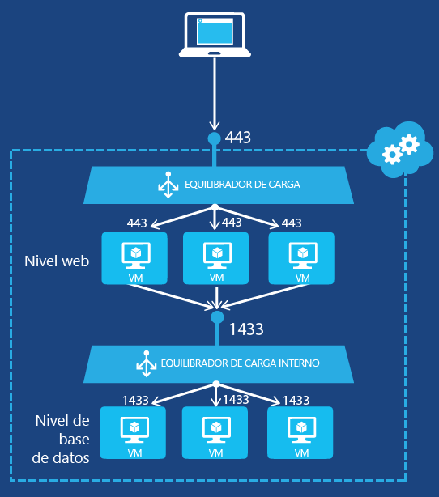

<properties 
   pageTitle="Creación de un equilibrador de carga interno mediante PowerShell con el modelo de implementación clásica | Microsoft Azure"
   description="Información sobre cómo crear un equilibrador de carga interno mediante PowerShell con el modelo de implementación clásica"
   services="load-balancer"
   documentationCenter="na"
   authors="joaoma"
   manager="carolz"
   editor=""
   tags="azure-service-management"
/>
<tags  
   ms.service="load-balancer"
   ms.devlang="na"
   ms.topic="article"
   ms.tgt_pltfrm="na"
   ms.workload="infrastructure-services"
   ms.date="02/09/2016"
   ms.author="joaoma" />

# Primeros pasos en la creación de un equilibrador de carga interno (clásico) mediante PowerShell

[AZURE.INCLUDE [load-balancer-get-started-ilb-classic-selectors-include.md](../../includes/load-balancer-get-started-ilb-classic-selectors-include.md)]

[AZURE.INCLUDE [load-balancer-get-started-ilb-intro-include.md](../../includes/load-balancer-get-started-ilb-intro-include.md)]

[AZURE.INCLUDE [azure-arm-classic-important-include](../../includes/learn-about-deployment-models-classic-include.md)] [Resource Manager model](load-balancer-get-started-ilb-arm-ps.md).

[AZURE.INCLUDE [load-balancer-get-started-ilb-scenario-include.md](../../includes/load-balancer-get-started-ilb-scenario-include.md)]

[AZURE.INCLUDE [azure-ps-prerequisites-include.md](../../includes/azure-ps-prerequisites-include.md)]

## Crear un equilibrador de carga interno establecido para máquinas virtuales

Para crear un conjunto con equilibrio de carga interno y los servidores que enviarán su tráfico a él, debe hacer lo siguiente:

1. Crea una instancia de Equilibrio de carga interno que será el extremo del tráfico entrante que su carga se va a equilibrar entre los servidores de un conjunto con equilibrio de carga.

1. Agregue extremos correspondientes a las máquinas virtuales que van a recibir el tráfico entrante.

1. Configura los servidores que van a enviar el tráfico cuya carga se va a equilibrar para que lo hagan a la dirección IP virtual (VIP) de la instancia de Equilibrio de carga interno.

### Paso 1: crear una instancia de Equilibrio de carga interno

Para un servicio en la nube existente o un servicio en la nube implementado en una red virtual regional, puedes crear una instancia de Equilibrio de carga interno con los siguientes comandos de Windows PowerShell:

	$svc="<Cloud Service Name>"
	$ilb="<Name of your ILB instance>"
	$subnet="<Name of the subnet within your virtual network>"
	$IP="<The IPv4 address to use on the subnet-optional>"

	Add-AzureInternalLoadBalancer -ServiceName $svc -InternalLoadBalancerName $ilb –SubnetName $subnet –StaticVNetIPAddress $IP

Tenga en cuenta que en este cmdlet [Add-AzureEndpoint](https://msdn.microsoft.com/library/dn495300.aspx) de Windows PowerShell, se usa el conjunto de parámetros DefaultProbe. Para obtener más información sobre conjuntos de parámetros adicionales, consulte [Add-AzureEndpoint](https://msdn.microsoft.com/library/dn495300.aspx).

### Paso 2: agregar extremos a la instancia de Equilibrio de carga interno

Aquí tiene un ejemplo:

	$svc="mytestcloud"
	$vmname="DB1"
	$epname="TCP-1433-1433"
	$lbsetname="lbset"
	$prot="tcp"
	$locport=1433
	$pubport=1433
	$ilb="ilbset"
	Get-AzureVM –ServiceName $svc –Name $vmname | Add-AzureEndpoint -Name $epname -Lbset $lbsetname -Protocol $prot -LocalPort $locport -PublicPort $pubport –DefaultProbe -InternalLoadBalancerName $ilb | Update-AzureVM

### Paso 3: configurar los servidores para que envíen su tráfico al nuevo extremo Equilibrio de carga interno

Tiene que configurar los servidores para los que se va a realizar el equilibrio de carga del tráfico para usar la nueva dirección IP (VIP) de la instancia de Equilibrio de carga interno. Esta es la dirección en la que se escuchará la instancia de Equilibrio de carga interno. En la mayoría de los casos, solo tienes que agregar o modificar un registro DNS de la dirección VIP de la instancia de Equilibrio de carga interno.

Si especificaste la dirección IP durante la creación de la instancia de Equilibrio de carga interno, ya tienes la dirección VIP. De lo contrario, puede ver a la dirección VIP con los siguientes comandos:

	$svc="<Cloud Service Name>"
	Get-AzureService -ServiceName $svc | Get-AzureInternalLoadBalancer

Para usar estos comandos, rellene los valores y quite el elemento < and >. Aquí tiene un ejemplo:

	$svc="mytestcloud"
	Get-AzureService -ServiceName $svc | Get-AzureInternalLoadBalancer

En la pantalla del comando Get-AzureInternalLoadBalancer, anote la dirección IP y realice los cambios necesarios en los servidores o registros DNS para asegurarse de que el tráfico se envía a la dirección VIP.

>[AZURE.NOTE] La Plataforma Microsoft Azure utiliza una dirección IPv4 estática enrutable públicamente para una variedad de escenarios de administración. La dirección IP es 168.63.129.16. Ningún firewall debe bloquear esta dirección IP, ya que puede causar un comportamiento inesperado. Con respecto al Equilibrio de carga interno de Azure, esta dirección IP la usan las sondas de supervisión del equilibrador de carga para determinar el estado de mantenimiento de las máquinas virtuales en un conjunto con equilibrio de carga. Si se usa un grupo de seguridad de red para restringir el tráfico a máquinas virtuales de Azure en un conjunto de carga equilibrada internamente o se aplica a una subred de Red virtual, asegúrate de agregar una regla de seguridad de red para permitir el tráfico desde 168.63.129.16.

## Ejemplo de equilibrio de carga interno

Para guiarle en el proceso completo de la creación de un conjunto con equilibrio de carga para dos configuraciones de ejemplo, vea las secciones siguientes.

### Una aplicación de niveles múltiples accesible desde Internet

Desea proporcionar un servicio de base de datos con equilibrio de carga para un conjunto de servidores de web a través de Internet. Ambos conjuntos de servidores se hospedan en un solo servicio en la nube de Azure. El tráfico del servidor web al puerto TCP 1433 debe distribuirse entre dos máquinas virtuales en el nivel de base de datos. La Ilustración 1 muestra la configuración.

La configuración es la siguiente:

- El servicio en la nube existente que hospeda las máquinas virtuales se denomina mytestcloud.

- Los dos servidores de base de datos existente se denominan DB1 y DB2.

- Los servidores web del nivel web se conectan con los servidores de base de datos en el nivel de base de datos mediante la dirección IP privada. Otra opción es usar su propio DNS para la red virtual y registrar manualmente un registro A para el conjunto de equilibrador de carga interno.

Los comandos siguientes configuran una nueva instancia de Equilibrio de carga interno denominada **ILBset** y agregan puntos de conexión a las máquinas virtuales correspondientes a los dos servidores de base de datos:

	$svc="mytestcloud"
	$ilb="ilbset"
	Add-AzureInternalLoadBalancer -ServiceName $svc -InternalLoadBalancerName $ilb 
	$prot="tcp"
	$locport=1433
	$pubport=1433
	$epname="TCP-1433-1433"
	$lbsetname="lbset"
	$vmname="DB1"
	Get-AzureVM –ServiceName $svc –Name $vmname | Add-AzureEndpoint -Name $epname -LbSetName $lbsetname -Protocol $prot -LocalPort $locport -PublicPort $pubport –DefaultProbe -InternalLoadBalancerName $ilb | Update-AzureVM

	$epname="TCP-1433-1433-2"
	$vmname="DB2"
	Get-AzureVM –ServiceName $svc –Name $vmname | Add-AzureEndpoint -Name $epname -LbSetName $lbsetname -Protocol $prot -LocalPort $locport -PublicPort $pubport –DefaultProbe -InternalLoadBalancerName $ilb | Update-AzureVM

## Quitar una configuración de Equilibrio de carga interno

Para quitar una máquina virtual como punto de conexión de una instancia de equilibrador de carga interno, use los comandos siguientes:

	$svc="<Cloud service name>"
	$vmname="<Name of the VM>"
	$epname="<Name of the endpoint>"
	Get-AzureVM -ServiceName $svc -Name $vmname | Remove-AzureEndpoint -Name $epname | Update-AzureVM

Para usar estos comandos, rellene los valores y quite el elemento < and >.

Aquí tiene un ejemplo:

	$svc="mytestcloud"
	$vmname="DB1"
	$epname="TCP-1433-1433"
	Get-AzureVM -ServiceName $svc -Name $vmname | Remove-AzureEndpoint -Name $epname | Update-AzureVM

Para quitar una instancia de equilibrador de carga interno de un servicio en la nube, use los comandos siguientes:

	$svc="<Cloud service name>"
	Remove-AzureInternalLoadBalancer -ServiceName $svc

Para usar estos comandos, rellene el valor y quite el elemento < and >.

Aquí tiene un ejemplo:

	$svc="mytestcloud"
	Remove-AzureInternalLoadBalancer -ServiceName $svc

## Información adicional sobre los cmdlet de equilibrador de carga interno

Para obtener información adicional sobre los cmdlets de Equilibrio de carga interno, ejecuta los comandos siguientes en un símbolo del sistema de Windows PowerShell:

- Get-help New-AzureInternalLoadBalancerConfig -full

- Get-help Add-AzureInternalLoadBalancer -full

- Get-help Get-AzureInternalLoadbalancer -full

- Get-help Remove-AzureInternalLoadBalancer -full

## Pasos siguientes

[Configurar un modo de distribución del equilibrador de carga mediante la afinidad IP de origen](load-balancer-distribution-mode.md)

[Configuración de opciones de tiempo de espera de inactividad de TCP para el equilibrador de carga](load-balancer-tcp-idle-timeout.md)

<!---HONumber=AcomDC_0218_2016-->