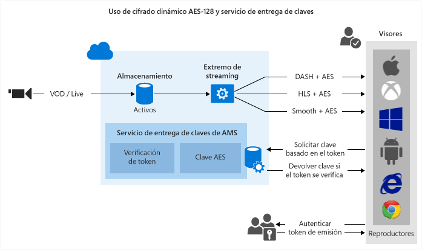

<properties 
	pageTitle="Información general de protección del contenido" 
	description="En este artículo se ofrece información general de protección de contenido con Media Services." 
	services="media-services" 
	documentationCenter="" 
	authors="Juliako" 
	manager="dwrede" 
	editor=""/>

<tags 
	ms.service="media-services" 
	ms.workload="media" 
	ms.tgt_pltfrm="na" 
	ms.devlang="na" 
	ms.topic="article" 
	ms.date="02/18/2016" 
	ms.author="juliako"/>

#Información general de protección del contenido

Servicios multimedia de Microsoft Azure le permite proteger su contenido multimedia desde el momento en que deja el equipo a través de almacenamiento, procesamiento y entrega. Servicios multimedia permite entregar el contenido cifrado de forma dinámica con Estándar de cifrado avanzado (AES) (mediante claves de cifrado de 128 bits) y cifrado común (CENC) mediante DRM de PlayReady o Widevine. Los Servicios multimedia también proporcionan un servicio para entregar claves AES y licencias de PlayReady a clientes autorizados. También puede usar los siguientes asociados de AMS para ayudarle a entregar licencias de Widevine: [Axinom](http://www.axinom.com/press/ibc-axinom-drm-6/), [EZDRM](http://ezdrm.com/), [castLabs](http://castlabs.com/company/partners/azure/).

- La siguiente imagen muestra el flujo de trabajo "Cifrado dinámico común DRM de PlayReady o Widevine". Para obtener más información, consulte [Uso de cifrado dinámico común DRM de PlayReady o Widevine](media-services-protect-with-drm.md).

- La siguiente imagen muestra el flujo de trabajo "Cifrado dinámico de AES-128". Para obtener más información, consulte [Uso del cifrado dinámico AES-128 y del servicio de entrega de claves](media-services-protect-with-aes128.md).

>[AZURE.NOTE]Para poder usar el cifrado dinámico, primero debe obtener al menos una unidad reservada de streaming en el extremo de streaming desde la que desea transmitir el contenido cifrado.

##Conceptos

###Opciones de cifrado de recursos

Según el tipo de contenido que desea cargar, almacenar y entregar, Servicios multimedia proporciona varias opciones de cifrado de las que puede elegir.

**Ninguno**: no se utiliza cifrado. Este es el valor predeterminado. Tenga en cuenta que al utilizar esta opción el contenido no está protegido en tránsito o en reposo en el almacenamiento.

Si planifica entregar un MP4 mediante una descarga progresiva, use esta opción para cargar el contenido.

**StorageEncrypted**: use esta opción para cifrar el contenido no cifrado de manera local mediante el cifrado AES de 256 bits y, a continuación, cargarlo al almacenamiento de Azure donde se almacena cifrado en reposo. Los recursos protegidos con el cifrado de almacenamiento se descifran automáticamente y se colocan en un sistema de archivos cifrados antes de la codificación y, opcionalmente, se vuelven a cifrar antes de volver a cargarlos como un nuevo recurso de salida. El caso de uso principal para el cifrado de almacenamiento es cuando desea proteger los archivos multimedia de entrada de alta calidad con un sólido cifrado en reposo en disco.

Para entregar a un recurso cifrado de almacenamiento, debe configurar la directiva de entrega del recurso para que Servicios multimedia sepa cómo desea entregar el contenido. Antes de poder transmitir el activo, el servidor de streaming quita el cifrado de almacenamiento y transmite el contenido usando la directiva de entrega especificada (por ejemplo, AES, cifrado común o sin cifrado).

**CommonEncryptionProtected**: use esta opción si desea cifrar contenido (o cargar contenido ya cifrado) con cifrado común. PlayReady y Widewine se cifran según la especificación de cifrado común (CENC) y son compatibles con AMS.

**EnvelopeEncryptedProtected**: utilice esta opción si desea proteger HTTP Live Streaming (HLS) cifrado (o cargar uno ya protegido) con estándar de cifrado avanzado (AES). Tenga en cuenta que si carga HLS ya cifrado con AES, se debe haber cifrado con Transform Manager.

###Cifrado dinámico

Servicios multimedia de Microsoft Azure le permite entregar el contenido cifrado de forma dinámica con Estándar de cifrado avanzado (AES) (mediante claves de cifrado de 128 bits) y PlayReady o Widevine DRM.

Actualmente puede cifrar los formatos de streaming siguientes: HLS, MPEG DASH y Smooth Streaming. No puede cifrar el formato de streaming HDS ni descargas progresivas.

Si desea que Servicios multimedia cifren un recurso, debe asociar una clave de cifrado (CommonEncryption o EnvelopeEncryption) con su recurso y, además, configurar directivas de autorización para la clave.

También necesita configurar la directiva de entrega del recurso. Si desea transmitir un recurso cifrado de almacenamiento, asegúrese de configurar la directiva de entrega del recurso para especificar cómo desea entregarlo.

Cuando un reproductor solicita una transmisión, Servicios multimedia usa la clave especificada para cifrar de forma dinámica el contenido mediante el cifrado AES o el cifrado común. Para descifrar la secuencia, el reproductor solicitará la clave del servicio de entrega de claves. Para decidir si el usuario está o no autorizado para obtener la clave, el servicio evalúa las directivas de autorización que especificó para la clave.

>[AZURE.NOTE]Para aprovechar al máximo el cifrado dinámico, primero debe obtener al menos una unidad de streaming a petición para el extremo de streaming desde el que va a entregar el contenido cifrado. Para obtener más información, consulte [Escalación de Servicios multimedia](media-services-manage-origins.md#scale_streaming_endpoints).

###Servicio de entrega de licencias y claves

Servicios multimedia proporciona un servicio para entregar licencias DRM (PlayReady y Widevine) y claves sin cifrado de AES a clientes autorizados. Puede utilizar el Portal de Azure clásico, API de REST o SDK de Servicios multimedia para .NET para configurar las directivas de autorización y autenticación de sus licencias y claves.

Observe que si usa el portal puede configura una directiva AES (que se aplicará a todo el contenido cifrado por AES) y una directiva de PlayReady (que se aplicará a todo el contenido cifrado por PlayReady). Use el SDK de Servicios multimedia para .NET si desea tener más control sobre las configuraciones.

###Licencia de PlayReady 

Servicios multimedia proporciona un servicio para entregar licencias de PlayReady. Cuando el reproductor del usuario final (por ejemplo, Silverlight) intenta reproduce el contenido protegido de PlayReady, se envía una solicitud al servicio de entrega de licencias para obtener una licencia. Si el servicio de licencia aprueba la solicitud, emite la licencia, la que se envía al cliente y se puede usar para descifrar y reproducir el contenido especificado.

Las licencias contienen los derechos y restricciones que desea para el tiempo de ejecución de DRM de PlayReady con la finalidad de hacer respetar los requisitos cuando un usuario intenta reproducir contenido protegido. Servicios multimedia proporciona API que le permiten configurar sus licencias de PlayReady. Para obtener más información, consulte [Información general de plantillas de licencias de PlayReady de Servicios multimedia](media-services-playready-license-template-overview.md).

###Licencia de Widevine

AMS también le permite entregar MPEG DASH cifrado con DRM de Widevine. PlayReady y Widewine se cifran según la especificación de cifrado común (CENC). Puede usar el [.NET SDK de AMS](https://www.nuget.org/packages/windowsazure.mediaservices/) (a partir de la versión 3.5.1) o la API de REST para configurar AssetDeliveryConfiguration para usar Widevine.

A partir del SDK de Servicios multimedia para .NET versión 3.5.2, Servicios multimedia permite configurar la [plantilla de licencia Widevine](media-services-widevine-license-template-overview.md) y obtener licencias de Widevine. También puede usar los siguientes asociados de AMS para ayudarle a entregar licencias de Widevine: [Axinom](http://www.axinom.com/press/ibc-axinom-drm-6/), [EZDRM](http://ezdrm.com/), [castLabs](http://castlabs.com/company/partners/azure/).

###Restricción de token

La directiva de autorización de claves de acceso podría tener una o más restricciones de autorización: abrir o restricción de token. La directiva con restricción token debe ir acompañada de un token emitido por un Servicio de tokens seguros (STS). Servicios multimedia admite tokens en formato Token de web simple (SWT) y en formato Token de web JSON (JWT). Los Servicios multimedia no proporcionan Servicios de tokens seguros. Puede crear un STS personalizado o aprovechar el Servicio de control de acceso (ACS) de Microsoft Azure para emitir tokens. Se debe configurar el STS para crear un token firmado con las notificaciones de clave y emisión que especificó en la configuración de restricción de tokens. El servicio de entrega de claves de Servicios multimedia devolverá la clave solicitada (o licencia) al cliente si el token es válido y las reclamaciones del token coinciden con las configuradas para la clave (o licencia).

Al configurar la directiva de restricción de token, debe especificar los parámetros de clave de comprobación principal, emisor y público. La clave de comprobación principal contiene la clave con la que se firmó el token y el emisor es el servicio de tokens seguros que emite el token. El público (a veces denominado ámbito) describe la intención del token o del recurso cuyo acceso está autorizado por el token. El servicio de entrega de claves de los Servicios multimedia valida que estos valores del token coincidan con los valores de la plantilla.

##Escenarios comunes

###Protección del contenido en el almacenamiento, entrega de soportes de streaming cifrados dinámicamente, use el servicio de entrega de claves\\licencia AMS

1. Introduzca un archivo intermedio de alta calidad en un recurso. Aplique una opción de cifrado de almacenamiento al recurso.
2. Configure de extremos de streaming.
1. Codifique en conjunto de archivos MP4 de velocidad de bits adaptable. Aplique una opción de cifrado de almacenamiento al recurso de salida.
1. Cree la clave de cifrado de contenido para el recurso que desee que se cifre dinámicamente durante la reproducción.
2. Configure la directiva de autorización de claves de contenido.
1. Configure la directiva de entrega de recursos (usada por el empaquetado y el cifrado dinámicos).
1. Publique el recurso mediante la creación de un localizador a petición.
1. Trasmita el contenido publicado.

###Uso del servicio de entrega de clave y licencia de Servicios multimedia con su propio cifrado y servicios de streaming

Para obtener más información, consulte [Integración del servicio de licencia de PlayReady de Azure con su propio servidor de streaming/sistema de cifrado](http://mingfeiy.com/integrate-azure-playready-license-service-encryptorstreaming-server).

###Integración con socios

[Uso de castLabs para entregar licencias de DRM a Servicios multimedia de Azure](media-services-castlabs-integration.md)

##Rutas de aprendizaje de Servicios multimedia

[AZURE.INCLUDE [media-services-learning-paths-include](../../includes/media-services-learning-paths-include.md)]

##Envío de comentarios

[AZURE.INCLUDE [media-services-user-voice-include](../../includes/media-services-user-voice-include.md)]

##Vínculos relacionados

[Anuncio de PlayReady como servicio y cifrado dinámico AES con Servicios multimedia de Azure](http://mingfeiy.com/playready)

[Explicación del precio de la entrega de licencia de PlayReady de Servicios multimedia de Azure](http://mingfeiy.com/playready-pricing-explained-in-azure-media-services)

[Depuración del flujo cifrado de AES en Servicios multimedia de Azure](http://mingfeiy.com/debug-aes-encrypted-stream-azure-media-services)

[Autenticación de token JWT](http://www.gtrifonov.com/2015/01/03/jwt-token-authentication-in-azure-media-services-and-dynamic-encryption/)

[Integración de la aplicación OWIN basada en MVC de Servicios multimedia de Azure con Azure Active Directory y restricción de la entrega de claves de contenido basada en notificaciones de JWT](http://www.gtrifonov.com/2015/01/24/mvc-owin-azure-media-services-ad-integration/).

[Uso de ACS de Azure para emitir tokens](http://mingfeiy.com/acs-with-key-services).

[content-protection]: ./media/media-services-content-protection-overview/media-services-content-protection.png

<!---HONumber=AcomDC_0224_2016-->