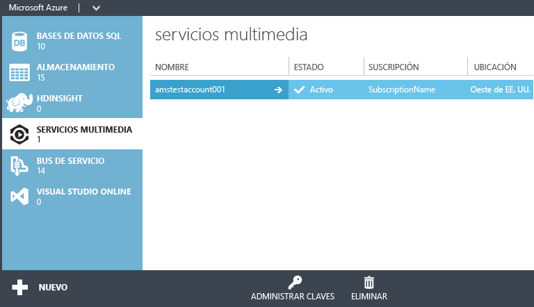

<properties
	pageTitle="Creación de una cuenta de Servicios multimedia | Microsoft Azure"
	description="Describe cómo crear una cuenta de Servicios multimedia de Azure en Azure."
	services="media-services"
	documentationCenter=""
	authors="Juliako"
	manager="dwrede"
	editor=""/>

<tags
	ms.service="media-services"
	ms.workload="media"
	ms.tgt_pltfrm="na"
	ms.devlang="na"
	ms.topic="get-started-article"
	ms.date="02/03/2016"
	ms.author="juliako"/>

# Creación de una cuenta de Servicios multimedia de Azure

> [AZURE.SELECTOR]
- [Portal](media-services-create-account.md)
- [PowerShell](media-services-manage-with-powershell.md)
- [REST](http://msdn.microsoft.com/library/azure/dn194267.aspx)

> [AZURE.NOTE] Para completar este tutorial, deberá tener una cuenta de Azure. Para obtener más información, consulte [Evaluación gratuita de Azure](/pricing/free-trial/?WT.mc_id=A261C142F).
 
El Portal de Azure clásico ofrece una forma rápida de crear una cuenta de Servicios multimedia de Azure. Puede usar la cuenta para obtener acceso a Servicios multimedia que le permiten almacenar, cifrar, codificar, administrar y transmitir contenido multimedia en Azure. En el momento en el que crea una cuenta de Servicios multimedia, también crea una cuenta de almacenamiento asociada (o usa una ya existente) en la misma región geográfica que la cuenta de Servicios multimedia.

En este artículo se explica cómo usar el método Quick Create para crear una nueva cuenta de Servicios multimedia y, a continuación, asociarla a una cuenta de almacenamiento.

## Conceptos

El acceso a Servicios multimedia requiere dos cuentas asociadas:

-   **Una cuenta de Servicios multimedia**. La cuenta le proporciona acceso a un conjunto de Servicios multimedia basados en la nube que están disponibles en Azure. Una cuenta de Servicios multimedia no almacena el contenido multimedia real, sino que almacena metadatos sobre el contenido multimedia y trabajos de procesamiento multimedia en su cuenta. En el momento en el que cree la cuenta, seleccione una región de Servicios multimedia disponible. La región que selecciona es un centro de datos que almacena los registros de metadatos para su cuenta.

	Entre las regiones de Servicios multimedia (AMS) disponibles se incluyen las siguientes: Europa del Norte, Europa occidental, Oeste de EE. UU., Este de EE. UU., Sudeste de Asia, Asia oriental, Oeste de Japón, Este de Japón. Servicios multimedia no usa grupos de afinidad.
	
	AMS ahora también está disponible en los centros de datos siguientes: Sur de Brasil, India occidental, Sur de la India e India central. Ahora puede usar el Portal de Azure clásico para [crear cuentas de Servicios multimedia](media-services-create-account.md#create-a-media-services-account-using-quick-create) y realizar diversas tareas descritas [aquí](https://azure.microsoft.com/documentation/services/media-services/). Sin embargo, Codificación en directo no está habilitado en estos centros de datos. Además, no todos los tipos de unidades reservadas de codificación están disponibles en estos centros de datos.
	
	- Sur de Brasil: solo están disponibles las unidades reservadas de codificación básicas y estándar
	- India occidental, Sur de la India e India central: solo están disponibles unidades reservadas de codificación básicas

-   **Una cuenta de almacenamiento asociada**. La cuenta de almacenamiento es una cuenta de almacenamiento de Azure asociada a una cuenta de Servicios multimedia. La cuenta de almacenamiento proporciona almacenamiento de blobs para archivos multimedia y debe ubicarse en la misma región geográfica que la cuenta de Servicios multimedia. Cuando cree una cuenta de Servicios multimedia, podrá elegir una cuenta de almacenamiento existente en la misma región o crear una nueva cuenta de almacenamiento en la misma región. Si elimina una cuenta de Servicios multimedia, no se eliminarán los blobs de la cuenta de almacenamiento relacionada.

## una cuenta de Servicios multimedia mediante Quick Create

1. En el [Portal de Azure clásico][], haga clic en **Nuevo**, en **Servicios multimedia** y luego en **Creación rápida**.

2. En **NOMBRE**, especifique el nombre de la cuenta nueva. El nombre de la cuenta de Servicios multimedia debe estar compuesto de números o letras en minúscula, sin espacios y con una longitud de entre 3 y 24 caracteres.

3. En **REGIÓN**, seleccione la región geográfica que se usará para almacenar los registros de metadatos para la cuenta de Servicios multimedia. Solo las regiones de Servicios multimedia disponibles aparecen en la lista desplegable.

4. En **CUENTA DE ALMACENAMIENTO**, seleccione una cuenta de almacenamiento para proporcionar almacenamiento de blobs del contenido multimedia desde la cuenta de Servicios multimedia. Puede seleccionar una cuenta de almacenamiento existente en la misma región geográfica que la cuenta de Servicios multimedia o crear una nueva cuenta de almacenamiento. Se crea una nueva cuenta de almacenamiento en la misma región.

5. Si ha creado una nueva cuenta de almacenamiento, en **NOMBRE DE NUEVA CUENTA DE ALMACENAMIENTO**, especifique un nombre para la cuenta de almacenamiento. Las reglas para los nombres de cuenta de almacenamiento son las mismas que para las cuentas de Servicios multimedia.

6. Haga clic en **Creación rápida** en la parte inferior del formulario.

Puede supervisar el estado del proceso en el área de mensajes situada en parte inferior de la ventana.

Cuando el estado cambia a Activo, la cuenta se habrá creado correctamente. Se abrirá la página **Servicios multimedia** con la nueva cuenta.

En la parte inferior de la página, se muestra el botón **ADMINISTRAR CLAVES**. Al hacer clic en este botón, se muestra una página con el nombre de cuenta de Servicios multimedia y las claves principales y secundarias. Necesitará el nombre de cuenta y la información de la clave principal para obtener acceso mediante programación a la cuenta de Servicios multimedia.

Cuando haga doble clic en el nombre de cuenta, se mostrará la página de **Inicio rápido** de forma predeterminada. La página le permite realizar algunas tareas de administración que también están disponibles en otras páginas del portal. Por ejemplo, puede cargar un archivo de vídeo desde esta página o hacerlo desde la página **CONTENIDO**.

Además, puede ver el código que usa el SDK de Servicios multimedia de Azure para realizar las siguientes tareas: cargar, codificar y publicar vídeos. Puede hacer clic en uno de los vínculos en la sección **ESCRIBIR ALGÚN CÓDIGO**, copiar el código y usarlo en la aplicación.

##Rutas de aprendizaje de Servicios multimedia

[AZURE.INCLUDE [media-services-learning-paths-include](../../includes/media-services-learning-paths-include.md)]

##Envío de comentarios

[AZURE.INCLUDE [media-services-user-voice-include](../../includes/media-services-user-voice-include.md)]

## Pasos siguientes

- [Introducción a la entrega de contenido de vídeo bajo demanda (VoD) mediante el SDK para .NET](media-services-dotnet-get-started.md)

- [Uso del SDK de .NET para crear canales que realicen la codificación en directo de secuencias de una sola velocidad de bits a secuencias de varias velocidades de bits](media-services-dotnet-creating-live-encoder-enabled-channel.md)

<!-- Reusable paths. -->

<!-- Anchors. -->
  [Concepts]: #concepts
  [Before you begin]: #begin
  [How to: Create a Media Services account using Quick Create]: #quick

<!-- URLs. -->
  [Web Platform Installer]: http://go.microsoft.com/fwlink/?linkid=255386

  [Portal de Azure clásico]: http://manage.windowsazure.com/

<!---HONumber=AcomDC_0211_2016-->