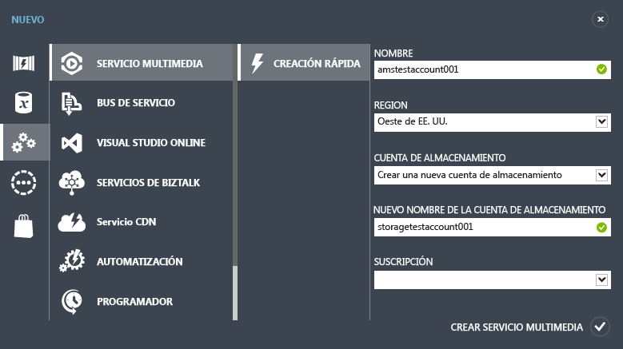
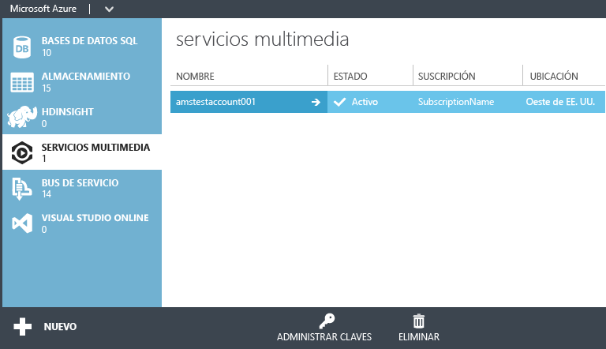
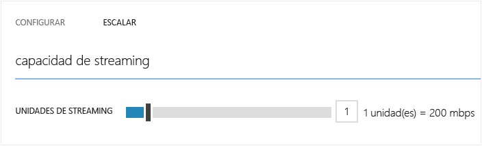

<properties
	pageTitle="Introducción a la entrega de contenido a petición mediante el Portal de Azure clásico | Microsoft Azure"
	description="Este tutorial le guiará por los pasos necesarios para implementar una aplicación de entrega de contenido de vídeo bajo demanda (VoD) con Servicios multimedia de Azure mediante el Portal de Azure clásico."
	services="media-services"
	documentationCenter=""
	authors="Juliako"
	manager="erikre"
	editor=""/>

<tags
	ms.service="media-services"
	ms.workload="media"
	ms.tgt_pltfrm="na"
	ms.devlang="na"
	ms.topic="get-started-article"
	ms.date="02/25/2016"
	ms.author="juliako"/>

# Introducción a la entrega de contenido a petición mediante el Portal de Azure clásico

[AZURE.INCLUDE [media-services-selector-get-started](../../includes/media-services-selector-get-started.md)]

Este tutorial le indica los pasos necesarios para implementar una aplicación básica de entrega de contenido de vídeo bajo demanda (VoD) mediante el Portal de Azure clásico.

> [AZURE.NOTE] Para completar este tutorial, deberá tener una cuenta de Azure. Para obtener más información, consulte [Evaluación gratuita de Azure](/pricing/free-trial/?WT.mc_id=A261C142F).

Este tutorial incluye las siguientes tareas:

1.  Creación de una cuenta de Servicios multimedia de Azure.
2.  Configuración de extremos de streaming.
1.  Carga de un archivo de vídeo.
1.  Codificación del archivo de origen en un conjunto de archivos MP4 de velocidad de bits adaptativa
1.  Publicación del recurso y obtención de direcciones URL de descarga progresiva y streaming.  
1.  Reproduzca el contenido.

## Creación de una cuenta de Servicios multimedia de Azure

1. En el [Portal de Azure clásico](https://manage.windowsazure.com/), haga clic en **Nuevo**, en **Servicios multimedia** y luego en **Creación rápida**.

	

2. En **NOMBRE**, especifique el nombre de la cuenta nueva. El nombre de la cuenta de Servicios multimedia debe estar compuesto de números o letras en minúscula, sin espacios y con una longitud de entre 3 y 24 caracteres.

3. En **REGIÓN**, seleccione la región geográfica que se usará para almacenar los registros de metadatos para la cuenta de Servicios multimedia. Solo las regiones de Servicios multimedia disponibles aparecen en la lista desplegable.

4. En **CUENTA DE ALMACENAMIENTO**, seleccione una cuenta de almacenamiento para proporcionar almacenamiento de blobs del contenido multimedia desde la cuenta de Servicios multimedia. Puede seleccionar una cuenta de almacenamiento existente en la misma región geográfica que la cuenta de Servicios multimedia o crear una nueva cuenta de almacenamiento. Se crea una nueva cuenta de almacenamiento en la misma región.

5. Si ha creado una nueva cuenta de almacenamiento, en **NOMBRE DE NUEVA CUENTA DE ALMACENAMIENTO**, especifique un nombre para la cuenta de almacenamiento. Las reglas para los nombres de cuenta de almacenamiento son las mismas que para las cuentas de Servicios multimedia.

6. Haga clic en **Creación rápida** en la parte inferior del formulario.

	Puede supervisar el estado del proceso en el área de mensajes situada en parte inferior de la ventana.

	Una vez que la cuenta se crea correctamente, el estado cambia a Activo.

	En la parte inferior de la página, se muestra el botón **ADMINISTRAR CLAVES**. Al hacer clic en este botón, se muestra un cuadro de diálogo con el nombre de la cuenta de Servicios multimedia y las claves principal y secundaria. Necesitará el nombre de cuenta y la información de la clave principal para obtener acceso mediante programación a la cuenta de Servicios multimedia.

	

	Cuando haga doble clic en el nombre de cuenta, se mostrará la página de Inicio rápido de forma predeterminada. La página le permite realizar algunas tareas de administración que también están disponibles en otras páginas del portal. Por ejemplo, puede cargar un archivo de vídeo desde esta página o hacerlo desde la página CONTENT.

## Configuración de extremos de streaming con el Portal

Cuando se trabaja con Servicios multimedia de Azure, uno de los escenarios más comunes es entregar streaming de velocidad de bits adaptable a los clientes. Con el streaming de velocidad de bits adaptable, el cliente puede cambiar a una secuencia de velocidad de bits mayor o menor que el vídeo mostrado, según el ancho de banda actual de la red, el uso de CPU y otros factores. Servicios multimedia admite las siguientes tecnologías de streaming adaptable: HTTP Live Streaming (HLS), Smooth Streaming, MPEG DASH y HDS (únicamente para licenciatarios de Adobe PrimeTime/Access).

Servicios multimedia proporciona paquetes dinámicos que permiten entregar contenido codificado MP4 de velocidad de bits adaptable o Smooth Streaming en formatos admitidos por Servicios multimedia (MPEG DASH, HLS, Smooth Streaming, HDS) sin tener que volver a empaquetar en estos formatos de streaming.

Para aprovecharse de los paquetes dinámicos, deberá hacer lo siguiente:

- Codifique su archivo intermedio (origen) en un conjunto de archivos MP4 de velocidad de bits adaptable o archivos Smooth Streaming de velocidad de bits adaptable (los pasos de codificación se muestran más adelante en este tutorial).  
- Obtenga al menos una unidad de streaming para el *extremo de streaming* desde el que planea entregar el contenido.

Con el empaquetado dinámico solo necesita almacenar y pagar por los archivos en formato de almacenamiento sencillo y Servicios multimedia creará y servirá la respuesta adecuada en función de las solicitudes del cliente.

Para cambiar el número de unidades reservadas de streaming, haga lo siguiente:

1. En el [Portal de Azure clásico](https://manage.windowsazure.com/), haga clic en **Servicios multimedia**. A continuación, haga clic en el nombre del servicio multimedia.

2. Seleccione la página EXTREMOS DE STREAMING. Luego, haga clic en el extremo de streaming que desea modificar.

3. Para especificar el número de unidades de streaming, seleccione la pestaña **ESCALA** y mueva el control deslizante de **capacidad reservada**.

	

4. Haga clic en el botón **GUARDAR** para guardar los cambios.

	La asignación de cualquier nueva unidad puede tardar unos 20 minutos en finalizarse.

	>[AZURE.NOTE] Actualmente, pasar de cualquier valor positivo de unidades de streaming a ninguno puede deshabilitar el streaming hasta una hora.
	>
	> Se utiliza el número más elevado de unidades especificadas durante el período de 24 horas al calcular el coste. Para obtener más información acerca del precio, consulte la página sobre [información del precio de Servicios multimedia](http://go.microsoft.com/fwlink/?LinkId=275107).

## Carga de contenido

1. En el [Portal de Azure clásico](http://go.microsoft.com/fwlink/?LinkID=256666&clcid=0x409), haga clic en **Servicios multimedia** y luego en el nombre de la cuenta de Servicios multimedia.
2. Seleccione la página CONTENT.
3. Haga clic en el botón **Cargar** en la página o en la parte inferior del portal.
4. En el cuadro de diálogo **Cargar contenido**, diríjase al archivo del recurso deseado. Haga clic en el archivo y, luego, haga clic en **Abrir** o presione Entrar.

	![Cuadro de diálogo de carga de contenido][uploadcontent]

5. En el cuadro de diálogo **Cargar contenido**, haga clic en el botón de comprobación para aceptar el **Archivo** y el **Nombre de contenido**.
6. La carga comenzará y podrá realizar un seguimiento del proceso desde la parte inferior del portal.  

	![Estado del trabajo][status]

Una vez que la carga se haya completado, verá el nuevo recurso en la lista de contenido. Se establecerá una convención en la que el nombre tendrá anexo "**-Source**" en la parte inferior para ayudar a realizar un seguimiento del nuevo contenido como contenido de origen para las tareas de codificación.

![ContentPage][contentpage]

Si el valor del tamaño de archivo no se actualiza después de que se detenga el proceso de carga, presione el botón **Sincronizar metadatos**. De esta forma, se sincroniza el tamaño de archivo del recurso con el tamaño del archivo real en el almacenamiento y se actualiza el valor en la página de contenido.

## Codificar contenido

### Información general

Para entregar vídeo digital a través de Internet, debe comprimir los archivos multimedia. Servicios multimedia proporciona un codificador multimedia que le permite especificar cómo desea que su contenido se codifique (por ejemplo, los códecs que se van a usar, el formato de archivo, la resolución y la velocidad de bits).

Cuando se trabaja con Servicios multimedia de Azure, uno de los escenarios más comunes es entregar streaming de velocidad de bits adaptable a los clientes. Con el streaming de velocidad de bits adaptable, el cliente puede cambiar a una secuencia de velocidad de bits mayor o menor que el vídeo mostrado, según el ancho de banda actual de la red, el uso de CPU y otros factores. Servicios multimedia admite las siguientes tecnologías de streaming adaptable: HTTP Live Streaming (HLS), Smooth Streaming, MPEG DASH y HDS (únicamente para licenciatarios de Adobe PrimeTime/Access).

Servicios multimedia proporciona empaquetado dinámico que permite entregar contenido codificado con Adaptive Bitrate MP4 o Smooth Streaming en formatos de streaming admitidos por Servicios multimedia (MPEG DASH, HLS, Smooth Streaming, HDS) sin tener que volver a empaquetar en dichos formatos.

Para aprovecharse de los paquetes dinámicos, deberá hacer lo siguiente:

- Codifique su archivo intermedio (origen) en un conjunto de archivos MP4 de velocidad de bits adaptable o archivos Smooth Streaming de velocidad de bits adaptable (los pasos de codificación se muestran más adelante en este tutorial).
- Obtenga al menos la unidad de streaming a petición para el extremo de streaming desde el que planea entregar el contenido. Para obtener más información, vea [Escalación de unidades reservadas de streaming a petición](media-services-manage-origins.md#scale_streaming_endpoints/).

Con el empaquetado dinámico solo necesita almacenar y pagar por los archivos en formato de almacenamiento sencillo y Servicios multimedia creará y servirá la respuesta adecuada en función de las solicitudes del cliente.

Tenga en cuenta que además de poder usar las capacidades de empaquetado dinámico, las unidades reservadas de streaming a petición con capacidad de salida dedicada pueden adquirirse en incrementos de 200 Mbps. De manera predeterminada, el streaming a petición está configurado en un modelo de instancia compartido en el que se comparten recursos de servidor (por ejemplo, proceso, capacidad de salida, entre otros) con los demás usuarios. Para mejorar el rendimiento del streaming a petición, se recomienda adquirir unidades reservadas de streaming a petición.

### Codificación

En esta sección se describen los pasos que puede seguir para codificar el contenido con Estándar de codificador multimedia mediante el Portal de Azure clásico.

1.  Seleccione el archivo que desea codificar. Si se admite la codificación para este tipo de archivo, se habilitará el botón **PROCESO** en la parte inferior de la página CONTENIDO.
4. En el cuadro de diálogo **Proceso**, seleccione el procesador **Estándar de codificador multimedia**.
5. Elija una de las **configuraciones de codificación**.

	![Process2][process2]

	El tema [Task Preset Strings for Media Encoder Standard](https://msdn.microsoft.com/es-ES/library/mt269960) (Cadenas preestablecidas de tareas para Estándar de codificador multimedia) explica el significado de cada cadena preestablecida.

5. A continuación, especifique el nombre descriptivo del contenido de salida o acepte el valor predeterminado. A continuación, haga clic en el botón de comprobación para iniciar la operación de codificación y podrá realizar un seguimiento del progreso desde la parte inferior del portal.
6. Seleccione **Aceptar**.

	Después de realizar la codificación, la página de contenido contendrá el archivo codificado.

	Para ver el progreso de la tarea de codificación, cambie a la página **TRABAJOS**.

	Si el valor del tamaño de archivo no se actualiza después de que la codificación se haya realizado, presione el botón **Sincronizar metadatos**. De esta forma, se sincroniza el tamaño de archivo de salida del recurso con el tamaño de archivo real en el almacenamiento y se actualiza el valor en la página de contenido.

## Publicación de contenido

### Información general

Para proporcionar al usuario una dirección URL que pueda utilizarse para transmitir o descargar su contenido, primero necesitará "publicar" su recurso mediante la creación de un localizador. Los localizadores proporcionan acceso a los archivos contenidos en el recurso. Servicios multimedia admite dos tipos de localizadores: OnDemandOrigin locators, utilizados para transmitir contenido (por ejemplo, MPEG DASH, HLS o Smooth Streaming) y localizadores de firma de acceso (SAS), que se usan para descargar archivos multimedia.

Al usar el Portal de Azure clásico para publicar sus recursos, los localizadores se crean automáticamente y se proporciona una dirección URL a petición (si el activo contiene un archivo .ism) o una dirección URL de SAS.

Una dirección URL de SAS tiene el formato siguiente:

	{blob container name}/{asset name}/{file name}/{SAS signature}

Una dirección URL de streaming tiene el siguiente formato y se puede usar para reproducir los recursos de Smooth Streaming:

	{streaming endpoint name-media services account name}.streaming.mediaservices.windows.net/{locator ID}/{filename}.ism/Manifest

Para generar una dirección URL de streaming de HLS, anexe (format=m3u8-aapl) a la dirección URL.

	{streaming endpoint name-media services account name}.streaming.mediaservices.windows.net/{locator ID}/{filename}.ism/Manifest(format=m3u8-aapl)

Para generar una dirección URL de streaming de MPEG DASH, anexe (format=mpd-time-csf) a la dirección URL.

	{streaming endpoint name-media services account name}.streaming.mediaservices.windows.net/{locator ID}/{filename}.ism/Manifest(format=mpd-time-csf)

Los localizadores tienen fecha de caducidad. Al usar el portal para publicar sus recursos, se crean los localizadores con una fecha de caducidad de 100 años.

>[AZURE.NOTE] Si usó el portal para crear localizadores antes de marzo de 2015, se crearon localizadores con una fecha de caducidad de dos años.

Para actualizar la fecha de caducidad de un localizador, use las API de [REST](http://msdn.microsoft.com/library/azure/hh974308.aspx#update_a_locator) o de [.NET](http://go.microsoft.com/fwlink/?LinkID=533259). Tenga en cuenta que, cuando se actualiza la fecha de caducidad de un localizador de SAS, cambia la dirección URL.

### Publicar

Para usar el portal para publicar un recurso, haga lo siguiente:

1. Seleccione el recurso.
2. A continuación, haga clic en el botón Publicar.

 ![Contenido publicado][publishedcontent]

## contenido desde el portal

El Portal de Azure clásico proporciona un reproductor de contenido que puede usar para probar el vídeo.

Haga clic en el vídeo deseado y, luego, en el botón **Reproducir** en la parte inferior del portal.

Se aplican algunas consideraciones:

- Asegúrese de que se ha publicado el vídeo.
- El **REPRODUCTOR DE CONTENIDO DE SERVICIOS MULTIMEDIA** reproduce desde el extremo de streaming predeterminado. Si desea reproducir desde un extremo de streaming que no esté predeterminado, use otro reproductor. Por ejemplo, el [Reproductor de Servicios multimedia de Azure](http://amsplayer.azurewebsites.net/azuremediaplayer.html).

![AMSPlayer][AMSPlayer]

##Siguientes pasos: Rutas de aprendizaje de Servicios multimedia

[AZURE.INCLUDE [media-services-learning-paths-include](../../includes/media-services-learning-paths-include.md)]

##Envío de comentarios

[AZURE.INCLUDE [media-services-user-voice-include](../../includes/media-services-user-voice-include.md)]

## ¿Busca alguna otra cosa?

Si este tema no contiene lo que esperaba, falta algo o no satisface de alguna forma sus necesidades, háganos llegar sus comentarios mediante el subproceso de Disqus siguiente.

### Recursos adicionales
- <a href="http://channel9.msdn.com/Shows/Azure-Friday/Azure-Media-Services-101-Get-your-video-online-now-">Servicios multimedia de Azure 101 - ¡Obtenga el vídeo en línea ahora!</a>
- <a href="http://channel9.msdn.com/Shows/Azure-Friday/Azure-Media-Services-102-Dynamic-Packaging-and-Mobile-Devices">Servicios multimedia de Azure 102 - Empaquetado dinámico y dispositivos móviles</a>

<!-- Anchors. -->

<!-- URLs. -->
[Azure Classic Portal]: http://manage.windowsazure.com/

<!-- Images -->
[portaloverview]: ./media/media-services-portal-get-started/media-services-content-page.png
[publishedcontent]: ./media/media-services-portal-get-started/media-services-upload-content-published.png
[uploadcontent]: ./media/media-services-portal-get-started/UploadContent.png
[status]: ./media/media-services-portal-get-started/Status.png
[encoder]: ./media/media-services-manage-content/EncoderDialog2.png
[branding]: ./media/branding-reporting.png
[contentpage]: ./media/media-services-portal-get-started/media-services-content-page.png
[process]: ./media/media-services-manage-content/media-services-process-video.png
[process2]: ./media/media-services-portal-get-started/media-services-process-video2.png
[encrypt]: ./media/media-services-manage-content/media-services-encrypt-content.png
[AMSPlayer]: ./media/media-services-portal-get-started/media-services-portal-player.png

<!---HONumber=AcomDC_0302_2016-->