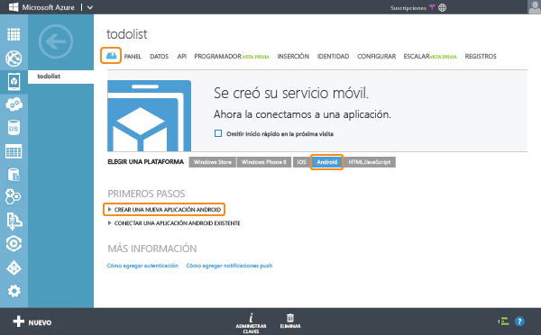

<properties
	pageTitle="Introducción a Servicios móviles para de Azure para aplicaciones Android (back-end JavaScript)"
	description="Siga este tutorial para empezar a usar Servicios móviles de Azure para el desarrollo de Android (back-end JavaScript)."
	services="mobile-services"
	documentationCenter="android"
	authors="RickSaling"
	manager="reikre"
	editor=""/>

<tags
	ms.service="mobile-services"
	ms.workload="mobile"
	ms.tgt_pltfrm="mobile-android"
	ms.devlang="java"
	ms.topic="hero-article"
	ms.date="03/05/2016"
	ms.author="ricksal"/>

# Introducción a Servicios móviles para Android (back-end JavaScript)

[AZURE.INCLUDE [mobile-services-selector-get-started](../../includes/mobile-services-selector-get-started.md)]

&nbsp;

[AZURE.INCLUDE [mobile-service-note-mobile-apps](../../includes/mobile-services-note-mobile-apps.md)]
> Para ver la versión equivalente de este tema en Aplicaciones móviles, consulte [Creación de una aplicación de Android](../app-service-mobile/app-service-mobile-android-get-started.md).

En este tutorial se muestra cómo agregar un servicio back-end basado en la nube a una aplicación Android mediante los Servicios móviles de Azure. Con este tutorial creará tanto un servicio móvil nuevo como una aplicación simple de **Lista de pendientes** que almacena datos de la aplicación en el servicio móvil nuevo.

> [AZURE.VIDEO mobile-get-started-android]

La siguiente captura de pantalla muestra la aplicación final:

## Requisitos previos

Para completar este tutorial se requieren las [Herramientas para desarrolladores de Android](https://developer.android.com/sdk/index.html), que incluyen el entorno de desarrollo integrado de Android Studio y la última plataforma de Android. Se requiere Android 4.2 o versiones posteriores.

El proyecto de inicio rápido descargado contiene el SDK de Servicios Móviles de Azure para Android.

> [AZURE.IMPORTANT] Para completar este tutorial, deberá tener una cuenta de Azure. En caso de no tener ninguna, puede crear una cuenta de evaluación gratuita en tan solo unos minutos. Para obtener más información, consulte [Evaluación gratuita de Azure](https://azure.microsoft.com/pricing/free-trial/?WT.mc_id=AE564AB28).

## Creación de un servicio móvil

[AZURE.INCLUDE [mobile-services-create-new-service](../../includes/mobile-services-create-new-service.md)]

## Creación de una aplicación Android

Después de crear el servicio móvil, puede seguir una sencilla introducción rápida en el Portal de Azure clásico para crear una aplicación o modificar una ya existente a fin de conectarla a dicho servicio.

En esta sección se creará una nueva aplicación Android que se conecta al servicio móvil.

1.  En el Portal de Azure clásico, haga clic en **Servicios móviles** y luego en el servicio móvil que acaba de crear.

2. En la pestaña de inicio rápido, haga clic en **Android** en **Seleccionar plataforma** y expanda **Crear una nueva aplicación Android**.

   	

   	Con esto se muestran los tres sencillos pasos requeridos para crear una aplicación Android conectada al servicio móvil.

  	

3. Si aún no lo ha hecho, descargue las [herramientas para desarrolladores de Android](https://go.microsoft.com/fwLink/p/?LinkID=280125) (en inglés) e instálelas en el equipo local o la máquina virtual.

4. Haga clic en **Crear tabla TodoItem** para crear una tabla para almacenar los datos de la aplicación.

5. Descargue ahora la aplicación presionando el botón **Descargar**.

## Ejecución de la aplicación Android

[AZURE.INCLUDE [mobile-services-run-your-app](../../includes/mobile-services-android-get-started.md)]

## Pasos siguientes
Ahora que completó el inicio rápido, aprenda a realizar importantes tareas adicionales en los Servicios móviles:

* [Introducción a los datos]  Obtenga más información sobre cómo almacenar y consultar datos con los servicios móviles.

* [Introducción a la autenticación]  Aprenda a autenticar a los usuarios de su aplicación con un proveedor de identidades.

* [Introducción a las notificaciones de inserción]  Aprenda a enviar una notificación de inserción muy básica a la aplicación.

[AZURE.INCLUDE [app-service-disqus-feedback-slug](../../includes/app-service-disqus-feedback-slug.md)]

<!-- URLs. -->
[Get started (Eclipse)]: mobile-services-android-get-started-ec.md
[Introducción a los datos]: mobile-services-android-get-started-data.md
[Introducción a la autenticación]: mobile-services-android-get-started-users.md
[Introducción a las notificaciones de inserción]: mobile-services-javascript-backend-android-get-started-push.md
[Mobile Services Android SDK]: https://go.microsoft.com/fwLink/p/?LinkID=266533

<!---HONumber=AcomDC_0309_2016-->