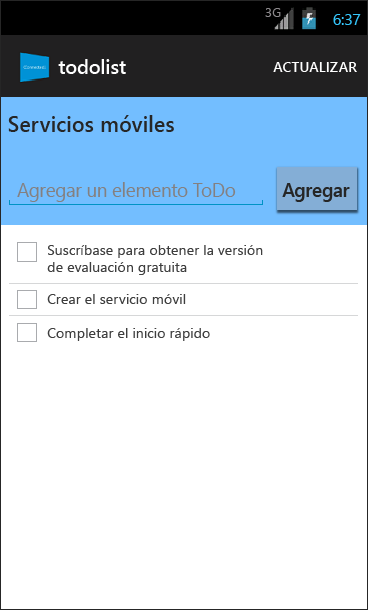

<properties
	pageTitle="Introducción a Servicios móviles de Azure para aplicaciones de Android"
	description="Siga este tutorial para empezar a usar Servicios móviles de Azure para el desarrollo de Android."
	services="mobile-services"
	documentationCenter="android"
	authors="RickSaling"
	manager="erikre"
	editor=""/>

<tags
	ms.service="mobile-services"
	ms.workload="mobile"
	ms.tgt_pltfrm="mobile-android"
	ms.devlang="java"
	ms.topic="get-started-article"
	ms.date="03/05/2016"
	ms.author="ricksal"/>

# Introducción a Servicios móviles

[AZURE.INCLUDE [mobile-services-selector-get-started](../../includes/mobile-services-selector-get-started.md)]

&nbsp;

[AZURE.INCLUDE [mobile-service-note-mobile-apps](../../includes/mobile-services-note-mobile-apps.md)]
> Para ver la versión equivalente de este tema en Aplicaciones móviles, consulte [Creación de una aplicación de Android](../app-service-mobile/app-service-mobile-android-get-started.md).

En este tutorial se muestra cómo agregar un servicio back-end basado en la nube a una aplicación Android mediante los Servicios móviles de Azure. Con este tutorial creará tanto un servicio móvil nuevo como una aplicación simple de _Lista de pendientes_ que almacena datos de la aplicación en el servicio móvil nuevo. El servicio móvil que cree utilizará los lenguajes .NET compatibles y recurrirá a Visual Studio para la lógica de negocios de servidor y para las tareas de administración. Si desea crear un servicio móvil que le permita escribir su lógica de negocios de servidor en JavaScript, consulte la [versión back-end de JavaScript](mobile-services-android-get-started.md) de este tema.

La siguiente captura de pantalla muestra la aplicación final:

Para completar este tutorial se requieren la [Herramientas para desarrolladores de Android][Android Studio], que incluyen el entorno de desarrollo integrado de Android Studio y la última plataforma de Android. Se requiere Android 4.2 o versiones posteriores.

El proyecto de inicio rápido descargado contiene el SDK de Servicios móviles para Android.

> [AZURE.IMPORTANT] Para completar este tutorial, deberá tener una cuenta de Azure. Si no dispone de ninguna cuenta, puede registrarse para obtener una versión de evaluación de Azure y conseguir hasta 10 servicios móviles gratuitos que podrá seguir usando incluso después de que finalice la evaluación. Para obtener más información, consulte [Evaluación gratuita de Azure](https://azure.microsoft.com/pricing/free-trial/?WT.mc_id=AE564AB28).

## Creación de un servicio móvil

[AZURE.INCLUDE [mobile-services-dotnet-backend-create-new-service](../../includes/mobile-services-dotnet-backend-create-new-service.md)]

## Descarga del servicio móvil en el equipo local

Una vez creado el servicio móvil, descargue el proyecto de servicio móvil personalizado, que podrá ejecutar en el equipo local o la máquina virtual local.

1. Haga clic en el servicio móvil que acaba de crear, y, a continuación, en la pestaña de inicio rápido haga clic en **Android** en **Seleccionar plataforma** y expanda **Crear una nueva aplicación Android**.

	![][1]

2. Si todavía no lo ha hecho, descargue e instale [Visual Studio Professional 2013](https://go.microsoft.com/fwLink/p/?LinkID=391934) o una versión posterior.

3. En el paso 2, haga clic en **Descargar** en **Descargar y publicar su servicio en la nube**.

	De este modo, se descarga el proyecto de Visual Studio que implementa el servicio móvil. Guarde el archivo comprimido del proyecto en el equipo local y anote dónde lo guardó.

## Prueba del servicio móvil

[AZURE.INCLUDE [mobile-services-dotnet-backend-test-local-service](../../includes/mobile-services-dotnet-backend-test-local-service.md)]

## Publicación del servicio móvil

[AZURE.INCLUDE [mobile-services-dotnet-backend-publish-service](../../includes/mobile-services-dotnet-backend-publish-service.md)]

## Creación de una aplicación Android

En esta sección se creará una nueva aplicación Android que se conecta al servicio móvil.

1. En el [Portal de Azure clásico], haga clic en **Servicios móviles** y luego en el servicio móvil que acaba de crear.

2. En la pestaña de inicio rápido, haga clic en **Android** en **Seleccionar plataforma** y expanda **Crear una nueva aplicación Android**.

	![][2]

3. Si aún no lo ha hecho, descargue las [herramientas para desarrolladores de Android][Android SDK] (en inglés) e instálelas en el equipo local o la máquina virtual.

4. En **Descargar y ejecutar la aplicación**, haga clic en **Descargar**.

  	De este modo se descarga el proyecto para la aplicación de _lista de pendientes_ de muestra que está conectada al servicio móvil. Guarde el archivo comprimido del proyecto en el equipo local y anote dónde lo guardó.

## Ejecución de la aplicación Android

[AZURE.INCLUDE [mobile-services-run-your-app](../../includes/mobile-services-android-get-started.md)]

## Pasos siguientes
Ahora que completó el inicio rápido, aprenda a realizar importantes tareas adicionales en los Servicios móviles:

* [Incorporación de notificaciones de inserción a la aplicación]  Aprenda a enviar una notificación push muy básica a la aplicación.

* [Incorporación de autenticación a la aplicación]  Obtenga información sobre cómo restringir el acceso a los datos back-end a determinados usuarios de la aplicación registrados.

* [Solución de problemas de un back-end de .NET de Servicios móviles]   Aprenda a diagnosticar y corregir los problemas que pueden surgir con un back-end de .NET de Servicios móviles.

<!-- Anchors. -->
[Getting started with Mobile Services]: #getting-started
[Create a new mobile service]: #create-new-service
[Define the mobile service instance]: #define-mobile-service-instance
[Next Steps]: #next-steps

<!-- Images. -->
[0]: ./media/mobile-services-dotnet-backend-android-get-started/mobile-quickstart-completed-android.png
[1]: ./media/mobile-services-dotnet-backend-android-get-started/mobile-quickstart-steps-vs-AS.png
[2]: ./media/mobile-services-dotnet-backend-android-get-started/mobile-quickstart-steps-android-AS.png

[6]: ./media/mobile-services-dotnet-backend-android-get-started/mobile-portal-quickstart-android.png
[7]: ./media/mobile-services-dotnet-backend-android-get-started/mobile-quickstart-steps-android.png
[8]: ./media/mobile-services-dotnet-backend-android-get-started/mobile-eclipse-quickstart.png

[10]: ./media/mobile-services-dotnet-backend-android-get-started/mobile-quickstart-startup-android.png
[11]: ./media/mobile-services-dotnet-backend-android-get-started/mobile-data-tab.png
[12]: ./media/mobile-services-dotnet-backend-android-get-started/mobile-data-browse.png

[14]: ./media/mobile-services-dotnet-backend-android-get-started/mobile-services-import-android-workspace.png
[15]: ./media/mobile-services-dotnet-backend-android-get-started/mobile-services-import-android-project.png

<!-- URLs. -->
[Get started (Eclipse)]: mobile-services-dotnet-backend-android-get-started-ec.md
[Incorporación de notificaciones de inserción a la aplicación]: mobile-services-dotnet-backend-android-get-started-push.md
[Incorporación de autenticación a la aplicación]: mobile-services-dotnet-backend-android-get-started-auth.md
[Android SDK]: https://go.microsoft.com/fwLink/p/?LinkID=280125
[Android Studio]: https://developer.android.com/sdk/index.html
[Mobile Services Android SDK]: https://go.microsoft.com/fwLink/p/?LinkID=266533
[Solución de problemas de un back-end de .NET de Servicios móviles]: mobile-services-dotnet-backend-how-to-troubleshoot.md

[Portal de Azure clásico]: https://manage.windowsazure.com/

<!---HONumber=AcomDC_0309_2016-->