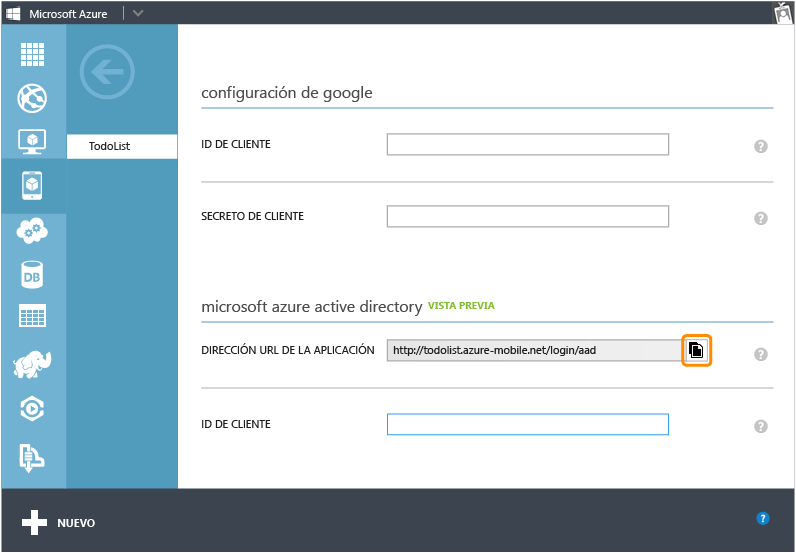
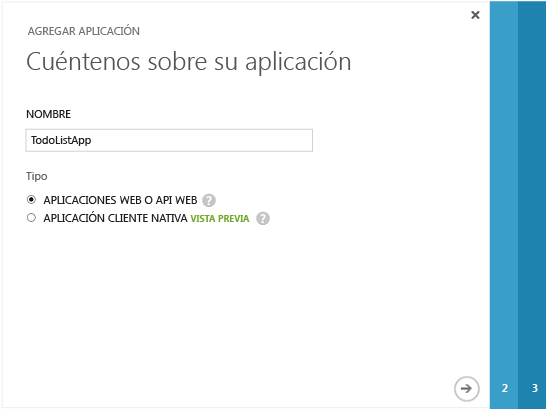
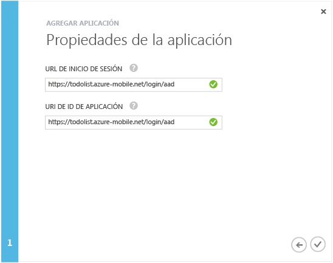
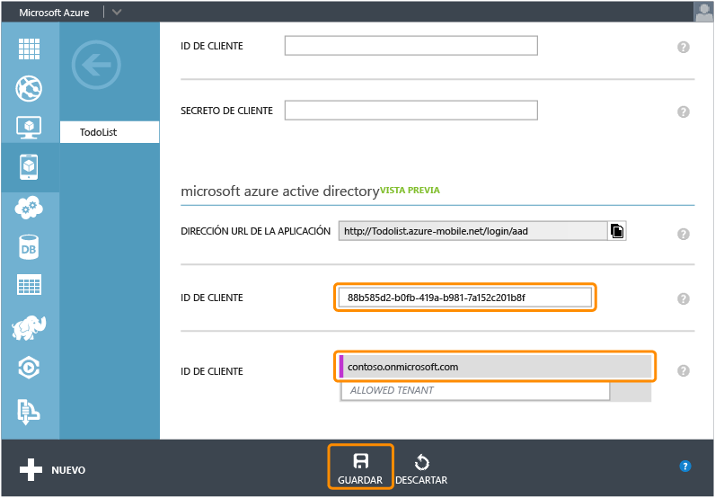

<properties
	pageTitle="Registro para la autenticación de Azure Active Directory | Microsoft Azure"
	description="Obtenga información acerca de cómo registrarse para la autenticación de Azure Active Directory en la aplicación de Servicios móviles de Azure."
	authors="wesmc7777"
	services="mobile-services"
	documentationCenter=""
	manager="dwrede"
	editor=""/>

<tags
	ms.service="mobile-services"
	ms.workload="mobile"
	ms.tgt_pltfrm="multiple"
	ms.devlang="multiple"
	ms.topic="article"
	ms.date="02/05/2016"
	ms.author="ricksal"/>

# Registro de las aplicaciones para usar un inicio de sesión de la cuenta de Azure Active Directory

[AZURE.INCLUDE [mobile-service-note-mobile-apps](../../includes/mobile-services-note-mobile-apps.md)]

&nbsp;

[AZURE.INCLUDE [mobile-services-selector-register-identity-provider](../../includes/mobile-services-selector-register-identity-provider.md)]

##Información general

Este tema indica cómo registrar las aplicaciones para que puedan usar Azure Active Directory como proveedor de autenticación para el servicio móvil.

##Registrar la aplicación

>[AZURE.NOTE] Los pasos descritos en este tema están diseñados para utilizarse con el tutorial [Incorporación de autenticación a la aplicación de Servicios móviles](mobile-services-dotnet-backend-windows-universal-dotnet-get-started-users.md) cuando desee usar [operaciones de inicio de sesión dirigidas por el servicio](http://msdn.microsoft.com/library/azure/dn283952.aspx) con su aplicación. Como alternativa, si la aplicación tiene un requisito de [operaciones de inicio de sesión dirigidas por el cliente](http://msdn.microsoft.com/library/azure/jj710106.aspx) para Azure Active Directory y un servicio móvil de back-end de .NET, debe comenzar por el tutorial [Autenticación de la aplicación con el inicio de sesión único de la biblioteca de autenticación de Active Directory](mobile-services-windows-store-dotnet-adal-sso-authentication.md).

1. Inicie sesión en el [Portal de Azure clásico], vaya al servicio móvil, haga clic en la pestaña **Identidad** y desplácese hacia abajo hasta la sección del proveedor de identidades de **Azure Active Directory** y copie la **Dirección URL de la aplicación** que aparece.

    

2. Vaya hasta **Active Directory** en el [Portal clásico], haga clic en su directorio y luego en **Dominios** y tome nota del dominio predeterminado de su directorio.

3. Haga clic en **Aplicaciones** > **Agregar** > **Agregar una aplicación que mi organización está desarrollando**.

4. En el asistente para agregar aplicaciones, escriba un **Nombre** para la aplicación y haga clic en el tipo **Aplicación web y/o API web**.

    

5. En el cuadro **Dirección URL de inicio de sesión**, pegue el valor de la dirección URL de aplicación que copió desde su servicio móvil. Escriba el mismo valor único en el cuadro **URI de id. de aplicación** y, a continuación, haga clic para continuar.

    

6. Una vez agregada la aplicación, haga clic en la pestaña **Configurar** y copie la **Id. de cliente** para la aplicación.

    >[AZURE.NOTE]Para un servicio móvil de back-end de .NET, también debe editar el valor de **URL de respuesta** en **Inicio de sesión único** para que sea la dirección URL del servicio móvil añadido con la ruta de acceso, _signin-aad_. Por ejemplo, `https://todolist.azure-mobile.net/signin-aad`

7. Vuelva a la pestaña **Identidad** de su servicio móvil y pegue el valor de **Id. de cliente** copiado para el proveedor de identidades de Azure Active Directory.

    

8.  En la lista **Inquilinos permitidos** escriba el dominio del directorio en el que registró la aplicación (por ejemplo, `contoso.onmicrosoft.com`) y luego haga clic en **Guardar**.

Ahora está preparado para usar Azure Active Directory para realizar la autenticación en la aplicación.

<!-- Anchors. -->

<!-- Images. -->

<!-- URLs. -->
[Portal de Azure clásico]: https://manage.windowsazure.com/
[Portal clásico]: https://manage.windowsazure.com/

<!---HONumber=AcomDC_0211_2016-->