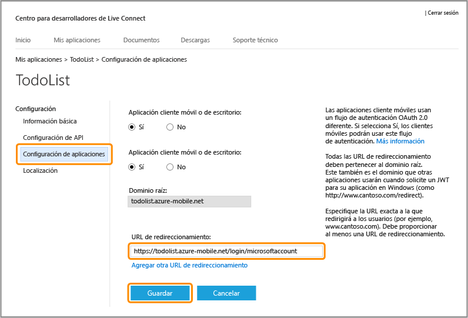
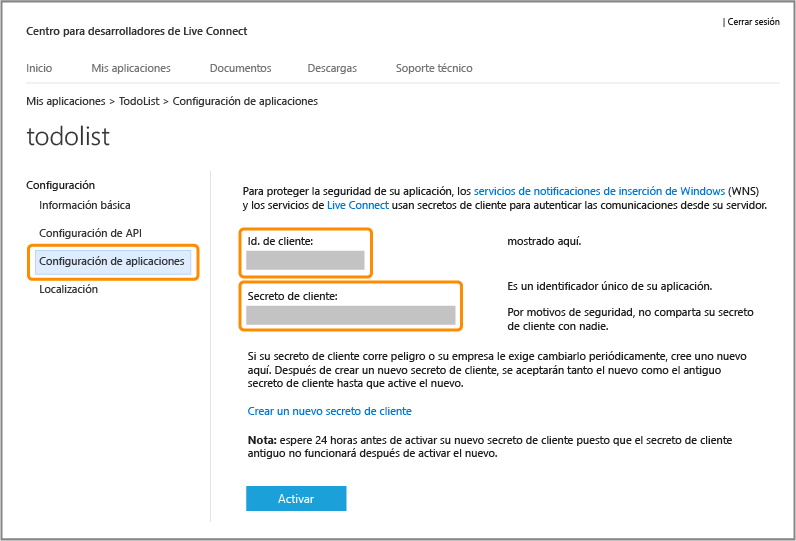

<properties
	pageTitle="Registro para autenticación de Microsoft | Microsoft Azure"
	description="Obtenga información acerca de cómo registrarse para la autenticación de Microsoft en la aplicación de Servicios móviles de Azure."
	authors="ggailey777"
	services="mobile-services"
	documentationCenter="Mobile"
	manager="dwrede"
	editor=""/>

<tags 
	ms.service="mobile-services" 
	ms.workload="mobile" 
	ms.tgt_pltfrm="NA" 
	ms.devlang="multiple" 
	ms.topic="article" 
	ms.date="02/25/2016" 
	ms.author="glenga"/>

# Registre la aplicación para usar la cuenta Microsoft para realizar la autenticación

[AZURE.INCLUDE [mobile-service-note-mobile-apps](../../includes/mobile-services-note-mobile-apps.md)]

&nbsp;

[AZURE.INCLUDE [mobile-services-selector-register-identity-provider](../../includes/mobile-services-selector-register-identity-provider.md)]

## Información general

Este tema indica cómo registrar su aplicación móvil para que pueda usar la cuenta de Microsoft como proveedor de identidad con Servicios móviles de Azure. Se aplican los mismos pasos para la autenticación dirigida por el servicio y la dirigida por el cliente con el SDK de Live.

##Registre la aplicación Tienda Windows en el Centro de desarrollo de Windows

Las aplicaciones de la Tienda Windows deben registrarse primero con el Centro de desarrollo de Windows. Al registrarse, la aplicación de Windows podrá usar los comportamientos de inicio de sesión único.

>[AZURE.NOTE]Las aplicaciones de Windows Phone 8, Windows Phone 8.1 Silverlight y las que no pertenezcan a Windows podrán omitir esta sección.

1. Si aún no ha registrado la aplicación, vaya al [Centro de desarrollo de Windows](https://dev.windows.com/dashboard/Application/New), inicie sesión en su cuenta Microsoft, escriba un nombre para su aplicación y haga clic en **Reservar nombre de aplicación**.

3. Abra su proyecto de aplicación de Windows en Visual Studio y en el Explorador de soluciones, haga clic con el botón derecho en el proyecto de la aplicación de la Tienda Windows, haga clic en **Tienda** > **Asociar aplicación con la Tienda...**.

  	

5. En el asistente, haga clic en **Iniciar sesión** e inicie sesión con su cuenta de Microsoft, seleccione el nombre de la aplicación que haya reservado y luego haga clic en **Siguiente** > **Asociar**.

6. (Opcional) Para una aplicación Windows universal 8.1, repita los pasos 4 y 5 para el proyecto de la Tienda de Windows Phone.

6. De nuevo en la página del Centro de desarrollo de Windows de su nueva aplicación, haga clic en **Servicios** > **Notificaciones de inserción**.

7. En la página **Notificaciones push**, haga clic en **Sitio de Servicios Live** en **Servicios de notificaciones de Windows (WNS) y Servicios móviles de Microsoft Azure**.
 
	Esto muestra la página de configuración de la aplicación de la cuenta de Microsoft para su aplicación.

8. Anote el valor de **SID del paquete**. Puede guardar este SID en el Portal de Azure para habilitar el inicio de sesión único y las notificaciones push de la aplicación de Windows.

A continuación, configurará la autenticación de la cuenta Microsoft para la aplicación de Windows, comenzando con el paso 4 de la sección siguiente.

## Configurar el registro de la cuenta de Microsoft y conectarse a Servicios móviles

Si ya registró su aplicación de Windows en la sección anterior, puede omitir el paso 2.

1. Para una aplicación que no sea de la Tienda Windows, vaya a la página [Mis aplicaciones](http://go.microsoft.com/fwlink/p/?LinkId=262039) del Centro de desarrolladores de la cuenta de Microsoft, inicie sesión con su cuenta de Microsoft (si es necesario), haga clic en **Crear aplicación**, escriba un **Nombre de la aplicación** y haga clic en **Acepto**.

   	Este reserva el nombre de la aplicación con la cuenta de Microsoft y muestra la página de la cuenta de Microsoft para su aplicación.

2. En la página de la cuenta de Microsoft para su aplicación, haga clic en **Configuración de API**, habilite **Aplicación de cliente móvil o de escritorio**, defina la dirección URL de servicio móvil como el **Dominio de destino**, proporcione uno de los siguientes formatos URL en **Dirección URL de redireccionamiento** y haga clic en **Guardar**:

	+ **Back-end de .NET**: `https://<mobile_service>.azure-mobile.net/signin-microsoft`
	+ **Back-end de JavaScript**: `https://<mobile_service>.azure-mobile.net/login/microsoftaccount`

	 >[AZURE.NOTE]Asegúrese de usar el formato correcto de ruta de acceso a dirección URL de redireccionamiento para su tipo de back-end de Servicios móviles. Si es incorrecto, la autenticación no se realizará correctamente. El **Dominio raíz** debería rellenarse automáticamente. &nbsp;

    

4. Haga clic en **Configuración de aplicaciones** y tome nota de los valores de **Id. de cliente**, **Secreto de cliente** y **SID de paquete**.

   	

    > [AZURE.NOTE] El secreto de cliente es una credencial de seguridad importante, por lo que no debe compartirlo con nadie ni distribuirlo con su aplicación. Solo los registros de aplicaciones de la Tienda Windows verán un campo de SID del paquete.

4. En el [Portal de Azure clásico], haga clic en la pestaña **Identidad** del servicio móvil, escriba el identificador de cliente, el secreto de cliente y el SID del paquete obtenido del proveedor de identidades y haga clic en **Guardar**.

	>[AZURE.NOTE]No es necesario proporcionar un valor de SID del paquete para Windows Phone 8, Windows Phone 8.1 Silverlight o una aplicación que no sea de Windows.

El servicio móvil y la aplicación están ahora configurados para funcionar con una cuenta de Microsoft.

<!-- Anchors. -->

<!-- Images. -->

<!-- URLs. -->

[Submit an app page]: http://go.microsoft.com/fwlink/p/?LinkID=266582
[My Applications]: http://go.microsoft.com/fwlink/p/?LinkId=262039

[Portal de Azure clásico]: https://manage.windowsazure.com/

<!---HONumber=AcomDC_0302_2016-->